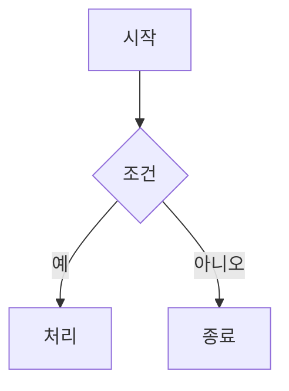

# 글/프로젝트 작성 가이드

> 이 파일은 `content/` 루트에 있기 때문에 사이트 빌드에서 무시됩니다. (리더는 `content/blog`와 `content/projects`만 스캔합니다.)

## 핵심: 포스트별 폴더에 글 + 이미지를 함께

글과 이미지를 **같은 폴더 안에** 두고 포스팅합니다.

```
content/blog/<slug>/
  index.md          ← 글 (폴더 이름이 URL slug → /blog/<slug>)
  cover.png         ← 이미지를 바로 옆에
  diagram.png
```

본문에서는 **상대경로**로 이미지를 임베드합니다. 빌드할 때 `content/`의 이미지가 `public/`으로 자동 복사되고, 리더가 `cover.png`를 `/blog/<slug>/cover.png`로 자동 치환합니다.

```markdown

<!-- 또는 raw , <figure markdown> 안에서도 동작 -->
```

## 블로그 글 frontmatter

기존 github.io(MkDocs) frontmatter를 **그대로 붙여넣어도 동작합니다.** 기존 github.io 블로그와의 호환성을 유지하기 위한 것이며, 리더가 두 방식을 모두 인식합니다.

```markdown
---
title: '[Algorithm] 글 제목'
description: 한 줄 요약 (목록/메타 설명에 사용)   # 또는 excerpt:
authors: [bnbong]
date:
  created: 2026-06-14
  updated: 2026-06-14
categories: [Algorithm]                          # 또는 category: Algorithm
tags: [Python, Algorithm]
comments: true
---

본문은 표준 Markdown. MkDocs 문법도 지원:

!!! tip "팁 제목"
    admonition 블록도 그대로 렌더링됩니다.

<!-- more -->  ← 프리뷰 구분자는 자동 제거.
```

- **읽는 시간**: `readingTime: "8 min read"`를 넣으면 그 값을 그대로 쓰고, 없으면 본문 길이로 자동 계산합니다.
- **사이드바 한 줄 소개**: `intro:`로 글마다 다르게 지정할 수 있고, 없으면 프로필 기본값을 사용합니다.

## 프로젝트

```
content/projects/<slug>/
  index.md
  demo.png
```

레거시 frontmatter(`title`, `description`, `tags`, `featured`, `period`, `role`)에서 `name / stack / year / status`가 자동 파생되고, 본문의 첫 GitHub URL이 RepoCard 링크가 됩니다.

GitHub 소셜 카드에 별/포크/언어를 표시하려면 frontmatter에 `stars`, `forks`, `language`, `languageColor`를 추가하면 됩니다. 이미지는 블로그와 동일하게 폴더 안에 두고 `` 상대경로로 참조합니다.

## 카드 썸네일

블로그 목록과 프로젝트 목록의 카드에는 썸네일 이미지가 표시됩니다. 어떤 이미지를 사용할지는 다음 순서로 결정됩니다.

1. frontmatter의 `thumbnail:` 값을 사용합니다. 호환을 위해 `cover:`와 `image:`도 같은 용도로 인식합니다.
2. `thumbnail:`이 없으면 본문에 처음 등장하는 이미지를 사용합니다.
3. 본문에도 이미지가 없으면 기본값인 프로필 사진(`/assets/new_profile.png`)을 사용합니다.

```markdown
---
title: 글 제목
thumbnail: cover.png        # 글 폴더 안의 상대경로
# thumbnail: /assets/new_profile.png   ← 절대경로나 외부 URL도 가능합니다
---
```

상대경로로 적으면 본문 이미지와 동일하게 글 폴더를 기준으로 해석되므로, 이미지를 `index.md` 옆에 두고 파일 이름만 적으면 됩니다.

## blogflow 활용

```bash
pip install -e tools/blogflow
blogflow init --topic "글 주제" --post-path content/blog/<slug>/index.md
blogflow brief && blogflow draft && blogflow review && blogflow finalize && blogflow approve && blogflow publish
```

발행 경로는 포스트별 폴더 규칙(`content/blog/<slug>/index.md`)을 그대로 쓰면 되며, `.blogflow/config.yaml`의 `blog_dir: content/blog` 아래에 있다면 유효합니다.

## 본문 렌더링 문법 (MkDocs 호환)

MKDocs-materials 시절의 문법을 그대로 적용합니다. 리더가 빌드할 때 HTML로 변환합니다.

### Admonition (콜아웃)

```markdown
!!! tip "제목"
    들여쓴 본문 (4칸 들여쓰기)
```

- `???` 로 시작하면 접히는(collapsible) 형태로도 인식합니다.
- 타입: `note` `tip` `info` `warning` `danger` `success` `question` `example` `quote` `abstract` `failure` `bug`

### Blocks (`/// … ///`)

```markdown

/// caption
그림 아래 캡션
///
```

- `/// caption … ///` 는 이미지나 표 아래에 **중앙 정렬 캡션**을 넣습니다.
- `/// note | "제목" … ///` 등 admonition 타입도 동일하게 렌더링합니다(제목은 `|` 뒤의 인자로 지정합니다).
- `/// details | 요약 … ///` 는 접히는 `<details>` 로 렌더링합니다.

### 링크 소셜 카드 (`<url>`)

줄 하나에 URL을 `<`, `>` 로 감싸면 OG 메타데이터를 가져와 **소셜 카드**로 렌더링합니다.

```markdown
<https://github.com/bnbong/dev-blog>
```

- **그 줄 전체가** `<url>` 일 때만 카드가 됩니다. 문장 속 `<url>` 이나 `[텍스트](url)` 는 일반 링크로 유지됩니다.
- OG 메타데이터는 **`npm run prefetch:links`** 로 미리 받아 **`data/link-previews.json`(커밋됨)** 에 저장합니다. CI 타임아웃을 방지하기 위한 것입니다.
- 새 `<url>` 을 추가했으면 `npm run prefetch:links` 를 실행한 뒤 `data/link-previews.json` 을 커밋해야 합니다. 전체를 갱신하려면 `npm run prefetch:links -- --force` 를 사용합니다.

### 수식 (LaTeX / KaTeX)

빌드할 때 [KaTeX](https://katex.org/)로 정적 HTML을 생성합니다. 클라이언트 JS는 사용하지 않습니다.

```markdown
인라인: $O(N \log N)$, $\sqrt{N}$ 처럼 한 줄 안에서 `$ … $`.

블록(가운데 정렬):

$$
\sum_{i=1}^{n} i = \frac{n(n+1)}{2}
$$
```

- 인라인 수식은 **`$` 바로 안쪽이 공백이 아니어야** 인식합니다(`$O(N)$` ⭕, `$ O(N) $` ❌). 덕분에 `$5`, `$VAR` 같은 일반 텍스트는 수식으로 처리되지 않습니다.
- **코드 블록(```` ``` ````)과 인라인 코드(`` `…` ``) 안의 `$` 는 건드리지 않습니다.** 쉘 변수 `$GITHUB_OUTPUT` 등은 그대로 유지됩니다.
- 잘못된 LaTeX는 빌드를 중단시키지 않고 빨간색으로 표시합니다(`throwOnError: false`).

### 다이어그램 (Mermaid)

언어를 `mermaid` 로 지정한 코드 펜스에 작성합니다. 다이어그램이 있는 페이지에서만 라이브러리를 lazy 로드해 **클라이언트에서 SVG로 렌더링합니다**.

````markdown

````

- 문법은 [Mermaid 공식 문서](https://mermaid.js.org/)를 참고합니다(flowchart, sequence, class, state, ER, gantt 등).
- `securityLevel: "strict"` 로 동작하므로 다이어그램 안의 클릭 핸들러와 HTML 삽입은 비활성화됩니다.
- 렌더링 전에는 원본 소스를 숨겼다가 SVG로 교체합니다(깜빡임을 방지하기 위한 것입니다).

### 각주 (Footnotes)

`[^id]` 로 참조하고, 아무 곳에서나 `[^id]: 내용` 으로 정의합니다. 빌드할 때 문서 하단에 번호가 매겨진 각주 목록과 본문으로 돌아가는 백링크가 생성됩니다.

```markdown
본문 문장입니다.[^1] 이름 있는 각주도 됩니다.[^ref]

[^1]: 첫 번째 각주 내용.
[^ref]: 식별자는 숫자가 아니어도 됨.
```

### 기타

- `<!-- more -->`(프리뷰 구분자), `:material-…:`/`:fontawesome-…:` 아이콘 단축코드, `{ .class }` attr-list 는 자동으로 제거됩니다.
- 레거시 `*.md` 상호 링크(예: `qr-phishing-detector.md`)는 실제 라우트(`/projects/qr-phishing-detector/`)로 자동 변환됩니다.
- 모든 HTML은 allowlist sanitizer를 거쳐 주입합니다(스크립트와 위험한 URL은 차단합니다).

## 참고

- 수동으로 한 번 동기화하려면 `npm run sync:assets` 를 실행합니다.
