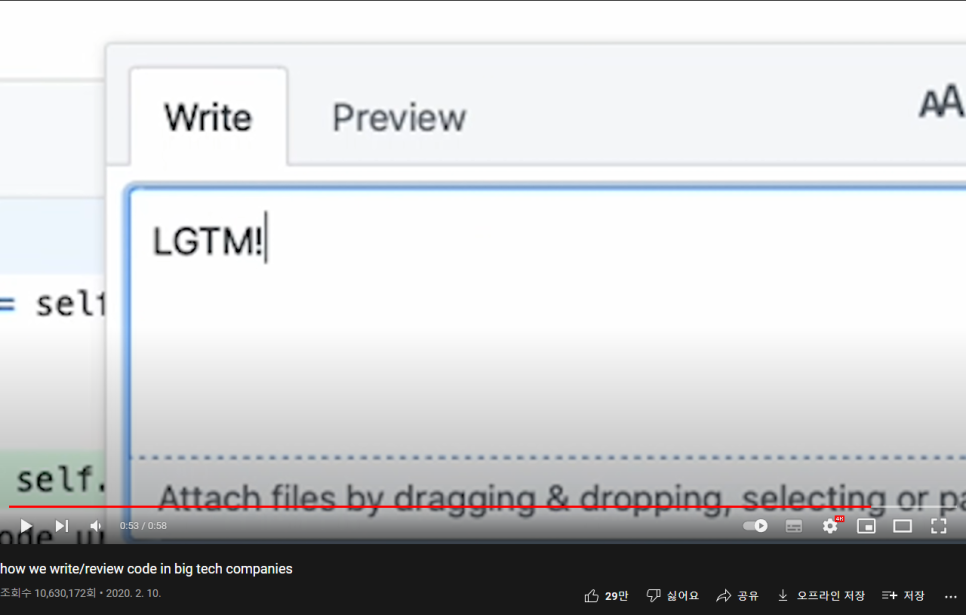
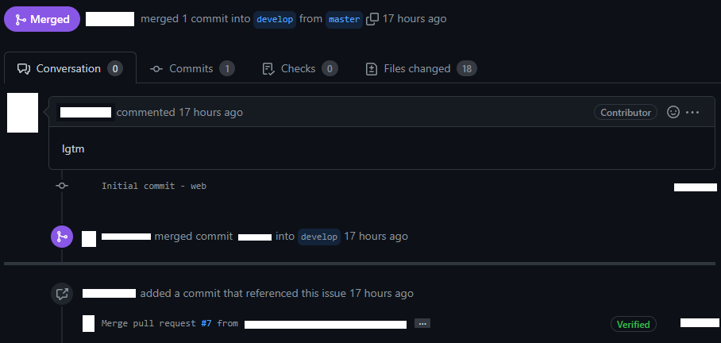

## 타자 치며 먹고사는 사람들도 타자 치는 것이 귀찮을 때가 있다..

예전에 유튜브 알고리즘을 통해 해외 개발자의 하루에 대한 영상을 시청한 적이 있습니다. 나름 이름 있는 기업의 소프트웨어 엔지니어로 일하고 있는 사람도 있었고 스타트업에 종사하는 개발자의 일과에 대한 영상도 있었습니다. 그렇게 아무 생각 없이 영상을 시청하다가 어떤 테크 기업의 개발자들이 코드를 리뷰하는 모습에 대한 영상을 시청하게 되었는데, 해당 영상에 나오는 단어가 제 눈길을 끌었습니다.

어떤 개발자가 test case의 불필요한 부분을 손을 본 후 다른 개발자에게 코드 리뷰를 요청하자 리뷰하는 개발자가 위와 같은 코멘트를 남겼습니다.

해당 영상에 대한 출처는 다음과 같습니다.

<https://www.youtube.com/watch?v=rR4n-0KYeKQ>

저는 영상에 나온 LGTM이라는 단어가 어떤 단어인지 도저히 감을 잡지 못했습니다. 검색을 통해 위 단어는 'Looks Good To Me(LGTM)'라는 표현이고, 리뷰한 코드가 문제가 없어 보인다는 의미로 쓰이는 깃허브의 약어라는 것을 알게 되었습니다.

LGTM처럼 Github에서 흔히 사용하는 또 다른 약어가 있는지 궁금해 찾아본 뒤 간단하게 정리하려고 합니다!

<!-- more -->

## Github에서 종종 사용하는 약어 모음

본문에서 소개되는 약어들을 보면서 느끼겠지만 약어의 원래 문장들이 곧 잘 해석되기도 해서 이해하는데 큰 어려움이 없고, 비단 Github 뿐만 아니라 우리가 주로 접할 수 있는 해외 커뮤니티에서 자주 사용하는 약어들도 포함되어 있다는 것을 알 수 있습니다.

- **AFAIK (As Far As I Know)**: 제가 아는 한.
- **FYI (For Your Information)**: 참고, 종종 FYI 단어 뒤에 참고용 URL 등을 첨부하고는 합니다.
- **GOTCHA (I've Got You, 또는 Got Ya)**: 알겠습니다. 어디선가 정말 자주 나오는 약어
- **IMO 또는 IMHO (In My Opinion 또는 In My Humble Opinion)**: 개인적인 의견입니다만, 제 소견입니다만. (humble은 '겸손한'이라는 뜻으로 보다 겸손하게 의견을 피력할 때 들어갑니다)
- **LGTM (Looks Good To Me)**: 괜찮은 것 같습니다. Okay의 의미로도 쓰일 수 있고 코드 리뷰를 요청할 때 리뷰 description에 해당 단어를 첨부한 채 올리면 코드 리뷰를 해달라는 의미로도 사용됩니다.
- **SSIA (Subject Says It All)**: 제곧네(제목이 곧 내용). 타이틀만 봐도 알 수 있다는 의미이고 Subject and Screenshot Says It All (SSSIA)로 응용해서 사용하기도 합니다.
- **TBD (To Be Determined)**: 나중에 결정할 것.
- **TGIF (Thanks God, It's Friday)**: 불금. 주말에 달콤함은 대한민국 반대편에 살고 있는 사람들도 똑같이 느끼는 듯합니다. 예전에 TGIF라는 음식점 자주 갔었는데 요즘에는 안보이는게 슬프네요ㅠ
- **TIA (Thanks In Advance)**: 미리 감사함. 뭔가 상대방 쪽에서 꼭 해줘야하는 느낌을 주고 안해준다면 껄끄러운 느낌도 받을 수 있어서 사용시 실례가 될 수 있습니다.
- **TL;DR (Too Long, Didn't Read)**: 요약해서 올립니다. 한국의 경우 너무 긴 글의 경우에는 센스있는 사람들은 마지막에 3줄 요약을 해서 올리는 것 처럼 장문 시작 부분에 요약을 올릴 때 사용하는 단어입니다.
- **WFM (Works For? Fine? Me)**: 저에게는, 또는 제 환경에서는 괜찮습니다.

실제로 Github 프로젝트에서 약어를 사용하는 모습입니다.

---

## 마치며...

이렇게 Github에서 개발자 간의 커뮤니케이션 용도로 사용하는 약어에 대해서 알아봤습니다. 국내든 해외든 여러 커뮤니티가 존재하고 그런 커뮤니티들 사이에서 형성되는 분위기 속에 여러 종류의 약어들이 탄생하고 없어지기도 하지만, 제가 정말 자주 가는 사이트인 Github에도 이러한 약어들이 존재한다는 것을 알게 되니 신기했습니다.

저는 코드 리뷰나 단순한 comment도 저렇게 극한까지 줄여서 사용하는 경우는 잘 없습니다. 저처럼 처음 저런 단어를 마주하면 이해하지 못해 난감해하는 사람들도 있을 것입니다. 제가 외국 커뮤니티를 자주 탐방해본 사람은 아니라서 그런지 모르겠지만, 구구절절 설명하는 것을 좋아하는 타입이라 이런 약어들을 알고 있어도 자주 사용하지는 않을 것 같습니다(ㅋㅋ). 그래도 유익한 경험이었습니다.
