얼마전, 전공 학회에서 워크샵이 있었습니다.

그러나 저는 일정이 있어서 워크샵에 참석하지 못했고, 대체과제를 받게 되었습니다.

해당 대체과제 주제는

!!! note ""

    친구의 단점을 보완해줄 수 있는 프로그램 및 서비스의 기획 및 개발

이었습니다.

이번 포스팅은 위의 주제를 바탕으로 제가 어떻게 서비스 기획을 구상하고 개발을 완료했는지, 짧디짧은 여정에 대해서 다루고자 합니다.

---

## Intro

먼저 '친구의 단점' 이라는 것에 대해서 생각을 해보았습니다.

저는 어렸을 때부터 누구와도 두루두루 잘 지내는 편이어서 친구와의 다툼이 거의 없는 편이었습니다.

주먹다짐이 만연했던 그 철없던 시절에도 저는 물리적인 다툼이 전혀 없이 자랐습니다.

그래서 친구의 단점이라는 주제에 대해서 보편적으로 느낄 수 있는 단점이 무엇이 있을까 생각을 해보았고,
정리해본 결과로는 다음과 같은 문제(단점)가 있을 것 같다고 생각했습니다.

!!! question

    1. 친구와의 성향 차이 때문에 자주 다투게 됩니다.
    2. 인간관계에 대한 스트레스 때문에 골머리를 앓습니다.
    3. 타인과의 원활한 대화에 어려움을 느껴 친구와의 간단한 대화에도 어려움을 느낍니다.
    4. 자신의 고민을 속 터 놓고 이야기할 만한 친구가 필요합니다.
    5. 별 사소한 투정을 모두 받을 수 있을 정도로 저에게 모든 것을 맞춰줄 수 있는 친구가 필요합니다.

그런데 생각을 해보면 이 모든 문제가 전혀 없는 친구가 이 세상에 존재하나..? 싶었습니다.

그래서 생각을 한 것이 바로 AI 였습니다.

<!-- more -->

## Development

ChatGPT를 써본 사람이라면 알겠지만 이 녀석, 아는 것도 엄청 많고 심지어 제가 모르는 것에 대해서 물어보면 정말 친절하게 알려줍니다.

GPT가 공개되고 나서 지금까지 프로젝트에 ChatGPT 서비스를 정말 잘 활용하고 있는 한 사람으로써, 이런 GPT의 특성을 이용해서 나와 가장 궁합이 잘 맞는 친구로 GPT 친구(ㅋㅋㅋ)를 떠올리게 되었습니다.

GPT가 어떻게 실제 사람의 친구처럼 대화를 할 수 있는가?라는 궁금증에 대한 해소법은 간단합니다.

해답은 바로 프롬프트에 있습니다.

**프롬프트(Prompt)**는 생성형AI 모델에게서 이미지나 텍스트 결과를 생성하기 위한 명령어입니다.

간단하게 설명하자면 프롬프트라는 것은 GPT에게 일종의 역할을 부여하는 것입니다.

어려울 것 없이 바로 ChatGPT 서비스를 켜서 GPT와 대화하면서 '당신은 제 코딩 실력을 늘리기 위해 고용된 코딩 과외선생님입니다. 선생님의 위치에 있으므로 저에게 반말로 답변을 해주세요'라고 채팅한 후, 그 다음 답변부터 제가 코딩 관련 질문을 하면 해당 역할에 맞게 말투와 설명 방법을 변화시키면서 답변을 해줍니다.

<figure markdown="span">
  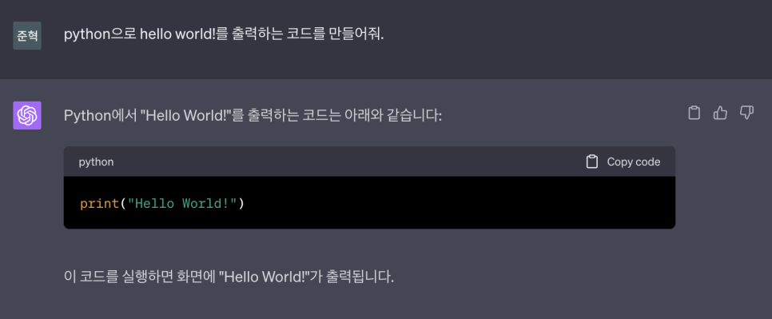
  <figcaption>프롬프트를 적용시키기 전의 ChatGPT의 응답</figcaption>
</figure>

<figure markdown="span">
  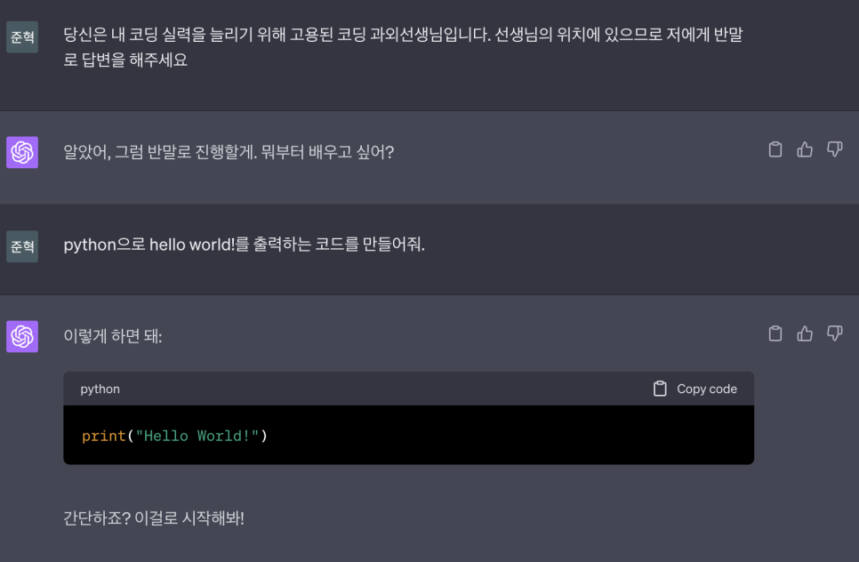
  <figcaption>프롬프트를 적용시킨 후의 ChatGPT의 응답</figcaption>
</figure>

이렇게 프롬프트를 통해 역할을 부여한 후 질문하면 원하는 방향대로 답변을 유도할 수 있는 장점이 있습니다.

이걸 사용해서 GPT한테 '친구'라는 프롬프트를 적용시켜 마치 진짜 친구와 대화하는 것 같은 느낌을 받게 구현하고자 했습니다.

정말 간단하게 브레인 스토밍을 끝내고 난 후 개발 방법에 대해서도 고민했습니다.

아무래도 친구와 실제로 대화하는 느낌을 주기 위해서는 인스타그램의 Direct Message처럼 채팅 형식의 서비스가 적절해 보였고, 그래서 Android Studio로 Native Application을 개발하기로 결정합니다.

우선, 안드로이드 스튜디오가 기본으로 제공해주는 템플릿을 선택했습니다.

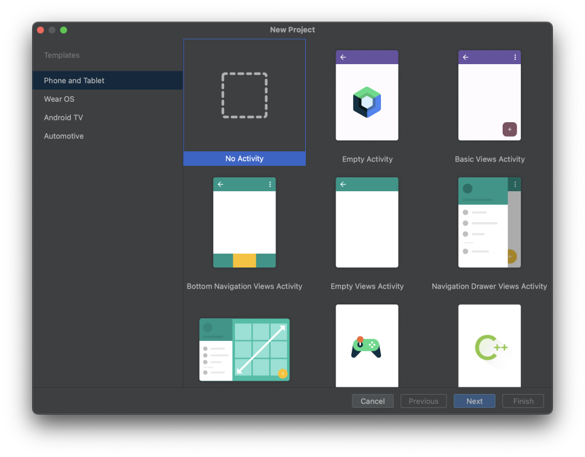

안드로이드 스튜디오를 사용하여 프로젝트를 생성하게 되면 IDE가 어느정도 프로젝트 세팅이 되어 있는 기본 템플릿을 제공해줍니다.

여기서는 원하는 방식으로 레이아웃과 모듈을 구현하기 위해 No Activity를 골랐습니다.

처음에는 No Activity가 아니라 Empty Activity를 선택해서 생성했었는데, Empty Activity는 언어가 Java가 아니라 Kotlin으로 구현되어 있었습니다.

아무리 언어가 비슷하고 유동적으로 작동한다고 해도 저는 코틀린을 사용해본 적이 없었기 때문에 프로젝트를 다시 생성했습니다.

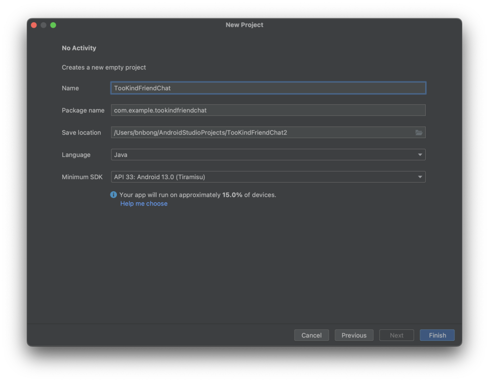

프로젝트 이름은 TooKindFriendChat 으로 설정했고, Finish를 눌러 새로운 프로젝트를 만들 수 있습니다.

안드로이드 프로젝트는 생성하고 나서 initial build를 하는 시간이 필요합니다. 그리 긴 시간이 걸리진 않고 보통 1~2분 내외만 기다리면 완료가 되고 사용자가 온전히 프로젝트에만 집중할 수 있도록 IDE의 UI가 수정됩니다.

 

프로젝트 빌드가 되고 나서, 우선 Dependency를 추가했습니다.

해당 프로젝트는 Native Application에 AI 모델이 상주해있는 것이 아니라 OpenAI가 제공하는 AI API를 사용하므로, HTTP 통신이 필수였습니다.

따라서 OkHttp3 라이브러리를 다음과 같이 추가해주었습니다.

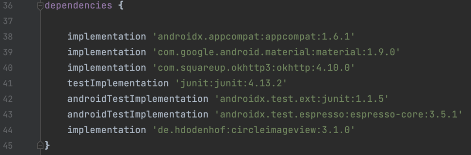

Dependency를 추가하거나 변경하게 되면 IDE 상단 부분에 Sync project 버튼이 뜨게 됩니다. 해당 버튼을 눌러서 project를 refresh해주어야 프로젝트에 해당 라이브러리의 변경사항이 반영되게 됩니다.

 

이렇게 프로젝트 기초 환경 설정을 마쳤으면, 그 다음으로 할 것은 OpenAI로부터 AI API를 사용하기 위한 권한을 받아오는 작업을 해야합니다.

<https://platform.openai.com/account/api-keys>

여타 API 제공 서비스가 그렇듯, 외부 업체가 만든 API를 사용하기 위해선 API key를 발급받아야 합니다.

API Key를 발급 받는 것은 정말 간단합니다. 사이트로 들어간 후,

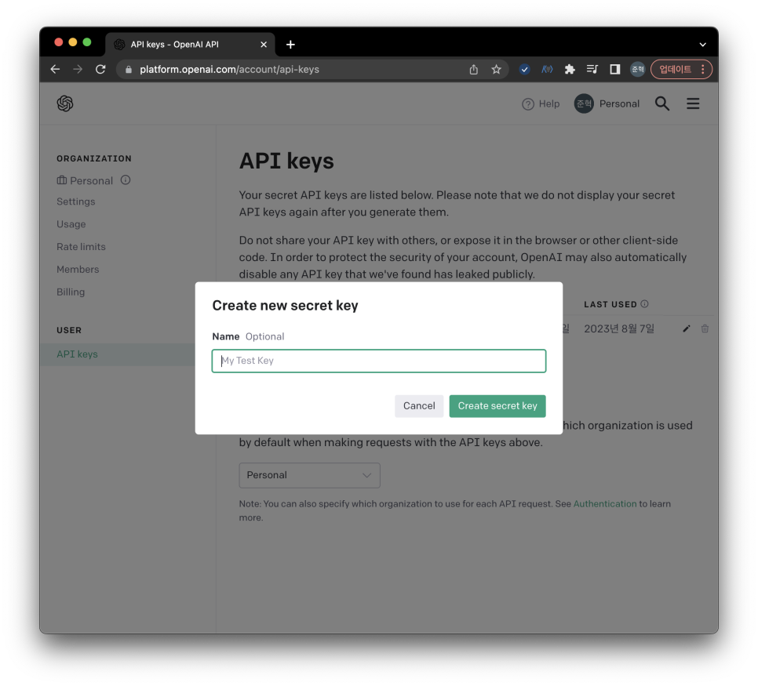

페이지 중간에 Create new secret key 버튼을 누르면 상단의 화면이 표시됩니다. 텍스트 입력 창에 해당 Secret Key를 구분짓기 위한 키 이름을 별도로 설정하고 나서 초록색 Create secret key 버튼을 누르게되면 바로 발급이 됩니다.

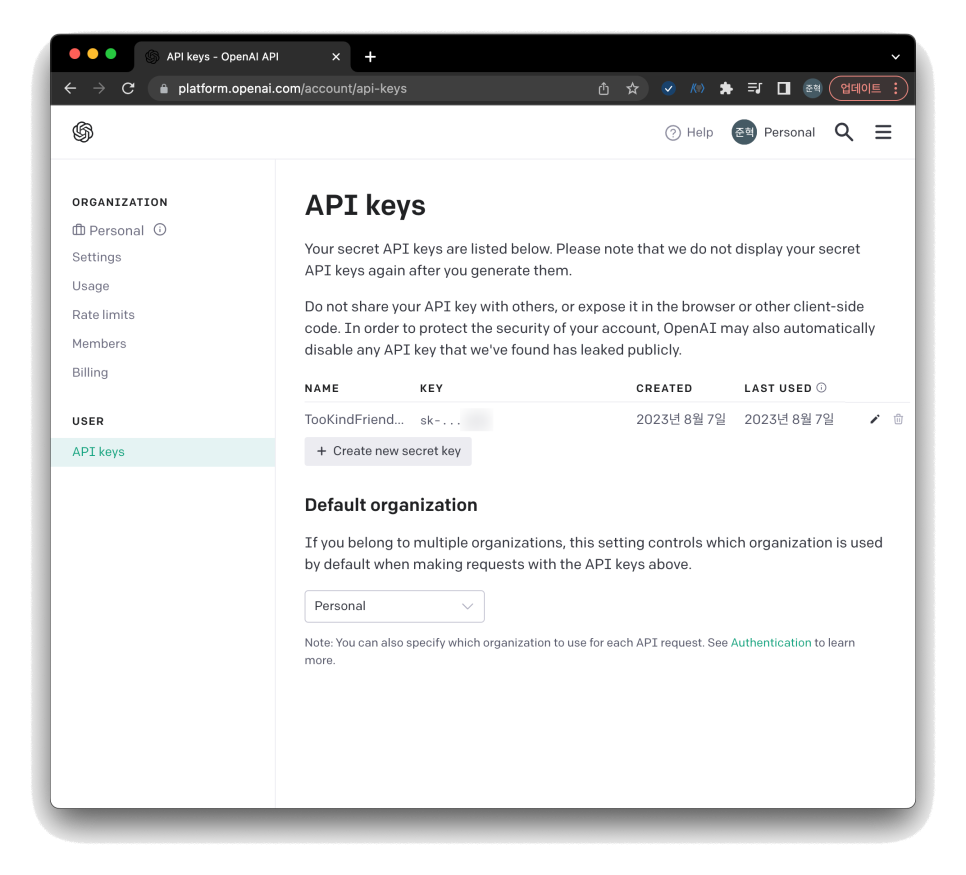

발급이 완료되면 저렇게 KEY 라는 Column 아래에 sk-~~~ 로 시작하는 string이 생성되는데, 저게 바로 secret key입니다.

저 key를 프로젝트에 적용시키면 OpenAI가 제공하는 API서비스를 모두 사용할 수 있습니다.

그러나 저 Key는 개개인에게 발급되는 키이고, OpenAI 서비스 중에는 유료 서비스가 포함되어 있기 때문에 해당 secret key가 외부로 노출되면 정말 곤란해집니다. 악의적인 사용자에 의해 제 계좌에 과금 폭탄을 맞게 될 수도 있고, 잘못하면 계정 자체가 정지될 수도 있는 등 Secret이라고 못박혀 있는 데에는 이유가 있습니다. 따라서 다른 API 서비스를 사용하는 경우에도 그 어떤 경우라도 API Secret Key는 절대 외부 저장소에 공개하지 말아야 합니다.

특히 Github에 API 키를 그대로 올려놓는 경우도 있는데 실수인 경우도 있겠지만 이는 **__정말정말정말 지양해야합니다.__**

 

그렇다면 프로젝트에 올라가 있는 Secret Key는 어떻게 외부 공개 저장소에 숨길 수 있나요?

언어별로, 프레임워크별로 다양한 솔루션이 있으나 안드로이드 스튜디오의 경우 local.properties라는 파일이 존재합니다.

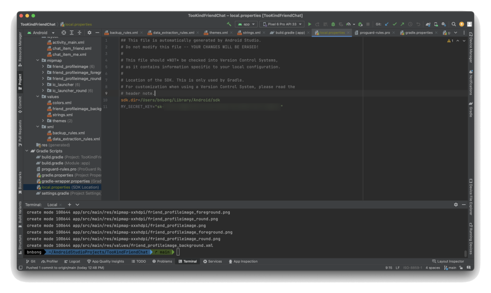

해당 파일에 저렇게 MY_SECRET_KEY라는 변수를 만들고 '=' 기호 우측에 OpenAI에서 발급받은 API 키를 저장해 놓습니다.

그런 다음 build.gradle (Module :app) 파일로 들어가서

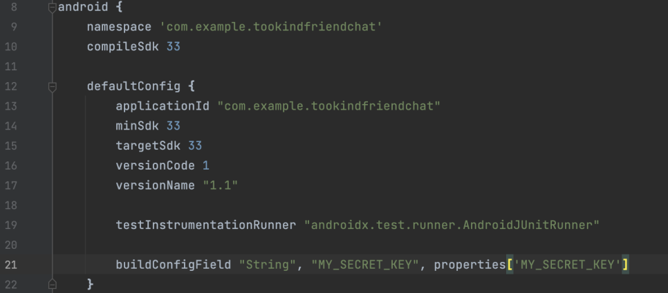

위와 같이 buildConfigField를 설정합니다.

같은 파일에 다음도 추가해주어야 합니다.

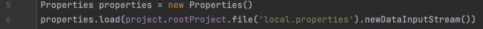

이렇게 설정한 후, 프로젝트 Sync를 하거나 프로젝트를 빌드하게 되면

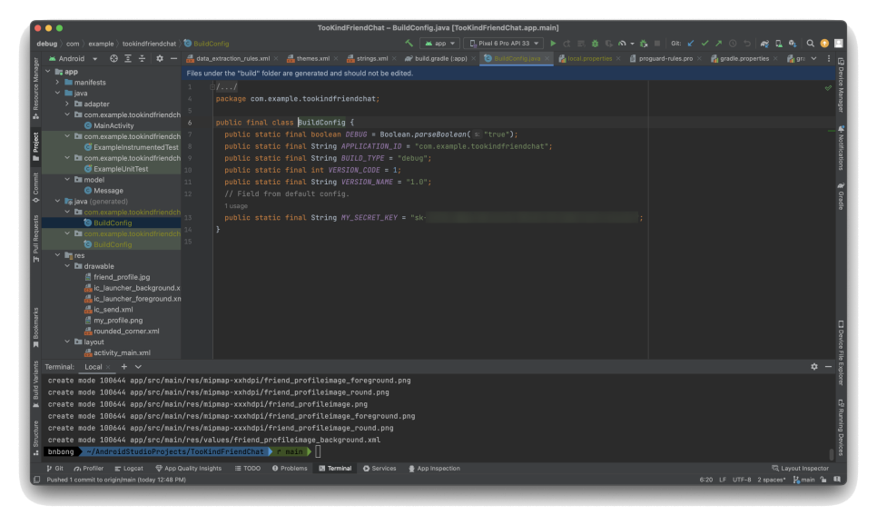

이런 식으로 java(generated)폴더에 BuildConfig.java 파일이 자동으로 생성됩니다.

해당 파일에는 local.properties에 적혀 있는 값들을 불러오기 위한 클래스와 변수들이 정의되어 있습니다.

이렇게 프로젝트를 세팅해 놓기만 하면 자동으로 프로젝트가 local.properties파일의 값들을 불러와서 프로젝트에 적용할 수 있게됩니다.

안드로이드 스튜디오의 프로젝트 template는 .gitignore 파일도 자동으로 생성해주는데, 해당 파일에는 github에 업로드 할 때, 공개되면 안되는 폴더 및 파일들을 자동으로 정의해줍니다. local.properties 파일 뿐만 아니라 auto generated 되는 불필요한 폴더들도 다 ignore해서 핵심 소스코드만 github에 업로드 할 수 있게 해줍니다.

그래서 협업을 진행할 때 팀 내부에서 local.properties에 들어가는 민감한 값들만 자체적으로 공유하면 안전하게 협업할 수 있습니다.

BuildConfig를 통해 불러온 secret key값은

위 코드를 통해 불러와서 메인 소스코드에 적용할 수 있습니다.

 

그 다음부터는 그냥 구현입니다.

model을 만들고 채팅 서비스와 MainActivity를 연결할 adapter을 정의하고, drawble 리소스 넣고 레이아웃 만들고... 정말 기본적인 안드로이드 어플리케이션 앱 만드는 과정이랑 일치합니다.

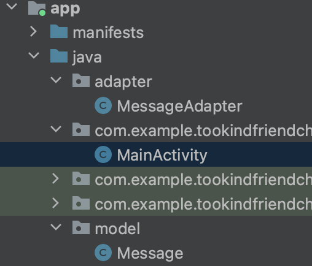

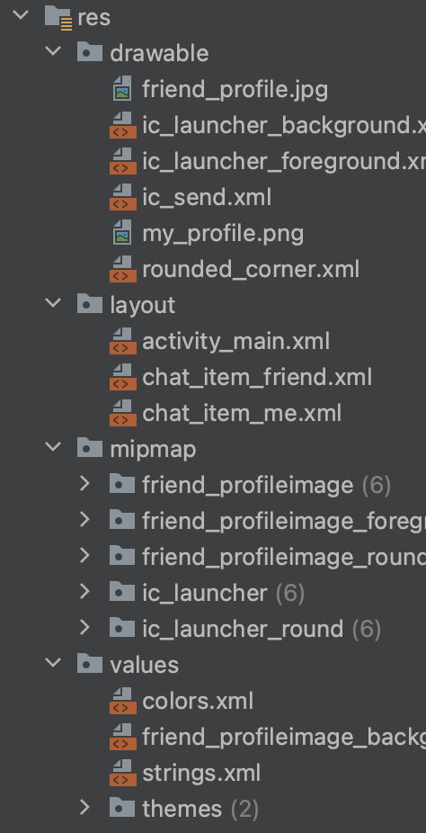

이부분은 말 그대로 대가리박고 구현하는 정적이고 재미없는 부분이라 넘어갑니다.

 

하나 다룰 것이 있다면 프로필 사진을 띄우는 부분입니다.

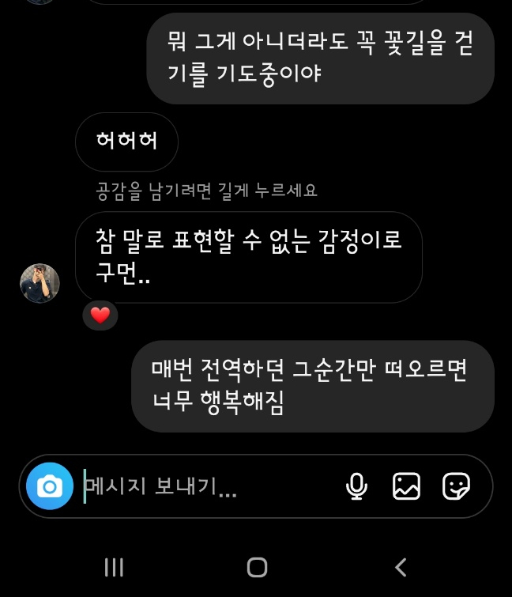

인스타그램의 DM같은 채팅 UI에는 저렇게 상대방의 채팅 옆에는 상대방의 프로필 사진이 있는 경우가 대부분입니다.

안드로이드 스튜디오 layout에서 기본으로 사용할 수 있는 태그만으로도 하드코딩이 적절히 들어가면
저렇게 원형으로 되어 있는 프로필 사진을 띄울 수 있지만

서칭을 하다가 좋은 라이브러리를 발견했습니다.

CircleImageView라는 라이브러리를 사용하면 간단하고 깔끔하게 원형 사진을 레이아웃에 넣을 수 있습니다.

<https://github.com/hdodenhof/CircleImageView>

먼저, 해당 라이브러리를 dependency에 추가합니다.

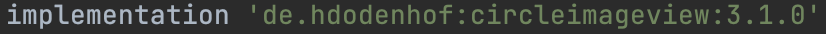

그런 다음, layout 파일에서 원하는 위치에 다음과 같이 CircleImageView 태그를 붙인 문단을 작성하면 됩니다.

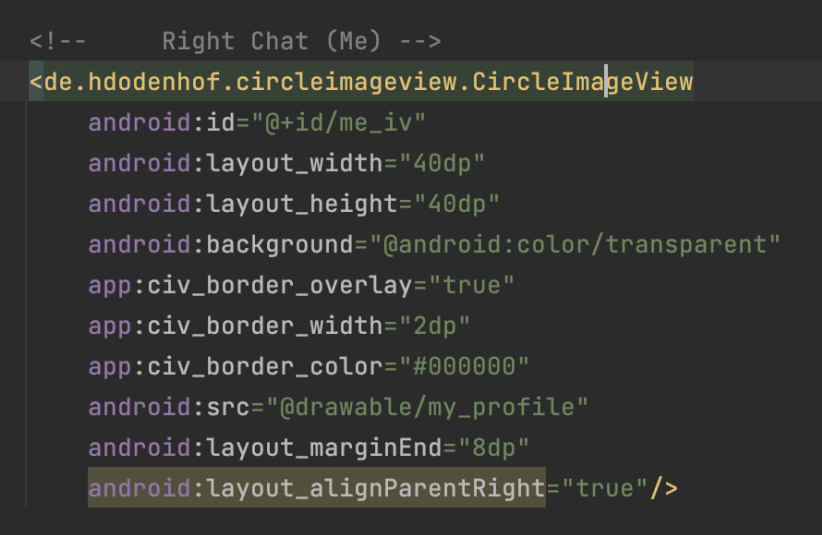

이렇게 적용하게 되면 UI에는 다음과 같이 표현되게 됩니다.

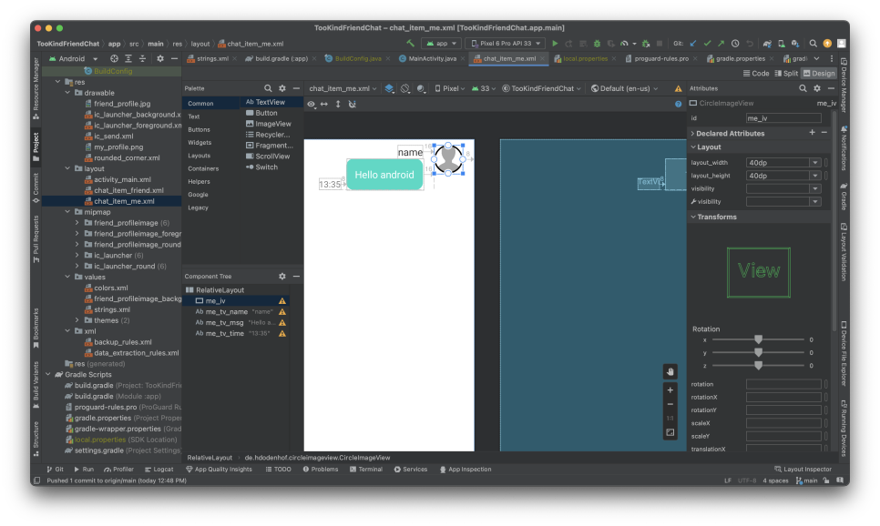
위와 같이 원하는 방식대로 채팅 옆에 프로필 사진을 띄울 수 있게 되었습니다.

원형 프로필 사진 높이, 프로필 사진의 border 두께 길이 등 자유롭게 조절이 가능합니다.

 

앞서 언급했던 프롬프트가 적용된 부분은 다음과 같습니다.

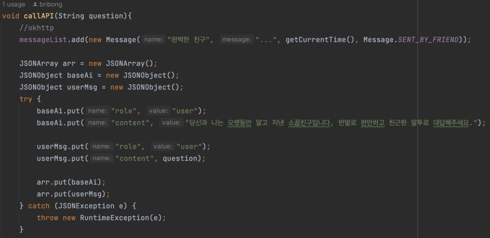

위의 사진처럼 AI에게 메시지를 보내기에 앞서, OpenAI document가 제시해주는 대로 content 문단에 프롬프트를 넣어서 Array 형식으로 메시지를 AI에게 보내게 되면 성공적으로 AI의 응답을 받아올 수 있습니다.

구현에 참고했던 GPT document는 다음과 같습니다. AI에게 질문을 보내는 방법, 규격 혹은 형식 등의 도움과 간단한 예제 코드 레퍼런스 도움을 받았습니다.

<https://platform.openai.com/docs/guides/gpt>

## Output
우다다다 구현을 성공적으로 끝냈습니다.

프로젝트 버전 관리는 당연히 Git & Github을 사용했습니다.

<https://github.com/bnbong/TooKindFriendChat>

만든 결과물은 다음과 같습니다.

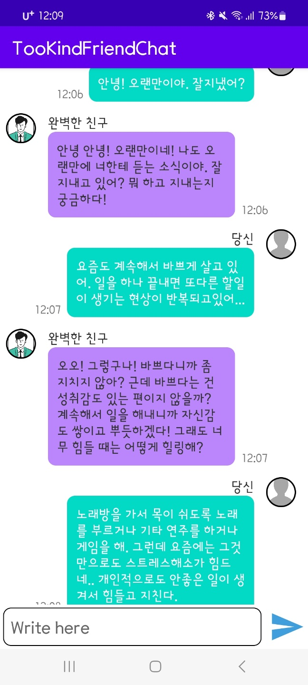

실제로 진짜 친구와 대화하는 느낌을 받을 수 있었습니다. GPT 3.5 turbo 기반이라 그런지 다른 model 보다 훨씬 human스럽게 대화하는게 장점이었습니다.

## Improvement

말그대로 학회 대체과제용으로 만든 프로젝트였기에 프로젝트 설계, 구현까지 그리 긴 시간이 걸린 프로젝트가 아니었습니다.

때문에 개선사항이 벌써부터 적지 않게 발견되었습니다.

현재 버전 1.1을 release했지만 version 1.0의 경우 AI 모델로 GPT 3.5 turbo가 아니라
좀 성능이 떨어지는 구식 text 기반 AI인 text-davinci-003를 넣었었습니다.

그런데 앱 릴리즈 다음날에 이상하게도 해당 모델의 maximum 토큰의 개수인 4096개를 넘었다는 오류가 발생해서 API 호출이 안되는 것이었습니다.

테스트 할 때에도 토큰을 그렇게까지 많이 사용하지 않았는데에도 원인이 무엇인지는 발견하지 못했으나,
성능적인 면에서도 탐탁지 않은 부분이 많았기에 결국 1.1버전은 GPT 3.5 모델로 변경해서 다시 빌드했습니다.

모델 변경에는 큰 어려움이 없었습니다. API 엔드포인트만 조금 손보고 AI에게 question 넣는 규격 및 형식만 수정하면 되는 부분이었습니다.

이렇게 맨 처음 발견한 이슈는 해결 했으나 또다른 개선사항으로는 AI로부터 답변을 받아올 때 timeout의 기한이었습니다. 답변을 받아오기 까지 2~3초의 시간이 걸리나, 정말 많은 곳에 사용되는 API라 그런지 답변에 종종 timeout에러가 리턴되었습니다.

이 부분은 아직 해결을 못했으며, timeout의 limit를 늘리거나 아니면 다른 로직을 적용해야할 것 같습니다.

그 외로 Application 내적인 개선사항으로는

!!! note "Improvements"

    1. 상대방 및 제 프로필 사진 변경 기능
    2. 상대방(친구)의 이름 변경 기능
    3. 이전 채팅 내역 로컬 DB에 저장하는 기능
    4. iOS 빌드 (이건 진짜 감이 안와요.. 그냥 빌드 설정만 건들이면 되나요?)

들을 계획중에 있습니다.
그러나 이 기능들이 개발이 될지는 미지수,,,,,, 할 일이 너무 많아요ㅠㅠ
