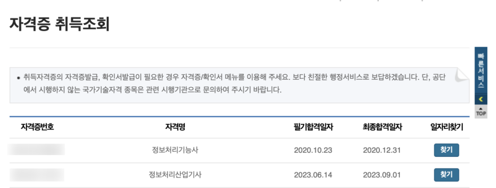
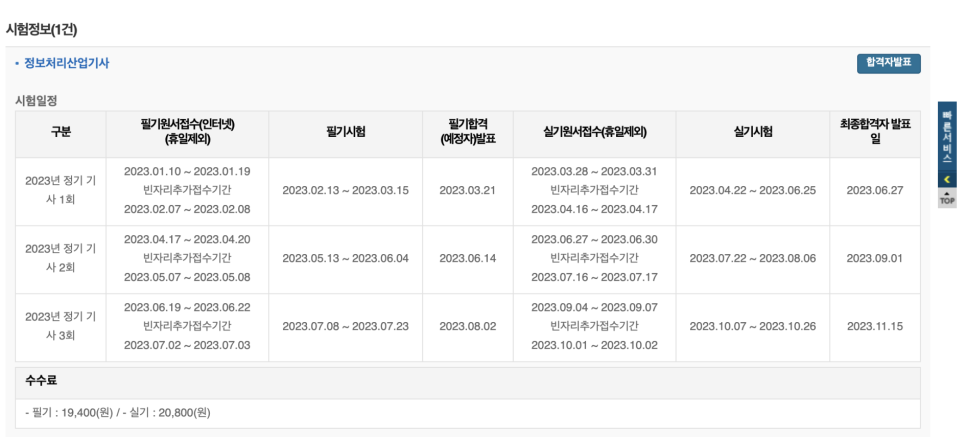
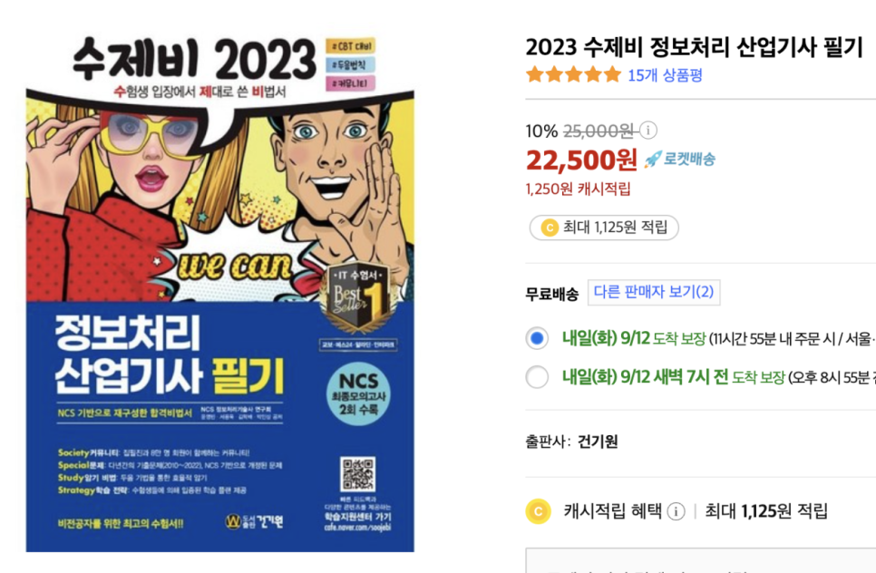
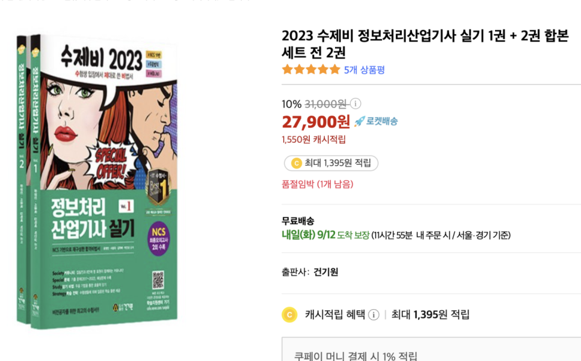
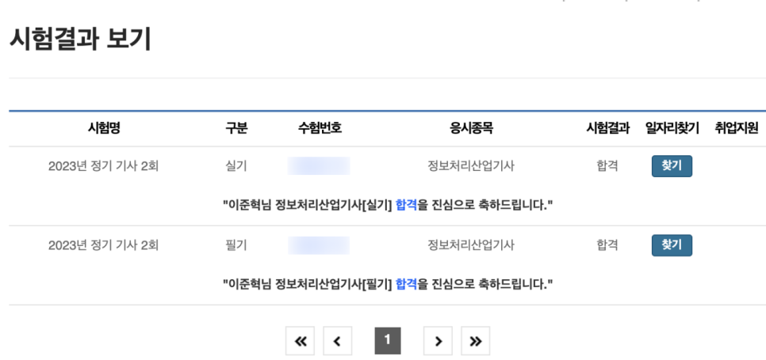

올해 5월, 나는 정보처리산업기사 자격증을 준비했다.

기존에 나는 정보처리'기능사' 자격증을 취득한 상태였다. 정보처리 기능사를 따게 된 이유는 입대 때문이었다.

공군 전산병으로 입대를 결심한 나는 특기병 입대 요건을 알아보다가 대학 전공을 제외하고 가장 높은 점수를 취득할 수 있는 분야가 자격증이라는 것을 깨닫게 되었고,

좀 더 안정적으로 특기병에 합격을 하기 위해 작년 2020년 말부터 정보처리기능사를 준비했고, 성공적으로 따서 입대할 수 있었다.

1년 휴학을 한 올해는 자격증을 포함해서 내 개인적인 실력과 경험을 쌓을 수 있는 일들을 해보자라는 취지로 자격증을 뭘 따볼까 고민하던 차에
정보처리기능사의 상위 자격증인 정보처리산업기사 자격증을 알게 되었다.

---

## 자격증 신청

/// caption
자격증 접수 화면
///

정보처리 기능사, 산업기사, 기사는 모두 '정기' 고사이다. 이전에는 상시로 시험을 보는 자격증이었으나 개편이 되어서 시험 일정이 1년에 3~4번 존재한다. 자격증을 취득하려면 시험 일정을 잘 체크하고 신청해야 한다.

신청은 대학 수강신청이나 티켓팅을 해보았다면 익숙할 수 있다.

!!! warning "수도권 고사장 접수 시간"

    한가지 유의할 점이라면, 만약 필기 및 실기 시험장 접수를 할 때 수도권에 있는 고사장으로 신청을 하고자 한다면 수도권 고사장이 신청가능 시간인 오전 10시부터 열리는지, 아니면 오후 2시에 열리는지 체크를 잘 해야한다
    (23년 정기 기사 시험 2회 필기는 수도권 고사장 접수가 2시부터 열렸으나 해마다 혹은 시험마다 시간이 달라질 수 있음을 유의).

내 경우에는 실기시험장 접수할 때에는 오전 10시부터 수도권 고사장 접수가 가능했으나, 필기 시험장 접수 때에는 오후 2시부터 수도권 시험장 접수가 가능했었다.

신청 페이지에서 강조된 텍스트로 수도권 고시장 접수에 대한 내용이 기재되어 있으니 잘 읽어보고 유의하길 바란다.

---

## 필기 시험

/// caption
필기 시험 준비
///

나는 필기, 실기 시험 모두 수제비 책으로 공부했었다.

한권을 통째로 빠짐없이 다 풀고 공부하고 나서 1주일 전에는 시나공 책까지 추가로 사서 다 풀었다.

그러나 개인적으로 필기 공부는 수제비 책 보다는 시나공 책이 좀 더 도움이 되었다.

일단 시나공 책의 흐름이 수제비보다 깔끔한 느낌이 들었고, 수제비 책은 출제 가능성이 조금이라도 존재하는 부분도 자세하게 짚고 넘어가주지만 개정과정에서는 시험에 잘 출제하지 않는 부분까지도 여전히 첨부를 해두었다.

20년 개정과정의 1단원은 정보시스템기반기술 부분인데, 이 부분은 개정과정 이전에는 CPU 스케쥴링 부분 중 프로세스의 시간을 구하는 문제를 킬링 문제로 출제하는 경향이 있었다. '~~~ 스케쥴링 기법에서 작업 도착 시간과 CPU 사용 시간을 주고 평균 대기시간을 구하라' 라는 문제 유형들이 이전 개정과정 필기 시험에는 꼭 한문제 이상을 출제하였으나 개정 이후에는 해당 유형의 문제를 거의 출제하지 않는다.

따라서 효율적으로 공부를 하려면 스케쥴링 기법에 따라 특정 시간을 구하는 문제를 접근 방법과 푸는 방법정도만 이해를 하고 빠르게 넘어가서 1단원의 나머지 부분을 외우는데 더욱 많은 시간을 투자하는 것이 더 좋다. 그러나 수제비 책은 해당 부분을 초반에 너무 자세하고 많은 분량으로 풀어놔서 정보처리산업기사 분야를 처음 접해보는 비전공자 분들이 더 큰 압박감을 느낄 수도 있게 배치를 해두었다.

책을 고를 때 참고하시기를 바라면서, 전체적인 필기 시험에 대한 후기는 정보처리기능사때와 유사했다.

소프트웨어 전공자인 나는 전체내용의 적지 않은 부분이 학교 수업에서 배웠던 부분이라 개념을 이해하고 문제를 푸는데 어렵지 않았다. 다만 정보처리기능사도 마찬가지로 비전공자라면 생소할 내용이 굉장히 많다. 스케쥴링 기법, TCP/IP, OSI 7계층, DB 정규화, SQL 쿼리 등 외워야할 개념들이 많으면서도 시험에서 핵심적으로 출제하는 부분들은 많은 개념 암기를 요구하고 이해를 요구하기 때문에 비전공자 분들에게는 약간의 어려움이 있을 수 있다.

시험은 CBT, 즉 종이로된 시험지가 아닌 컴퓨터에 앉아서 시험을 보는 형태였으며 책에서 봤던 필기 기출 문제들이 거의 그대로 출제가 되었다. 기출문제를 열심히 풀었다면 큰 어려움 없이 시험지 제출 버튼을 클릭하고 바로 합격 화면을 볼 수 있을 것이다.

---

## 실기 시험

/// caption
실기 시험 준비
///

실기 시험은 필기 시험을 준비하면서 공부했던 개념과 내용들이 그대로 나왔다.

다만 실기이기 때문에 SQL 쿼리를 하는 부분이라던지, 실제로 간단한 로직을 짜거나 풀이를 해야하는 문제들이 출제가 되었다.

개인적으로 이번 23년 정기 기사 시험 2차의 정보처리산업기사 실기 시험은 20년 정보처리기능사 4회 실기보다 쉬운 느낌이었다.

시간도 넉넉하게 느껴진 편이었어서 문제를 두어번 검토하고도 시간이 남았으며, 오히려 개념 암기 부분에서 어려움을 느껴서 시간을 더 썼었다.

실기임에도 불구하고 개념 암기도 중요한 비중을 가지고 있기 때문에 책에서 작은 캡션으로 기재되어 있는 부분까지도 거의 모두 외우고 갈 것을 추천한다.

---

## 마무리

/// caption
합격 결과
///

필기든 실기든 시험 점수가 특정 점수 이상만 된다면 무조건 합격이기 때문에 100점에 목숨을 걸 필요 없이 완벽하게 공부하려고 하지 않아도 합격할 수 있다.

우리 모두의 시간은 소중하기에 효율적으로, 최선의 결과를 보이자.

각자의 목표를 위해 열심히 노력하시는 모두들, 화이팅 입니다!

!!! note "원문 안내"

    이 글은 [네이버 블로그](https://blog.naver.com/bnbong/223208201492)에 2023-09-11에 올렸던 글을 옮긴 것입니다.
