본 프로그램은 오픈소스 소프트웨어 통합 지원센터, Open Up가 주관하며, 선배 개발자(멘토)분들과 함께 오픈소스 소프트웨어 프로젝트에 직접 기여를 해보는 경험을 통해 참여, 오픈, 공유, 협업이라는 오픈소스 문화를 체험 해보는 멘토링 프로그램이다.

<https://www.contribution.ac/2023-ossca>

!!! abstract "참여 정보"

    - 기간: 2023/07/08 ~ 2023/10/07
    - 참여 프로젝트: Azure 클라우드 Python 오픈소스 SDK 도구 및 문서 (참여형 프로젝트)
    - 참여 과정: Challenges + Masters 수료
    - 참여 역할: 멘티

---

## 프로그램 참여

원래는 해당 프로그램의 존재, 더 나아가 Open Up이라는 기업이 어떤 기업인지도 모르고 있었다. 공교롭게도 이 프로그램에 지원하기 전의 나는 Open Up의 포털사이트인 공개SW 포털([https://www.oss.kr/](https://www.oss.kr/))에 올라와 있는 공모전 공고를 발견하여 개발 공모전에 참가 신청을 해 둔 상태였다. 이를 OSSCA 프로그램에 참여하고 나서 나중에 알게 되었다.

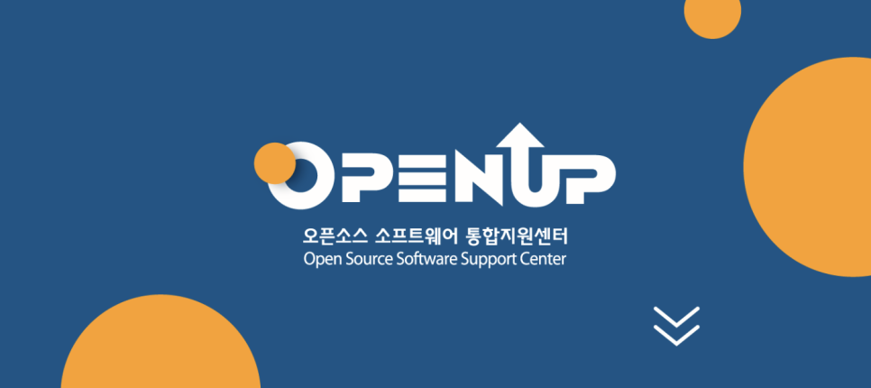
/// caption
오픈소스 소프트웨어 통합지원센터 Open UP
///

OSSCA라는 프로그램이 있다는 것을 내가 올해 들어가게된 학부 전공 학회 공지에서 알게되었다. 학회 공지에서는 간간히 대외활동이나 외부 세미나 같은 활동에 대한 공고가 올라오는데, 이번 공고는 올라가자마자 학회 내부 커뮤니티에서 작년에 해당 프로그램에 참여했던 선배 한분이 짧게나가 후기를 남겨주셨다.

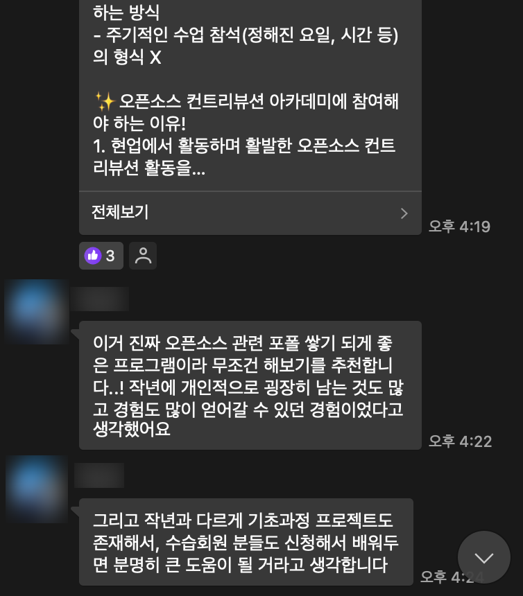
/// caption
학회 커뮤니티에 선배가 남겨준 후기
///

굉장히 만족했던 프로그램이었고 해당 프로그램을 통해서 자신의 실력도 많은 성장을 이뤄냈다는 것이었다. 해당 공지와 선배의 경험을 처음 들었던 나는 당시에 버스를 타고 학교로 가고 있었고, 버스 안에서 사이트를 들어가서 확인해보니 정말 괜찮은 프로그램이라는 생각이 들었다.

내가 처음으로 봤던 2023 OSSCA 모집 공고 (출처: [https://www.contribution.ac/2023-ossca](https://www.contribution.ac/2023-ossca))

나는 JAVA, C 언어도 다룰 수 있었지만 주로 다루는 언어는 Python이기 때문에 Python언어 관련해서 컨트리뷰션을 할 수 있는 프로젝트가 있을까 탐색을 하였다.

그러던 중 눈에 들어오는 프로젝트가 있었는데, 바로 Backend.AI 프로젝트와 Azure SDK for python 프로젝트였다. 지원서에는 총 2개의 지망을 적어서 지원이 가능했었기에 둘 중 어느 프로젝트를 1지망으로 쓸 지 고민했었다.

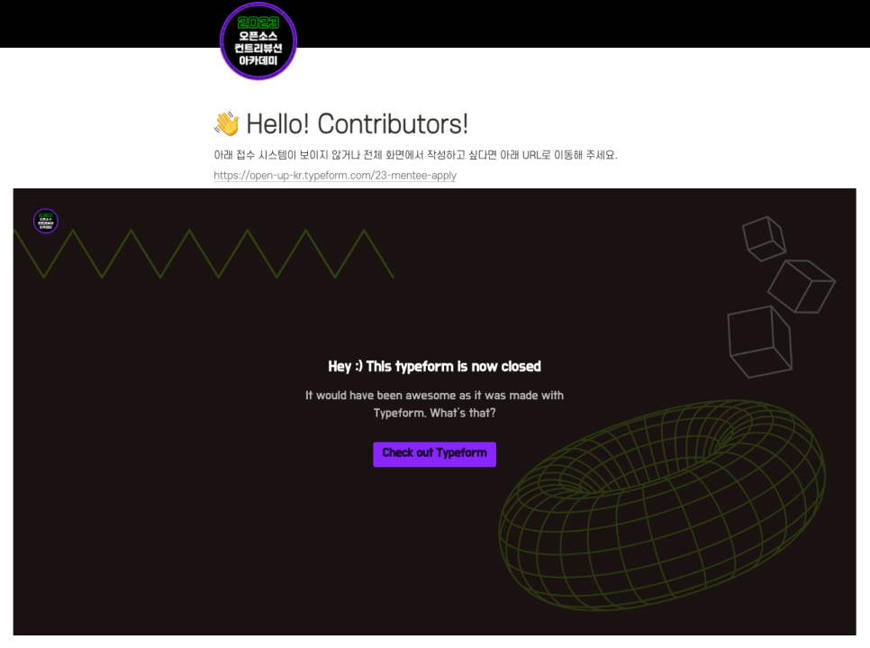
/// caption
지금은 지원 접수 링크가 닫혀있어서 내용을 볼 수 없다ㅠㅠ
///

먼저 Backend.ai 프로젝트는 요즘 AI 기술이 굉장히 핫해져서 먼저 눈길이 갔던 프로젝트였다. 내가 현재 다루는 기술이 Backend 쪽이기도 했고 내가 관심있어하는 두개의 키워드가 하나로 뭉쳐 프로젝트의 제목으로 나와 있었으니 제일 먼저 알아보게 되었다.

OSSCA 포털에서 각 프로젝트에 대한 설명과 참여할 프로젝트를 선택할 때 인지하고 있어야할 내용, 프로젝트 참여 자격 등이 서술되어 있었는데 Backend.AI의 경우에는 거기서 더 나아가 프로젝트에 참여하기 전에 개인적으로 수행해야하는 4개의 과제를 추가로 제공하였다.

해당 내용은 각 프로젝트마다 모두 같은 양식의 PPT로 작성되어 있었으며, Backend.AI의 PPT에서는 Backend.AI의 서비스를 설치 및 사용하는 방법까지 기재되어 있었다. 과제도 간단하게 Backend.AI 서비스를 설치해보고 서비스에서 AI 모델 하나를 받아서 내 대시보드에 올려보는 작업을 해보는 것이 과제였다.

<https://www.backend.ai/>

가이드라인도 훌륭하게 제공되어 있던 편이었고 서비스도 정말 괜찮아 보여서 더 탐색을 했었다. Github로 관련 코드가 오픈소스로 제공되어서 Github에 올라가 있는 소스코드도 살펴보았었다.

<https://github.com/lablup/backend.ai>

생각보다 규모가 있는 프로젝트였으며, 운영도 정말 정교하게 잘 운영이 되어있는 편이었다. 나중에 멘토님들께 들어보니 OSSCA에 있는 이 팀이 직접 해당 프로젝트를 운영하는 것이었다. OSSCA에 있는 프로젝트는 대부분이 다른 외부 오픈소스 프로젝트에 기여를 해보기 위해 Customer들이 자발적으로 모인 단체이기 때문에 실제 운영 팀과는 다른 조직에서 프로젝트 기여를 하게 되는 셈인데 Backend.AI의 경우에는 운영팀과 직접 같이 작업을 할 수 있는 것처럼 보였다.

다음으로 고려했던 프로젝트는 'Azure 클라우드 Python 오픈소스 SDK 도구 및 문서'였다. Azure SDK python 팀을 선택한 이유는, 이 프로그램에 지원하기 전에 나갔던 개발 공모전에 출품할 서비스의 아키텍처를 구축하면서 Azure 서비스를 사용해봤던 경험 때문이었다.

이전에 같이 작업을 했었던 창업 팀의 선임 개발자분이 새로 가게된 산업체에서 아키텍처로 Azure을 사용하고 있다는 얘기를 듣고 나서 내가 진행하는 공모전 프로젝트에 도입을 해본 것이었다. AWS와 비교해서 Azure은 어떤 장점이 있고 어떤 면에서 좋은 것이 있는지 궁금했다. 이 것을 Azure을 집중적으로 다루는 팀에서 정보를 얻어갈 수 있으면 좋을 것 같다고 생각해서 지원을 했었다.

그렇게 계속 고민을 하다가 Azure SDK 쪽을 1지망으로 쓰기로 결정해서 지원서를 제출했고,

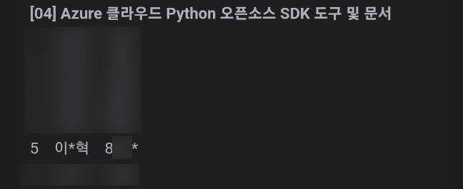
/// caption
지원서 제출 화면
///

제출 후 1달 정도가 지나자 Azure SDK 팀에 합격을 하게 되었다!

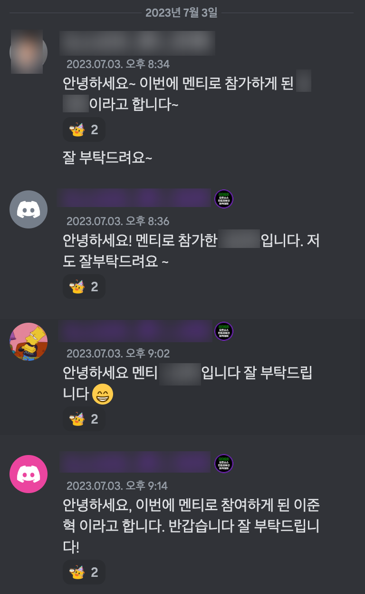
/// caption
Azure SDK 팀 합격 안내
///

프로그램에 합격하고 나서 제공된 디스코드 링크를 통해 OSSCA의 디스코드 서버로 가입을 할 수 있었고, Azure SDK 팀의 디스코드 채널에서 처음으로 인사를 나누었다.

---

## 프로그램 활동

## 1. 발대식

프로그램에 합격했다는 사실을 알게 되고 나서 7월 8일, 오픈소스 컨트리뷰션 아카데미의 첫 활동인 발대식에 참석을 하게 되었다.

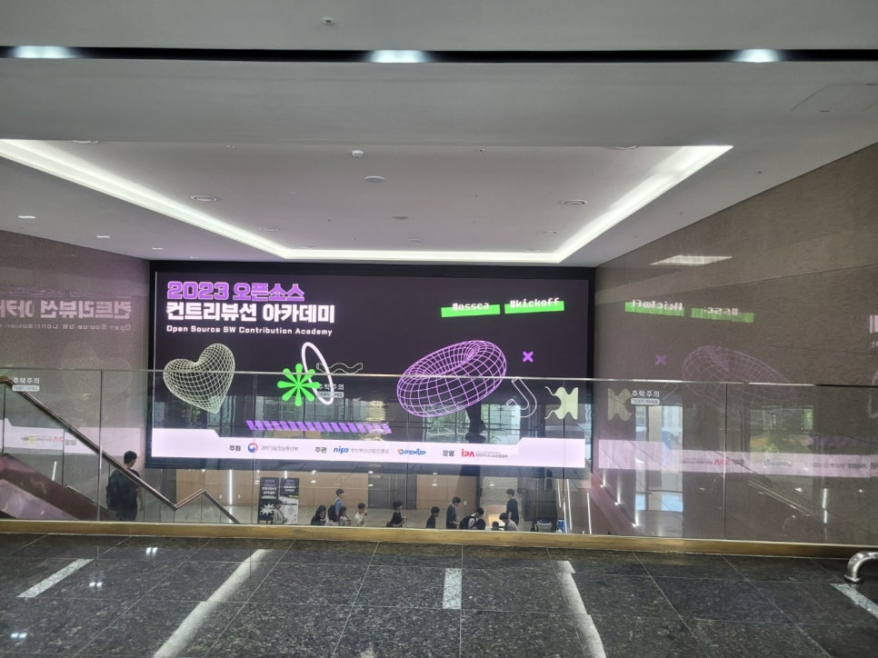
/// caption
발대식이 열린 한국 과학기술 회관
///

강남에 있는 한국 과학기술 회관이라는 곳에서 진행을 했으며, 행사장에는 정말 많은 사람들이 있었다.

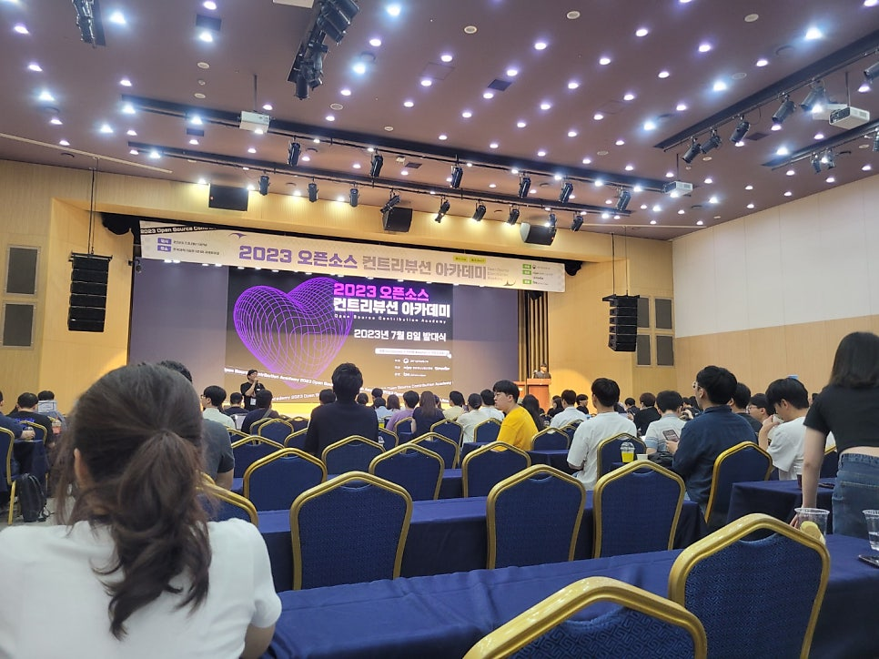
/// caption
발대식 행사장 풍경
///

발대식에서 오픈소스 컨트리뷰션 아카데미의 멘티로서 앞으로 어떤 활동을 하게 될지 안내를 받게 되고, 우리 Azure SDK 팀 뿐만 아니라 다른 오픈소스 팀들에 대한 간략한 소개 발표도 듣게 되었다.

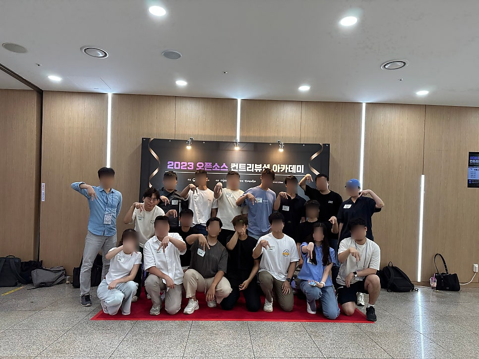
/// caption
Azure SDK 팀 단체 사진
///

다같이 사진도 찍었다. 포즈는 Azure의 알파벳 'A'를 본딴 포즈ㅋㅋ

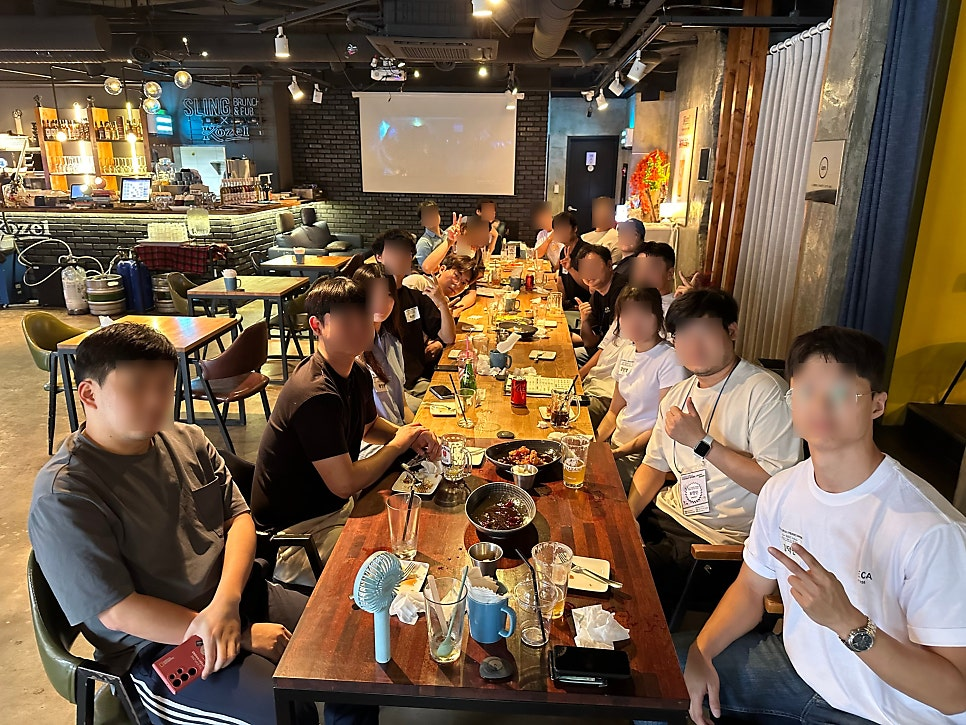
/// caption
발대식 이후 첫 회식
///

발대식 행사가 끝난 이후 다같이 처음으로 회식을 하면서 오픈소스에 대한 얘기도 해보고 서로 어떤일을 하는지, 어떤 경험이 있는지 얘기를 해보는 시간도 가졌다.

'Azure 클라우드 Python 오픈소스 SDK 도구 및 문서'팀의 멘토님들은 3분이셨는데, 그 중 2분이 Microsoft Korea 직원이셨다. 활동을 하면서 마이크로소프트 팀 내부의 개발 문화와 어떤 프로젝트의 개발 비화 같은 비하인드 스토리들을 종종 들을 수 있었다.

프로젝트를 만든 기업에 재직을 하시는 분이 계셨기 때문에 우리 팀도 기여를 할 때 마이크로소프트 팀 내부에서 어떤 식으로 작업을 하는지 어느정도 예상하며 원활한 기여를 할 수 있었다.

## 2. 모각코

모여서 각자 코딩하기, 줄여서 모.각.코라고 불리는 활동도 해봤다.

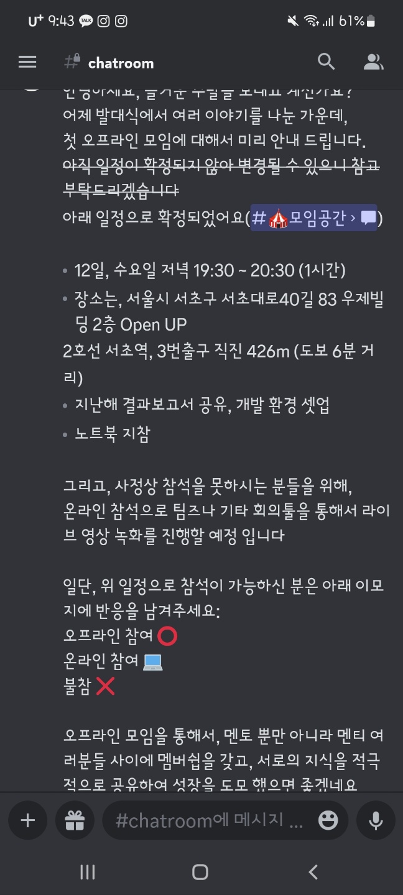
/// caption
OpenUp 오픈 스페이스에서 진행한 첫 모각코
///

발대식 이후 가졌던 첫 오프라인 모임에서는 OpenUp 기업이 직접 운영하는 오픈 스페이스인 'OpenUp'에서 진행했었다.

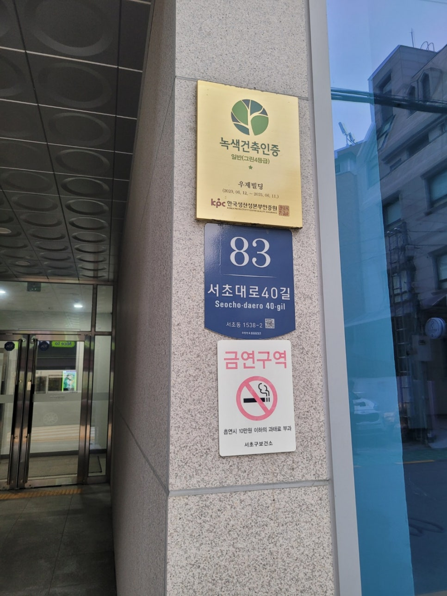
/// caption
서초에 있는 OpenUp 건물
///

서초에 있는 건물이라 집에서 가기가 은근 힘들었다. 물론 안산에서 집으로 갈 때 허구헌날 서초를 지나가기 때문에 '서초가는게 힘들어봤자 얼마나 힘들겠어?'라고 생각했는데, 이후 모든 모임 활동이 사람들이 한창 퇴근을 할 시간대인 7시경에 진행을 해서 갈때마다 지하철에 사람이 엄청 몰려있었다. 사람 많은 곳을 힘들어해서 학교가는 것 마냥 기운이 빠졌다...

첫 모각코 활동에서는 앞으로 계속 사용해야하는 Python 언어의 개발환경 세팅과, Azure 관련 오픈소스코드를 내 로컬 머신에 설치해서 환경을 세팅하는 시간을 가졌다. 나는 나름 Python을 많이 사용해봤고, 사용하고 있기 때문에 환경 설정에 큰 어려움은 없었다.

## 3. 온라인 활동

첫 모각코 활동 이후로도 계속 오프라인 및 온라인을 병행하여 모임을 진행했다.

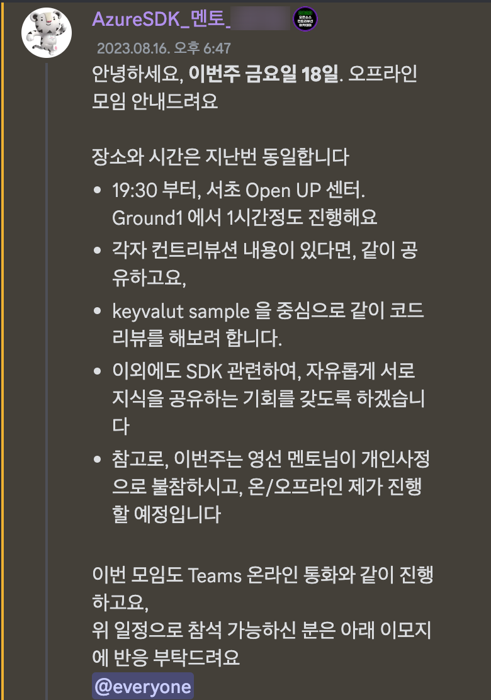
/// caption
Microsoft Teams로 진행한 온라인 미팅
///

미팅은 주마다 총 2회를 진행했고, 금요일은 고정으로 온라인 모임을 진행했다. 미팅에 사용한 화상회의 도구는 Microsoft 프로젝트에 기여를 하는 팀 답게 Microsoft Teams를 사용했다.

팀즈는 이번에 처음 사용해봤는데, 사용평을 간략하게 서술하자면 사용성은 **최악**이라고 생각한다. 회원가입이 필수로 필요하지만 계정을 생성하고 나면 각 그룹 서버내에서 채널을 분리하여 회의 내용과 회의 통화 방을 간편하게 관리 및 개설, 참가를 할 수 있는 디스코드, 회원가입이 필수는 아니지만 외부인도 링크만 있다면 회의방에 참여가능하고 권한 요청등의 호스트와의 커뮤니케이션이 정말 잘 구현되어 있는 Zoom과는 달리 Microsoft Teams는 이러한 UX부분에 불편한점이 너무 많았다.

!!! warning "Teams 계정 관련 문제"

    첫 번째로는 계정 관련한 문제였다. 마이크로소프트 계정이 구글 계정과의 통합 개설을 지원한다고 하지만, 구글 계정과 통합된 계정으로 로그인을 진행하면 정말 자주 로그인 실패가 떴다. 또한 그렇게 해서 겨우겨우 로그인을 성공하면 Microsoft Teams에 개설되어 있는 Azure SDK 팀 스페이스에 있는 내 계정이 아닌 다른 계정으로 로그인이 되는 것이었다.

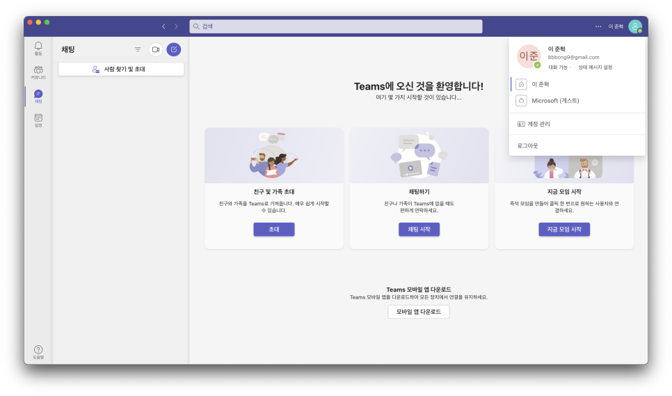
/// caption
'Microsoft (게스트)'로 쪼개져 있던 계정
///

나중에 알고 보니, Azure SDK 팀 스페이스에 들어가 있는 계정은 내 메인 계정이 아니라 'Microsoft (게스트)'라 적혀있는 계정이었다. 같은 메일, 같은 사용자, 게스트가 아니라 로그인을 수행한 계정인데도 불구하고 이렇게 계정 정보가 나도 모르게 쪼개져 있다는 것을 마소 팀즈 서비스는 알려주지 않았다. 이 때문에 회의를 할 때마다 불편함을 느꼈다.

두 번째로는 회의 진행 중 화면 공유에 대한 부분이었다. 윈도우는 문제가 전혀 안되는 부분이지만 나는 맥북을 사용하고 있기 때문에 내 맥북 화면을 다른 팀원들한테 공유하기 위해서는 별도의 작업을 수행해야 했다.

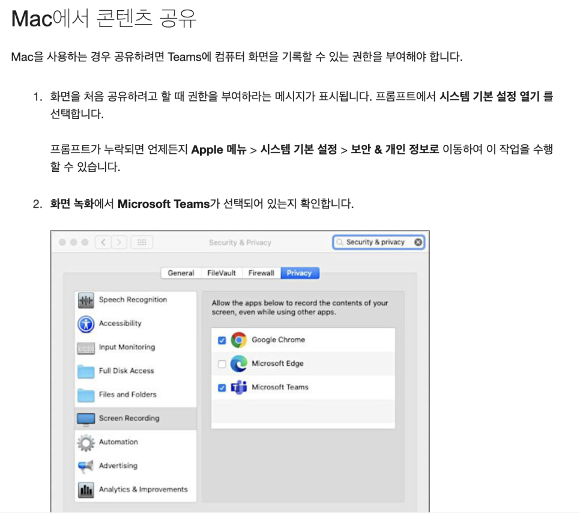
/// caption
맥북 화면 공유에 대한 마소 팀즈 가이드
///

마소 팀즈 사이트에서는 상단의 사진과 같이 가이드를 제공하고 있지만 가이드라인을 그대로 따라해도 화면 공유가 안되는 것이었다. 설정은 문제 없이 되었지만 화면 공유 버튼을 누를 때에면 자꾸만 내 맥북이 계정에 등록되지 않은 기기라는 오류가 뜨면서 화면 공유가 안되는 것이었다.

그렇다면 맥북을 등록해서 해결하면 되는 것 아닌가? 라고 생각해서 내 맥북을 계정에 등록하려고 했더니

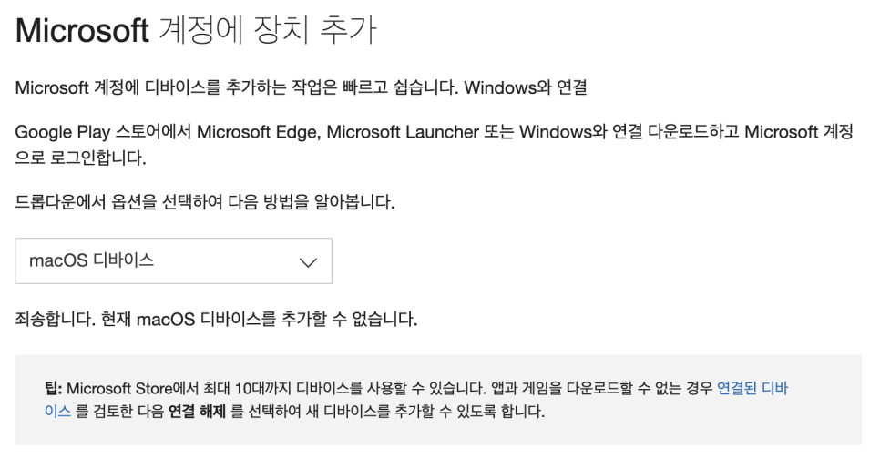
/// caption
기기 등록 안내 화면
///

... 뭐 어쩌라는 건지

결국 나는 회의를 할 때 마다 화면 공유 한번이면 쉽게 설명할 수 있는 것들을 일일이 내가 보고 있는 페이지의 링크를 제공하면서 설명을 해야했다. 이는 모든 활동이 끝날 때 까지 고쳐지지 않던 문제였다.

아마 이런 문제가 고쳐지지 않는다면 나는 앞으로도 회의에 사용할 도구로 Microsoft Teams를 선택하지 않을 것 같다.

도구에 대한 불편함을 제쳐두고, 온라인 활동 자체는 너무 만족스러웠다.

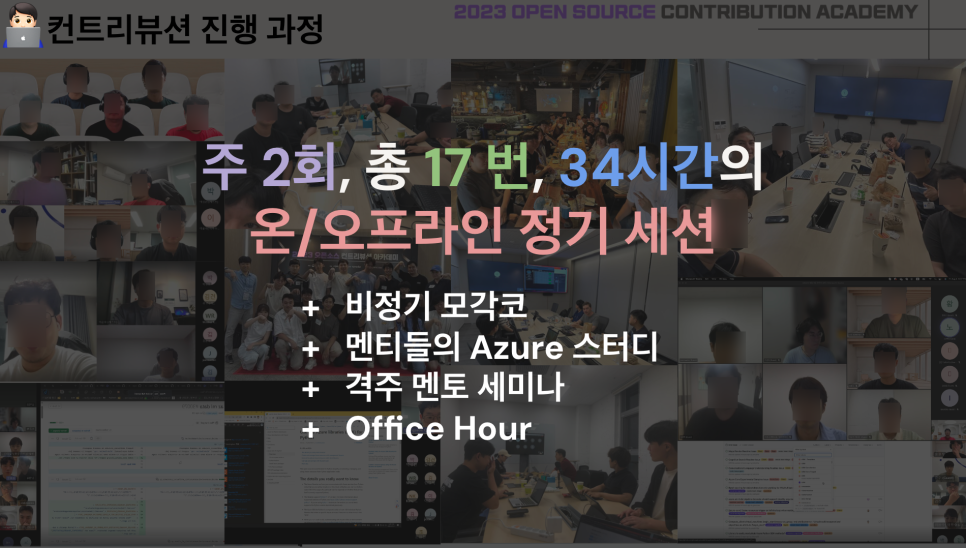
/// caption
매주 금요일 진행한 온라인 멘토링
///

매주 금요일 정기적으로 진행하는 온라인 멘토링에서 자신이 진행했던 이전 컨트리뷰션에서 어려운 점에 대해 그 내용을 공유하고 다같이 고민하고 해결해보는 시간을 가졌다. 이 시간 덕분에 궁금했던 내용을 해소할 수 있었으며 더 깔끔한 컨트리뷰션을 할 수 있는 역량을 기를 수 있었다.

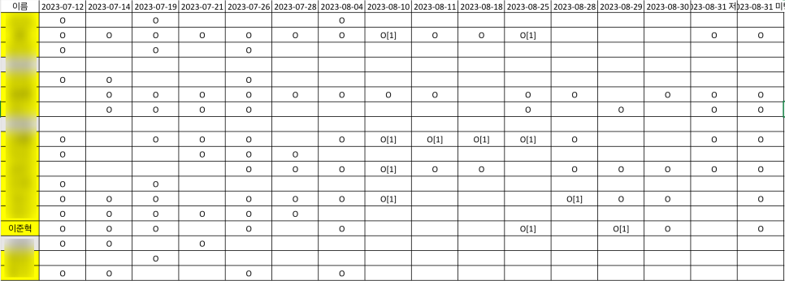
/// caption
엑셀로 정리한 활동 참여 현황
///

활동 참여는 위 사진과 같이 엑셀로 정리하여 관리를 했다. 오프라인 / 온라인 미팅에 참석을 하지 못하는 경우가 있더라도 모든 모임 활동은 녹화본으로 남기기 때문에 녹화본을 통해 Follow-up을 할 수 있었다.

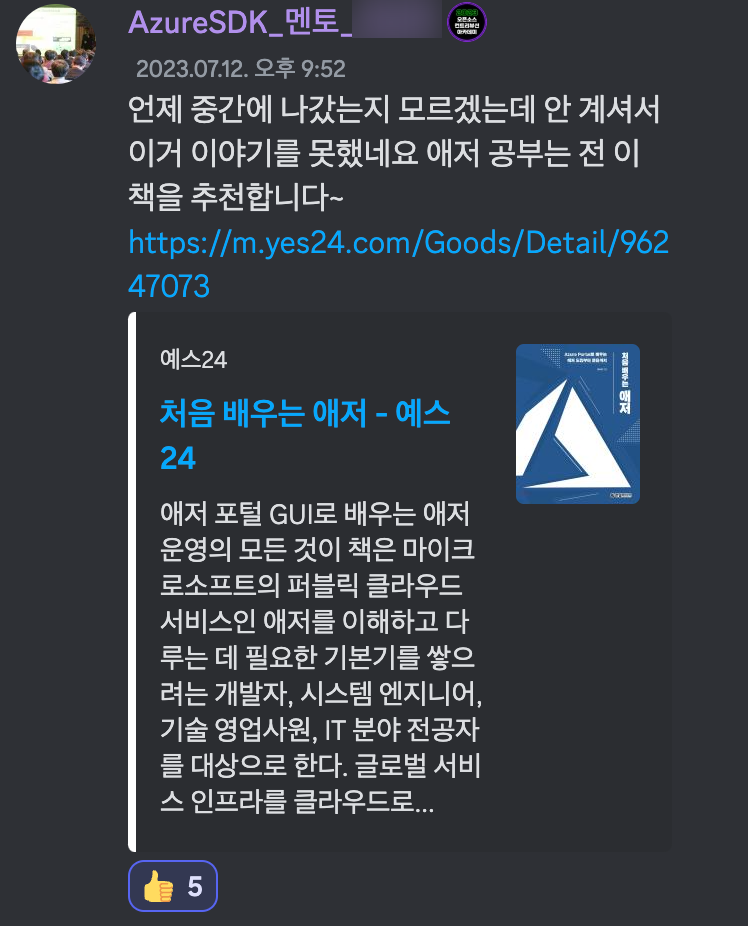
/// caption
멘토님이 디스코드에 공유해주신 책 추천
///

디스코드 채널에서 위 사진과 같이 멘토분들이 가끔 꿀팁(?)을 전달해주시기도 했다. 이 글보고 나도 위 책을 구매했다. 그렇지만 정작 볼 시간이..

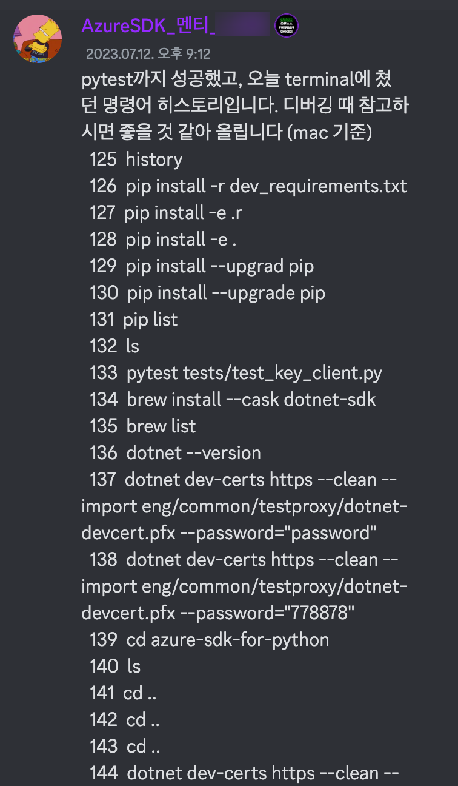
/// caption
디스코드 채널에서 멘티들끼리 나눈 소통
///

다른 멘티 분들도 디스코드 채널을 적극 활용하여 회의 날짜가 아니더라도 컨트리뷰션을 진행하면서 어려운 부분이 있으면 서로 소통하면서 문제를 해결했다.

## 4. 추가 활동

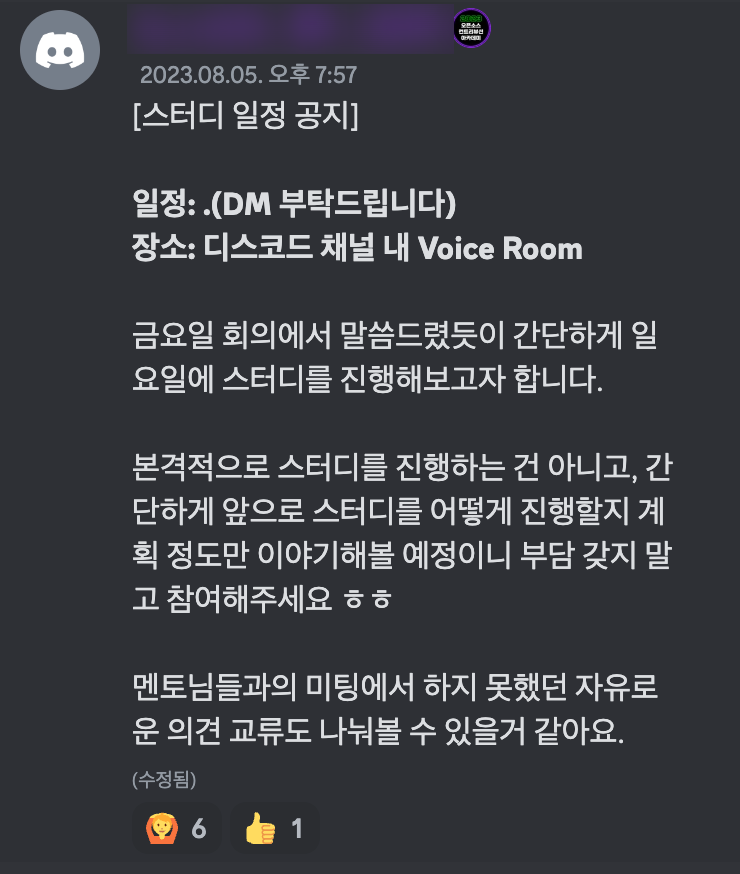
/// caption
멘티들끼리 결성한 스터디
///

컨트리뷰션을 진행하면서 몇 멘티분들 께서 Azure 서비스에 기여를 하기 위해서는 따로 스터디를 구성하여 공부를 해야할 것 같다는 필요성을 제기해오셨고 그에 따라 멘티 분들로만 이루어진 스터디가 결성되었다.

나는 시간이 조금 빠듯해져서 해당 스터디에 참여를 하지는 않았지만 스터디에서 다뤘던 내용 및 정리본을 보면 스터디원 모두가 정말 깊이 있게 고민을 한 흔적을 볼 수 있었다. 해당 스터디 그룹에서 타겟으로 잡았던 SAS 관련 내용은 컨트리뷰션으로 발전하여 이후 최종 성과 공유회에서 주요 컨트리뷰션으로 소개가 되었다.

또 다른 활동은 Microsoft Korea 본사에 방문하여 진행한 WSL 팀의 PM 분과의 미팅이었다.

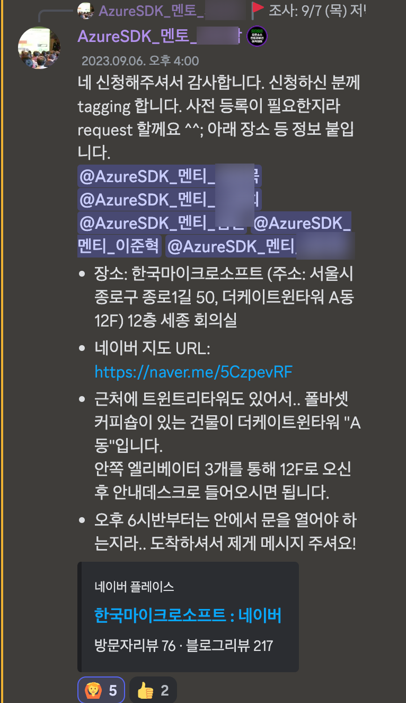
/// caption
마소 코리아 본사 방문 공지
///

활동 중반 즈음에 WSL의 PM 분이 한국으로 잠깐 방문하신다고 하셔서 그 내용을 알고 계시던 마소 코리아에 재직하시는 멘토분이 이를 공지하셨고, 참여 의사를 밝힌 멘티 몇 명이 마소코리아 본사로 방문하여 별도의 멘토링을 가지는 시간을 가졌다. 나는 이 활동이 너무 귀중했다. 이 내용은 이번 포스팅 하단에 좀 더 설명할 것이다.

---

## 프로그램 마무리

10월 7일, 드디어 프로그램 활동의 마지막이라고 볼 수 있는 최종 성과 공유회가 열렸다.

장소는 발대식과 동일한 장소에서 진행이 되었으며, 20개의 참여형 오픈소스 팀이 각자 기여 내용을 포함한 모든 활동 내용을 발표하는 시간을 가졌다. 20개의 팀이 발표를 진행하기 때문에 아침 10시부터 오후 4시까지 진행이 되었다.

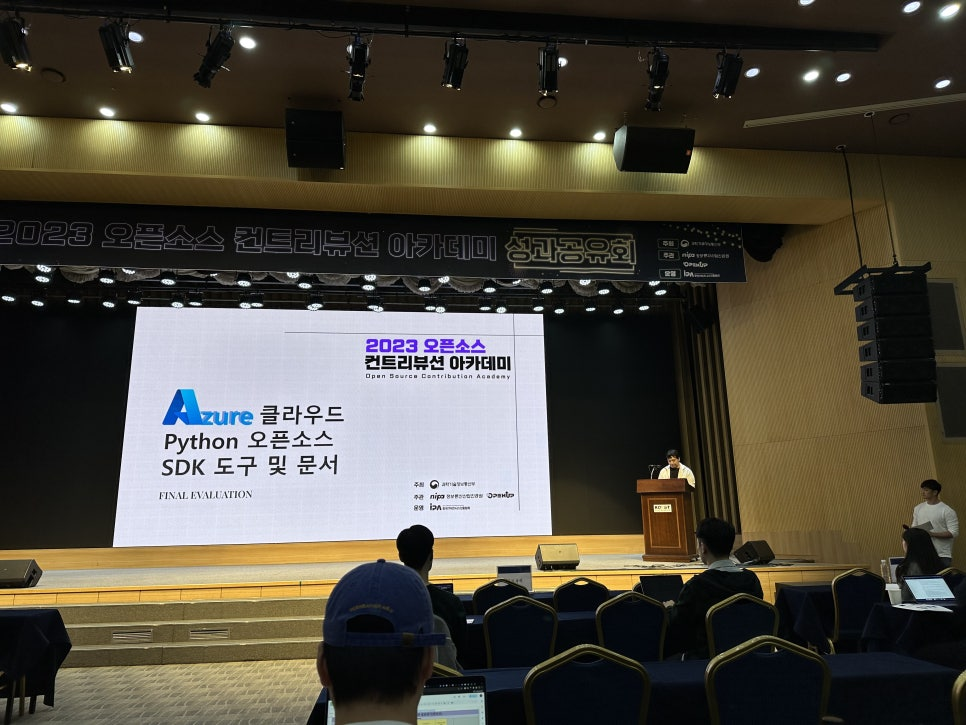
/// caption
최종 성과 공유회 발표
///

우리 팀은 발표 순서가 2번째여서 초반에 볼 수 있었다. 발표를 보고 나니 그동안 내가, 우리가 해왔던 모든 활동이 플래시백 되는 느낌을 받았다. 발표를 맡으신 리드멘티님이 발표를 너무 잘하시고 QnA 답변도 너무 잘하셔서 우리 팀 발표가 더욱 빛나 보였다.

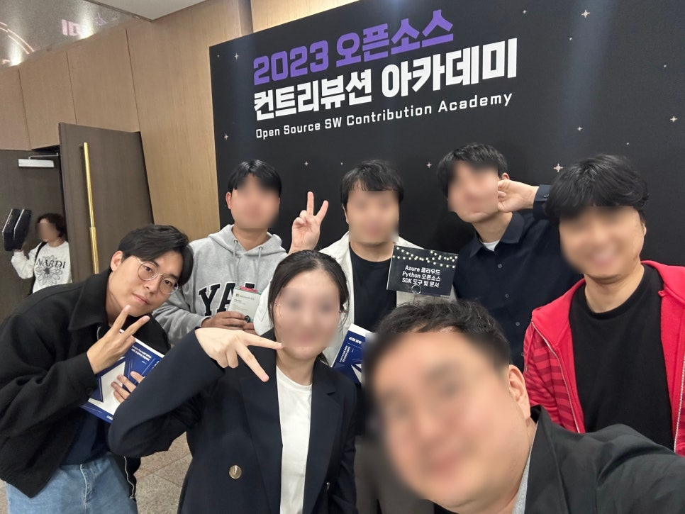
/// caption
성과 공유회 마지막 단체 사진
///

기나긴 발표가 모두 끝나고 성과공유회 참석한 멘토, 멘티 분들끼리 마지막으로 촬영한 사진!

멘토님께서 Azure을 배우는데 도움이 되는 책을 선물해주셨다. 같은 책이 이미 집에 있지만..ㅋㅋㅋ

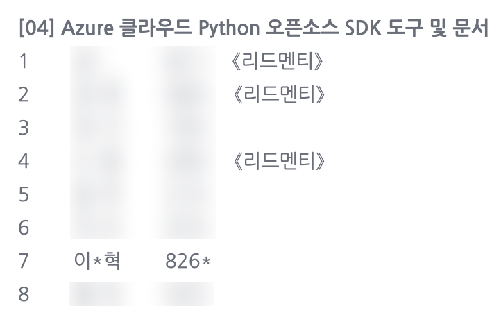
/// caption
최종 수료 멘티 명단에 오른 내 이름
///

이렇게 성공적으로 최종 수료 멘티에 내 이름을 올릴 수 있었다.

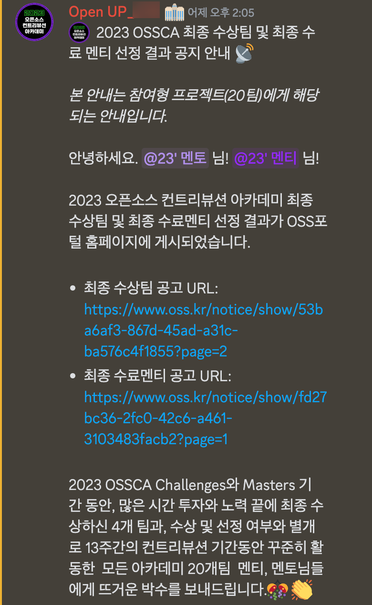
/// caption
디스코드에 올라온 최종 수료 멘티 선정 결과 공지
///

아쉽게도 작년과는 다르게 올해는 우리 팀이 상을 받지는 못했지만 그래도 OSSCA에서 활동한 이 3개월 넘는 시간이 나에게는 모든 순간이 너무 소중했다. 상을 받지 못했다는 아쉬움은 별 것 아닐 정도로 이 프로그램에서 얻은 것이 너무 많았다.

---

## 기여 내용

OSSCA의 Azure SDK 팀에서 내가 기여했던 내용 대부분은 문서와 관련된 부분이었다. 번역은 물론 서비스 사용자가 자주 보는 페이지에서 빠져 있는 내용 및 잘못 기재된 부분을 수정하는 기여를 하였는데, 그 중 가장 기억에 남는 기여 두 가지를 소개하자면 다음과 같다.

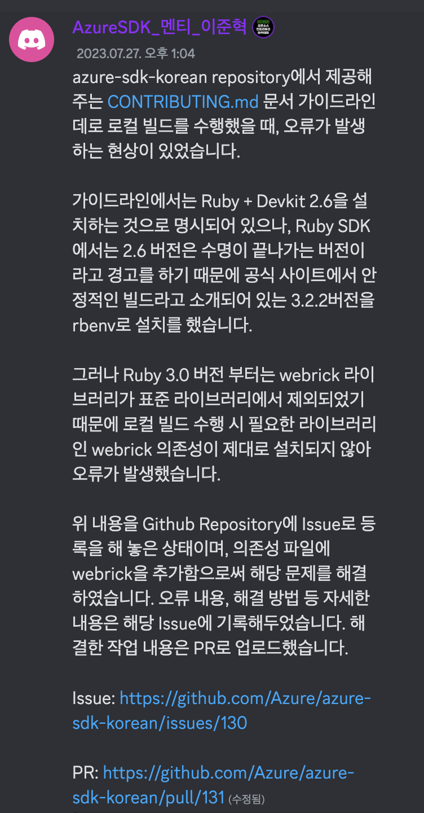
/// caption
Azure SDK 한글 문서 가이드 페이지
///

첫 번째는 의존성 관련 기여였다. Azure SDK 서비스는 서비스 사용자를 위해 가이드 페이지를 제공한다. 이 가이드 페이지는 다국어로 번역이 되어 제공이 되고 있으며, 한국어도 포함되어 있었다.

[Azure SDK 한글 문서 & 리소스 모음 | Azure SDKs](https://azure.github.io/azure-sdk-korean/)

Python 뿐만 아니라 Java 등의 다른 언어들로 컨트리뷰션을 진행할 때 참고해야할만한 사항이 기재되었고 서비스를 활용하는 방법 또한 상세하게 기재된 원문을 바탕으로 한국어 번역을 진행하고 있는 프로젝트가 있다.

그런데 이 프로젝트의 Github 저장소에는 CONTRIBUTION.md 파일에 로컬에서 페이지를 빌드해서 내 작업 내용을 로컬에서 확인하는 방법이 적혀있었는데, 이 부분을 따라해보다가 오류를 발견했다.

<https://github.com/Azure/azure-sdk-korean/blob/main/CONTRIBUTING.md#full-local-setup>

상단의 링크에 따르면 Azure SDK Korean 페이지는 Ruby + jekyll로 페이지 빌드를 진행하는데, 가이드라인을 빠짐 없이 따라했음에도 불구하고 빌드가 되지 않는 것이었다.

맥북은 기본적으로 Ruby가 설치되어 있어서 별도의 Ruby 업데이트를 진행할 필요 없이 프로젝트를 빌드할 수 있다. 멘토님께서도 Ruby Devkit을 별도로 설치할 필요 없이 MacOS Native build(버전 2.6X)로 빌드를 하면 된다고 했었지만 해당 버전으로 빌드를 하면 로그가 Warning(EOL warning, 더 이상 사후 업데이트를 진행하지 않을 것)을 뱉어내기 때문에 Devkit으로 3.0 이상의 Ruby 버전을 설치하여 빌드를 시도했었다.

그러나, 빌드가 되지 않았다.

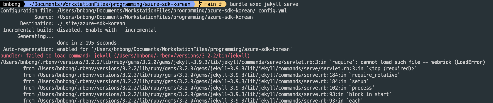
/// caption
빌드 실패 오류 로그
///

빌드 커멘드를 실행하면 위 사진과 같은 오류 로그가 찍히면서 빌드 자체가 실패했다. 그 이유를 계속 탐색하면서, 이 오류의 원인을 찾게 되었다.

<https://www.ruby-lang.org/en/news/2020/12/25/ruby-3-0-0-released/>

공식 홈페이지의 Ruby 3.0.0 릴리즈 노트에서는 기존 Ruby의 기본 의존성 라이브러리인 'webrick' 라이브러리를 기본 라이브러리에서 **제외**한다고 설명이 되어 있었다. Azure SDK Korean 프로젝트가 로컬에서 빌드가 되지 않는 현상은 위의 webrick 라이브러리가 설치되어있지 않아서 생기는 오류였던 것이다.

webrick 의존성을 별도로 설치하고 빌드 커멘드를 실행하니 다음 사진과 같이 정상적으로 빌드가 되는 것을 확인했다.

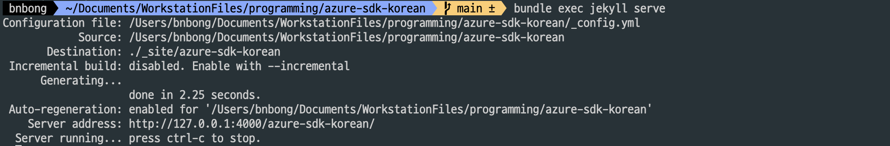
/// caption
webrick 설치 후 정상적으로 완료된 빌드
///

이 내용을 Gemfile, Gemfile.lock 폴더에 추가하는 컨트리뷰션을 진행했고 기여 내용이 정상적으로 반영이 되었다.

다음 링크는 이 현상에 대해 기록했던 이슈이다.

<https://github.com/Azure/azure-sdk-korean/issues/130>

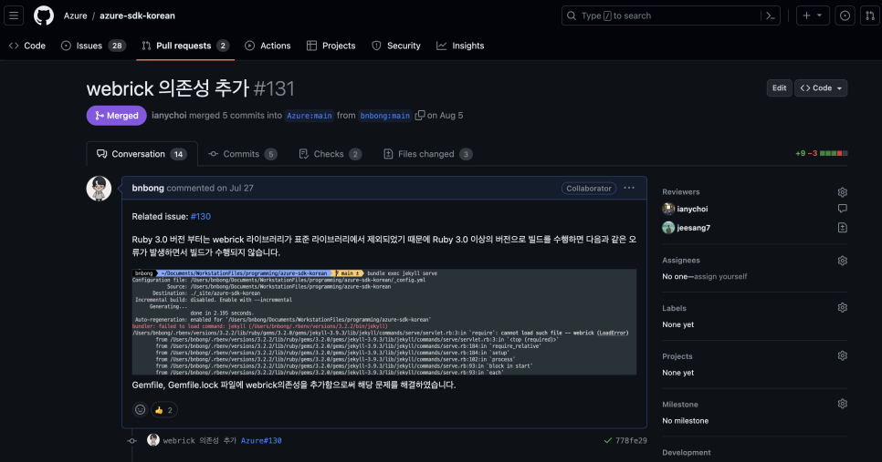
/// caption
Merge된 기여 내역
///

Merge 성공 ~~

두 번째는 Azure SDK 가이드 라인 중 Python/implementation 페이지를 나 혼자서 전체 내용에 대한 번역을 진행했던 컨트리뷰션 이었다.

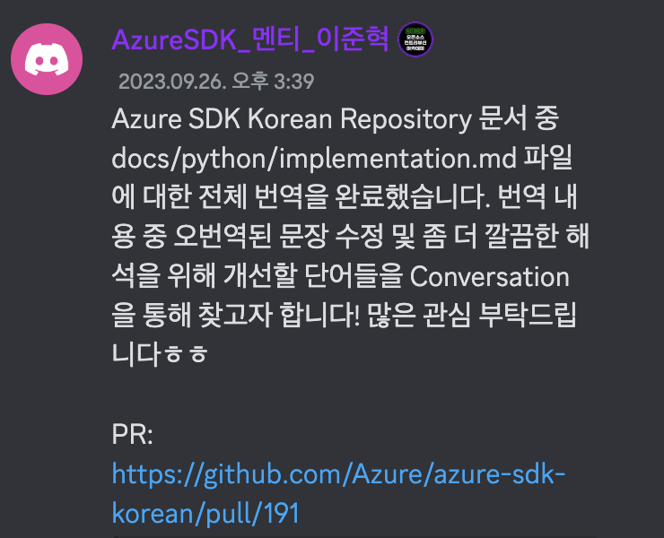
/// caption
Python/implementation 페이지 번역 작업
///

전체 페이지를 혼자서 번역을 진행했기에 시간이 많이 걸리는 기여였으며, Python 개발 경험을 바탕으로 원문의 내용을 실제 Python 개발 트랜드에 맞춰서 자연스러운 한국어로 번역하기 위해 많은 노력을 기울였다.

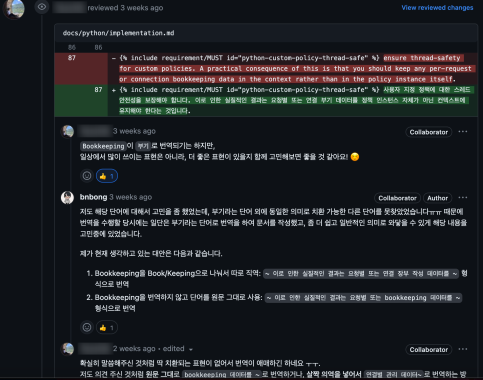
/// caption
번역 용어에 대해 나눈 Conversation
///

위 Conversation 처럼 특정 단어 번역에 대해서 다른 멘티분들과 의논을 진행하면서 방향성을 잡아보기도 했다.

프로그램 활동 막바지에 겨우 PR을 올릴 수 있었으며, 이 기여도 성공적으로 Merge가 되었다.

<https://github.com/Azure/azure-sdk-korean/pull/191>

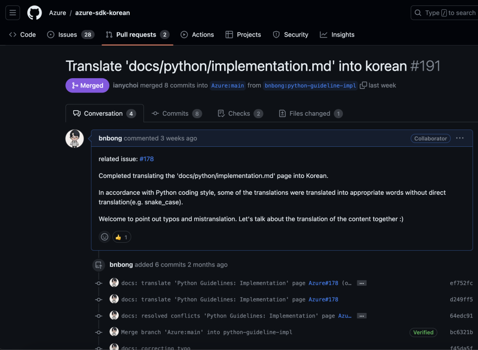
/// caption
번역 PR Merge 화면
///

Merge 성공 ~~~

이 Contribution이 Merge 되면서 내가 작업한 내용을 **공식 문서**에서 볼 수 있게 되었다.

[Python Guidelines: Implementation | Azure SDKs](https://azure.github.io/azure-sdk-korean/python_implementation.html)

---

## 좋았던 점

내가 작업한 내용이 공식 문서에 반영이 되었을 때 그 기쁨은 글로 설명하기에는 너무 벅차다. 공식 문서에 기여를 했다는 경험이 너무나도 신기했고 뿌듯하기까지 했다.

오픈소스 기여가 이번 프로그램이 처음인건 아니었다. 내가 Github에서 사용하고 있던 모 프로젝트가 불안정성을 보이자 해당 프로젝트의 저장소에 가서 이슈를 남기기도 했었다.

그러나 이번 프로그램에서 활동한 것 처럼 본격적으로 관계자와 커뮤니케이션을 통해 기여에 대한 방향성을 잡고 서로 도움이 되는 개발 경험을 해본 경우는 이번이 처음이었다. 멘토님들의 도움 덕분에 올바른 기여를 하기 위해 어떤 점을 신경써야하고 원활한 팀 협업, 더 나아가 기여를 하는 Customer과의 협업을 하기 위해서 글로벌 대기업은 어떤 노력을 하는지도 알게되는 귀중한 경험을 하게 되었다.

Microsoft는 어렸을 때부터 관심이 있는 기업이었다. 대부분의 사람이 사용하고 있는 OS인 Windows를 만들었다는 것은 모두가 알고 있는 사실이지만, 나는 게임 HALO 때문에 마이크로소프트를 알게 되었다.

프로그램 중반 즈음에 마소 코리아 본사로 찾아가서 WSL의 Project Manager 분을 만나는 기회가 있었다. 어렸을 때 부터 관심이 있는 기업이었기 때문에 직접 그 회사를 찾아간다는 것만으로도 너무 설레었다.

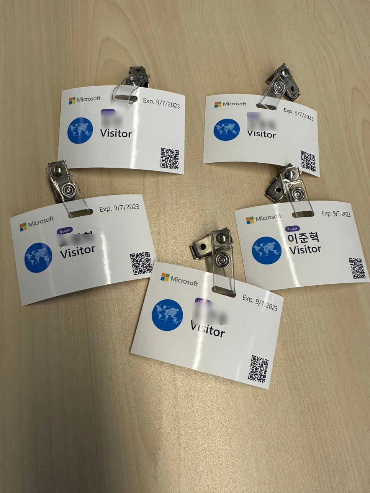
/// caption
Microsoft Korea 본사 방문
///

멘토님의 도움으로 Visitor 신분으로 마소 코리아 본사에 출입을 할 수 있었고, 영어와 한국어를 섞어가며 PM분과 소통하며 정말 다양한 이야기를 듣게 되었다. 그 자리에서 오픈소스의 중요함에 대해서도 알게 되었다. 오픈소스는 경험이 되고, 경력이 되고, 직업이 될 수 있다!ㅋㅋ

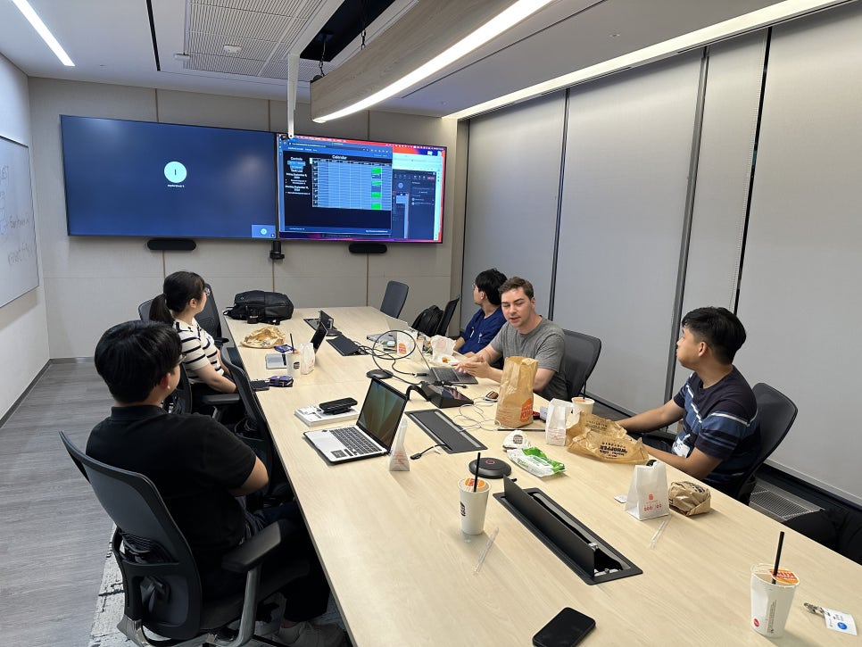
/// caption
WSL 팀 PM과의 미팅
///

한창 핫한 기술의 선두를 이끌어가는 프로젝트의 Project Manager를 만나기란 쉽지 않음에도 불구하고 이번 프로그램 덕분에 이렇게 같은 자리에서 만나 어디에서도 들을 수 없는 정말 귀중한 내용들을 많이 듣게 되었다. 글로벌 대기업의 기술력과 구성원의 실력에 대해서도 감탄을 하게 되었다. Microsoft같은 거대 기업의 협업 문화에 대해서도 조금이나마 알게 되었다.

뿐만 아니라 프로그램을 활동하면서 성공적인 협업을 하기 위해 신경써야하는 부분도 알게 되었다. 모임을 진행할 때 마다 멘토님들께서 각자 진행했던 이전의 컨트리뷰션에 대한 내용을 바탕으로 개선해야하는 점을 그 이유와 해결 방법을 함께 설명해주셨다.

내 경우에는 webrick 의존성 관련 기여를 하면서 하나의 기여 내용에 두개의 서로 다른 기여가 포함된 건에 대해서였다.

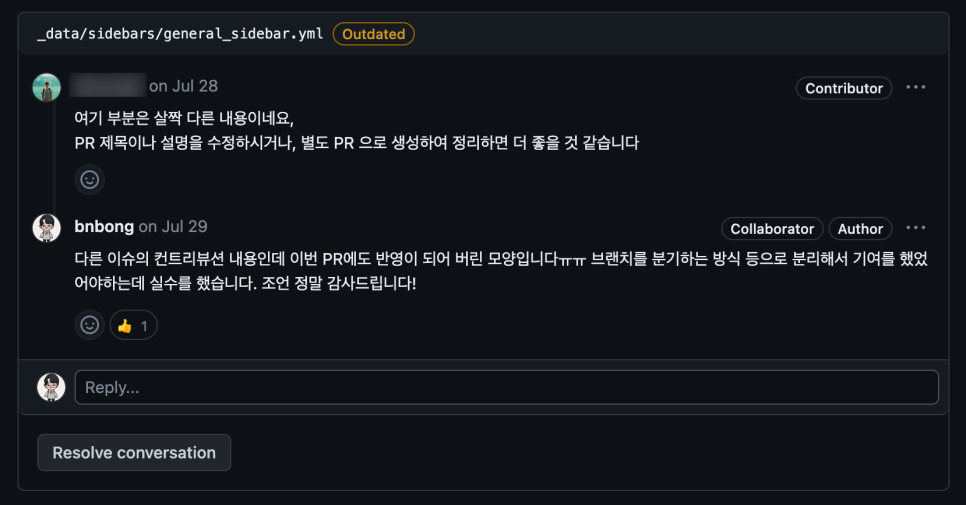
/// caption
하나의 PR에 섞여버린 두 개의 기여
///

Fork 한 내 저장소에 관련 내용 기여를 위해 branch를 개설하여 PR을 날렸는데, 내가 다른 페이지에 작업을 하면서 실수로 이 branch에 커밋을 하게 되어 해당 PR에 다른 기여 내용이 포함되어 버렸다. 다른 작업을 하기 위해서는 branch를 다시 새롭게 파서 작업을 했었어야 했는데 이 부분을 생각하지 못하고 commit을 해버려서 생긴 일이었다.

멘토님들께서 이 부분의 해결 내용에 대해 여러 대안책을 제시해주셨다(pre-commit 등). 이러한 활동을 통해 기여의 일관성을 유지해야하는 이유에 대해서도 알게 되었고, 다음에 내가 주도해서 협업을 진행할 때 이 부분을 신경 쓸 수 있게 되었다.

가장 좋았던 것은 '이렇게 거대한 프로젝트에 내가 기여를 해봤다'라는 경험 그 자체인 것 같다. 오픈소스는 누구나 기여를 할 수 있지만 아이러니하게도 누구나 기여를 할 수 없다. 혼자서는 감당하기 어려운 부분도 있기 마련이고, 마소같이 거대한 글로벌 기업이 운영하는 프로젝트는 아무것도 모르는 외부인이 기여를 하기에는 그 한계가 명확할 수 있다.

그러나 OSSCA 프로그램의 Azure SDK 팀은 기업에 속해있는 이해관계자분들과의 실시간 소통이 가능했으며, 혼자가 아니라 여러명이 속해 있는 팀 단위로 하나의 기여에 대해 같이 고민, 의논을 할 수 있는 시간을 가지며 더 밀도 있는 기여를 할 수 있었다. 이런 기회는 OSSCA에 지원하지 않았다면 경험할 수 없는 기회임이 분명했다.

---

## 어려웠던 점

컨트리뷰션을 여럿 올리면서 어려웠다고 느낀 점은 거의 없었다. 멘토님께서 친절하게 어렵거나 이해가 안되는 부분을 자세하게 설명해주시기도 했고, 내가 건들일 수 없는 부분은 기여를 하지 않았기 때문에 어려웠던 점은 거의 없었지만 당황했던 경험이 하나 있었다.

마이크로소프트의 오픈소스는 **AutoRelease**를 활용하여 프로젝트 버전업을 진행한다. AutoRelease 코드는 사람이 작성한 코드가 아니라 내부 동작 로직에 의해서 자동으로 작성되는 코드이다. 마이크로소프트에서는 이 AutoRelease로 인해 만들어진 코드에 대한 기여는 모두 Reject를 한다는 컨트리뷰션 가이드가 존재한다.

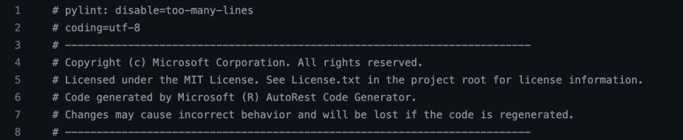
/// caption
AutoRest Code Generator 딱지가 붙은 코드
///

위 사진처럼 모듈 상단 주석부분에 **(R) AutoRest Code Generator.** 딱지가 붙어있는 코드는 기여가 불가능하다.

나는 이 내용에 대해서 알고 있었다. OSSCA 모임을 진행하면서 멘토분들께서 컨트리뷰션을 할 수 있는 내용을 몇 가지 설명해주신 적이 있었는데, 그 내용 중에 Python의 f-string이나 Type hint관련 내용이 있었다.

어떤 컨트리뷰션을 해볼까, 탐색하던 중에 Azure SDK for Python 저장소의 코드 중에서 이전에 멘토님께 들었던 f-string과 Type hint을 적용할 수 있을만한 코드를 발견하여 2시간동안 해당 부분에 대한 수정을 진행했다.

수정하면서 이상한점을 느꼈는데, 이렇게 많은 사람들이 기여를 하는 프로젝트인데 아직도 이렇게나 기여할 부분이 많다고? 하는 생각이 들었다. 아니나 다를까, 모듈 상단을 확인해보니까 Auto Rest 딱지가 붙어있었다... 그래서 아까운 내시간ㅠㅠ 하면서 눈물을 머금고 작업 내용을 모두 롤백했다.

---

## 아쉬웠던 점

기여를 했다라는 자체에 대해서 아쉬웠던 점은 하나도 없었다. 그러나, 나 뿐만 아니라 다른 멘티분들께서 진행했던 대부분의 기여가 Python Code의 Core을 건들이는 기여가 거의 없었다는 것이 제일 아쉬웠다.

꾸준하게 기여를 올리는 멘티분들의 Python에 대해 이해도가 부족하지 않았음에도 불구하고 프로젝트 자체에 대한 규모가 너무 거대하고 코드도 복잡하다 보니, print문 같은 단순하면서도 정말 사소한 코드를 약간이라도 건들이면 문제가 생기기 일쑤였다.

따라서 코드 동작에 대한 전체적인 이해가 없으면 core 코드에 대한 기여가 불가능했다. 이는 모임을 진행하면서도 꾸준히 멘티측에서 제기되던 아쉬운점으로 꼽혔지만 이를 해결할 방법이 없었다. 멘티끼리 스터디를 만드는 노력을 해도 한계가 명확했다.

다른 아쉬웠던 점은 오픈소스 프로젝트이지만 오픈되지 않은 부분 때문에 생긴 혼선이었다. 마이크로소프트는 거의 대부분의 소스를 오픈소스로 공개하여 외부인의 협업을 도모한다고는 하지만 마소 팀원이 아닌 외부인이 알지 못하는 내용 때문에 기여에 혼선이 있던 적이 있었다.

OSSCA 팀 회의 도중 어떤 멘티께서 이 부분에 대해 기여를 해보자~ 라고 결론을 내서 기여를 어느정도 끝내 PR을 올리고 나니 이미 그 부분은 마소 팀에서 처리를 한 내용이라 Reject를 당했다는 경험을 소개하셨던 적이 있었다.

OSSCA 팀 뿐만 아니라 다른 개인 혹은 팀 단위의 Customer들이 올린 기여 내역 중 Close된 PR이나 Issue 탭에서 이와 비슷한 사례를 어렵지 않게 발견할 수 있었다. 우리를 포함한 마소 직원이 아닌 외부인은 이런 내부 사정을 알지 못하기 때문에 그런 부분에 대해 열심히 시간과 노력을 투자해서 작업을 해도 기여 내용에 반영이 되지 못하는 것이 아쉬웠다. 그러나 이 부분은 우리가 어떻게 할 수 있는 부분이 아니기 때문에 정말 단순한 아쉬움으로만 남게 되었다.

가장 아쉬운 점은 올해 OSSCA가 다른 해와 비교하여 기간이 조금 짧았다는 것이었다. 너무 재미있고 좋은 경험이었는데 고작 3개월 남짓이라는 기간밖에 진행을 하지 않는다는 것이 제일 아쉬웠다. 멘토님들께서도 올해 프로그램이 이상하게 급하게 마무리하는 경향이 있어보인다고 아쉬워하셨다. 그래도 우리 팀이 소통하고, 함께 했던 추억과 경험이 사라지는 것도 아닐 뿐더러 커뮤니티도 그대로 보존할 계획이라고 말씀하셨기 때문에 그나마 위안이 되는 부분이다.

---

## 후기

거대한 오픈소스에 내가 기여를 한 코드를 올릴 수 있다는 것만으로도 정말 가슴이 설레는 경험이라고 생각한다. 기여를 한 오픈소스의 컨트리뷰션 가이드라인을 준용하면서 오픈소스 관리자분들과 소통을 할 수 있는 경험은 어디에서도 쉽게 경험할 수 없는 너무나도 매력적인 경험이라고 생각한다.

앞서 언급했던 시행착오를 겪으면서, 더욱 좋은 코드와 기여를 할 수 있도록 성장할 수 있는 시간을 가졌던 것 같다. 이 프로그램을 처음 소개해준 선배 말대로 정말 많은 것을 얻을 수 있는 기회였으며, 내가 좀 더 좋은 개발자로 성장할 수 있는 기회를 가질 수 있게 되었다. 내년에도 OSSCA 프로그램을 운영한다면 다시한번 더 지원하고 싶다.

이런 좋은 기회를 경험할 수 있도록 해준 OSSCA에게 무한한 감사를 올립니다.

!!! note "원문 안내"

    이 글은 [네이버 블로그](https://blog.naver.com/bnbong/223238108508)에 2023-10-16에 올렸던 글을 옮긴 것입니다.
