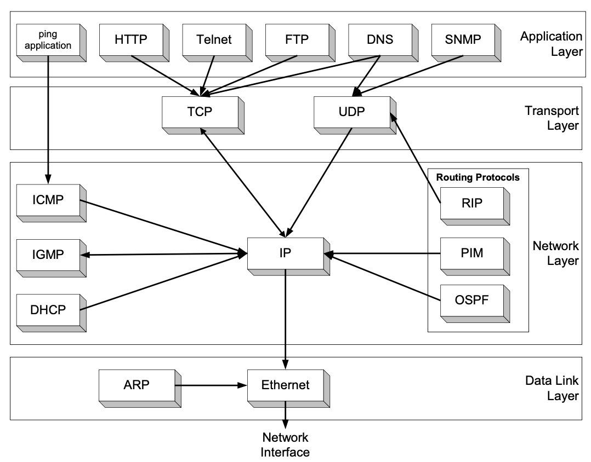
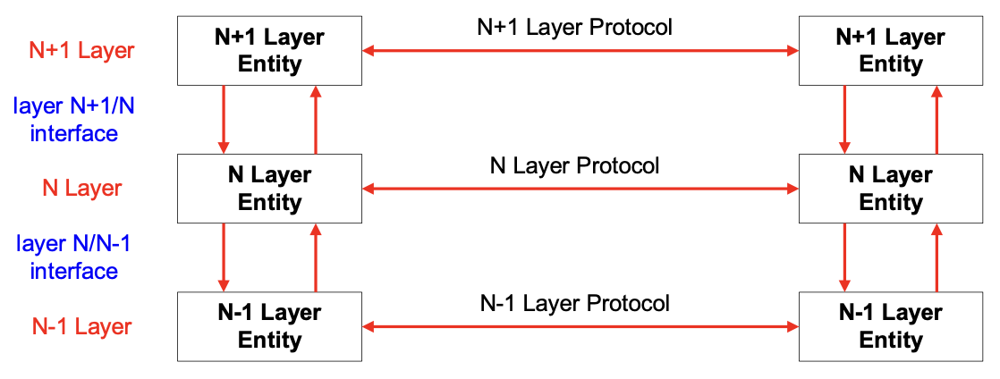
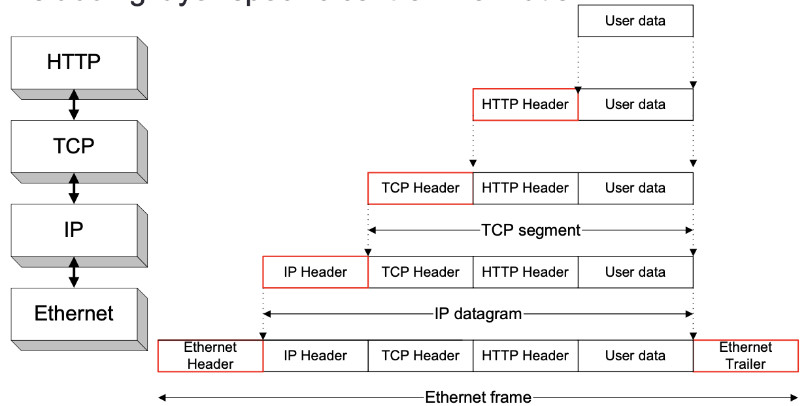
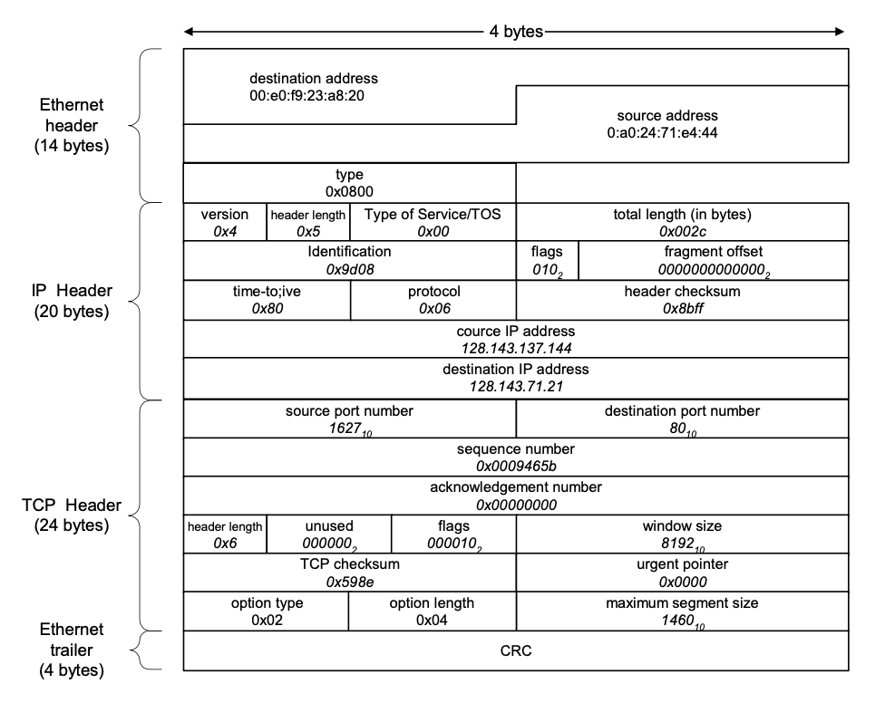
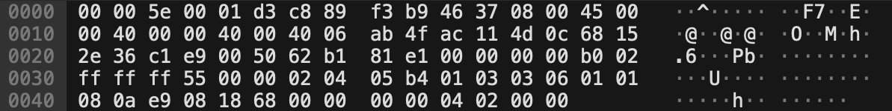

??? note "Series : Computer Network"

    [0. 컴퓨터 네트워크 개요](https://bnbong.github.io/blog/2024/12/30/computer-network-%EC%BB%B4%ED%93%A8%ED%84%B0-%EB%84%A4%ED%8A%B8%EC%9B%8C%ED%81%AC-%EA%B0%9C%EC%9A%94/)

    [1. ARP protocol](https://bnbong.github.io/blog/2025/01/15/computer-network-arp-protocol/)

## 네트워크 프로토콜과 계층 구조

네트워크는 현대 사회의 필수 기술 중 하나입니다. 이 글에서는 2024-2학기 모바일 컴퓨팅 수업 자료를 바탕으로 학습했던 네트워크의 계층 구조와 프로토콜의 기본 개념을 정리합니다. 특히 OSI 모델과 TCP/IP 스택을 중심으로 프로토콜이 데이터를 어떻게 전달하고 통신을 가능하게 하는지 설명합니다.

---

### 1. 네트워크 계층의 중요성

#### 계층 구조란?
네트워크 계층 구조는 복잡한 네트워크 작업을 단계별로 나누어 처리하기 위해 설계된 체계입니다. 각 계층은 특정 역할과 기능을 담당하며, 상호 독립적으로 작동합니다.

예를 들어:

- **데이터 링크 계층**은 오류 검출 및 수정, 프레임 전송을 담당합니다.
- **네트워크 계층**은 패킷 전달 및 라우팅 역할을 합니다.
- **전송 계층**은 데이터의 신뢰성을 보장하고 흐름 제어를 수행합니다.

현대에서는 정말 다양한 네트워크 장비가 존재합니다. 각 네트워크 장비들은 제조사가 다르고, 모델이 다르고, 심지어 같은 뿌리의 네트워크 장비라고 하더라도 버전이 다를 수 있습니다. 이러한 네트워크 장비들이 서로 통신하기 위해서는 각 장비들이 서로의 프로토콜을 알고 있어야 합니다.

그러나 다양한 환경의 네트워크 장비들이 서로의 상황을 완벽하게 이해하기란 불가능에 가깝습니다. 그래서 프로토콜로 이를 추상화해 각 장비가 서로의 상황을 이해하도록 합니다.

<!-- more -->

#### 추상화의 장점
계층 구조는 복잡한 네트워크 프로세스를 단순화하고 특정 계층의 변화가 다른 계층에 영향을 미치지 않도록 설계됩니다. 덕분에 시스템 확장성과 상호 운용성이 크게 높아집니다.

---

### 2. OSI 모델과 TCP/IP 프로토콜 스택

#### OSI 모델
OSI (Open Systems Interconnection) 모델은 7개의 계층으로 구성됩니다.

1. **물리 계층**: 하드웨어 전송 기술. 
2. **데이터 링크 계층**: 프레임 생성, MAC 주소. 
3. **네트워크 계층**: 라우팅 및 IP 주소. 
4. **전송 계층**: TCP, UDP. 
5. **세션 계층**: 통신 관리. 
6. **표현 계층**: 데이터 변환 (암호화 등). 
7. **응용 계층**: HTTP, FTP 등 응용 프로그램 프로토콜.

#### TCP/IP 프로토콜 스택
실제 네트워크에서는 TCP/IP 스택을 주로 씁니다. TCP/IP는 4계층 구조이며, OSI 모델과 비교하면 다음과 같습니다.

1. **링크 계층**: 이더넷, PPP(Point-to-Point Protocol). 
2. **네트워크 계층**: IP, ARP. 
3. **전송 계층**: TCP, UDP. 
4. **응용 계층**: HTTP, DNS.

TCP/IP 프로토콜 스택과 OSI 계층은 다음과 같이 서로 대응이 됩니다.

| OSI 계층 | TCP/IP 계층 |
| --------- | ------------ |
| 물리 계층 (Layer 1) | 링크 계층(Layer 1) |
| 데이터 링크 계층 (Layer 2) | 링크 계층(Layer 1) |
| 네트워크 계층 (Layer 3) | 네트워크 계층(Layer 2) |
| 전송 계층(Layer 4) | 전송 계층(Layer 3) |
| 세션 계층(Layer 5) | 응용 계층(Layer 4) |
| 표현 계층(Layer 6) | 응용 계층(Layer 4) |
| 응용 계층(Layer 7) | 응용 계층(Layer 4) |

각 네트워크 계층의 프로토콜들을 정리하여 그림으로 나타내면 다음과 같습니다.

---

### 3. 프로토콜의 역할과 상호작용

#### 프로토콜이란?
프로토콜은 통신 규칙을 정의한 표준입니다. 데이터를 전송하는 방법, 오류를 검출하는 방식 등을 규정합니다. 주요 프로토콜은 다음과 같습니다.

- **TCP**는 신뢰성 있는 데이터 전송을 보장합니다. 
- **UDP**는 빠르지만 신뢰성이 낮은 전송 방식을 제공합니다. 
- **IP**는 패킷을 목적지로 전달하는 역할을 합니다.

#### 프로토콜 계층 간의 상호작용
프로토콜은 계층 간 상호작용으로 데이터를 처리합니다.
- 상위 계층에서 요청한 데이터는 하위 계층에서 캡슐화(encapsulation)됩니다. 
- 반대로, 수신된 데이터는 하위 계층부터 상위 계층으로 전달되며 디캡슐화(decapsulation)됩니다.

통신을 수행하는 각 네트워크 장비는 서로의 프로토콜 계층에 데이터 통신을 주고 받습니다.

A 네트워크 장비가 B 네트워크 장비와 통신하는 상황이라면, A 장비의 IP 계층에서 캡슐화된 데이터 패킷이 B 장비에 도달해 B 장비의 IP 계층에서 디캡슐화된 뒤 다뤄집니다.

---

### 4. 데이터 전송과 PDU

#### PDU (Protocol Data Unit)
각 계층에서 처리되는 데이터 단위를 PDU라고 합니다. PDU는 각 계층마다 다르게 정의됩니다.

- 데이터 링크 계층: **프레임(Frame)**.
- 네트워크 계층: **패킷(Packet)**.
- 전송 계층: **세그먼트(Segment)**.

#### 캡슐화(Encapsulation)와 디캡슐화(Decapsulation)

- 캡슐화: 데이터가 각 계층에서 헤더를 추가하며 전송 준비를 합니다.
- 디캡슐화: 수신된 데이터에서 헤더를 제거하며 원래 데이터를 복원합니다.

캡슐화는 제가 상대방에게 보내고자 하는 데이터를 보내기 위해 각 계층에서 헤더를 추가하는 것이고, 디캡슐화는 상대방에게서 받은 데이터를 원래 데이터로 복원하는 것입니다.

기본적으로 네트워크 장비의 각 계층은 다른 계층의 데이터 구조를 전혀 건들이지 않는 것이 원칙입니다. 따라서 원본 데이터 구조를 변경하는 작업을 하지 않고 단순히 헤더를 붙여서 필요한 정보만을 헤더에 기록하도록 합니다.

각 TCP 계층에서 캡슐화가 수행되면 다음 사진과 같이 계층별 헤더가 추가됩니다.

이렇게 캡슐화된 데이터는 상대방 네트워크 장비의 각 계층의 헤더를 제거하며 디캡슐화가 수행됩니다. 캡슐화와 마찬가지로 디캡슐화를 수행하는 계층이 아닌 다른 계층의 헤더를 제거하는 것은 불가능하도록 설계되어 있습니다.

 

TCP 링크계층까지 캡슐화가 완료되어 외부로 나가는 데이터 프레임의 전체적인 구조는 다음과 같이 파싱됩니다.

상단의 사진은 인간이 이해하기 쉽도록 표현된 것이고, 실제로는 헤더를 포함한 모든 데이터가 컴퓨터가 읽을 수 있는 형태로 변환됩니다.

/// caption
Wireshark 패킷 캡처 예시
///

---

### 5. 데이터 링크 계층과 CRC

#### 데이터 링크 계층의 역할
데이터 링크 계층은 프레임으로 데이터를 전달하고 오류 검출 기능을 제공합니다. 대표적으로 CRC (Cyclic Redundancy Check)를 씁니다.

#### CRC의 기능
CRC는 데이터 오류를 검출하기 위한 방법입니다. 송신자가 CRC 값을 계산하여 프레임에 추가하고, 수신자는 이를 다시 계산해 비교함으로써 데이터 손상을 확인합니다.

---

### 6. 멀티캐스트와 브로드캐스트

#### 브로드캐스트
브로드캐스트는 네트워크의 모든 노드에 데이터를 전달하는 방식입니다. 예를 들어 ARP 요청은 브로드캐스트로 MAC 주소를 탐색합니다.

#### 멀티캐스트
멀티캐스트는 특정 그룹에 속한 노드에만 데이터를 전달합니다. IP TV와 같은 서비스에서 주로 사용됩니다.

---

### 7. 프로토콜과 상호 운용성의 미래

네트워크 기술은 계속 발전하지만 TCP/IP 프로토콜 스택과 OSI 모델은 여전히 중요한 역할을 합니다. 앞으로 IPv6, SDN(소프트웨어 정의 네트워크) 같은 차세대 기술이 도입되더라도 계층 구조의 핵심 원칙은 그대로 유지됩니다.

---

### 결론

네트워크 계층 구조와 프로토콜은 데이터 통신의 근본적인 토대입니다. OSI 모델과 TCP/IP 프로토콜 스택을 통해 네트워크의 동작 방식을 이해하면, 더 나은 네트워크 설계와 문제 해결 능력을 갖출 수 있습니다.
