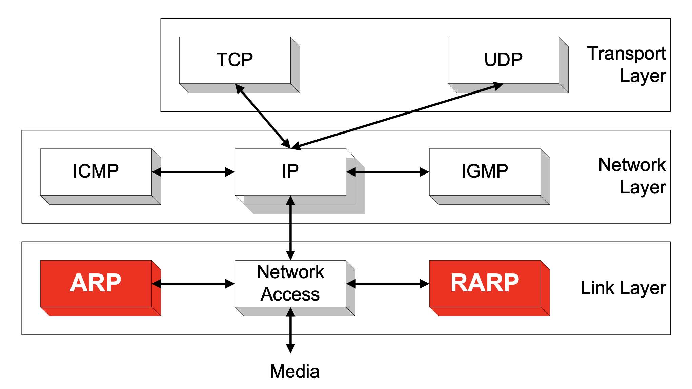
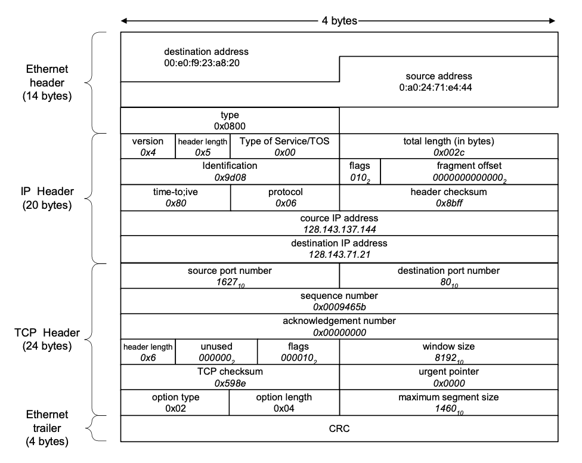
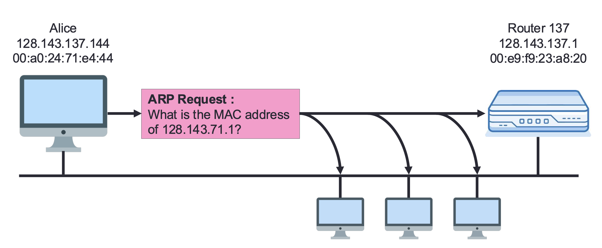
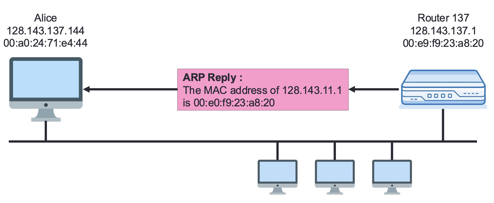
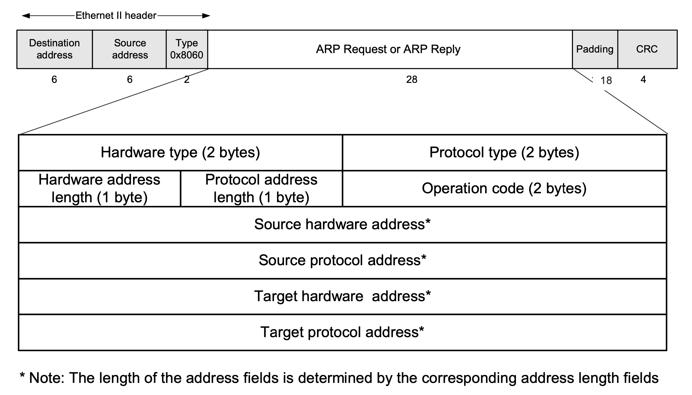
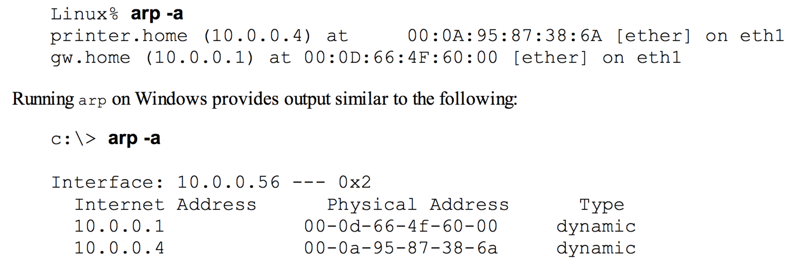
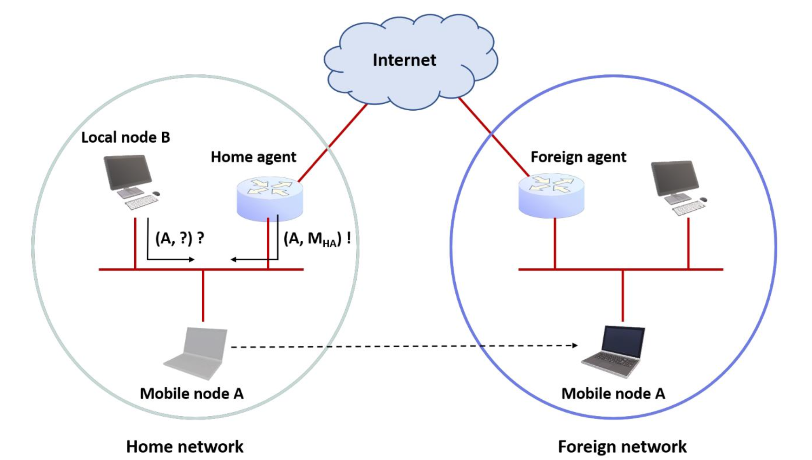

??? note "Series : Computer Network"

    [0. 컴퓨터 네트워크 개요](https://bnbong.com/blog/20241230-computer-network-1/)

    [1. ARP protocol](https://bnbong.com/blog/20250115-computer-network-2/)

    [2. IPv4](https://bnbong.com/blog/20250117-computer-network-3/)

    [3. IPv6](https://bnbong.com/blog/20260526-computer-network-4/)

## ARP (Address Resolution Protocol)

네트워크에서 장치들은 데이터를 주고받으려고 IP 주소와 MAC 주소를 사용합니다. 하지만 IP 주소만으로는 이더넷 수준에서 데이터를 전송할 수 없습니다. 여기서 **ARP (Address Resolution Protocol)**가 중요한 역할을 합니다. 이 글에서는 ARP의 원리와 동작 방식, 보안 취약점까지 설명합니다.

---

### 1. ARP란?

**ARP (Address Resolution Protocol)**는 IP 주소를 MAC 주소로 변환하는 네트워크 프로토콜입니다. 네트워크 계층의 IP 주소를 데이터 링크 계층에서 사용할 수 있는 물리적인 MAC 주소로 매핑하는 역할을 합니다.

여기서 언급되는 MAC 주소는 네트워크 장치의 고유한 식별 번호입니다. 사람을 예시로 들면, 이 글의 작성자 이름인 '이준혁'을 쓰는 대한민국 사람은 정말 많습니다.

하지만 이름이 '이준혁'이고 주민번호 000210-3XXXXXXX인 대한민국 사람은 지구상에 이 포스팅 작성자 단 한 명입니다.

대한민국 국민을 주민번호로 식별할 수 있듯이, 개별 네트워크 장비도 MAC 주소로 식별할 수 있습니다. 즉, 사람의 주민번호에 해당하는 정보가 컴퓨터의 MAC 주소라고 볼 수 있습니다.

<br>

다시 ARP로 돌아와서, ARP 프로토콜은 링크 레이어에 위치한 프로토콜입니다.



위 그림에서 언급된 RARP(Reverse ARP)는 ARP 프로토콜의 반대로 동작하는 프로토콜입니다.

ARP는 ==IP 주소 -> MAC 주소== 변환을 수행하고 RARP는 ==MAC 주소 -> IP 주소== 변환을 수행한다고 보면 됩니다.

#### **왜 ARP가 필요한가?**
- IP 주소는 네트워크 계층에서 사용되며 __논리적__ 주소입니다.
- MAC 주소는 데이터 링크 계층에서 사용되며 __물리적__ 주소입니다.
- 데이터 프레임을 전송하기 위해서는 목적지의 IP 주소뿐만 아니라 MAC 주소까지 알아야 합니다.

##### 왜 IP 주소만으로는 데이터 프레임을 보낼 수 없는가?

위에서 언급했듯, IP 주소는 논리적인 주소입니다. 즉, IP 주소는 언제든지 바뀔 수 있는 주소입니다.

데이터를 보내는 목적지의 주소가 바뀌면 당연히 데이터가 상대방에게 제대로 전달되지 않고, 정확한 데이터 전달이 필요한 네트워크 동작에 심각한 오류를 일으킵니다.

그래서 변하지 않는 MAC 주소까지 포함해서 데이터를 보낼 상대방의 주소를 파악합니다.

<br>

데이터 프레임의 구조를 살펴보면 이 원칙이 적용되어 있다는 사실을 확인할 수 있습니다.


/// caption
패킷의 가장 바깥을 둘러싸고 있는 이더넷 헤더에 `00:e0:~`으로 되어 있는 것이 MAC 주소입니다.
///

---

### 2. ARP의 동작 방식

ARP는 ==브로드캐스트와 유니캐스트를== 활용해 MAC 주소를 조회하고 응답하는 방식으로 동작합니다.

#### **ARP 요청과 응답 흐름:**
1. **ARP Request (브로드캐스트)**:
   - 송신자가 "이 IP 주소의 MAC 주소를 알고 있나요?"라는 요청을 네트워크에 __브로드캐스트__ 로 보냅니다.
   - 요청 패킷의 목적지 MAC 주소는 `ff:ff:ff:ff:ff:ff` (브로드캐스트).
2. **ARP Reply (유니캐스트)**:
   - 해당 IP 주소를 가진 장치는 자신의 MAC 주소를 ARP 응답으로 송신자에게 __유니캐스트__ 로 보냅니다.

브로드캐스트는 네트워크 서브넷 안에 있는 **모든 장비**에게 발송하는 방식이고, 유니캐스트는 특정 장비 **한 대**에게만 발송하는 방식입니다.

#### **예제:**
- Alice(128.143.137.144)가 Router137(128.143.137.1)의 MAC 주소를 알아야 할 때:
   1. Alice가 브로드캐스트로 `ARP Request`를 보냅니다.
   2. Router137이 `ARP Reply`로 자신의 MAC 주소를 알려줍니다.


/// caption
ARP request
///


/// caption
ARP reply
///

---

### 3. ARP 패킷 포맷



ARP 패킷은 다음과 같은 필드로 구성됩니다.

- **Hardware Type**: 2 bytes (이더넷의 경우 `0x0001`)
- **Protocol Type**: 2 bytes (IPv4의 경우 `0x0800`)
- **Hardware Address Length**: 1 byte (이더넷은 `6`)
- **Protocol Address Length**: 1 byte (IPv4는 `4`)
- **Operation**: 2 bytes (`1`은 Request, `2`는 Reply)
- **Source MAC Address**: 송신자의 MAC 주소.
- **Source IP Address**: 송신자의 IP 주소.
- **Target MAC Address**: 대상 MAC 주소 (`0`으로 초기화).
- **Target IP Address**: 대상 IP 주소.

---

### 4. ARP 캐시와 ARP 타임아웃

**ARP Cache**는 자주 사용하는 IP-MAC 매핑 정보를 일시적으로 저장하여 ARP 요청을 줄입니다.

### **ARP 캐시의 특징:**
- IP와 MAC 주소의 쌍을 저장.
- 유효 시간: 일반적으로 **20분** (1,200초).
- 요청 없이도 갱신 가능 (패킷 수신 시).

### **캐시 갱신 방식:**
- 새로운 ARP 요청 수신 시 갱신.
- 일정 시간 동안 사용되지 않을 경우 만료.

<br>

제 컴퓨터에서도 캐싱되어 있는 ARP table을 볼 수 있습니다.

확인하는 방법은 간단하며, 다음 명령어를 터미널에 입력하면 됩니다.

```bash
arp -a
```

위 명령어를 입력하면 다음과 같은 결과가 출력됩니다.


/// caption
MacOS 의 경우도 동일하게 입력하면 됩니다.
///

---

### 5. Gratuitous ARP (G-ARP)와 Duplicate Address Detection (DAD)

#### **Gratuitous ARP (G-ARP)**
- 자신의 IP를 알리기 위해 **브로드캐스트**로 ARP Request를 보내는 방식.
- IP 충돌 방지를 위해 사용.
- G-ARP 응답이 발생하면 충돌을 감지한 상황입니다. 응답이 발생했다는 사실은 제 IP와 동일한 IP를 사용하는 다른 장비가 존재한다는 의미입니다.

#### **Duplicate Address Detection (DAD)**
- 중복된 IP를 감지하기 위해 사용.
- **G-ARP와 차이점**:
   - G-ARP는 자신의 IP를 알리기 위해 사용되며, DAD는 IP 충돌 감지를 위해 사용.

G-ARP와 DAD의 차이를 조금 더 설명하자면, G-ARP는 주로 IPv4에서 사용되고 DAD는 주로 IPv6에서 사용된다는 점이 다릅니다.

---

### 6. ARP의 한계와 보안 취약점

그러나 이 프로토콜에도 한계가 존재합니다.

ARP 프로토콜은 컴퓨터 네트워크라는 개념이 처음 등장했을 시기에 만들어진 프로토콜입니다. 그 당시에는 지금처럼 다양한 네트워크 장비가 존재하지 않았기 때문에, 설계 시점에는 고도화된 네트워크 통신을 염두에 두지 않았다고 합니다.

그래서 ARP는 ==인증이 없고== 신뢰 기반으로 동작하기 때문에 여러 보안 취약점을 가집니다.

#### **ARP 스푸핑 (ARP Spoofing)**
- 공격자가 자신을 신뢰할 수 있는 호스트로 위장.
- 공격자가 라우터의 MAC 주소를 자신의 MAC으로 등록하여 패킷을 가로챌 수 있음.
- **MITM (Man-In-The-Middle) 공격**에서 자주 사용.

#### **ARP 캐시 포이즈닝 (ARP Cache Poisoning)**
- ARP 캐시를 의도적으로 조작하여 잘못된 MAC 주소를 등록하는 공격.
- 패킷을 공격자에게 리디렉션하거나 패킷 드랍 유발.

ARP cache를 조작할 수 있는 이유는, ARP cache를 다루는 방법이 생각보다 간편하기 때문입니다.

캐시되어 있는 테이블에서 일부 엔트리만 삭제할 수도 있고, 캐시 테이블 전체를 삭제할 수도 있습니다.

다음 명령어를 입력하면 전체 ARP cache table을 삭제할 수 있습니다.

```bash
netsh interface ip delete arpcache
```

일반적인 네트워크 환경에서는, 위 명령어를 입력하면 컴퓨터에 연결되어 있는 모든 네트워크가 끊깁니다.

1~2초가 지나면 컴퓨터가 자동으로 연결을 다시 수립하며, 브라우저를 새로고침하여 보고 있던 창을 다시 띄울 수도 있습니다.

---

### 7. Proxy ARP와 Directed ARP

#### **Proxy ARP**
- 라우터가 다른 네트워크를 대신하여 ARP 응답을 해주는 방식.
- 모바일 환경에서 특정 장치가 다른 서브넷에 있을 때 사용.



#### **Directed ARP**
- 기존 브로드캐스트 기반 ARP 대신 유니캐스트로 MAC 주소를 조회.
- ARP 캐시를 미리 갱신하는 방식.

ARP cache entry는 보통 1200초 정도의 수명을 가지고 있습니다. 연결이 계속 유지되는 네트워크 장비에 저장된 ARP cache 정보가 유실되지 않도록, Directed ARP로 그 정보를 갱신하는 것입니다.

---

## 마무리

ARP는 IP 주소를 물리적 MAC 주소로 변환하는 중요한 프로토콜입니다. 다만 인증 절차가 없어서 스푸핑이나 캐시 포이즈닝 같은 보안 취약점이 있습니다.

그래도 반대로 생각하면 별 거 없기 때문에(...) 이해하기 쉬운 프로토콜 중 하나입니다.
