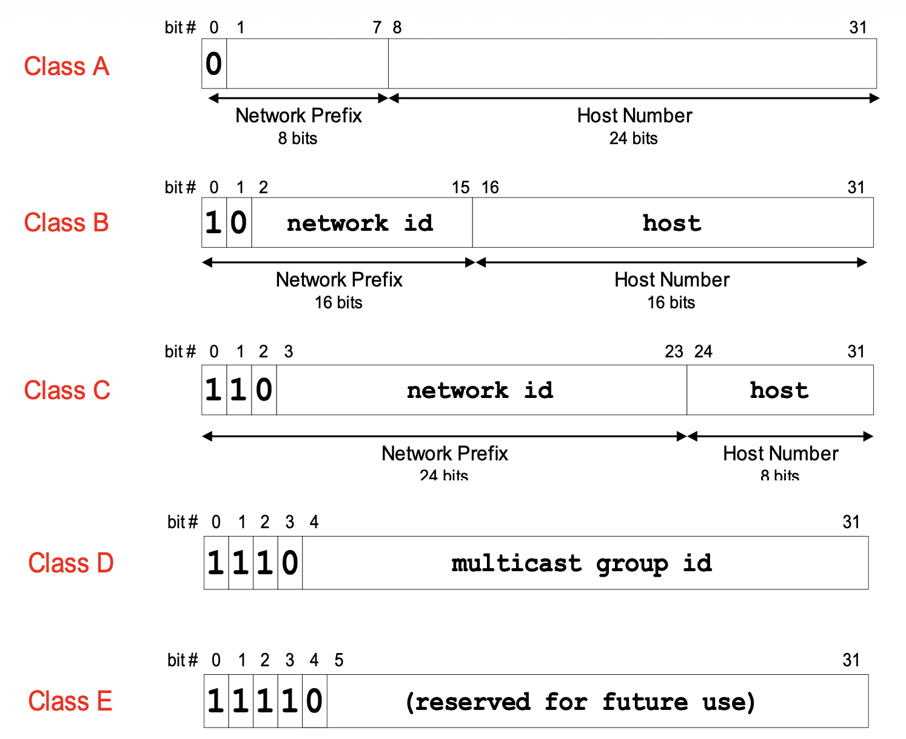
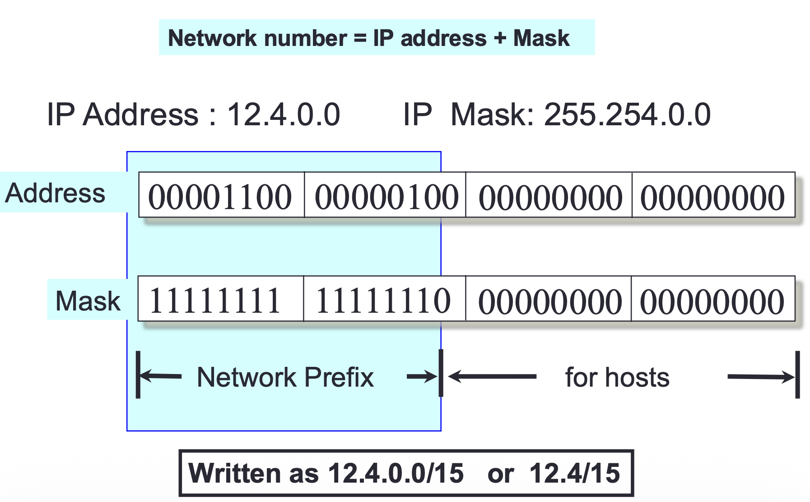
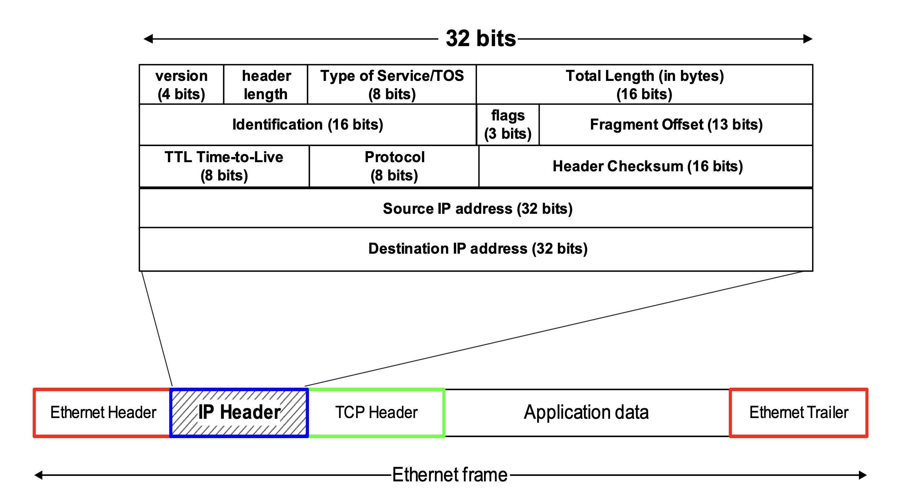
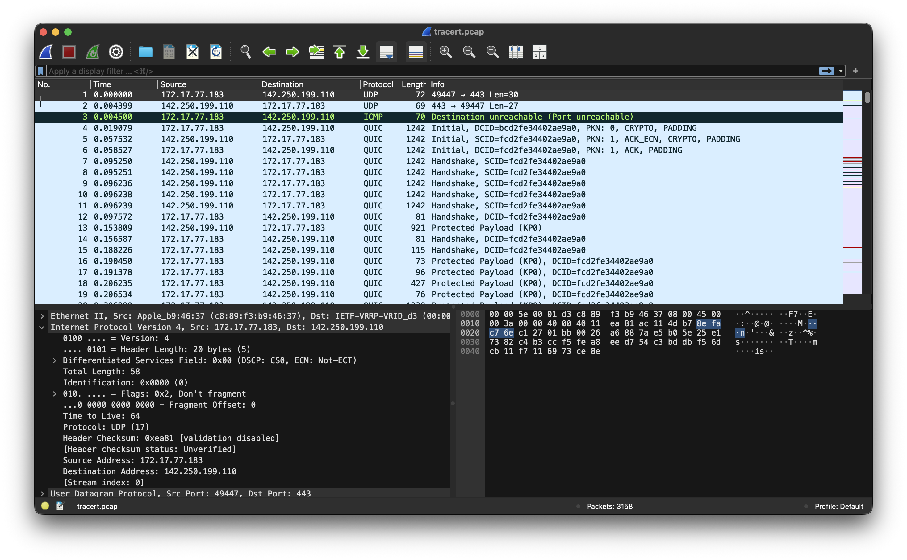

??? note "Series: Computer Network"

    [0. 컴퓨터 네트워크 개요](https://bnbong.github.io/blog/2024/12/30/computer-network-%EC%BB%B4%ED%93%A8%ED%84%B0-%EB%84%A4%ED%8A%B8%EC%9B%8C%ED%81%AC-%EA%B0%9C%EC%9A%94/)

    [1. ARP protocol](https://bnbong.github.io/blog/2025/01/15/computer-network-arp-protocol/)

    [2. IPv4](https://bnbong.github.io/blog/2025/01/17/computer-network-ipv4/)

## IPv4 — 인터넷의 주소 체계를 이해하자

인터넷에서 데이터를 주고받으려면 각 장치를 식별할 수 있는 주소가 필요하다. **IPv4(Internet Protocol version 4)**는 바로 이 주소 체계를 정의하는 네트워크 계층 프로토콜이다. 여전히 널리 사용되는 프로토콜이며, 네트워크를 공부하는 데 있어 가장 기본이 되는 주제이기도 하다.

이 글에서는 IPv4의 주소 체계, 헤더 구조, 서브넷팅, 단편화 원리를 살펴보고, 패킷 캡처 도구를 활용한 실제 분석까지 다뤄본다.

---

<!-- more -->

## 1. 들어가며 — IPv4란 무엇인가

**IPv4(Internet Protocol version 4)**는 인터넷에서 데이터를 전송하기 위한 네트워크 계층 프로토콜로, 1981년 RFC 791에서 정의되었다. 32비트 주소 체계를 사용하며, 주소 공간은 2^32 = 4,294,967,296개의 값으로 구성된다.

IPv4의 핵심 특성은 다음과 같다:

- **비연결형(Connectionless)**: 송신자와 수신자 간에 사전 연결 설정 없이 패킷을 전송한다.
- **비신뢰성(Unreliable)**: 패킷의 도착, 순서, 무결성을 보장하지 않는다. RFC 791은 "There are no acknowledgments either end-to-end or hop-by-hop"라고 명시하며, 신뢰성 보장은 상위 계층(TCP 등)에 위임된다.

이러한 특성은 흔히 **최선형 전달(best-effort delivery)**이라 요약되기도 한다. 네트워크가 최선을 다해 패킷을 전달하지만, 실패 시 별도의 복구 메커니즘은 제공하지 않는다는 의미이다.

즉, IPv4 자체는 "보내는 것"에만 집중하고, "제대로 도착했는지"는 관여하지 않는다. 택배로 비유하면 "일반 우편"에 가까운 셈이다 — 보내기는 하지만 등기처럼 추적이나 확인을 해주지는 않는다.

---

## 2. IPv4의 역사와 위치 (OSI 모델 / TCP/IP 모델에서의 역할)

[이전 포스트](https://bnbong.github.io/blog/2024/12/30/computer-network-%EC%BB%B4%ED%93%A8%ED%84%B0-%EB%84%A4%ED%8A%B8%EC%9B%8C%ED%81%AC-%EA%B0%9C%EC%9A%94/)에서 정리한 것처럼, 네트워크 프로토콜은 계층 구조로 나뉜다. IPv4는 이 중 **네트워크 계층**에 위치한다.

| 모델 | 계층 | IPv4의 역할 |
|------|------|------------|
| OSI 7계층 | 네트워크 계층 (Layer 3) | 논리적 주소 지정, 라우팅 |
| TCP/IP 4계층 | 인터넷 계층 | 패킷 전달, 주소 지정 |

!!! note "계층 번호에 대하여"
    OSI 모델은 7개 계층, TCP/IP 모델은 4개 계층으로 나뉘므로 같은 역할의 계층이라도 번호가 다르다. 혼동을 피하기 위해 이 글에서는 번호보다 **계층명**을 기준으로 표기한다.

IPv4는 상위 계층으로부터 받은 데이터(TCP 세그먼트 또는 UDP 데이터그램)를 **패킷(Packet)**으로 캡슐화하여 하위 계층(데이터 링크 계층)으로 전달하는 역할을 한다. [ARP 포스트](https://bnbong.github.io/blog/2025/01/15/computer-network-arp-protocol/)에서 다뤘던 것처럼, 이렇게 만들어진 IP 패킷은 데이터 링크 계층에서 이더넷 프레임으로 한 번 더 캡슐화되어 실제 물리 네트워크를 통해 전송된다.

---

## 3. IPv4 주소 체계

### 3.1. 32비트 주소와 dotted decimal 표기법

IPv4 주소는 32비트(4바이트) 크기의 숫자이다. 이진수 그대로는 사람이 읽기 어려우므로, 8비트씩 4개의 **옥텟(octet)**으로 나누어 10진수로 표기하는 **dotted decimal notation(점분 십진 표기법)**을 사용한다.

```
이진수:    11000000.10101000.00000001.00000001
10진수:    192     .168     .1       .1
```

각 옥텟은 0부터 255까지의 값을 가질 수 있으므로, IPv4 주소의 범위는 `0.0.0.0`부터 `255.255.255.255`까지이다.

### 3.2. 클래스 기반 주소 체계 (A/B/C/D/E)

초기 인터넷에서는 IP 주소를 **클래스(Class)**로 구분하여 할당했다. RFC 791은 주소의 선두 비트 패턴에 따라 세 가지 주소 형식(클래스 A, B, C)과 확장 주소 형식을 정의하고 있다. 이후 RFC 4632는 선두 비트 `1110`을 멀티캐스트 주소로 명시하고 있으며, 나머지 `1111` 대역은 전통적으로 예약(reserved)으로 분류된다.

아래 표는 각 클래스의 **비트 패턴 기준** 특성을 정리한 것이다.

| 클래스 | 선두 비트 | 비트 패턴상 첫 옥텟 범위 | 기본 프리픽스 길이 | 호스트 비트 |
|--------|----------|----------------------|------------------|-----------|
| A | `0` | 0–127 | /8 | 24 |
| B | `10` | 128–191 | /16 | 16 |
| C | `110` | 192–223 | /24 | 8 |
| D | `1110` | 224–239 | — | 멀티캐스트용 |
| E | `1111` | 240–255 | — | 예약(reserved) |

!!! info "클래스 A의 실제 할당 가능 범위"
    비트 패턴상 클래스 A의 첫 옥텟은 0~127이다. 그러나 `0.0.0.0/8`은 "현재 네트워크(This host on this network)" 주소로, `127.0.0.0/8`은 루프백(Loopback) 주소로 각각 예약되어 있다. 따라서 실제 유니캐스트 네트워크에 할당 가능한 첫 옥텟 범위는 **1~126**이다.

!!! info "네트워크 수 계산 방법"
    네트워크 수는 프리픽스 내에서 **클래스 식별 비트를 제외한** 나머지 비트로 계산된다. 예를 들어, 클래스 B는 기본 프리픽스 16비트 중 선두 2비트(`10`)가 클래스 식별에 사용되므로, 네트워크 ID에 활용할 수 있는 비트는 14비트이다. 따라서 2^14 = 16,384개의 네트워크가 가능하다. 마찬가지로 클래스 A는 7비트(2^7 - 2 = 126, `0/8`과 `127/8` 제외), 클래스 C는 21비트(2^21 = 2,097,152)이다.

아래 그림은 각 클래스의 비트 구조를 시각적으로 보여준다.



클래스 기반 체계는 역사적으로 중요하지만, **주소 낭비가 심하다**는 근본적인 문제가 있었다. 예를 들어, 호스트 300대가 필요한 조직은 클래스 C(254개)로는 부족하고 클래스 B(65,534개)를 할당받아야 했다. 대부분의 주소가 사용되지 않은 채 낭비된 것이다. 이 문제를 해결하기 위해 **CIDR**이 도입되었다.

### 3.3. 사설 IP 주소와 공인 IP 주소

RFC 1918에서는 인터넷에서 라우팅되지 않는 **사설 IP(Private IP) 주소 대역**을 정의했다:

| 대역 | CIDR 표기 | 주소 범위 | 주소 수 |
|------|-----------|-----------|--------|
| 10.0.0.0 ~ 10.255.255.255 | 10.0.0.0/8 | 약 1,677만 개 | 16,777,216 |
| 172.16.0.0 ~ 172.31.255.255 | 172.16.0.0/12 | 약 104만 개 | 1,048,576 |
| 192.168.0.0 ~ 192.168.255.255 | 192.168.0.0/16 | 약 6.5만 개 | 65,536 |

사설 IP는 가정이나 기업의 내부 네트워크에서 자유롭게 사용할 수 있다. 집에서 공유기에 연결된 기기의 IP가 `192.168.0.x`인 것을 본 적이 있을 텐데, 이것이 바로 사설 IP이다. 인터넷에 접속할 때는 NAT(Network Address Translation)를 통해 공인 IP로 변환되는데, NAT에 대해서는 7절에서 간략히 소개한다.

**공인 IP(Public IP) 주소**는 인터넷에서 고유하게 식별 가능한 주소로, ISP(Internet Service Provider), 클라우드 제공자, 또는 지역 인터넷 레지스트리(RIR/LIR) 등 상위 할당 체계를 통해 부여되는 것이 일반적이다.

### 3.4. 특수 목적 주소 (루프백, 브로드캐스트 등)

RFC 6890은 특수 목적 IP 주소 대역을 레지스트리 형태로 정리하고 있다. 아래는 그중 대표적인 항목이다.

| 주소/대역 | 이름 | RFC 6890 등록 여부 |
|-----------|------|-------------------|
| `0.0.0.0/8` | "This host on this network" | 등록됨 |
| `127.0.0.0/8` | 루프백(Loopback) | 등록됨 |
| `169.254.0.0/16` | Link-Local | 등록됨 |
| `255.255.255.255/32` | 제한된 브로드캐스트(Limited Broadcast) | 등록됨 |

!!! info "루프백 주소 테스트"
    터미널에서 루프백 주소를 간단히 테스트해볼 수 있다:

    ```bash
    ping 127.0.0.1
    # PING 127.0.0.1 (127.0.0.1): 56 data bytes
    # 64 bytes from 127.0.0.1: icmp_seq=0 ttl=64 time=0.048 ms
    ```

    이 명령은 자기 자신에게 ICMP 패킷을 보내는 것으로, 네트워크 스택이 정상적으로 동작하는지 확인할 때 유용하다.

---

## 4. 서브넷팅과 CIDR

### 4.1. 서브넷 마스크의 원리

**서브넷 마스크(Subnet Mask)**는 IP 주소에서 네트워크 부분과 호스트 부분의 경계를 정의하는 32비트 값이다. 서브넷 마스크에서 1인 비트는 네트워크 부분, 0인 비트는 호스트 부분을 나타낸다.

아래 그림은 IP 주소와 서브넷 마스크의 관계를 보여준다.



서브넷 마스크의 1인 비트 위치와 IP 주소를 대조하면 네트워크 부분을 식별할 수 있다. 실무적으로는 IP 주소와 서브넷 마스크의 **AND 연산**으로 네트워크 주소를 구한다:

```
IP 주소:        192.168.1.100    = 11000000.10101000.00000001.01100100
서브넷 마스크:   255.255.255.0    = 11111111.11111111.11111111.00000000
──────────────────────────────────────────────────────────────────────
네트워크 주소:   192.168.1.0      = 11000000.10101000.00000001.00000000
```

같은 네트워크 주소를 가지는 호스트들은 같은 서브넷에 속한다.

### 4.2. CIDR 표기법과 계산 예제

**CIDR(Classless Inter-Domain Routing)**은 클래스 기반 주소 체계의 한계를 극복하기 위해 도입된 주소 할당 방식이다. IP 주소 뒤에 슬래시(`/`)와 네트워크 비트 수를 붙여 표기한다.

```
192.168.1.0/24
    → 네트워크 비트: 24비트
    → 호스트 비트: 32 - 24 = 8비트
    → 사용 가능한 호스트 수: 2^8 - 2 = 254개
```

!!! info "왜 2를 빼는가?"
    호스트 비트가 모두 0인 주소는 **네트워크 주소**, 모두 1인 주소는 **브로드캐스트 주소**로 예약되어 있어 실제 호스트에 할당할 수 없다.

CIDR 덕분에 클래스에 구애받지 않고 필요한 만큼만 주소 블록을 할당할 수 있게 되었다.

#### 서브넷팅 계산 예제 1

아래는 CIDR 원리를 활용한 풀이 예시이다.

**문제**: `192.168.10.0/24` 네트워크를 4개의 동일한 서브넷으로 분할하라.

**풀이**:

1. 4개의 서브넷이 필요하므로 추가 서브넷 비트 = ⌈log₂(4)⌉ = **2비트**
2. 새로운 프리픽스 길이: /24 + 2 = **/26**
3. 각 서브넷의 호스트 수: 2^(32 - 26) - 2 = **62개**
4. 서브넷 크기(블록 크기): 2^(32 - 26) = 64

| 서브넷 | 네트워크 주소 | 사용 가능 범위 | 브로드캐스트 주소 |
|--------|--------------|---------------|-----------------|
| 1 | 192.168.10.0/26 | 192.168.10.1 ~ 192.168.10.62 | 192.168.10.63 |
| 2 | 192.168.10.64/26 | 192.168.10.65 ~ 192.168.10.126 | 192.168.10.127 |
| 3 | 192.168.10.128/26 | 192.168.10.129 ~ 192.168.10.190 | 192.168.10.191 |
| 4 | 192.168.10.192/26 | 192.168.10.193 ~ 192.168.10.254 | 192.168.10.255 |

#### 서브넷팅 계산 예제 2

**문제**: `10.0.0.0/8` 네트워크에서 각 서브넷이 최소 500개의 호스트를 수용해야 한다. 적절한 서브넷 마스크는?

**풀이**:

1. 500개 이상 호스트 수용 → 호스트 비트 ≥ ⌈log₂(502)⌉ = **9비트** (2^9 = 512, 512 - 2 = 510개 가능)
2. 프리픽스 길이: 32 - 9 = **/23**
3. 서브넷 마스크: `255.255.254.0`
4. 각 서브넷의 호스트 수: 510개

#### 서브넷팅 연습 문제

다음 문제를 직접 풀어보자:

1. `172.16.0.0/16`을 8개의 서브넷으로 나누면, 프리픽스 길이와 각 서브넷의 호스트 수는?
2. `192.168.5.0/24`에서 `/28`로 서브넷팅하면 몇 개의 서브넷이 생기고, 각각 몇 대의 호스트를 수용할 수 있는가?

??? note "정답 확인"
    **1번 정답**: 추가 비트 = ⌈log₂(8)⌉ = 3, 프리픽스 = /16 + 3 = **/19**, 호스트 수 = 2^(32-19) - 2 = **8,190개**

    **2번 정답**: 서브넷 수 = 2^(28-24) = **16개**, 호스트 수 = 2^(32-28) - 2 = **14개**

### 4.3. VLSM (Variable Length Subnet Mask)

RFC 950은 서브넷 마스크 방식을 채택하면서, 주소 마스크 기반 서브넷팅에서는 특정 네트워크 내의 서브넷 마스크가 일정하게 유지된다고 설명한다. 다만 RFC 950 자체는 가변 폭(variable-width) 인코딩 방식도 논의하고 있으며, 고정 폭만을 강제하는 문서는 아니다.

CIDR(RFC 4632)의 도입으로 클래스 경계 자체가 사라지고 임의 길이의 프리픽스가 표준이 되면서, 하나의 주소 블록을 다양한 크기의 서브넷으로 나누는 것이 가능해졌다. 실무에서는 이 기법을 **VLSM(Variable Length Subnet Mask)**이라 부른다.

여기서 CIDR과 VLSM의 관계를 명확히 할 필요가 있다. **CIDR**은 클래스 경계 없이 임의 길이의 프리픽스로 주소를 할당·집계하는 **인터넷 전체 수준의 주소 체계**이다. 반면 **VLSM**은 CIDR의 프리픽스 개념을 조직 내부 서브넷 설계에 적용하여, 서브넷마다 다른 마스크 길이를 사용하는 **실무적 설계 기법**이다. 즉 CIDR이 인터넷 주소 할당의 큰 틀이라면, VLSM은 그 틀 안에서 내부 네트워크를 효율적으로 나누는 구체적 방법이라고 이해하면 된다.

!!! note "source pack 범위 안내"
    VLSM은 후속 표준들과 실무적 필요에 의해 발전한 기법으로, 별도의 후속 표준들에 의해 뒷받침된다. 이 절에서는 개념 소개 수준으로만 다룬다.

기존의 고정 길이 서브넷팅은 모든 서브넷이 동일한 크기를 가져야 했다. 하지만 실제 네트워크에서는 부서마다 필요한 호스트 수가 다르기 때문에 주소 낭비가 발생한다. VLSM은 이 문제를 해결한다.

**VLSM 예제**: `192.168.1.0/24`를 다음 요구사항에 맞게 분할

| 대상 | 필요 호스트 | 할당 서브넷 | 사용 가능 호스트 |
|------|-----------|-----------|----------------|
| 부서 A | 100대 | 192.168.1.0/25 | 126개 |
| 부서 B | 50대 | 192.168.1.128/26 | 62개 |
| 부서 C | 20대 | 192.168.1.192/27 | 30개 |
| WAN 링크 | 2대 | 192.168.1.224/30 | 2개 |

VLSM을 적용할 때는 **가장 큰 서브넷부터 할당**하는 것이 실무적인 설계 요령으로 알려져 있다. 이렇게 하면 주소 공간의 단편화를 최소화할 수 있다.

---

## 5. IPv4 헤더 구조 상세 분석

### 5.1. 각 필드별 역할 (Version, IHL, TTL, Protocol 등)

IPv4 헤더는 최소 **20바이트**(옵션 미포함)로 구성된다. 아래 그림은 IPv4 헤더의 전체 구조와 이더넷 프레임 내에서의 위치를 보여준다.



RFC 791에서 정의한 헤더의 ASCII 다이어그램은 다음과 같다:

```
 0                   1                   2                   3
 0 1 2 3 4 5 6 7 8 9 0 1 2 3 4 5 6 7 8 9 0 1 2 3 4 5 6 7 8 9 0 1
+-+-+-+-+-+-+-+-+-+-+-+-+-+-+-+-+-+-+-+-+-+-+-+-+-+-+-+-+-+-+-+-+
|Version|  IHL  |Type of Service|          Total Length         |
+-+-+-+-+-+-+-+-+-+-+-+-+-+-+-+-+-+-+-+-+-+-+-+-+-+-+-+-+-+-+-+-+
|         Identification        |Flags|      Fragment Offset    |
+-+-+-+-+-+-+-+-+-+-+-+-+-+-+-+-+-+-+-+-+-+-+-+-+-+-+-+-+-+-+-+-+
|  Time to Live |    Protocol   |         Header Checksum       |
+-+-+-+-+-+-+-+-+-+-+-+-+-+-+-+-+-+-+-+-+-+-+-+-+-+-+-+-+-+-+-+-+
|                       Source Address                          |
+-+-+-+-+-+-+-+-+-+-+-+-+-+-+-+-+-+-+-+-+-+-+-+-+-+-+-+-+-+-+-+-+
|                    Destination Address                        |
+-+-+-+-+-+-+-+-+-+-+-+-+-+-+-+-+-+-+-+-+-+-+-+-+-+-+-+-+-+-+-+-+
|                    Options                    |    Padding    |
+-+-+-+-+-+-+-+-+-+-+-+-+-+-+-+-+-+-+-+-+-+-+-+-+-+-+-+-+-+-+-+-+
```

각 필드의 역할을 정리하면 다음과 같다:

| 필드 | 크기 | 설명 |
|------|------|------|
| **Version** | 4비트 | IP 프로토콜 버전. IPv4의 경우 항상 `4` |
| **IHL** (Internet Header Length) | 4비트 | 헤더 길이를 4바이트(32비트 워드) 단위로 표현. 최솟값 `5` (= 20바이트) |
| **Type of Service (ToS)** | 8비트 | 서비스 품질(QoS) 관련 지시자. 후속 RFC에서 DSCP(Differentiated Services Code Point)와 ECN(Explicit Congestion Notification) 필드로 재정의되었다. Wireshark 등 도구에서 'Differentiated Services Field'로 표시되는 것은 이 재정의를 반영한 것이다 (재정의 자체는 이 글의 source pack 범위 밖) |
| **Total Length** | 16비트 | 헤더 + 데이터를 포함한 전체 IP 데이터그램 길이 (최대 65,535바이트) |
| **Identification** | 16비트 | 단편화된 패킷의 각 조각을 식별하기 위한 고유 값 |
| **Flags** | 3비트 | 단편화 제어: Reserved(0), DF(Don't Fragment), MF(More Fragments) |
| **Fragment Offset** | 13비트 | 원본 데이터에서의 위치를 8바이트 단위로 표현 |
| **TTL** (Time to Live) | 8비트 | 패킷 수명 상한 (아래 별도 설명 참조) |
| **Protocol** | 8비트 | 상위 계층 프로토콜 번호 (아래 별도 설명 참조) |
| **Header Checksum** | 16비트 | 헤더의 무결성 검증용 체크섬. 데이터 부분은 포함하지 않음 |
| **Source Address** | 32비트 | 출발지 IP 주소 |
| **Destination Address** | 32비트 | 목적지 IP 주소 |

#### TTL (Time to Live)

TTL은 패킷이 네트워크에서 무한히 순환하는 것을 방지하는 필드이다.

**RFC 791의 원래 정의**: TTL은 데이터그램이 인터넷 시스템 내에서 존재할 수 있는 **시간 상한(초 단위)**으로 정의된다. 패킷을 처리하는 각 모듈은 TTL을 최소 1만큼 감소시켜야 하며, TTL이 0이 되면 해당 패킷은 폐기된다.

**현대 네트워크에서의 배경 지식**: 현대 라우터는 패킷을 1초 이내에 처리하므로, TTL은 사실상 **홉 카운트(hop count)**처럼 동작하는 것으로 널리 알려져 있다. TTL이 0이 되어 패킷이 폐기될 때, ICMP를 통해 송신자에게 알림이 전달되는 것으로 알려져 있으나, 이는 별도의 프로토콜 명세(RFC 792)에서 정의하는 내용이며 이 글의 source pack 범위 밖이다.

```bash
# TTL 값 확인 예시
ping -c 1 google.com
# 64 bytes from ...: icmp_seq=0 ttl=117 time=3.2 ms
# → TTL 117: 초깃값에서 감소된 결과로, 경유한 라우터 수를 추정하는 단서가 될 수 있다
```

#### Protocol 필드 참고 값

Protocol 필드는 IP 데이터그램에 캡슐화된 상위 계층 프로토콜을 나타낸다. 아래는 자주 접하는 프로토콜 번호의 대표 예시이다.

| 값 | 프로토콜 | 용도 |
|----|---------|------|
| 1 | ICMP | ping, traceroute 등 네트워크 진단 |
| 6 | TCP | 웹(HTTP/HTTPS), 이메일, 파일 전송 등 |
| 17 | UDP | DNS, 스트리밍, VoIP 등 |

!!! note "프로토콜 번호 출처"
    프로토콜 번호의 전체 공식 목록은 IANA(Internet Assigned Numbers Authority)의 "Assigned Internet Protocol Numbers" 레지스트리에서 관리되는 것으로 알려져 있다. 위 표는 실무에서 자주 접하는 값만 발췌한 참고용 예시이며, RFC 791 본문이 직접 열거하는 목록은 아니다.

### 5.2. 옵션 필드와 패딩

IPv4 헤더의 **옵션(Options)** 필드는 가변 길이이며, 필수는 아니다. 다음과 같은 기능을 제공한다:

- **Record Route**: 패킷이 경유하는 라우터의 IP 주소를 기록
- **Timestamp**: 각 라우터에서의 시간 정보를 기록
- **Loose Source Routing**: 패킷이 반드시 경유해야 할 라우터를 느슨하게 지정 (다른 라우터도 경유 가능)
- **Strict Source Routing**: 패킷이 경유해야 할 라우터를 엄격하게 지정 (지정된 라우터만 경유)

옵션 필드가 사용되면 IHL 값이 5보다 커지며, 헤더 전체 길이가 4바이트(32비트)의 배수가 되도록 **패딩(Padding)**이 추가된다.

### 5.3. Wireshark / tcpdump로 IPv4 헤더 직접 확인하기

이론으로만 공부하면 금방 잊어버린다. 직접 패킷을 캡처해서 헤더를 확인해보자.

#### 직접 따라해보기: ping 트래픽 캡처

다음 절차를 따르면 자신의 환경에서 IPv4 패킷을 직접 캡처하고 분석할 수 있다.

**1단계 — 트래픽 유도**: 터미널에서 `ping`으로 ICMP 패킷을 발생시킨다.

```bash
ping -c 3 8.8.8.8
```

**2단계 — tcpdump로 캡처**: 별도의 터미널에서 다음 명령을 실행하여 해당 트래픽을 캡처한다 (관리자 권한 필요).

```bash
sudo tcpdump -i any -c 6 -nn -v 'icmp and host 8.8.8.8'
```

출력 예시:

```
14:30:22.123456 IP (tos 0x0, ttl 64, id 12345, offset 0, flags [none], proto ICMP (1), length 84)
    192.168.1.100 > 8.8.8.8: ICMP echo request, id 1234, seq 0, length 64
14:30:22.130000 IP (tos 0x0, ttl 117, id 54321, offset 0, flags [none], proto ICMP (1), length 84)
    8.8.8.8 > 192.168.1.100: ICMP echo reply, id 1234, seq 0, length 64
```

이 출력에서 앞서 배운 헤더 필드를 확인할 수 있다:

- `tos 0x0` → Type of Service
- `ttl 64` / `ttl 117` → TTL (요청과 응답의 TTL이 다른 것에 주목)
- `id 12345` → Identification
- `flags [none]` → Flags (DF/MF 모두 미설정)
- `proto ICMP (1)` → Protocol 필드 (ICMP = 1)
- `length 84` → Total Length

**3단계 — Wireshark로 시각적 분석**: Wireshark를 실행하고 캡처를 시작한 뒤, 표시 필터에 `ip.addr == 8.8.8.8 && icmp`를 입력하면 해당 ICMP 패킷만 필터링할 수 있다. 패킷을 선택하면 하단 패널에서 IPv4 헤더의 각 필드를 트리 형태로 펼쳐볼 수 있다.

#### Wireshark에서 실제 패킷 필드별 분석

아래는 Wireshark로 실제 캡처한 IPv4 패킷의 스크린샷이다.



스크린샷에서 확인할 수 있는 **관찰값(캡처된 그대로의 필드 값)**과, 이로부터 도출할 수 있는 **해석**을 구분하여 정리한다.

**관찰값 — IPv4 헤더** (Wireshark 패킷 상세 패널에서 직접 읽은 값):

| 필드 | 캡처된 값 |
|------|----------|
| **Version** | 4 |
| **Header Length** | 20 bytes (IHL = 5) |
| **Differentiated Services** | 0x00 (DSCP: CS0, ECN: Not-ECT) |
| **Total Length** | 1392 |
| **Identification** | 0x0000 (0) |
| **Flags** | 0x2 — Don't Fragment |
| **Fragment Offset** | 0 |
| **Time to Live** | 64 |
| **Protocol** | UDP (17) |
| **Source Address** | 172.17.77.183 |
| **Destination Address** | 142.250.199.110 |

**관찰값 — 상위 계층(UDP) 참고 정보**:

| 필드 | 캡처된 값 |
|------|----------|
| **Src Port** | 443 |
| **Dst Port** | 52341 |

!!! note "포트 정보는 IPv4 헤더가 아니다"
    위 포트 정보는 IPv4 헤더가 아닌 상위 계층(UDP) 헤더에 포함된 값이다. IPv4의 Protocol 필드가 UDP(17)를 가리키므로, Wireshark가 이어지는 UDP 헤더를 함께 파싱한 결과를 참고로 기재한 것이다.

!!! note "Differentiated Services와 ToS의 관계"
    Wireshark에서 'Differentiated Services Field'로 표시되는 필드는, 앞서 헤더 구조 표에서 설명한 ToS(Type of Service)가 후속 표준에서 재정의된 것이다. 같은 8비트 위치를 사용하지만 해석 방식이 달라진 것이며, 이 재정의 과정의 상세는 이 글의 source pack 범위 밖이다.

**해석** (관찰값에서 도출한 내용):

- Version=4이므로 IPv4 패킷임을 확인할 수 있다.
- IHL=5(20바이트)이므로 옵션 필드 없이 기본 헤더만 사용된 패킷이다.
- DF 비트가 설정되어 있고 Fragment Offset=0이므로, 단편화되지 않은 완전한 패킷이다.
- Protocol=17(UDP)이며, 상위 계층(UDP)에서 Src Port=443이 관찰된다. 배경 지식으로, UDP 443번 포트는 QUIC 프로토콜에서 사용되는 것으로 알려져 있어 해당 트래픽일 가능성이 있으나, 이는 이 글의 source pack 범위를 벗어나는 배경 지식이며 단정할 수 없다.
- TTL=64가 관찰된다. 이 값 자체는 패킷이 출발지에서 아직 많은 홉을 남겨두고 있음을 시사한다.

이처럼 Wireshark를 활용하면 패킷의 각 필드를 시각적으로 확인할 수 있어, 이론으로 배운 헤더 구조를 실제 데이터와 대조하며 이해할 수 있다.

!!! tip "Wireshark에서 주로 확인할 포인트"
    1. **Version**: 4인지 확인 (IPv4)
    2. **Header Length**: 20바이트인지, 옵션이 포함되었는지
    3. **TTL**: 값의 크기로 경유한 라우터 수를 간접적으로 추정 가능
    4. **Protocol**: 상위 계층 프로토콜(TCP/UDP/ICMP) 확인
    5. **Flags**: DF/MF 비트로 단편화 여부 확인
    6. **Source/Destination**: 출발지와 목적지 IP 확인

---

## 6. 단편화와 재조립 (Fragmentation & Reassembly)

### 6.1. MTU와 단편화가 발생하는 상황

네트워크 링크에는 한 번에 전송할 수 있는 최대 데이터 단위 크기가 있으며, 이를 일반적으로 **MTU(Maximum Transmission Unit)**라 부른다.

IP 데이터그램의 크기가 경유하는 네트워크의 MTU보다 크면 **단편화(Fragmentation)**가 발생한다. 단편화된 각 조각은 독립적인 IP 패킷으로 전송되며, **최종 목적지**에서 **재조립(Reassembly)**된다.

중요한 점은 **단편화는 경로 상의 어떤 라우터에서든 발생할 수 있지만, 재조립은 반드시 최종 목적지에서만 수행된다**는 것이다.

```
[ 원본 IP 데이터그램: 4,020 바이트 (헤더 20 + 데이터 4,000) ]
                ↓ MTU 1,500 네트워크 경유
┌──────────────────┐ ┌──────────────────┐ ┌──────────────────┐
│ Fragment 1       │ │ Fragment 2       │ │ Fragment 3       │
│ 1,500 바이트     │ │ 1,500 바이트     │ │ 1,060 바이트     │
│ (헤더20+데이터1480)│ │ (헤더20+데이터1480)│ │ (헤더20+데이터1040)│
└──────────────────┘ └──────────────────┘ └──────────────────┘
```

### 6.2. Identification, Flags, Fragment Offset 필드

단편화와 관련된 IPv4 헤더의 세 필드를 자세히 살펴보자.

#### Identification (16비트)

같은 원본 데이터그램에서 나온 단편들은 **동일한 Identification 값**을 가진다. 목적지에서는 이 값을 기준으로 같은 데이터그램의 조각들을 모은다.

#### Flags (3비트)

| 비트 | 이름 | 의미 |
|------|------|------|
| 0 | Reserved | 항상 0 |
| 1 | **DF** (Don't Fragment) | `1`이면 단편화 금지. MTU 초과 시 패킷을 폐기 |
| 2 | **MF** (More Fragments) | `1`이면 뒤에 더 많은 단편이 있음. 마지막 단편만 `0` |

!!! note "DF 비트와 경로 MTU 탐색"
    DF 비트를 설정하면 경로 상의 MTU를 탐색하는 기법(Path MTU Discovery)에 활용할 수 있다. 이 기법의 상세는 별도의 후속 표준에서 정의된 주제이며, 이 글의 source pack 범위 밖이다.

#### Fragment Offset (13비트)

원본 데이터에서 해당 단편의 시작 위치를 **8바이트 단위**로 표현한다. 8바이트 단위를 사용하는 이유는, 13비트로 더 넓은 오프셋 범위를 표현하기 위함이다.

#### 단편화 계산 예시

아래는 단편화 원리를 적용한 계산 예시이다.

4,020바이트 IP 데이터그램(헤더 20바이트 + 데이터 4,000바이트)을 MTU 1,500 네트워크로 전송하는 경우:

- 각 단편이 담을 수 있는 최대 데이터: 1,500 - 20(헤더) = 1,480바이트
- 1,480은 8의 배수이므로 그대로 사용 가능 (1,480 ÷ 8 = 185)

| 단편 | Total Length | ID | MF | Fragment Offset | 데이터 범위 (바이트) |
|------|-------------|-----|-----|-----------------|-------------------|
| 1 | 1,500 | x | 1 | 0 | 0 – 1,479 |
| 2 | 1,500 | x | 1 | 185 (= 1,480 ÷ 8) | 1,480 – 2,959 |
| 3 | 1,060 | x | 0 | 370 (= 2,960 ÷ 8) | 2,960 – 3,999 |

세 단편 모두 동일한 Identification(x) 값을 가지며, 마지막 단편만 MF=0이다.

---

## 7. IPv4 주소 고갈 문제와 대응

!!! warning "배경 설명"
    이 절의 내용은 이 글의 source pack(RFC 791, 1918, 950, 4632, 6890) 범위 밖의 배경 설명이다.

IPv4의 약 43억 개 주소 공간은 인터넷에 연결되는 장치 수의 폭발적 증가에 비해 충분하지 않다. 이를 완화하기 위해 **NAT(Network Address Translation)**가 활용되고 있으며, NAT는 RFC 1918의 사설 IP 대역을 활용하여 다수의 내부 장치가 소수의 공인 IP를 공유하도록 한다. 보다 근본적인 해결을 위해 128비트 주소 공간을 제공하는 **IPv6**가 설계되었으며, IPv6에 대한 상세한 내용은 이 시리즈의 다음 포스트에서 별도로 다룰 예정이다.

<br>

나는 Oracle Cloud와 AWS에서 클라우드 인스턴스를 운영할 때, 사용할 인스턴스 수에 맞춰 VPC(Virtual Private Cloud)의 서브넷을 설계한 경험이 있다. 소규모 프로젝트에서는 /28 서브넷(호스트 14개)으로 충분했지만, 서비스 성장을 고려하면 처음부터 여유 있는 서브넷 크기를 잡는 것이 나중에 재설계하는 것보다 훨씬 수월하다는 것을 체감했다.

---

## 8. 마무리 및 정리

이 글에서 다룬 IPv4의 핵심 내용을 정리하면 다음과 같다:

| 주제 | 핵심 내용 |
|------|----------|
| **주소 체계** | 32비트, dotted decimal 표기, 2^32개 주소 공간 |
| **클래스** | A/B/C/D/E 클래스 (역사적 의미, 현재는 CIDR 사용) |
| **서브넷팅** | 서브넷 마스크로 네트워크/호스트 경계 정의, VLSM으로 유연한 분할 |
| **헤더** | 최소 20바이트, TTL·Protocol·Flags 등 패킷 전달 메타데이터 포함 |
| **단편화** | MTU 초과 시 발생, ID·MF·Offset으로 재조립 |
| **주소 고갈** | NAT로 완화, IPv6로의 전환 진행 중 |

IPv4는 단순해 보이지만, 서브넷 설계부터 패킷 분석까지 실무에서 끊임없이 마주치는 프로토콜이다. 특히 클라우드 환경에서 VPC를 구성하거나 네트워크 문제를 디버깅할 때, 이 글에서 다룬 내용들이 기본이 된다.

---

**참고 자료:**

- [RFC 791 – Internet Protocol](https://datatracker.ietf.org/doc/html/rfc791)
- [RFC 1918 – Address Allocation for Private Internets](https://datatracker.ietf.org/doc/html/rfc1918)
- [RFC 4632 – CIDR: The Internet Address Assignment and Aggregation Plan](https://datatracker.ietf.org/doc/html/rfc4632)
- [RFC 950 – Internet Standard Subnetting Procedure](https://datatracker.ietf.org/doc/html/rfc950)
- [RFC 6890 – Special-Purpose IP Address Registries](https://datatracker.ietf.org/doc/html/rfc6890)
