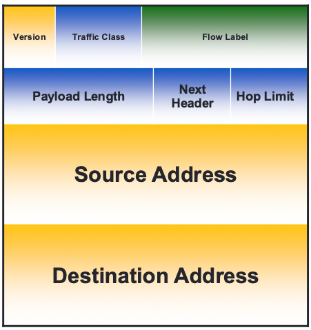
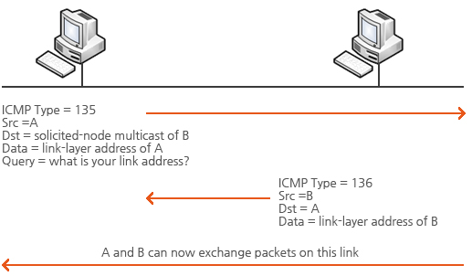
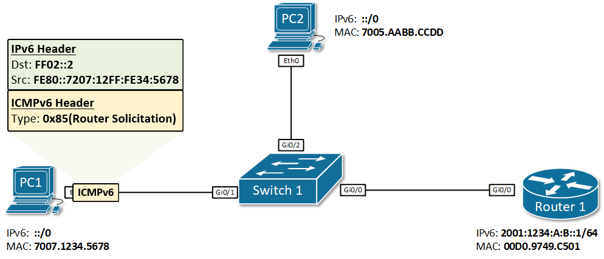
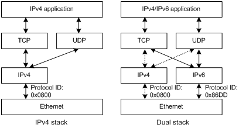
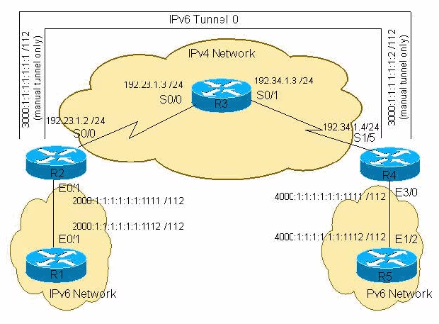
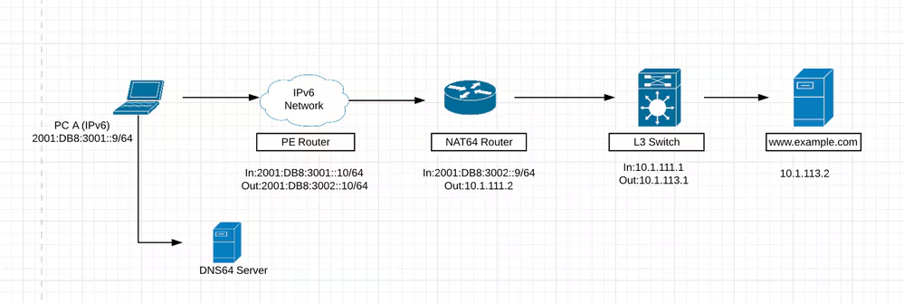

??? note "Series: Computer Network"

    [0. 컴퓨터 네트워크 개요](https://bnbong.github.io/blog/2024/12/30/computer-network-%EC%BB%B4%ED%93%A8%ED%84%B0-%EB%84%A4%ED%8A%B8%EC%9B%8C%ED%81%AC-%EA%B0%9C%EC%9A%94/)

    [1. ARP protocol](https://bnbong.github.io/blog/2025/01/15/computer-network-arp-protocol/)

    [2. IPv4](https://bnbong.github.io/blog/2025/01/17/computer-network-ipv4/)

    [3. IPv6](20260526.md)

## 1. 개요 — IPv6의 등장 배경과 필요성

IPv4는 32비트 주소 체계로 약 43억 개의 주소를 제공한다. 인터넷의 폭발적인 성장과 IoT 기기의 확산으로 이 주소 공간은 사실상 고갈되었고, CIDR이나 NAT 같은 기술로 수명을 연장해 왔지만 근본적인 해결책은 아니었다.

이 문제를 해결하기 위해 설계된 것이 **IPv6(Internet Protocol version 6)**이다. IPv6는 128비트 주소 체계를 사용하여 약 3.4×10³⁸개의 주소를 제공하며, 주소 공간 확장 외에도 헤더 단순화, 확장 헤더 체계, 자동 주소 설정 등 다양한 개선을 포함한다.

> 이 포스트는 기존 Computer Network 시리즈의 [IPv4 포스트](https://bnbong.github.io/blog/2025/01/17/computer-network-ipv4/)와 연결되는 내용이다. IPv4 헤더 구조를 먼저 살펴보고 오면 비교가 더 수월하다.

---

<!-- more -->

## 2. IPv6 주소 체계

### 2.1. 주소 표기법과 축약 규칙

IPv6 주소는 128비트를 **콜론으로 구분된 8개의 16비트 블록**으로 표기하며, 각 블록은 4자리 16진수로 나타낸다.

```
2001:0db8:0000:0000:0000:0000:0000:0001
```

**축약 규칙**은 두 가지가 있다:

| 규칙 | 설명 | 예시 |
|---|---|---|
| **선행 0 생략** | 각 블록의 앞쪽 0을 생략할 수 있다 | `0db8` → `db8`, `0000` → `0` |
| **연속 0 블록 축약 (`::`)** | 연속된 모든-0 블록을 `::`로 한 번만 축약할 수 있다 | `2001:db8::1` |

위 주소를 축약하면:

```
2001:db8::1
```

**주의:** `::`는 주소 내에서 **단 한 번**만 사용할 수 있다. 두 번 이상 사용하면 어디에 몇 개의 0 블록이 생략되었는지 모호해지기 때문이다.

### 2.2. 주소 유형 — 유니캐스트, 멀티캐스트, 애니캐스트

IPv6에는 **브로드캐스트가 없다**. 대신 세 가지 주소 유형을 정의한다:

| 유형 | 설명 |
|---|---|
| **유니캐스트(Unicast)** | 단일 인터페이스를 식별한다. 패킷은 해당 인터페이스에만 전달된다. |
| **멀티캐스트(Multicast)** | 인터페이스 그룹을 식별한다. 패킷은 그룹에 속한 모든 인터페이스에 전달된다. IPv4의 브로드캐스트 기능을 멀티캐스트가 대체한다. |
| **애니캐스트(Anycast)** | 여러 인터페이스에 동일한 주소를 할당하고, 라우팅상 가장 가까운 인터페이스 하나에만 패킷이 전달된다. |

멀티캐스트 주소는 `ff00::/8` 프리픽스로 시작한다.

### 2.3. 주소 스코프(Link-local, Global 등)

IPv6 주소는 **스코프(scope)** 에 따라 유효 범위가 달라진다:

| 스코프 | 프리픽스 | 설명 |
|---|---|---|
| **Link-local** | `fe80::/10` | 같은 링크(세그먼트) 내에서만 유효. 모든 IPv6 인터페이스에 자동 할당된다. |
| **Global Unicast** | `2000::/3` | 인터넷에서 전역적으로 라우팅 가능한 주소. IPv4의 공인 IP에 대응한다. |
| **Unique Local (ULA)** | `fc00::/7` | 사설 네트워크 내에서 사용. IPv4의 `10.0.0.0/8`, `192.168.0.0/16` 등에 대응한다. |
| **Loopback** | `::1/128` | 자기 자신을 가리킨다. IPv4의 `127.0.0.1`에 대응. |

특히 IPv6에서 일반적인 인터페이스는 link-local 주소를 가지며, 라우터 탐색과 주소 자동 설정 같은 핵심 동작에서 중요하게 사용된다.

---

## 3. IPv6 헤더 구조

### 3.1. 고정 헤더(40바이트) 필드 분석

IPv6 헤더는 **고정 40바이트** 크기를 가진다.



| 필드 | 크기 | 설명 |
|---|---|---|
| **Version** | 4비트 | IP 버전. 항상 `6`이다. |
| **Traffic Class** | 8비트 | 트래픽 분류 및 우선순위(QoS). IPv4의 ToS 필드에 대응. |
| **Flow Label** | 20비트 | 동일한 플로우에 속하는 패킷을 식별하여 특별한 처리(예: 실시간 서비스)를 가능하게 한다. |
| **Payload Length** | 16비트 | 페이로드의 길이(바이트). 확장 헤더가 있으면 확장 헤더도 페이로드에 포함된다. |
| **Next Header** | 8비트 | 바로 다음에 오는 헤더의 타입을 지정한다. 확장 헤더 또는 상위 계층 프로토콜(TCP, UDP 등)을 가리킨다. |
| **Hop Limit** | 8비트 | 패킷이 통과할 수 있는 최대 홉 수. IPv4의 TTL에 대응. |
| **Source Address** | 128비트 | 출발지 주소. |
| **Destination Address** | 128비트 | 목적지 주소. |

### 3.2. IPv4 헤더와의 비교

IPv4 포스트에서 다룬 헤더 구조와 비교하면 다음과 같은 차이가 있다:

| 항목 | IPv4 | IPv6 |
|---|---|---|
| **헤더 크기** | 가변 (20~60바이트) | 고정 40바이트 |
| **주소 길이** | 32비트 | 128비트 |
| **Header Checksum** | 있음 | **제거됨** — 하위/상위 계층에서 이미 오류 검출을 수행하므로 중복 제거 |
| **Fragmentation** | 라우터가 수행 가능 | **출발지만** 수행. Fragment 확장 헤더 사용 |
| **Options** | 헤더 내 포함 (IHL로 크기 변동) | 확장 헤더로 분리 |
| **TTL / Hop Limit** | TTL | Hop Limit (이름 변경, 동작 유사) |

IPv6 헤더에서 **Header Checksum이 제거**된 것은 주목할 만하다.

데이터 링크 계층(예: Ethernet CRC)과 전송 계층(TCP/UDP 체크섬)에서 이미 오류 검출을 수행하기 때문에, 네트워크 계층에서의 중복 검사를 없애 라우터의 처리 부담을 줄인 것이다.

또한 **단편화(Fragmentation)를 라우터가 수행하지 않는다**는 점도 중요하다.

IPv6에서는 출발지 호스트만 단편화를 수행하며, 경로 MTU 탐색(Path MTU Discovery)을 통해 적절한 패킷 크기를 결정한다.

### 3.3. 확장 헤더(Extension Header) 개요

IPv4에서 옵션 필드가 헤더 크기를 가변적으로 만들었다면, IPv6는 **확장 헤더(Extension Header)** 체인 방식으로 옵션 처리를 분리했다.

기본 헤더의 `Next Header` 필드가 다음에 올 확장 헤더의 타입을 가리키고, 각 확장 헤더도 자신만의 `Next Header` 필드를 가져 체인처럼 연결된다.

```
IPv6 헤더 → [Hop-by-Hop Options] → [Routing] → [Fragment] → TCP/UDP 페이로드
  (Next Header)    (Next Header)     (Next Header)  (Next Header)
```

주요 확장 헤더 종류:

| 확장 헤더 | 설명 |
|---|---|
| **Hop-by-Hop Options** | 경로상의 모든 라우터가 처리해야 하는 옵션 |
| **Routing** | 패킷이 거쳐야 할 중간 노드를 지정 |
| **Fragment** | 출발지에서 단편화할 때 사용 |
| **Destination Options** | 목적지 노드만 처리하는 옵션 |
| **Authentication Header (AH)** | IPsec 인증 |
| **Encapsulating Security Payload (ESP)** | IPsec 암호화 및 인증 |

이 체인 구조 덕분에 중간 라우터는 Hop-by-Hop Options을 제외한 확장 헤더를 처리할 필요가 없어 라우팅 성능이 향상된다.

---

## 4. ICMPv6와 NDP(Neighbor Discovery Protocol)

### 4.1. ICMPv6 역할 및 주요 메시지 타입

**ICMPv6(Internet Control Message Protocol for IPv6)**는 IPv6에서 오류 보고와 진단 기능을 수행하는 프로토콜이다.

IPv4의 ICMP와 유사한 역할을 하지만, ICMPv6는 ARP와 IGMP 등의 기능까지 흡수하여 범위가 더 넓다.

ICMPv6 메시지는 크게 **오류 메시지**와 **정보 메시지**로 나뉜다:

| 구분 | 타입 번호 | 메시지 | 설명 |
|---|---|---|---|
| 오류 | 1 | Destination Unreachable | 목적지에 도달할 수 없음 |
| 오류 | 2 | Packet Too Big | 패킷이 MTU를 초과함 (Path MTU Discovery에 사용) |
| 오류 | 3 | Time Exceeded | Hop Limit 초과 |
| 정보 | 128 | Echo Request | ping 요청 |
| 정보 | 129 | Echo Reply | ping 응답 |
| 정보 | 133 | Router Solicitation (RS) | 라우터 탐색 요청 (NDP) |
| 정보 | 134 | Router Advertisement (RA) | 라우터 정보 광고 (NDP) |
| 정보 | 135 | Neighbor Solicitation (NS) | 이웃 탐색 요청 (NDP) |
| 정보 | 136 | Neighbor Advertisement (NA) | 이웃 탐색 응답 (NDP) |

### 4.2. NDP — ARP를 대체하는 메커니즘

IPv6에서는 ARP를 사용하지 않으며, 링크 계층 주소 해석은 NDP의 NS/NA 메시지로 수행한다.

**NDP(Neighbor Discovery Protocol)**는 ICMPv6 메시지를 기반으로 동작하며, 다음과 같은 기능을 수행한다:

- **주소 해석(Address Resolution):** NS(Neighbor Solicitation) / NA(Neighbor Advertisement) 메시지를 통해 IPv6 주소에 대응하는 링크 계층(MAC) 주소를 알아낸다.
- **라우터 탐색(Router Discovery):** RS(Router Solicitation) / RA(Router Advertisement)를 통해 링크 상의 라우터와 프리픽스 정보를 파악한다.
- **중복 주소 검출(DAD — Duplicate Address Detection):** 새로 설정하려는 주소가 이미 사용 중인지 확인한다.
- **이웃 도달 불가 감지(NUD — Neighbor Unreachability Detection):** 이웃 노드와의 연결 상태를 주기적으로 확인한다.
- **리다이렉트(Redirect):** 더 나은 next-hop 라우터가 있을 때 알려준다.


/// caption
Neighbor Solicitation - type 135, Neighbor Advertisement - type 136

출처 : https://xn--3e0bx5euxnjje69i70af08bea817g.xn--3e0b707e/jsp/resources/vsix/icmp.jsp
///

A는 B와 통신하기 위하여 상대방의 MAC 및 링크 로컬 주소를 알아야 하기 때문에 A는 B에게 자신의 링크 로컬 주소를 기반으로 Solicited node multicast 그룹으로 NS 메시지를 전송한다.

B는 NS 메시지를 전송 받은 후 A에서 요청한 MAC 및 링크 로컬 주소를 NA 메시지를 통하여 응답해준다. 이때 B는 A의 링크 로컬 주소를 알고 있기 때문에 출발지를 자신으로, 목적지를 A의 주소로 설정하여 메시지를 전송한다.

A와 B가 서로의 정보를 모두 주고 받으면 IPv6 neighbor 정보에 MAC과 링크 로컬 주소가 등록되어 서로 통신이 가능하게 된다.

ARP가 브로드캐스트 기반이었던 것과 달리, NDP는 **멀티캐스트**를 사용한다. Solicited-Node 멀티캐스트 주소(`ff02::1:ffXX:XXXX`)로 NS를 보내면, 해당 주소를 가진 노드만 응답하므로 네트워크 부하가 줄어든다.

---

## 5. 주소 자동 설정 — SLAAC

**SLAAC(Stateless Address Autoconfiguration)**는 DHCPv6 서버 없이도 호스트가 스스로 IPv6 주소를 설정할 수 있는 메커니즘이다.

SLAAC의 동작 과정:

1. **Link-local 주소 생성:** 호스트가 부팅되면, 인터페이스 ID(보통 MAC 주소 기반의 EUI-64 또는 랜덤 값)를 이용해 `fe80::/10` 범위의 Link-local 주소를 생성한다.
2. **DAD(중복 주소 검출):** 생성한 주소가 링크 내에서 이미 사용 중인지 NS 메시지로 확인한다.
3. **Router Solicitation 전송:** 링크 상의 라우터에게 RS 메시지를 보내 프리픽스 정보를 요청한다.
4. **Router Advertisement 수신:** 라우터가 RA 메시지로 네트워크 프리픽스(예: `2001:db8:abcd::/64`)와 기타 설정 정보를 알려준다.
5. **Global Unicast 주소 생성:** 수신한 프리픽스 + 인터페이스 ID를 결합하여 전역 주소를 만든다.


/// caption
출처 : https://www.networkacademy.io/ccna/ipv6/stateless-address-autoconfiguration-slaac
///

```
프리픽스 (64비트, RA에서 수신)  +  인터페이스 ID (64비트)  =  128비트 Global Unicast 주소
     2001:db8:abcd:0000           :    XX:XXFF:FEXX:XXXX       2001:db8:abcd::XX:XXFF:FEXX:XXXX
```

SLAAC 덕분에 소규모 네트워크에서는 DHCP 서버 없이도 자동으로 주소를 설정할 수 있다. 다만, DNS 서버 주소 등 추가 설정 정보가 필요하면 DHCPv6를 병행하기도 한다.

---

## 6. IPv4에서 IPv6로의 전환 메커니즘 개요

IPv4와 IPv6는 호환되지 않는다. 전 세계의 모든 네트워크를 한꺼번에 전환할 수 없으므로, 공존 기간 동안 사용하는 전환 메커니즘이 필요하다.

대표적으로 **듀얼 스택**, **터널링**, **변환(NAT64/DNS64)** 세 가지가 있다.

### 6.1. 듀얼 스택(Dual Stack)

**듀얼 스택**은 하나의 장비(호스트 또는 라우터)에서 IPv4와 IPv6를 **동시에** 운영하는 방식이다.


/// caption
출처 : https://whatismyipaddress.com/dual-stack
///

- 장비가 IPv4와 IPv6 주소를 모두 가진다.
- 통신 상대가 IPv6를 지원하면 IPv6로, 그렇지 않으면 IPv4로 통신한다.
- 가장 직관적인 전환 방법이지만, 두 프로토콜 스택을 모두 유지·관리해야 하는 부담이 있다.

### 6.2. 터널링(Tunneling)

**터널링**은 IPv6 패킷을 IPv4 패킷 안에 캡슐화(encapsulation)하여 IPv4 네트워크를 통과시키는 방식이다.


/// caption
출처 : https://www.cisco.com/c/ko_kr/support/docs/ip/ip-version-6/25156-ipv6tunnel.html
///

```
[IPv6 호스트] ──IPv6──▶ [터널 시작점] ──IPv4(IPv6 캡슐화)──▶ [터널 종단점] ──IPv6──▶ [IPv6 호스트]
```

- IPv6 섬(island)들이 IPv4 바다를 통해 서로 연결할 수 있다.
- 대표적인 터널링 기법: **6in4**(수동 터널), **6to4**(역사적으로 사용된 자동 터널 방식), **ISATAP**, **Teredo** 등이 있다.

### 6.3. 변환(NAT64/DNS64)

**NAT64/DNS64**는 IPv6 전용 네트워크에서 IPv4 전용 서버에 접근해야 할 때 사용하는 변환 방식이다.


/// caption
출처 : https://www.cisco.com/c/en/us/support/docs/ip/network-address-translation-nat/217208-understanding-nat64-and-its-configuratio.html
///

```
[IPv6 클라이언트] ──IPv6──▶ [NAT64 게이트웨이] ──IPv4──▶ [IPv4 서버]
                               ↕
                          [DNS64 서버]
```

- **DNS64:** IPv4 전용 서버의 A 레코드(IPv4 주소)를 IPv6 주소로 합성(synthesize)하여 AAAA 레코드처럼 응답한다.
- **NAT64:** IPv6 패킷과 IPv4 패킷 간의 프로토콜 변환을 수행하는 게이트웨이이다.
- IPv6 전용 환경으로 전환하면서도 레거시 IPv4 서비스와의 호환성을 유지할 수 있다.

---

## 7. 정리 및 마무리

IPv6의 핵심 특징을 정리하면 다음과 같다:

| 항목 | 내용 |
|---|---|
| **주소 공간** | 128비트, 약 3.4×10³⁸개 주소 |
| **헤더** | 고정 40바이트, Header Checksum 제거, 확장 헤더로 옵션 분리 |
| **주소 유형** | 유니캐스트, 멀티캐스트, 애니캐스트 (브로드캐스트 없음) |
| **주소 자동 설정** | SLAAC으로 DHCPv6 없이 자동 설정 가능 |
| **이웃 탐색** | ARP 대신 NDP (ICMPv6 기반) 사용 |
| **단편화** | 출발지만 수행, 라우터는 단편화하지 않음 |
| **IPsec** | AH/ESP 등 IPsec 관련 확장 헤더를 사용할 수 있음 |
| **전환 메커니즘** | 듀얼 스택, 터널링, NAT64/DNS64 |

IPv6는 단순히 주소 공간을 넓힌 것이 아니라, 헤더 단순화, 확장 헤더 체계, NDP, SLAAC 등 네트워크 프로토콜 전반에 걸친 개선이 이루어진 차세대 프로토콜이다.

IPv4와의 공존 기간이 계속되고 있지만, 점차 IPv6 채택률이 높아지고 있는 만큼 그 구조와 동작 원리를 이해해두는 것이 중요하다.

뭐, 언젠가는 IPv6가 만연해질 날이 올테니까..?
