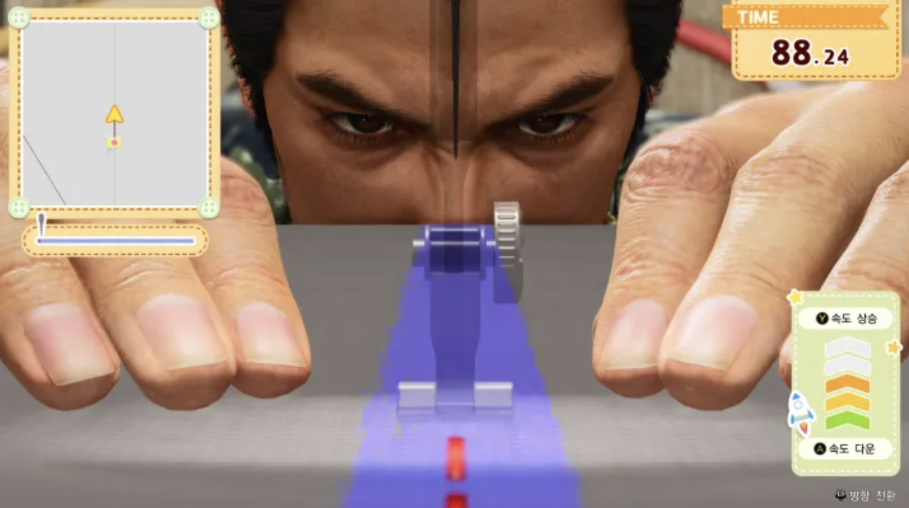
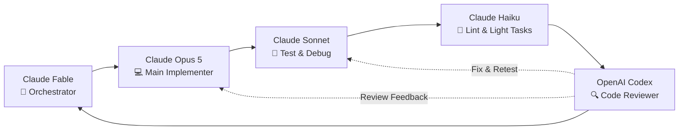
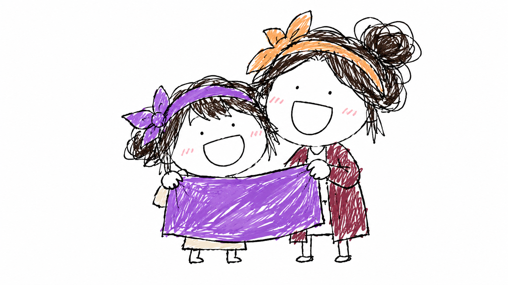

26년 8월 23일 태어나서 처음으로 개발해본 게임 Overlock(오버로크) 버전 1.0.0을 릴리즈했습니다. 이 글을 쓰는 시점의 바로 어제인 28일에는 버전 1.1.0까지 업데이트했습니다.

그래서 이거 어떻게, 왜 만듦?

## 개발 배경

사실 Overlock 이전에 개발중이던 게임이 하나 있었습니다.

바로 ['헤쳐 모여!(Fall-In!)'](https://bnbong.com/projects/fall-in/)이라는 보드게임 '젝스님트'를 온라인 게임으로 포팅한 프로젝트였는데, 최종 에셋 개발을 앞두고 큰 고민이 있었습니다.

> 와 진짜 𝒥𝑜𝓃𝓃𝒶 재미없는데???

친구들끼리 젝스님트를 모여서 해봤을 땐 참 재미있었는데 막상 온라인으로 구현하고 붙여보니 생각보다 너무 재미가 없었습니다. 카드를 4열로 배치하는걸 군대에서 오와 열 맞추는 모습으로 재해석한건 나름 참신하다고 생각했지만 만들어지고 있는 게임은 단순 방치형 게임 그 이상 그 이하도 아닌 무언가가 만들어졌습니다...

더군다나 당시에는 게임 개발 외에도 다른 프로젝트나 취준 원서 작성, 자격증 준비 등 할일이 태산이었고 여러모로 실패를 거듭하고 의욕이 바닥나던 시기였어서 더욱이 속도가 나지 않았습니다.

그러던중 웹서핑을 하다가 재미있는 게임 스크린샷을 발견했습니다:

/// caption
ⓒ SEGA, 『용과 같이 3』 재봉 미니게임 스크린샷. 시점 및 연출 참고를 위한 인용, 사진 출처 : https://game.hqofgwh.com/yakuza-kiwami-3-chapter-3-walkthrough/
///

용과같이라는 게임은 다메다메BGM으로나마 알고 있던 게임이었는데 그 우락부락한 야쿠자 요야붕들이 재봉틀로 보육원 아이들한테 뭔가 만들어주고 있는 그 구도가 너무 웃겨보였습니다.

거기서 번뜩, 이거 되게 재미있는데 이걸로 레이싱게임을 만들어보면 어떨까? 하는 생각이 들었습니다. 바로 메모에다가 이 새로운 게임이 풀어나가야할 아이디어들을 막힘없이 써내려가기 시작했습니다. 그 후 당시 Pro 구독중이었던 매우 똑똑한 버전의 ChatGPT한테 게임 기획서를 만들어달라고 던졌습니다.

그렇게 이 게임이 세포분열하기 시작했죠

## 개발 과정

지피띠니가 만들어준 기획서는 역시나 군더더기가 없었습니다. 수정할 부분이 그렇게 많지 않았고 MVP 개발 범위와 이후 업데이트 방향성 내용까지 꽤나 괜찮은 아이디어들로 가득했습니다.

이걸 그대로 Codex 세션으로 넘길 수 있었지만 저는 메인 개발 에이전트는 OpenAI 계열이 아닌 Antropic 계열의 Claude를 더 선호합니다(지금도ㅇㅇ). 기획서가 막 만들어졌을 당시에는 현재 OpenAI의 5.6 Sol이나 Luna 플래그십 모델이 없었고 Fable이 타사 LLM 성능을 매우 압도하고 있었기에 클로드를 선택하지 않을 이유가 더욱 없었습니다.

그래도 하나의 LLM한테 매몰되는건 좋지 않기에 안전한 개발 flow를 다음과 같이 구축해봤습니다:

Fable이 상당히 비싼 모델이기 때문에 모든 구현을 Fable로 돌리는건 빌게이츠만 가능한 행동이라 이런 식으로 최적화를 해봤습니다.

게임 개발이 완료된 시점에서의 평가는 상당히 만족스럽습니다. Python언어가 아닌 Godot으로 개발되었기 때문에 주류 언어가 아니었다는 점을 고려해서 결과물이 기대보다 살짝 낮게 나온 감이 있습니다. Claude Opus 4.6 시절 결과물을 보는 느낌?

그래도 매우 만족스럽습니다. 단일 에이전트가 아니라 두 프로바이더의 여러 에이전트가 붙어 작업했기에 요구사항 하나를 구현하는데 오랜 시간이 걸렸지만 꽤나 원하는 방향대로 잘 뽑아줬습니다.

그래픽 에셋은 GPT Image 2로 뽑았습니다. Fable 에이전트한테 만들어야하는 에셋에 대해 프롬프트를 만들어달라고 부탁했고 고대로 GPT한테 던졌습니다. 1~2번의 프롬프트질로 만족스러운 결과물이 나오더라구요.

사운드 에셋은 Suno AI로 뽑았습니다. 최근에 재개봉했던 F1 영화 느낌의 노래를 뽑고 싶어 사운드 뽑는데 시간(+돈)을 좀 투자했습니다.

LLM Agent 구현 flow를 제외한 나머지 개발 스택 선택 이유, 설계 방식에 대해서는 [Overlock 프로젝트 소개](https://bnbong.com/projects/overlock/)에 적어두었습니다.

<https://bnbong.com/projects/overlock/>

## 릴리즈

배포는 원래 소유하고 운영중이던 도메인과 클라우드 서비스에 올렸습니다. 클라이언트는 웹서빙용 VM에, 리더보드 서버는 API서빙용 VM에 올렸고 overlock이라는 서브도메인을 추가해서 연결해두었습니다.

게임 링크

<https://overlock.bnbong.com>

/// caption
배포했다 야르
///

## 후기

기획서 자체는 2달정도 전에 만들어뒀지만 중간에 이것저것 할게 많아서 본격적인 개발 착수는 1.0.0 릴리즈 2주 전에 시작했습니다. 그럼에도 불구하고 LLM의 말도안되는 생산성 덕분에 릴리즈까지 할 수 있었습니다.

1.0.0 배포 이후 테스팅과 홍보를 위해 지인 위주로 여기저기 뿌려봤습니다. 대학 동기들부터 글을 쓰고 있는 현재 속해있는 SSAFY 16기 동기들한테까지...

피드백을 얻고자 게임 피드백 구글폼을 따로 만들어서 같이 첨부했는데 생각보다 많은 피드백을 받았습니다. 난이도에 대한 피드백이 제일 많았는데 일부러 어렵게만든거라 예상 범위였고, 맵을 탈출한다는 버그 제보가 많았기에 SW적으로 트랙을 너무 멀리 벗어나면 패널티 부여와 함께 트랙으로 순간이동 시키는 가드레일을 추가했습니다.

많은 피드백 중에 공통적으로 받았던 후기는 '어렵지만 재미있다'였습니다. 이게 너무 짜릿했습니다. 처음으로 개발부터 릴리즈까지 무사히 순행한 게임 프로젝트였고, 어렸을 때부터 해보고 싶었던 게임 개발이었고, 직접 만든 결과물에 대한 평가를 실시간으로 받으면서 더군다나 좋은 평가를 받은 것이 엄청 황홀했습니다. ~~생각보다 파급력이 강했는지 SSAFY 수업 시간에 게임 하는 사람들이 너무 많이 늘어 공지에 게임 하지 말라는 공지가 따로 올라오기도...~~

일단 당장 앞둔 목표는 itch.io에 올리는 것입니다. 지금도 그럭저럭 볼만한 게임이지만 더더더 다듬어서 업로드할 예정입니다. 어머니는 빨리 업로드하라고 닥달하시긴 하는데 일단 좀 더 닦구...

아직 Overlock에 더 붙이고 싶은 아이디어가 많습니다. 열심히 재미있는 컨텐츠 붙여보겠습니다.

