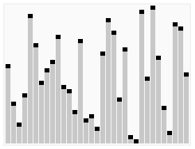

??? note "Series: 알고리즘 리뷰"

    [0. Introduction](20250128.md)

    [1. 구현](20260825.md)

    [2. DFS / BFS](20260828.md)

    [3. 정렬](20260830.md)

    [4. 이분 탐색 & 이분 탐색 트리](20260902.md)

나동빈님의 '이것이 취업을 위한 코딩 테스트다 with 파이썬' 책을 바탕으로 정리한 내용이 포함되어 있습니다.

## 0. 정렬이란?

> 정렬 - 데이터를 순서대로 나열하는 것 (너무 당연)
> 

그냥 파이썬 내장 정렬 함수 `sorted()` 쓰면 안됨? ⇒ ‘**분할 정복(Divide and Conquer)**’적 사고가 필요

- 퀵 정렬의 핵심이 분할 정복임, 기억할 것

---

## 1. 버블 정렬 (Bubble Sort)

> 옆자리끼리 비교하여 왼쪽이 더 크면 자리를 바꿈. 이 사이클을 반복
> 


#### 왜 이름에 버블이 들어가냐

큰 값이 오른쪽 끝으로 정렬 되는 과정이 마치 물 속의 거품이 보글보글 위로 올라가는 모습과 닮아서
~~(개인적으론 이름 어거지로 붙인 듯)~~

### 버블 정렬 과정

1. **비교 시작:** 맨 앞 인덱스부터 시작
2. **인접 원소 비교:** 현재 값과 바로 다음 값 비교
3. **자리 교환:** 앞의 값이 뒤의 값보다 크다면 두 자리를 바꿈
4. **반복:** 배열 끝까지 위 비교 & 자리 교환 진행
5. **사이클 하나 끝:** 순회 하나 끝나면 가장 큰 원소가 맨 마지막에 놓임
6. **범위 축소:** 맨 끝에 놓인 원소 제외, 위 사이클 반복

`[5, 1, 4, 2, 8]` 을 정렬한다고 했을 때.

버블 정렬을 하게 되면 **큰 수를 뒤로 보내는 과정**을 반복함

#### 1회전 (하이라이트 - 비교 / 밑줄 - 큰 수)

```python
[5, 1, 4, 2, 8]    5 > 1  -> 자리 교환
[1, 5, 4, 2, 8]    5 > 4  -> 자리 교환
[1, 4, 5, 2, 8]    5 > 2  -> 자리 교환
[1, 4, 2, 5, 8]    5 < 8  -> 그대로
```

#### 2회전

맨 뒤 8 제외 사이클 반복

```python
[1, 4, 2, 5, 8]    1 < 4  -> 그대로
[1, 4, 2, 5, 8]    4 > 2  -> 자리 교환
[1, 2, 4, 5, 8]    4 < 5  -> 그대로
```

#### 3회전

```python
[1, 2, 4, 5, 8]    1 < 2  -> 그대로
[1, 2, 4, 5, 8]    2 < 4  -> 그대로
```

교환이 없음 → 정렬 끝

### 버블 정렬 코드

```python
def bubble_sort(a):
    n = len(a)
    for i in range(n - 1):              # 회전 횟수
        for j in range(n - 1 - i):      # 확정된 뒤쪽은 제외 (확정된 부분만큼이 i라고 생각하면 됨)
            if a[j] > a[j + 1]:         # 왼쪽이 더 크면
                a[j], a[j + 1] = a[j + 1], a[j]    # 자리 교환
    return a

print(bubble_sort([7, 5, 9, 0, 3, 1, 6, 2, 4, 8]))
# [0, 1, 2, 3, 4, 5, 6, 7, 8, 9]
```

if 문이 핵심, 자리 비교를 통해 큰 값을 자리 교환해가며 뒤쪽으로 보내게 됨

#### 개선 - Early Stop 추가 : 더 이상의 자리 교환 없으면 멈추도록 만들어보기

```python
def bubble_sort(a):
    n = len(a)
    for i in range(n - 1):
        swapped = False                 # 이번 회전에 교환이 있었나?
        for j in range(n - 1 - i):
            if a[j] > a[j + 1]:
                a[j], a[j + 1] = a[j + 1], a[j]
                swapped = True
        if not swapped:                 # 교환이 없었다 = 이미 정렬됨
            break
    return a
```

### 버블 정렬 시간복잡도

| 경우 | 복잡도 | 언제? |
| --- | --- | --- |
| 최선 | O(N) | 이미 정렬됨(조기 종료 개선판 적용 시) |
| 평균 | O($N^2$) | 무작위 |
| 최악 | O($N^2$) | 주어진 데이터가 역순 정렬된 경우 |

**왜 O(N²)인가?** 회전을 약 N번 돌고, 회전마다 약 N번 비교하니 N x N

### 버블 정렬은 언제 쓰나

시간복잡도를 기준으로 생각했을 때 가장 느린 정렬이라서 실전에서는 거의 안씀

그럼 얘 의의는 뭐냐? → 반면 교사인듯

못난 놈(버블정렬)과 잘난 놈(퀵정렬)끼리 붙여서 잘난 놈을 더 잘나보이게 돋보이게 하는 의의가 있지 않을까 하는 필자의 생각…

---

## 2. 퀵 정렬 (Quick Sort)

> 기준값(피벗)을 하나 정해서 전체를 두 덩어리로 쪼갬 (피벗 보다 작은 것은 왼쪽 / 큰 것은 오른쪽)
> 


/// caption
참고: GIF에서는 맨 뒤 요소를 피벗으로 잡음
///

버블 정렬과의 차이는…

- 버블 정렬은 옆자리끼리만 비교
- 퀵 정렬은 기준 하나를 정하고, 전체를 덩어리로 쪼갬, 이를 반복

#### 왜 빠름?

기준값(피벗)을 정하면 왼쪽 덩어리와 오른쪽 덩어리는 **서로 비교할 필요가 전혀 없음**

왼쪽 덩어리는 어떻게 정렬되든 전부 피벗보다 작고, 오른쪽은 전부 크기 때문

⇒ 문제를 절반씩으로 쪼개기 때문에 비교 양이 매우 크게 줄어든다

⇒ 이것이 **분할 정복 (Divide and Conquer)**

### 퀵 정렬 과정

1. **기준점 선택:** 배열에서 원소 하나를 기준점(피벗)으로 고름. 보통 맨 앞이나 중간값, 맨 뒤 값을 선택함
2. **분할:** 덩어리 나누기 - 피벗보다 작은 값은 왼쪽, 큰 값은 오른쪽
3. **기준점 고정:** 분할 후에는 골랐던 피벗이 왼쪽 덩어리와 오른쪽 덩어리 사이에 위치
4. **재귀 반복:** 왼쪽 덩어리와 오른쪽 덩어리에 대해 위 사이클 반복
    1. **종료 조건:** 덩어리 크기가 0 또는 1이 되면 정렬이 완료, 반복 멈춤

`[5, 3, 8, 1, 9, 2]` 을 정렬한다고 했을 때.

피벗부터 뽑은 후 덩어리 분류 시작

```python
[5, 3, 8, 1, 9, 2]   피벗=5   작은쪽=[3,1,2]   큰쪽=[8,9]
  [3, 1, 2]          피벗=3   작은쪽=[1,2]     큰쪽=[]
    [1, 2]           피벗=1   작은쪽=[]        큰쪽=[2]
      []             -> 종료 (크기=0)
      [2]            -> 종료 (크기=1)
    []               -> 종료 (크기=0)
  [8, 9]             피벗=8   작은쪽=[]        큰쪽=[9]
    []               -> 종료 (크기=0)
    [9]              -> 종료 (크기=1)

결과: [1, 2, 3, 5, 8, 9]
```

### 퀵 정렬 코드

```python
def quick_sort(a):
    if len(a) <= 1:                              # 원소 0 또는 1개면 종료
        return a

    pivot = a[0]                                 # 피벗은 첫 번째 원소 (중간 혹은 끝 값 선택 가능)
    tail = a[1:]                                 # 피벗을 뺀 나머지

    left  = [x for x in tail if x <= pivot]      # 피벗보다 작거나 같은 것
    right = [x for x in tail if x >  pivot]      # 피벗보다 큰 것

    return quick_sort(left) + [pivot] + quick_sort(right)   # 재귀 반복

print(quick_sort([5, 7, 9, 0, 3, 1, 6, 2, 4, 8]))
# [0, 1, 2, 3, 4, 5, 6, 7, 8, 9]
```

마지막 줄이 핵심.  `정렬된 왼쪽 + 피벗 + 정렬된 오른쪽`

#### 개선 - 메모리 효율적으로…

위 코드는 left, right라는 리스트를 매 재귀 마다 새로 만들기 때문에 메모리 비효율적

리스트를 새로 만들지 않고 원본 안에서 자리를 바꿔서 정렬한다면?

```python
def quick_sort(array, start, end):               # 함수 인자를 3개로 늘림 - 인덱스 start & end
    if start >= end:                             # 원소 0 또는 1개면 종료
        return

    pivot = start                                # 피벗은 첫 번째 원소 (중간 혹은 끝 값 선택 가능)
    left = start + 1                             # 포인터 left - 피벗 인덱스 바로 뒤부터 포인팅
    right = end                                  # 포인터 right - 맨 끝 인덱스부터 포인팅

    while left <= right:
        # 왼쪽에서부터 피벗보다 큰 값을 찾는다
        while left <= end and array[left] <= array[pivot]:
            left += 1
        # 오른쪽에서부터 피벗보다 작은 값을 찾는다
        while right > start and array[right] >= array[pivot]:
            right -= 1

        if left > right:                         # 엇갈렸다면 -> 피벗을 제자리에
            array[right], array[pivot] = array[pivot], array[right]
        else:                                    # 엇갈리지 않았다면 -> 둘을 자리 교환
            array[left], array[right] = array[right], array[left]

    quick_sort(array, start, right - 1)          # 재귀 반복 - 피벗 왼쪽
    quick_sort(array, right + 1, end)            # 재귀 반복 - 피벗 오른쪽
```

**엇갈린 경우:** 왼쪽에서 오는 포인터와 오른쪽에서 오는 포인터가 서로 지나쳐버린 상태 ⇒ 더 이상 바꿀 쌍이 없는 신호

즉, 엇갈렸다면 피벗을 최종 위치(왼쪽 덩어리와 오른쪽 덩어리 사이)에 보냄

개인적으론 굳이? 이렇게 구현하지 않아도 된다고 생각…

### 퀵 정렬 시간복잡도

| 경우 | 복잡도 |
| --- | --- |
| 평균 | O($NlogN$) |
| 최악 | O($N^2$) |

O($NlogN$)인 이유 = 절반씩 조개면 높이(책의 표현)가 약 $logN$이고, 각 높이마다 N번 비교 ⇒ N x $logN$

평균이 O($N^2$)인 버블 정렬과 비교하면 매우 선녀.

### 퀵 정렬은 무적인가

개인적으로는 무적이라고 생각.

책에서 얘기하는 퀵 정렬의 최악 시간 복잡도 O($N^2$)인 경우는 피벗을 가장 왼쪽 데이터로 잡고, 이미 데이터가 정렬되어 있는 경우임

근데 이미 데이터가 정렬됐다면 정렬은 끝난건데 거기에 정렬 알고리즘을 왜 또 걸어서 최악을 고려하나?

→ 즉, 평균적으로 O($NlogN$)를 뽑아주는 퀵 정렬 아주 좋다 따봉

Python의 기본 정렬 라이브러리`sorted()`  함수는 퀵정렬과 비슷한 병합 정렬 기반(Timsort - 삽입 정렬과 병합 정렬을 결합한 것)으로 구현됨. 최악 경우에도  **항상 O($NlogN$)을 보장**해줌.

- 직접 구현한 퀵 정렬보다 약 15배 정도 빠른 성능을 낼 수 있음
- C로 구현 & 실제 데이터 패턴까지 활용하는 Timsort 기반이라서

#### 같이 보면 더 이해하기 좋은 영상(코딩애플님 영상)

<https://youtu.be/9JvsSaqiles?si=X4CvXgqzupHKrdG3>