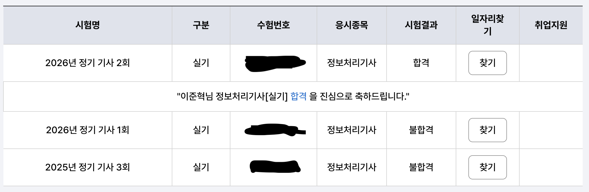
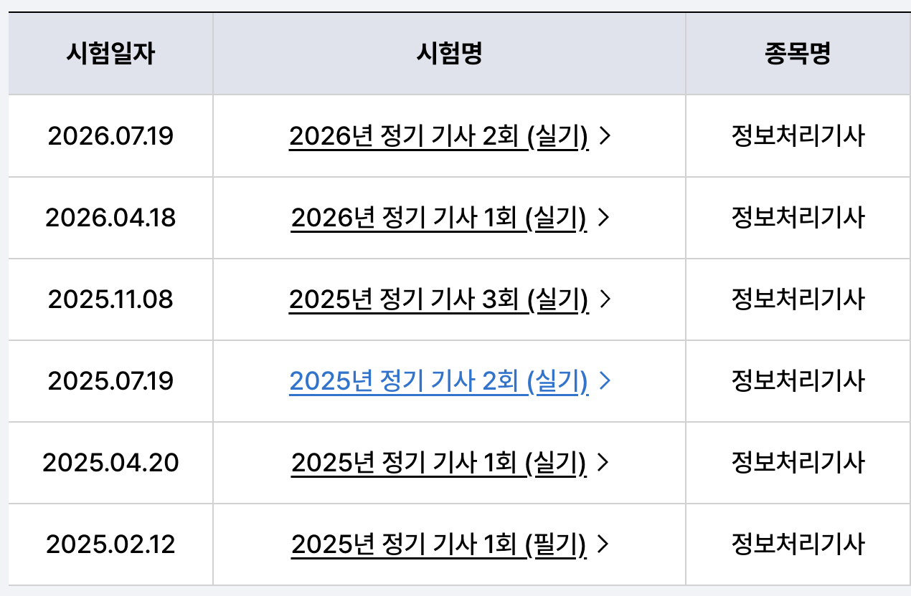
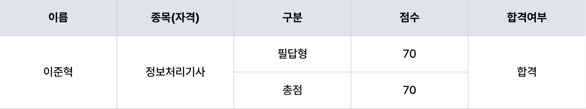

정보처리 시리즈 2020년 기능사부터 시작해서 산업기사, 올해 2026년 기사까지 땄네요.

## 4트만에 합격한 범부

사실 앞에 기능사, 산업기사는 매우 수월하게 합격했지만 정보처리 기사는 그렇지 못했습니다.

기사 필기 시험은 전날 4시간 정도 공부한 것으로 매우 널널하게 합격하여, 실기 시험도 지난 시험들 처럼 딸칵 수준으로 합격할 줄 알았던 지난날의 오산들이 있었습니다.

사진에서는 실기만 5회 등록했는데 그 중 한 회는 대학 기말고사 일정 때문에 응시하지 못해 실질적으로는 4트만에 합격한 셈입니다.

## 필기 시험

이전 두 시험은 실물 책을 구입해서 공부했는데 이런 식으로 공부하다 보니 자격증 시험을 다 보고나면 책들이 집에 공간만 차지하는 애물단지가 돼버려서 이번 시험은 온라인 매체를 많이 활용했습니다.

시나공 사이트에 이전 년도 기출 문제들을 풀고 부족한 부분 개념들은 개념 정리 노트를 바탕으로 풀었습니다. 정보처리산업기사 필기 공부했을 때 시나공 책에 있는 개념들도 챙겨보며 공부했습니다.

<https://www.sinagong.co.kr/pds/001001001/past-exams>

저는 컴퓨터 전공이었거니와 기출 문제를 풀어보니 정보처리 산업기사 시절에 공부했던 개념들을 어럽지 않게 떠올릴 수 있었습니다. 그래서 정말 시험 전날에 4시간 정도만 도서관에서 공부하고 시험을 봤고, 5과목 모두 거의 만점에 가까운 점수를 받았습니다.

그런데 문제는...

## 실기 시험

실기 시험은 만만하지 않았습니다. 23년 개정 이후 기출 문제를 나름 모두 풀었는데 정작 시험에 가보니 완전 처음 보는 개념들이 나왔습니다.

개인적으로는 2026년 버전과 비교하여 2025년 실기 시험이 유독 어렵게 나오기도 했는데, 필기 시험때 생각하고 설렁설렁 공부했던 것이 사실 진짜 패착이지 않았나.. 싶기도 하네요ㅋㅋ

기사 필기 때와는 다르게 처음에는 정보처리기사 실기 책을 구매해서 풀었지만, 그리 큰 도움은 되지 못했습니다.

매번 새로운 문제를 출제하거니와 저처럼 제대로 약한 부분을 공부하지 않고 시험에 치르는 사람에겐 결국 개념을 제대로 알고 있는지를 다양한 방면에서 파악할 수 있는 문제들이 필요했습니다.

그래서 마지막 실기 시험 준비과정에선 온라인 매체를 사용하는 것으로 공부 노선을 바꿨습니다. 사용한 플랫폼입니다:

<https://jeongcheogi.edugamja.com/>

기출 문제들을 섞어주기도 하고 예상 문제도 만들어주고 개념 정리 노트도 알아서 제공해주는, 돈 값을 하는 사이트였습니다. 심지어 책보다도 훨씬 저렴함

이 사이트 덕분에 공부가 부족했던 파트들이 무엇인지 파악할 수 있었고 계속해서 만들어주는 예상 문제들을 풀어보며 대비했습니다. 

개인적으로 어려웠다고 생각했던 파트는 코드 실행 결과 예측 유형이었습니다. python을 나름 오랫동안 다뤄왔기에 자신 있었는데, 난생 처음 보는 문법을 보기도 하고 lambda식을 어렵게 꼬아버리니 머리가 터질 것 같았습니다. C언어 파트야 역시 포인터를 하드하게 꼬아놓으니 정신 안차리면 트레이스를 놓쳐버리기도 했고요.

그래서 실패를 거듭한 후 문법부터 튼튼히 다져두어야겠다고 생각해서 이 기술블로그에서도 언어 별 문법 정리 시리즈를 다루기도 했습니다:

<https://bnbong.com/blog/20260427-python-difficult-syntax/>

<https://bnbong.com/blog/20260627/>

여튼 이렇게 하니

70점으로 합격 커트라인 60점을 넘겨 합격할 수 있었습니다.

## 마무리

요즘 AI가 좋아졌다곤 하지만 예상 문제 만들어달라고하면 출제 패턴 및 경향과는 살짝 어긋난 문제를 뽑아내기에, 정처기감자 사이트 같은 커뮤니티 검증이 되어 있는 매체를 사용하는 쪽이 훨씬 도움될 것입니다.

모두 화이팅