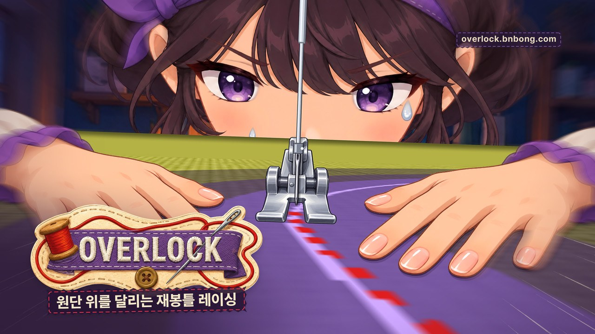
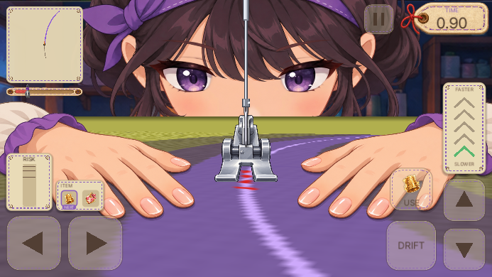
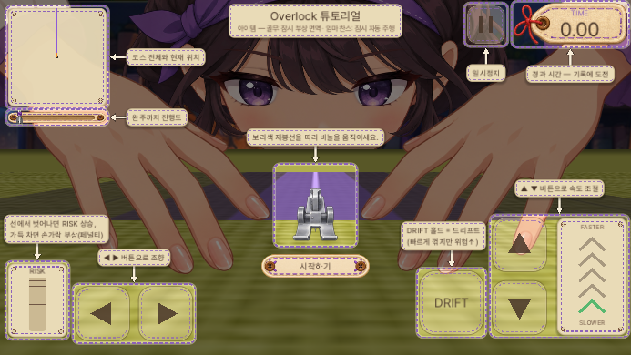
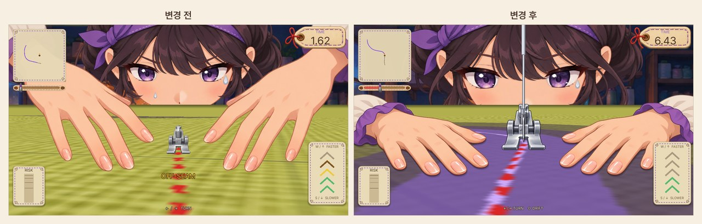
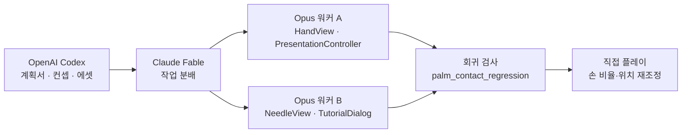
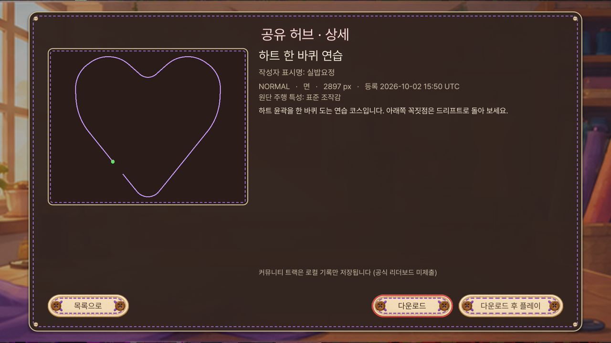
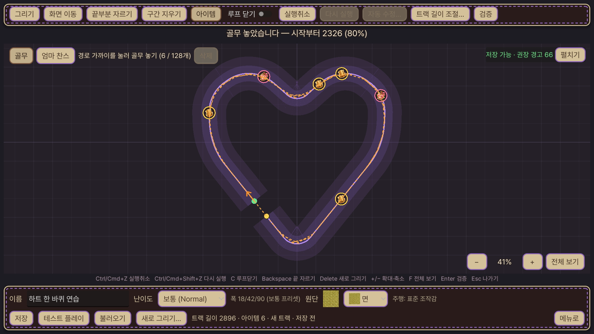
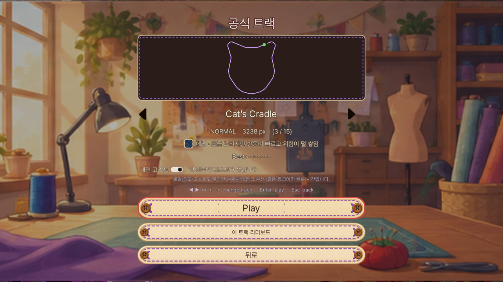
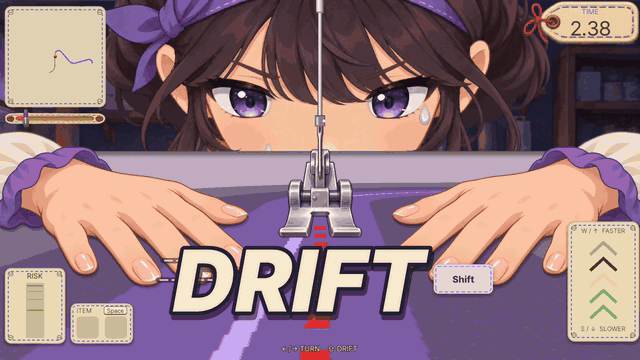
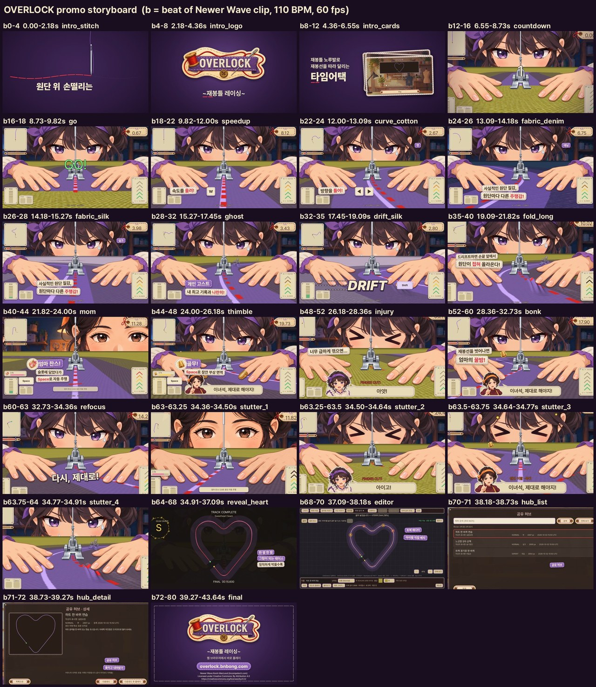

/// caption
v2.3.1 기준 Overlock 키 비주얼
///

[지난 글](https://bnbong.com/blog/20260829-overlock/)에서 Overlock v1.1.0까지의 개발 기록을 남기면서 "당장 앞둔 목표는 itch.io에 올리는 것"이라고 적었습니다. 이제 그 약속을 충족했습니다.

v1.1.0을 8월 28일에 올린 뒤로 한 달 정도는 이것저것 할 일이 많아서 업데이트가 없었습니다. 그러다 9월 29일부터 10월 4일까지 엿새 동안 v1.2.0부터 v2.3.1까지 8개 버전을 연달아 냈고, 그 사이에 itch.io 배포까지 마쳤습니다.

엿새치 변경을 주제별로 묶어서 적어 보겠습니다. 설계에 대한 자세한 설명은 [Overlock 프로젝트 소개](https://bnbong.com/projects/overlock/)에 정리해 두었습니다.

## 모바일에서도 달리게 하기

v1.2.0은 itch.io 배포 준비와 함께 모바일 대응을 시작한 버전입니다. 그전까지 Overlock은 키보드가 없으면 조작할 방법이 없었습니다. 그래서 iOS Safari와 Android Chrome의 가로 화면을 대상으로 터치 컨트롤을 넣었습니다. 네이티브 앱으로 낼 계획은 없습니다.

### 터치도 키보드와 같은 길로

구현에서 가장 먼저 정한 원칙은 시뮬레이션 코드를 건드리지 않는 것이었습니다. `TouchControls.gd`가 화면에 버튼을 그리고, 버튼을 누르거나 떼면 `InputEventAction`을 만들어 `Input.parse_input_event()`로 보냅니다. 키보드 입력과 완전히 같은 InputMap 액션 경로를 타기 때문에 `RaceDirector`나 `PlayerController` 같은 시뮬레이션 코드는 한 줄도 수정하지 않았습니다.

이 구조는 공정성 원칙과도 맞물려 있습니다. 조향은 원래 -1/0/+1의 디지털 값이라 터치도 같은 값만 냅니다. 가상 조이스틱이나 기울기 센서 같은 아날로그 조향은 일부러 넣지 않았습니다. 키보드로는 낼 수 없는 궤적이 생기면 한쪽이 유리해지고, 기존 기록과 비교하는 기준도 무너지기 때문입니다.

멀티터치는 Godot의 `TouchScreenButton` 노드를 쓰지 않고 `InputEventScreenTouch`의 터치 인덱스를 직접 추적하는 방식으로 처리했습니다. 이렇게 하면 HUD와 같은 Control 좌표계에서 버튼끼리 겹치는지 검사할 수 있습니다. 또 버튼마다 다른 규칙을 줄 수 있습니다. 조향과 드리프트는 손가락이 미끄러져 들어와도 인정하고, 속도·일시정지·USE는 처음 누른 버튼에서만 인정합니다. 판정 영역은 눈에 보이는 사각형보다 8px 넓게 잡았고, 데스크톱에서도 `--touch-controls` 옵션으로 터치 모드를 강제해 마우스로 검증할 수 있게 했습니다.

/// caption
844×390 화면 기준 터치 레이아웃. 왼쪽 아래가 조향, 오른쪽이 속도·DRIFT·USE 버튼입니다
///

버그도 하나 있었습니다. 씬을 다시 불러올 때 눌려 있던 액션이 해제되지 않고 남는 문제였습니다. `_exit_tree`에서 모든 액션을 해제하도록 고쳤습니다.

처음 들어온 사람을 위한 튜토리얼도 이때 넣었습니다. 화면 전체를 어둡게 덮고 HUD 요소만 밝게 잘라 낸 뒤 화살표 라벨로 설명하는 코치마크 방식을 택했습니다. 최초 1회만 나오고, 튜토리얼이 떠 있는 동안에는 카운트다운과 시뮬레이션, 입력을 모두 멈춥니다.

/// caption
터치 모드에서 보이는 최초 1회 튜토리얼
///

### 범인은 iOS였다

v1.2.1을 준비하던 9월 29일에 iPhone 15 Pro Max의 Chrome에서 게임이 아예 켜지지 않는 문제가 생겼습니다. "WebGL context lost" 오류였습니다.

처음에는 WebKit의 Metal provoking-vertex 버그를 의심했습니다. 그래서 `getContext`를 감싸서 `WEBGL_provoking_vertex`를 FIRST로 지정하고, devicePixelRatio에 상한 2를 거는 우회를 넣었습니다.

그런데 게임을 빼고 순수 JS로 프로브를 짜서 돌려 보니, 300×150 크기의 webgl2 캔버스조차 만들자마자 context가 날아갔습니다. 결국 원인은 게임이 아니라 iOS 18.7.2 RC(22H123) 자체의 WebKit 버그였고, 이 버그는 최종 빌드(22H124)에서 수정됐습니다. 제 코드와는 아무 상관이 없었던 셈입니다. provoking-vertex 지정은 해가 없어서 그대로 두었습니다.

문제는 같이 넣었던 DPR 상한 2였습니다. 얼마 뒤 모바일 웹에서 텍스트가 뭉개진다는 문제가 보였는데, DPR이 3인 기기에서 화면의 2/3 해상도로 렌더한 뒤 업스케일하고 있었기 때문입니다. 상한을 건 쪽과 걸지 않은 쪽을 라플라시안 선명도로 비교하니 2.4~6배 차이가 났습니다. 상한을 제거하면 그리는 픽셀 수가 2.25배 늘어나지만, 그 비용을 받아들이고 상한을 다시 뺐습니다. 엉뚱한 곳을 의심하고 넣은 우회가 다른 문제를 만든 셈입니다.

### 작아진 메뉴와 가상 키보드

휴대폰 화면 해상도에 맞춰 v2.2.1에서 메뉴, 결과, 설정, 리더보드 화면을 터치 전용 배치로 키웠고, 조향 버튼도 112px에서 128px을 거쳐 144px까지 키웠습니다.

마지막 v2.3.1은 모바일에서 닉네임 입력칸을 눌러도 가상 키보드가 뜨지 않던 문제를 고친 버전입니다. 웹 export 옵션인 `html/experimental_virtual_keyboard`가 꺼져 있던 것이 원인이었습니다. 이 옵션을 켰고, 키보드 없이도 닉네임을 바꿀 수 있도록 "추천 이름으로 바꾸기" 버튼을 추가했습니다.

참고로 홍보용 스크린샷과 영상은 모두 macOS 데스크톱에서 찍었습니다. 데스크톱에서 터치 모드를 흉내 내어 확인한 결과와 실제 기기에서 확인한 결과는 구분해서 보고하도록 원칙을 정해 두었습니다.

## 손을 원단에 붙이다

v2.0.0에서는 메이저 버전을 올릴 만큼 연출을 크게 고쳤습니다. 이전에는 손끝만 원단 위에 떠 있는 자세였는데, 이번에 손목을 내리고 손바닥을 원단에 붙인 자세로 바꿨습니다. 기본 캐릭터와 엄마, 밴드를 붙인 손, 골무 낀 손까지 손 9종과 큰 노루발 1종을 새로 만들었습니다. 조향과 드리프트에 맞춰 손이 원단을 누르는 움직임을 넣었고, 바늘도 관통점을 기준으로 위아래로 움직이는 모습이 잘 보이게 다듬었습니다.

/// caption
v2.0.0 전후 비교. 손이 원단에 붙고 바늘이 노루발 위로 보이게 바뀌었습니다
///

부상 연출도 바꿨습니다. 이전에는 RISK가 1.0에 닿는 순간 바로 손가락을 다쳤습니다. 이제는 0.20초(12틱) 동안 대기 상태에 들어가서, 손이 노루발 쪽으로 미끄러지고 캐릭터가 놀란 눈이 된 다음에 부상이 일어납니다. 이 사이에 골무나 엄마 찬스, 원단 이탈 리셋이 끼어들면 부상 없이 넘어갑니다. 사전 연출 시간만큼 부상 1회당 최대 0.15초가 유리해지지만, 결정론은 그대로 유지됩니다.

/// caption
RISK MAX에서 손이 미끄러지고 놀란 뒤 손가락을 다치는 3컷 컨셉아트
///

다치면 좌측 하단에 초상화와 함께 "아얏!", "아파!", "아이고!" 중 하나가 말풍선으로 나옵니다. 대사를 고르는 난수는 시뮬레이션 난수와 분리해서 기록에 영향을 주지 않습니다. 원단을 이탈해 강제로 복귀할 때는 캐릭터가 ">_<" 표정으로 엄마한테 꿀밤을 맞고, 엄마가 "이녀석, 제대로 해야지!"라고 꾸중합니다.

### Codex가 계획하고 Fable이 나눠 주는 방식

이 작업은 지난 글에서 소개한 에이전트 구조를 조금 바꿔서 진행했습니다. 이번에는 Codex가 계획서(`docs/ingame-palm-contact-plan.md`)와 컨셉 이미지, 에셋을 먼저 준비했습니다. 그다음 Claude Fable이 격리된 worktree에서 Opus 워커 2명에게 일을 병렬로 나눠 맡겼습니다.

회귀 검사 도구(`tools/palm_contact_regression`)에서 317개 항목이 통과한 뒤, 제가 직접 돌려 보면서 손 비율과 위치를 다시 조정했습니다. 이번 기간에는 손 밀착, 공유 허브, 에디터 UX, 고스트와 원단까지 Codex가 계획서를 먼저 쓰고 Fable이 구현을 나누는 흐름이 자주 나왔습니다.

생각보다 이 결과가 좋았습니다. 기존에 Fable이 먼저 계획을 세울 때는 게임 컨셉이나 전체 흐름도를 보고 판단하기 보단 일부만 보고 판단하는 경우가 있었는데 비쥬얼 관련 분야에서 이게 더 독이 돼서 에셋도 부분별로 따로 뽑다보니 부자연스럽게 구현되었습니다. Codex는 내부 플러그인으로 Image 2.5를 바로 불러와서 적절하게 편집 가능하도록 명령을 내릴 수 있어 제가 의도하는대로 에셋을 매우 잘 뽑아줬습니다. 이번 변경은 Codex에게 컨셉아트를 먼저 뽑으라고 지시한 후 계획과 구현을 Claude에게 맡긴 결과입니다.

## 트랙을 나누는 공유 허브

v2.1.0에서는 지난 글을 쓸 무렵 프로젝트 소개의 다음 단계 목록에 "오래 걸릴 수 있음"이라고 적어 두었던 커스텀 트랙 공유 허브를 넣었습니다. 트랙 에디터로 만든 코스를 공개로 올리고, 제목으로 검색하고, 받아서 바로 달릴 수 있습니다.

/// caption
공유 허브 상세 화면. 게시물은 촬영용 데모 데이터입니다
///

가장 고민한 부분은 계정 없이 삭제 권한을 어떻게 줄지였습니다. 로그인과 댓글, 좋아요, 인기순은 첫 버전 범위에서 뺐기 때문에, 게시할 때 응답으로 삭제 토큰을 딱 한 번만 돌려주는 방식을 골랐습니다. 서버는 토큰의 SHA-256 값만 저장하고 일정 시간 비교로 확인합니다. 클라이언트는 토큰을 별도 파일에 보관하고 트랙 JSON 내보내기에는 넣지 않습니다. 대신 브라우저 데이터를 지우면 삭제 권한도 함께 사라집니다. 게시물은 수정할 수 없어서, 고친 트랙은 새로 올리고 이전 게시물을 지우는 방식으로 다룹니다.

서버는 클라이언트의 검증 결과를 믿지 않고 모든 데이터를 다시 검증합니다. 점은 최대 4096개까지만 받고, 좌표와 폭, 난이도, 재질, 제목 길이를 모두 확인합니다. 클라이언트가 보낸 길이나 체크섬은 서버가 다시 계산합니다. 부하 제한도 따로 두었습니다. 허브 경로는 실제로 받은 바이트를 기준으로 1MiB를 넘는 순간 413을 돌려줍니다. Content-Length를 속이거나 chunked로 보내도 마찬가지입니다. 게시는 IP당 분당 3회, 하루 30회로 묶었고 삭제는 토큰 추측을 막으려고 분당 10회로 제한했습니다. 이 버킷들은 기존 기록 제출용 레이트리밋과 분리되어 있습니다.

허브에서 받은 트랙의 기록은 로컬에만 저장하고, 공식 리더보드에는 공식 트랙 기록만 올라갑니다.

## 에디터와 아이템 슬롯

v2.2.0에서는 Start를 누르면 공식 트랙과 유저 트랙 중 하나를 고르는 화면을 거치게 했고, 트랙 에디터를 크게 손봤습니다. 아이템을 트랙에 배치하도록 하고, 확대·축소와 전체 보기, 트랙 길이 조절, 실행취소와 다시 실행, 이미 만든 트랙 재편집을 지원합니다. 검증에 실패하면 어디를 고쳐야 하는지 이슈 목록으로 알려 줍니다. v2.2.1에서는 지우고 싶은 부분만 문질러 지우는 "구간 지우기"도 추가했습니다.

/// caption
아이템 배치와 구간 지우기 도구가 들어간 트랙 에디터
///

v2.2.1에서는 아이템 사용 규칙을 카트라이더처럼 바꿨습니다. v1.1.0에서는 아이템을 밟는 순간 바로 발동했는데, 이제는 먹은 아이템을 2칸짜리 슬롯에 담아 두었다가 Space(모바일은 USE 버튼)로 먼저 먹은 것부터 꺼내 씁니다. 슬롯이 가득 차 있으면 새 아이템을 먹을 수 없습니다. 입력 프레임에 `use_item` 필드가 추가되었으므로, 이 변경은 모바일 대응이 아니라 게임 규칙이 바뀐 변경으로 다뤘습니다.

/// caption
슬롯에 아이템을 담아 둔 채로 달리는 장면
///

## 고스트와 원단 물리

### 내 최고 기록과 같이 달리기

이제 내 최고 기록의 주행이 반투명한 보라색 노루발 실루엣으로 같이 달립니다. 고스트는 입력을 다시 시뮬레이션하는 방식이 아니라 위치를 저장해 두는 방식입니다. 물리 틱에서 20Hz(50ms) 간격으로 시간, 위치, 방향, 진행도를 저장하고 렌더할 때 인접한 샘플 사이를 보간합니다. 원단 이탈 복귀처럼 순간 이동한 지점은 별도 이벤트로 남겨서 직선으로 이어 그리지 않습니다. 고스트는 충돌이나 아이템, 기록에 아무 영향을 주지 않습니다.

/// caption
앞서 달리는 개인 고스트
///

고민했던 부분은 비교할 수 있는 기록인지 판단하는 방법이었습니다. 위치를 저장하는 방식이라 트랙이 바뀌거나 물리 규칙이 바뀌면 고스트가 엉뚱한 곳을 달리게 됩니다. 그래서 고스트 파일 헤더에 트랙 플레이 데이터 전체의 해시(track_fingerprint)와 물리 규칙 버전(physics_ruleset)을 기록하고, 둘 중 하나라도 다르면 고스트만 끄고 기록은 그대로 둡니다. 최고 기록 판정 기준도 온라인 리더보드와 똑같이 등급 우선, 같은 등급이면 시간 순서로 맞췄습니다.

### 원단마다 다른 주행감

지난 글을 쓸 무렵 프로젝트 소개의 다음 단계에 "미끄러운 실크, 저항이 큰 펠트 같은 차이를 두고 싶다"고 적어 두었던 부분을 이번에 넣었습니다. 지금까지 원단은 바닥 그림만 달랐지만, v2.3.0부터는 트랙의 원단이 주행 특성도 바꿉니다. 원단마다 속도, 조향 지연, 위험 누적의 세 가지 배율을 갖고, 값은 `fabric_profiles.json` 한 곳에서 관리합니다.

| 원단 | 속도 | 조향 지연 | 위험 누적 | 화면 문구 |
|---|---:|---:|---:|---|
| 면 | 1.00 | 1.00 | 1.00 | 표준 조작감 |
| 데님 | 0.94 | 0.90 | 0.85 | 조금 느리지만 반응이 빠르고 위험이 덜 쌓임 |
| 실크 | 1.04 | 1.15 | 1.10 | 조금 빠르지만 반응이 늦고 위험이 더 쌓임 |
| 가죽 | 0.92 | 0.95 | 0.85 | 가장 느리지만 위험이 덜 쌓임 |

적용할 때는 전역 `Tuning` 값을 건드리지 않았습니다. 런을 시작할 때 `PlayerController`가 배율만 받아 두고, 매 틱 전역 값에 배율을 곱한 effective 값을 씁니다. 이렇게 하면 다음 트랙으로 넘어가도 배율이 누적되지 않습니다. 면은 배율이 모두 1.0이라 원단을 도입하기 전의 물리와 틱 단위로 비트까지 같고, 이를 확인하는 회귀 검사도 있습니다. 5단에서 풀조향을 유지했을 때 부상까지 걸리는 시간을 재 보면 면은 2.08초, 실크는 1.57초, 데님은 2.78초로 차이가 납니다.

/// caption
트랙 선택 화면에 원단의 주행 특성 문구와 고스트 토글이 표시됩니다
///

### 드리프트하면 원단이 접힌다

제일 신경을 많이 썼던 변경입니다. 바닥 원단도 실제 천처럼 보이는 질감으로 바꿨고, 드리프트할 때 원단에 주름이 생기도록 했습니다. Shift를 누르고 있는 동안 손끝 앞에서 원단이 접혀 올라오고, 놓으면 가라앉습니다. 표현 계층만 바꾼 작업이라 시뮬레이션에는 영향이 없습니다.

/// caption
드리프트하는 동안 손끝 앞에 생기는 원단 주름
///

기존에 드리프트 기능을 추가할 때 가장 표현하고 싶었던 기능인데 이제서야 의도대로 완벽하게 구현된 감이 없잖아 있습니다.

## 드디어 itch.io

지난 글의 목표였던 itch.io 이야기입니다. 배포는 수동으로만 실행하는 GitHub Actions 워크플로로 만들었습니다. Godot 4.6.1을 headless로 돌려 Web 프리셋을 export한 다음, itch.io 공식 CLI인 butler로 빌드를 채널에 올립니다.

걸린 부분은 butler 설치였습니다. 러너에서 broth.itch.ovh 주소의 DNS 해석이 실패하는 경우가 있어서, GitHub Releases에서 먼저 받고 broth를 폴백으로 두도록 바꿨습니다. zip 구조도 판마다 달라서 바이너리를 `find`로 찾아 PATH에 등록했습니다. 10월 3일에 워크플로 수정 커밋 두 개를 넣은 뒤 게시를 마쳤습니다.

itch.io는 COOP/COEP 헤더를 붙여 주지 않지만, Overlock은 스레드를 끈 웹 export를 쓰기 때문에 SharedArrayBuffer가 필요하지 않습니다. 그래서 헤더가 없어도 그대로 실행됩니다.

### 홍보 키트

페이지를 꾸밀 홍보 자료도 새로 만들었습니다. 이 작업할 때 한창 Opus 5.5가 모션그래픽을 워낙 잘 뽑아준다는 소식을 접해서 Opus 5.5 에이전트를 혹사시켜봤습니다. 키 비주얼은 새로 그린 그림이 아니라, HUD를 끄고 4K로 렌더한 게임 스틸에 로고와 부제, URL을 합성한 이미지입니다. 배너와 특징 아이콘, 조작법 블록, GIF 같은 itch 페이지 에셋도 전부 스크립트로 생성했습니다.

/// caption
홍보 영상 스토리보드 시트
///

## 후기

이제서야 게임다운 게임을 만들었다는 생각이 들었습니다. 버전 1 당시에는 이 퀄리티로 공개를 하는게 맞는기 고민이 많았는데 개선하고 나니 이정도면 그래도 공개는 해도 되겠다 싶어 itch.io에 올렸습니다. 현재 다른 플랫폼에 올리는 작업과 버전 업데이트 계획도 진행중입니다.

간략하게 생각해본 다음 업데이트는 미싱기가 아니라 손으로 한땀한땀 계급장 오버로크하는 남동생 캐릭터의 게임모드 추가... 입니다(아마도?ㅋㅋ).

게임 링크

<https://overlock.bnbong.com>

itch.io

<https://bnbong.itch.io/overlock>

저장소와 프로젝트 소개는 아래에 있습니다.

- <https://github.com/bnbong/Overlock>
- <https://bnbong.com/projects/overlock/>
