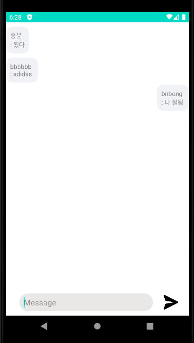

# Awesome Chatting App

## 개요

Awesome Chatting App은 별도 회원가입 없이 닉네임만 입력하면 바로 익명 채팅방에 들어갈 수 있도록 만든
모바일 채팅 앱입니다. 오픈소스 SW 수업 팀 프로젝트로 진행했습니다.

### 저장소

<https://github.com/bnbong/Awesome_ChattingApp>

### 팀원

- 백엔드 개발 : [JJongmen](https://github.com/JJongmen/JJongmen.github.io)
- DB 및 이슈 관리 : [namHG](https://github.com/namHG/namHG.github.io)
- 프론트엔드 개발 : [GoodTY](https://github.com/GoodTY/GoodTY.github.io)
- 프로젝트 디렉팅 및 문서화 : [bnbong](https://github.com/bnbong/bnbong.github.io)

## 왜 Firebase였는가

이 프로젝트는 로그인 체계나 서버 인프라를 직접 만드는 데 목표를 두지 않았습니다.
수업 과제 범위 안에서 실시간 채팅 경험을 빠르게 구현하고 싶었고, 그래서 자체 서버보다
Firebase Realtime Database가 훨씬 적합했습니다.

- 실시간 데이터 동기화를 빠르게 붙일 수 있습니다.
- 별도 백엔드 구축 없이 메시지 입출력 흐름을 확인할 수 있습니다.
- 팀 프로젝트 일정 안에서 UI/기능 검증에 집중할 수 있습니다.

기술을 고를 때는 장기 운영보다 구현 속도와 실시간성 검증을 먼저 봤습니다.

## 구현 포인트

- 닉네임만 입력해 즉시 채팅방 입장
- 본인 메시지와 타인 메시지를 구분해 읽기 쉽게 렌더링
- 단순한 화면 구성으로 핵심 대화 흐름에 집중

서비스 목표가 명확했던 만큼 기능을 늘리기보다 진입 장벽을 줄이고 실시간 대화 경험을 살리는 데
무게를 뒀습니다.

## 제가 맡은 역할

- 프로젝트 설계 및 방향 정리
- 스프린트와 이슈 관리
- 테스트 코드 작성
- 문서화

## 배운 점

- 모바일 팀 프로젝트에서는 모든 기능을 직접 구현하기보다 문제에 맞는 백엔드 서비스를 고를 줄 아는 판단이 더 중요했습니다.
- Firebase 같은 BaaS가 그냥 쉬운 도구가 아니라 짧은 기간의 프로토타이핑에 꽤 강력한 선택지라는 걸 체감했습니다.
- 작은 프로젝트라도 문서화와 역할 분리가 있으면 협업 품질이 눈에 띄게 좋아집니다.
