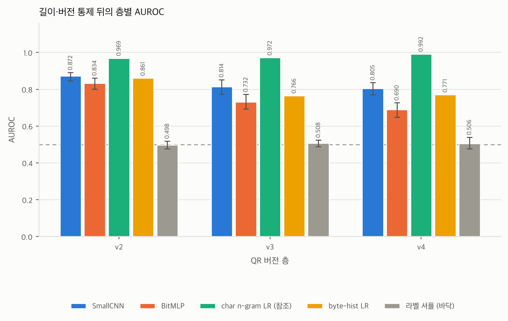
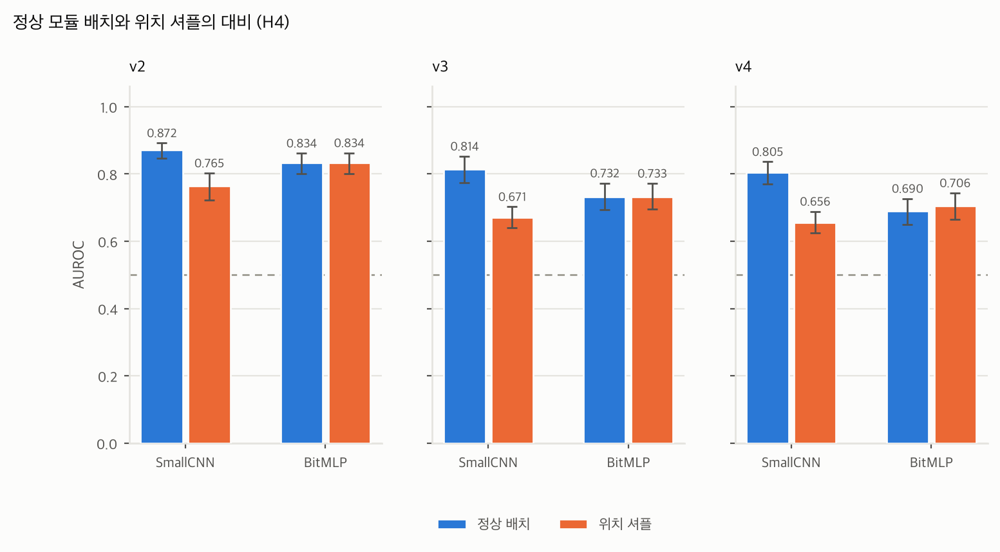

# CNN-QR-phishing-detector

## 개요

!!! tip "아이템 한줄 설명"
    QR 코드 무늬만 보고 피싱 사이트를 알아챌 수 있는지 통제 실험으로 검증하는 연구 프로젝트

QR 코드는 입력 문자열을 그대로 보존합니다. 그렇다면 작은 CNN이 URL을 명시적으로 디코딩하지 않고도 그 정보를 학습할까요? 이 프로젝트는 QR의 흑백 모듈 격자만 입력으로 주고 피싱 URL을 분류할 수 있는지, 그리고 그 성능을 "피싱에 고유한 패턴"으로 해석해도 되는지를 따로 떼어 평가한 실험입니다.

### 저장소

- 연구 저장소 : <https://github.com/bnbong/CNN-QR-phishing-detector>
- 질문의 출발점이 된 캡스톤 : [Phishing QR detector](qr-phishing-detector.md)
- 같은 뿌리에서 갈라진 서비스형 프로젝트 : [Wegis](wegis.md)

## 문제 정의

질문은 캡스톤 프로젝트 Qshing Detector를 만들던 중에 떠올랐습니다. 피싱 사이트로 연결되는 QR 코드에 공통된 시각 패턴이 있을까 하는 궁금증이었습니다. 2025년 1월부터 2월까지 1차 실험을 돌렸습니다. 그러나 당시 제 AI 역량은 기초 수준이었고 GPT-4의 도움에 크게 의존한 미흡한 실험에 그쳤습니다.

문제는 실험이 미흡했다는 데서 끝나지 않았습니다. SSAFY에서 AI를 폭넓게 학습하며 CNN이 어떤 구조이고 어떤 상황에 맞는 모델인지 이해한 뒤에야 1차 실험의 결함을 스스로 짚어낼 수 있었습니다.

- QR을 PNG로 굽고 리사이즈해 학습시킨 탓에 모델이 URL 어휘가 아니라 **길이 프록시**를 학습했습니다. URL이 길어지면 QR 버전이 올라가 격자가 커지고, 남는 데이터 코드워드는 `0xEC`/`0x11` 교대 패딩으로 채워집니다. 패딩이 시작되는 위치가 URL 길이를 그대로 누출하는 셈입니다.
- 데이터셋 설계 오류로 피싱 QR이 v5 이상에 몰려 있었습니다. 모델은 시각 패턴이 아니라 **QR 버전 자체**를 보고 피싱이라 판별하고 있었습니다.

정확도는 높게 나왔지만 그 원인을 설명할 수 없었습니다. 그래서 2026년 9월, 같은 질문을 처음부터 다시 설계했습니다.

## 재설계

다시 설계할 때의 목표는 성능을 올리는 게 아니라 **성능의 출처를 통제하는 것**이었습니다.

- **모듈 격자 직접 입력**: PNG 리사이즈 없이 `(2, n, n)` 비트 격자를 그대로 넣습니다. 첫 채널은 모듈 값, 둘째 채널은 기능 패턴 이외의 위치를 표시하는 마스크입니다. 마스크에는 URL 본문뿐 아니라 헤더와 패딩, 오류정정과 잔여 비트 위치도 들어갑니다.
- **버전 층화**: v2/v3/v4/v5+로 층을 나눠 층 안의 격자 크기를 고정했습니다.
- **엄격 길이 매칭**: 층 안에서 1바이트 버킷마다 두 클래스를 같은 수로 맞췄습니다. 완화 조건과 무통제 조건도 함께 돌려 길이 아티팩트의 기여분을 따로 보고합니다.
- **eTLD+1 그룹 분할**: train/val/test를 eTLD+1 단위로 갈라 data leakage를 막았습니다.
- **역매핑**: 모듈에서 비트, 코드워드, URL 바이트로 되짚어가는 경로를 구현해 Grad-CAM 질량이 URL 문자에 실리는지 패딩과 EC 영역에 실리는지 구분할 수 있게 했습니다.

주 조건은 정규화 URL, EC=L, 단일 바이트 모드, 고정 마스크입니다. 카메라 촬영에 따른 조명이나 기울기, 해상도 변화는 평가 대상에서 제외했습니다. QR 패턴 자체에 신호가 있는지만 보려 했기 때문입니다. 데이터는 WebPhish(Opara et al., 2024)의 Kaggle 배포본을 사용했고, 외부 검증에는 OpenPhish 피드와 Common Crawl × Tranco 조인으로 만든 2026년 세트를 썼습니다.

v5+ 층은 매칭 후 클래스당 266개만 남아 사전 등록한 규칙대로 폐기했습니다. 그래서 결론이 닿는 범위는 URL 길이 18~78바이트 구간입니다.

## 핵심 결과

아래 수치는 모두 v2 / v3 / v4 순서이고 지표는 AUROC입니다. 1은 완전한 순위 구분, 0.5는 무작위 수준을 뜻합니다. 1차 실험과는 지표와 평가 조건이 달라 성능을 직접 비교하지 않습니다.

<figure markdown="span">
    
    <figcaption>길이와 버전을 통제한 주 조건에서 층별 AUROC (시드 5개 평균, 95% CI)</figcaption>
</figure>

**길이와 버전을 통제하고 도메인을 분리한 뒤에도 판별력은 남았습니다.** 주 조건 SmallCNN의 AUROC는 0.872 / 0.814 / 0.805였습니다. 길이와 버전만 쓰는 LR은 0.500에 머물렀습니다. 이 두 특징만으로 CNN의 성능을 설명할 수는 없습니다.

<figure markdown="span">
    
    <figcaption>모델과 배치(정상 / 위치 셔플)를 교차한 2×2 대비로, CNN에서만 성능이 크게 떨어집니다</figcaption>
</figure>

**원래 QR 배치는 CNN 학습에 도움이 됩니다.** 모든 표본에 동일한 고정 위치 순열을 적용해 재학습하면 CNN은 0.765 / 0.671 / 0.656으로 내려갔습니다. 반면 위치 정보를 쓸 수 있는 대조 모델 BitMLP는 거의 흔들리지 않았습니다. 정보가 보존되어도 배치가 달라지면 CNN이 분류 규칙을 학습하는 난이도도 달라집니다.

**특정 국소 패턴의 특별한 중요성은 일관되게 확인하지 못했습니다.** 피싱 motif를 겨냥한 비트 개입이 위치와 밀도를 맞춘 무작위 개입보다 AUROC를 추가로 낮춘다는 근거는 부족했습니다. 다만 일부 비교에서는 차이가 나타났으므로 모든 국소 패턴이 중요하지 않다고 단정할 수도 없습니다.

**표현에서 URL 속성을 일부 예측할 수 있지만 얻은 이득은 제한적입니다.** 선형 프로브에서 접근성 기준을 통과한 목표는 26/91, 13/114, 1/104였고, 미학습 CNN과 비교한 학습 이득 기준까지 통과한 목표는 v2의 경로 유무와 깊이뿐이었습니다. 프로브는 내부 표현에서 URL 속성을 예측할 수 있는지만 검사합니다. 모델이 그 정보를 실제 판단에 쓰는지는 확인하지 않았습니다.

<figure markdown="span">
    
    <figcaption>외부 세트 전이 결과로, 매칭 조건별 CNN AUROC와 텍스트, 바이트, 경로 기준선을 함께 표시했습니다</figcaption>
</figure>

**외부 데이터에서도 판별력은 일부 남지만 일반화 성능은 제한적입니다.** 길이와 경로 유무를 함께 맞춘 외부 평가에서 AUROC는 0.649 / 0.639 / 0.677로 순열 대조 기준값보다는 높았습니다. 그러나 내부 성능보다 낮았고 문자 n-gram LR에도 못 미쳤습니다.

도메인뿐 아니라 URL 템플릿까지 분리한 캠페인 홀드아웃에서도 판별력은 남았습니다(Model B의 AUROC 0.851 / 0.774 / 0.828). 다만 주 실험과 평가 집합이 다르므로 이 수치를 모든 통제를 누적한 최종 성능으로 읽어서는 안 됩니다.

## 해석 범위

!!! warning "결론을 어디까지 말할 수 있는가"
    실험 조건 안에서는 QR 무늬만으로 피싱 URL을 어느 정도 구분할 수 있었습니다. 그러나 모든 피싱 QR에 공통된 고유 패턴을 찾았다거나, 실제 환경에서도 안정적으로 탐지할 수 있다고 결론 내릴 근거는 부족합니다.

- QR 모듈 배치에 학습 가능한 판별 신호는 있었지만 모든 피싱 QR에 통용되는 고유 패턴은 입증하지 못했습니다.
- 프로브 목표에는 어휘와 구조가 섞여 있습니다. 통과 수는 복원한 문자 수도, 실제 판단에 쓰인 정보량도 아닙니다. 층별 목표 집합과 표본 수도 달라 정보량을 직접 비교할 수 없습니다.
- 내부 학습 출처는 WebPhish 하나입니다. 외부 데이터도 같은 방향의 경로 편향을 공유하므로 외부 평가만으로 출처 편향이 사라졌다고 보기는 어렵습니다.
- URL 전체 소문자화와 말미 `/` 제거는 경로나 쿼리의 의미를 바꿀 수 있습니다. 결론은 이 전처리를 거친 합성 QR에 한정됩니다.

## 현재 상태

결과 정리와 논문 초안 작성을 마친 뒤 지도교수님께 검토를 요청했습니다. 2026년 9월 13일 회신을 받고 두 개의 축으로 실험 수정 계획을 세웠습니다. 핵심 질문은 "통제 후 남는 QR 판별 신호가 무엇이며, 실제 공격에 사용된 QR에서도 그 신호가 유지되는가"로 구체화했습니다.

**축 A - 실제 피싱에 사용된 QR 확보 및 평가.** 공격 메일과 첨부파일, 신고 자료에 실제 포함된 QR 이미지를 목표로 합니다. OpenPhish URL을 새로 QR로 만드는 것은 기존 외부 검증의 확장일 뿐 공격 원본 확보가 아니기 때문입니다. 평가는 두 단계로 나눕니다. 실제 QR에서 읽은 URL을 기존 전처리로 재생성해 넣는 단계, 그리고 원본 QR의 모듈 격자를 복원해 넣는 단계입니다. 정상 QR도 가능한 한 같은 매체와 기간, 같은 수집 경로에서 확보해야 이미지 출처를 분류하는 함정을 피할 수 있습니다.

**축 B - 남은 신호의 구체적 분석.** 분석 단위를 국소 motif에서 URL 구간과 구조 수준으로 올립니다. 기존 예측과 프로브 결과를 재사용해 경로 유무와 깊이, 숫자와 구분자 비율 같은 후보 속성을 모델 점수와 연결합니다. 그리고 도메인과 경로, 쿼리 구간으로 제한한 개입을 동결 모델에 적용해 의존성을 확인합니다. 같은 URL과 버전, EC, 모드를 유지한 상태에서 마스크만 0~7로 바꿔 예측이 얼마나 흔들리는지도 측정합니다.

!!! note "실행 전 제안 단계"
    이 수정 계획은 아직 **실행 전 제안**입니다. 일정도 임시로 잡아둔 것이라 실제 투입 가능 시간과 데이터 접근 가능성에 따라 달라집니다. 기존 결과와 논문은 기준선으로 보존합니다.

## 역할

- 실험 설계와 사전 등록 규칙 작성
- QR 생성, 역매핑, 층화 샘플링을 담당하는 데이터 파이프라인 구현
- SmallCNN, BitMLP, 기준선 모델 학습 및 평가(Colab T4, 시드 5개)
- 절제 실험, motif 분석, 선형 프로브, 외부 전이 평가
- 결과 보고서와 논문 초안 작성, 교수님 회신 기반 수정 계획 수립

## 배운 점

- 높은 정확도보다 **그 정확도의 출처를 설명할 수 있는지**가 먼저였습니다. 1차 실험의 87%대 수치는 상당 부분 URL 정규화 여부에서 왔습니다. 통제를 걸자 다른 그림이 나왔습니다.
- 대조군 설계가 실험의 절반이었습니다. 고정 위치 순열 뒤에도 표현력이 유지되는 BitMLP를 함께 둔 덕분에 CNN의 성능 하락을 정보 손실만으로 설명할 수 없다는 근거를 만들 수 있었습니다.
- 음성 결과도 결과입니다. 표적 개입이 무작위 대조보다 낫지 않았다는 사실을 신호 부재로 과장하지도, 숨기지도 않고 쓰는 연습을 했습니다.
- 결과를 본 뒤에 세운 가설은 탐색적이라고 명시해야 합니다. 사전 등록과 사후 탐색을 문서에서 갈라두는 습관이 논문 초안 단계에서 크게 도움이 됐습니다.
