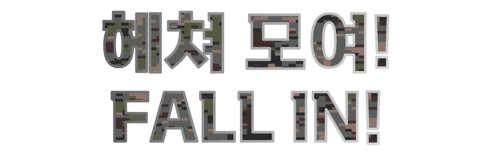

# 헤쳐 모여! (Fall In!)

## 개요

<figure markdown="span">
    
    <figcaption>프로젝트 로고</figcaption>
</figure>

<figure markdown="span">
    
    <figcaption>프로젝트 타이틀</figcaption>
</figure>

!!! tip "아이템 한줄 설명"
    보드게임 6 Nimmt!를 대한민국 공군 세계관으로 재해석한 전략 카드 게임

헤쳐 모여!는 원작 보드게임 6 Nimmt!의 핵심 긴장감은 그대로 두고,
무대만 대한민국 공군 ORI(작전준비태세) 세계관으로 옮긴 전략 카드 게임입니다.
Python과 Pygame-CE로 개발 중이고, 데스크톱 배포를 목표로 합니다.

### 저장소

<https://github.com/bnbong/Fall-In>

<figure markdown="span">
    
    <figcaption>현재 개발 중인 인게임 화면</figcaption>
</figure>

## 기획 의도

이 프로젝트의 출발점은 단순했습니다. 25년 12월 경 친구들이랑 보드게임카페에서 6 Nimmt! 게임을 접했는데, 처음 해보는 게임임에도 규칙이 간단하고 재미 있어서 이를 온라인 게임으로 만들어보고 싶다는 욕구가 생겼습니다.

그래서 같은 규칙으로 게임 개발을 시작했고, 스토리와 게임 테마를 고민하다가 카드를 4열로 배치하는 과정이 마치 군대가 헤쳐 모이는 모습과 유사한 점에 착안하여 제가 복무했던 대한민국 공군 배경과 섞어봤습니다.

## 왜 Pygame-CE를 선택했는가

이 프로젝트는 화려한 3D나 엔진 의존성이 중요한 게임이 아니라,
규칙 엔진과 상태 전환이 명확한 2D 전략 게임입니다. 그래서 무거운 엔진보다
게임 루프와 렌더링을 직접 제어하는 Pygame-CE가 더 잘 맞았습니다.

Pygame-CE를 택한 이유는 이렇습니다.

- 룰 구현과 화면 연출을 빠르게 연결하기 쉽습니다.
- Python 기반 테스트 코드와 규칙 엔진 분리가 자연스럽습니다.
- 1인 개발 범위에서 빌드 파이프라인까지 직접 통제하기 쉽습니다.
- 게임 개발은 처음이기 때문에 Claude-Code 및 Codex 등의 도구를 적극 활용했습니다. 이들은 Python 코드 생성에 강점이 있었기 때문에 저에게도 익숙한 언어인 Python을 쓰는 게 효율적이었습니다.

## 핵심 설계

### 룰 엔진 분리

게임 상태와 렌더링을 강하게 결합해 버리면 테스트가 어려워집니다. 그래서

- 카드 덱/편성/페널티 계산을 담당하는 규칙 엔진
- 입력과 상태 전환을 담당하는 게임 흐름
- 실제 렌더링을 담당하는 화면 계층

을 가능한 한 분리해 설계하고 있습니다. 덕분에 Pygame을 띄우지 않고도 핵심 규칙을 `pytest`로 검증할 수 있습니다.

### 디지털화 전략

원작 규칙을 그대로 옮기기보다, 디지털 게임에서만 가능한 요소를 일부 추가했습니다.

- 자동 정산
- 턴 단위 시각적 피드백
- AI 상대와의 템포 조절

다만 룰 자체의 핵심 손익 구조는 유지해서, 원작의 의사결정 감각이 무너지지 않도록 신경 썼습니다.

### AI 상대

초기 버전은 휴리스틱 기반 AI로 시작했습니다. 빠르게 플레이 루프를 검증하고,
사람이 실제로 "재미있는 상대"인지 확인하려는 목적이었습니다.

이후 티플레이 서버 코드와 멀티플레이 기능을 추가하면서 게임 세션에 플레이어 4명 전원이 채워지지 않을 시 자동으로 AI 상대가 들어가도록 설계했습니다.

## 테스트와 배포

### 테스트

핵심 규칙 로직은 `pytest`로 검증합니다. 소규모 프로젝트이지만 테스트를 붙인 이유는,
규칙이 조금만 복잡해져도 UI로만 검증하는 비용이 급격히 올라가기 때문입니다.

### 배포

Windows, macOS, Linux를 모두 목표로 하고 있으며, PyInstaller와 GitHub Actions 매트릭스 빌드를
조합해 릴리스 자동화를 구성하고 있습니다. 개발이 끝난 뒤 수작업으로 패키징하지 않고,
태그를 달면 플랫폼별 바이너리가 빌드되도록 흐름을 미리 준비해 둡니다.

## 역할

- 게임 기획 및 세계관 재해석
- 규칙 엔진 구현
- Pygame-CE 기반 렌더링 및 입력 처리
- AI 로직 구현
- 테스트 코드 작성
- 배포 자동화 구성
- 아트/사운드 에셋 통합
- 멀티플레이 구현

## 현재까지의 의미

이 프로젝트는 단순히 "게임 하나 만들어 보기"를 넘어, 1인 개발로도

- 기획
- 시스템 설계
- 구현
- 테스트
- 배포

까지 닿을 수 있는지 검증하는 과정이기도 합니다.

## 배운 점

- 게임은 구현보다 릴리스 가능한 상태를 계속 유지하는 일이 더 어렵습니다.
- 룰 기반 게임은 생각보다 테스트 친화적이고, 테스트가 붙으면 설계도 같이 좋아집니다.
- 개인적인 도메인 언어를 시스템 이름에 녹이면, 기획과 구현이 더 단단하게 연결됩니다.

## 아쉬운 점

- 아트워크를 만들어본 경험이 하나도 없기 때문에 에셋 개발을 AI 도구에 매우 강하게 의존중입니다. 원하는 결과물이 나올 때 까지 AI의 결과물을 다듬는 과정이 생각보다 오래 걸리고 개인적인 일정 때문에 에셋 구현이 계속 늦어져서 게임 배포 일정이 계속 밀리고 있습니다.
