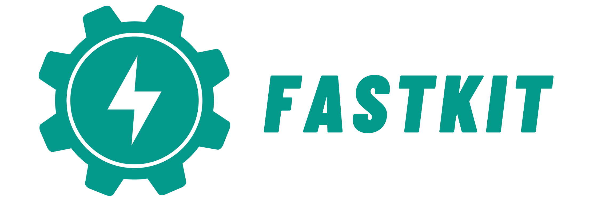

# FastAPI FastKit

## 개요

!!! tip "아이템 한줄 설명"
    FastAPI 입문자가 프로젝트 초기 구조를 빠르게 만들 수 있도록 돕는 CLI 기반 스타터 키트

FastAPI-fastkit은 FastAPI 프로젝트를 생성하고 필요한 스택을 골라 템플릿에 맞춰 코드와 설정 파일을 자동으로 만들어 주는 OSS 패키지입니다. 단순한 보일러플레이트 저장소가 아니라 CLI 경험 자체를 하나의 제품처럼 설계한 개발자 도구입니다.

### 저장소

<https://github.com/bnbong/FastAPI-fastkit>

## 왜 만들었는가

이 프로젝트는 FastAPI 생태계에서 반복적으로 마주친 문제에서 출발했습니다.

- 입문자는 FastAPI 자체보다 프로젝트 초기 세팅에서 먼저 막힙니다.
- `main.py` 하나로 시작하는 건 쉽지만, 막상 개발을 진행하려면 환경 변수, 테스트, Docker, DB 설정이 금방 필요해집니다.
- 템플릿 저장소를 직접 복제하는 방식은 유연성이 떨어지고, 패키지 매니저나 옵션 조합을 반영하기도 어렵습니다.

그래서 이 문제를 단순한 예제 저장소가 아니라 `django-admin`이나 Spring Initializr처럼 시작점을 만들어 주는 도구로 풀고 싶었습니다.

## 설계 방향

FastAPI-fastkit은 "프로젝트 생성기"이면서 동시에 "입문자용 가이드" 역할도 합니다.
그래서 설계할 때 다음 기준을 중요하게 봤습니다.

- 가장 간단하고 직관적인 인터페이스인 CLI만으로 프로젝트 생성 흐름을 끝낼 수 있어야 합니다.
- 생성된 결과물이 예제 코드가 아니라 실제 개발 시작점으로 쓸 만해야 합니다.
- 데이터베이스, 인증, 배포, 테스트처럼 자주 필요한 기능을 조합식으로 선택할 수 있어야 합니다.
- 초보 사용자도 출력만 보고 다음 행동을 이해할 수 있어야 합니다.

## 핵심 기능

2026년 기준 FastAPI-fastkit은 다음 기능을 제공합니다.

- `fastkit init` : 새 FastAPI 프로젝트 초기 생성
- `fastkit init --interactive` : DB, 인증, 캐시, 모니터링, 테스트, 배포 옵션을 대화형으로 선택
- `fastkit startdemo` : 사전 정의된 템플릿으로 프로젝트 생성
- `fastkit addroute` : 라우트 추가
- `fastkit runserver` : 개발 서버 실행
- `fastkit list-templates` : 사용 가능한 템플릿 조회

단순히 디렉터리를 복사하는 게 아니라 선택한 조합에 맞는 코드와 설정을 생성한다는 점이 핵심입니다.

## 기술 선택 이유

### `click`

CLI 인터페이스를 빠르게 구성하면서도 명령 구조를 명확하게 유지하기 위해 `click`을 택했습니다.
Python 사용자에게 익숙하고, 명령 계층을 깔끔하게 나누기 좋았습니다.

### `rich`

개발자 도구는 기능만큼 피드백 경험도 중요합니다. 생성 중인 작업, 에러, 다음 단계 안내가 잘 보이도록 터미널 출력을 꾸미기 위해 `rich`를 사용했습니다. 특히 입문자용 도구에서는 무슨 일이 일어나는지 설명해 주는 출력 자체가 UX의 일부라고 봤습니다.

### 템플릿 기반 구조

FastAPI 프로젝트는 팀마다 스타일이 다릅니다. 그래서 하나의 정답 구조를 강제하기보다,
여러 템플릿과 기능 조합을 지원하는 방향이 더 적합했습니다.

Github에서 확인 가능한 최대한 다양한 FastAPI 프로젝트들을 참고하여 FastAPI 구조의 best practice를 도출하여 템플릿에 녹였습니다.

### 다중 패키지 매니저 지원

현실적으로 Python 사용자는 `pip`, `uv`, `pdm`, `poetry`를 혼용합니다. 특정 툴 하나를 정답처럼 강제하기보다, 사용자의 선호를 반영하는 쪽이 도구로서 설득력 있다고 판단했습니다.

## 구현 포인트

### 대화형 빌더

`--interactive` 모드는 단순 옵션 질문기가 아닌 사용자가 선택한 항목에 따라

- `main.py`
- 인증 설정
- 데이터베이스 설정
- Docker 관련 파일
- 테스트 구성

이 함께 생성되도록 만들었습니다. 기능 선택이 곧바로 코드 생성으로 이어지는 구조입니다.

### 템플릿 품질 보증

템플릿 프로젝트의 가장 큰 문제는 시간이 지나면 금방 깨진다는 점입니다. 이를 막기 위해 주기적인 자동 테스트 흐름을 GitHub Actions 워크플로우로 두어 템플릿이 계속 동작하도록 관리하고 있습니다.

### 문서와 튜토리얼

패키지 하나 배포하는 것으로 끝내지 않았습니다. Quick Start, Tutorial, CLI Reference, Template QA 문서를 함께 운영하는 이유는 이 도구가 겨냥하는 사용자가 입문자이기 때문입니다.

## 왜 업스트림 기여 대신 독립 프로젝트였는가

초기에는 FastAPI CLI 관련 논의를 따라가며 기존 생태계 안에서 기여할 부분을 찾아봤습니다. 그런데 내가 풀고 싶었던 문제는 FastAPI 프레임워크 내부 CLI가 아니라 FastAPI 입문자의 시작 경험이었습니다.

그래서 FastAPI FastKit은 특정 프로젝트의 부가 기능이 아니라, 별도의 철학을 가진 개발자 도구로 분리해 운영하는 쪽이 맞다고 판단했습니다.

## 역할

- CLI 명령 구조 설계
- 템플릿 시스템 구현
- 생성 코드 및 설정 파일 구조 설계
- 문서 사이트 구성
- 오픈소스 배포 및 릴리스 관리

## 현재 상태와 방향

- PyPI 배포형 패키지로 운영 중
- 다양한 스택 조합을 지원하는 대화형 빌더 확장 중
- 템플릿 품질 검증과 문서 보강을 지속 진행 중

## 배운 점

- 템플릿 프로젝트는 한 번 만드는 것보다 시간이 지나도 계속 동작하게 유지하는 일이 더 중요합니다.
- FastAPI 생태계에서 필요한 건 프레임워크 자체만이 아니라 좋은 시작 경험이라는 점을 다시 확인했습니다.
