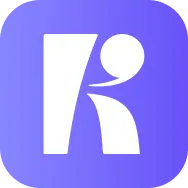
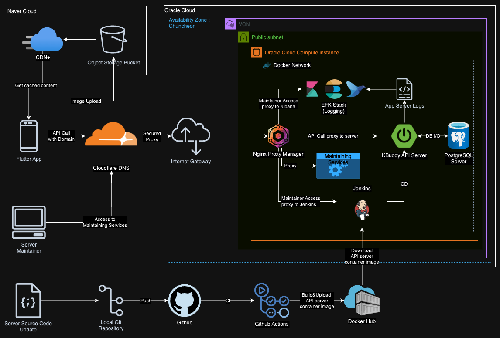
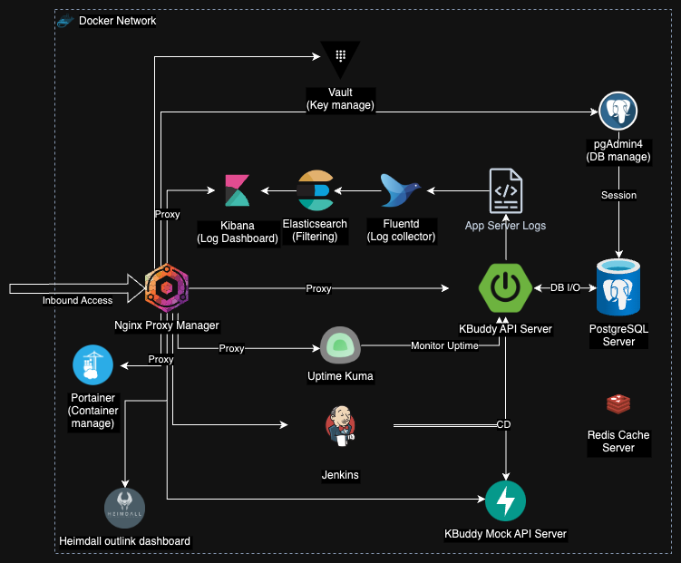
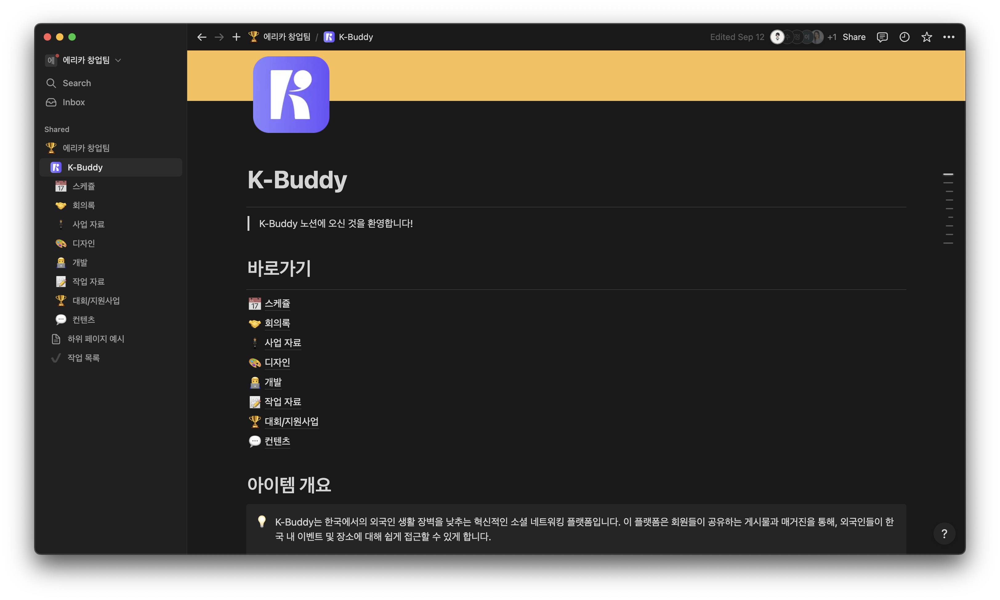

# K-Buddy

## 개요

!!! tip "아이템 한줄 설명"
    방한 외국인의 한국 생활 정보 비대칭을 줄이기 위한 로컬 경험 플랫폼

K-Buddy는 한국을 방문하거나 체류하는 외국인이 겪는 정보 비대칭 문제를 해결하려고 기획된 창업팀 프로젝트입니다. 단순 관광 정보 제공에서 그치는 게 아니라, **한국 생활 정보, 커뮤니티, 멘토링까지 이어지는 플랫폼 구조**를 목표로 삼았습니다.

### 저장소

- Server : <https://github.com/KBuddy-devs/KBuddy-Server>
- Mocking Server : <https://github.com/KBuddy-devs/KBudddy-MockAPI>

## 해결하려던 문제

초기 기획 단계에서 본 문제는 다음과 같았습니다.

- 외국인이 한국 생활에 필요한 정보를 얻기 어렵습니다.
- 지도 서비스만으로는 "현지에서 실제로 도움이 되는 맥락 정보"를 얻기 어렵습니다.
- 언어 장벽 때문에 커뮤니티형 정보 교환 비용이 높습니다.

그래서 K-Buddy는 장소 정보 자체보다도, **커뮤니티와 신뢰 가능한 생활 정보를 연결하는 쪽**을 더 중요하게 봤습니다.

## 맡은 역할

창업팀 초기 멤버로 참여해 다음 업무를 담당했습니다.

- 백엔드 API 개발
- 클라우드 아키텍처 설계 및 구축
- Docker 기반 배포 환경 정리
- 모바일 팀 병렬 개발을 위한 Mock API 서버 구축
- Confluence/Notion 기반 운영 문서화 및 Slack/Discord 등 협업 도구 구성

## 백엔드 설계

K-Buddy 메인 서버는 Spring Boot 기반으로 구성했습니다.

- Spring Boot
- Spring Security
- Spring Data JPA
- QueryDSL
- PostgreSQL
- Redis

### 왜 Spring Boot를 택했는가

서비스가 커뮤니티, 인증, 북마크, 멘토링처럼 비교적 전형적인 비즈니스 도메인을 가지고 있었기 때문에 검증된 웹 백엔드 생태계가 필요했습니다. Spring Boot는 인증/인가, ORM, API 문서화, 팀 협업 측면에서 모두 안정적이었습니다.

### 왜 QueryDSL을 함께 사용했는가

장소/게시글/사용자 조건 검색이 섞이는 구조였기 때문에, 복잡한 조회가 늘어날 것이 어느 정도 예상됐습니다. 문자열 기반 JPQL보다 타입 안전성을 확보하고 싶어서 QueryDSL을 선택했습니다.

### 인증 처리

Google, Kakao 기반 소셜 로그인을 지원했고, refresh token 저장소로 Redis를 고려했습니다. 이 구조는 인증 상태를 DB 테이블만으로 처리하기보다 만료와 재발급 흐름을 더 빠르게 다루려고 선택했습니다.

## Mocking Server를 따로 둔 이유

모바일 앱 팀과 백엔드 팀이 동시에 움직이는 상황에서, 메인 API가 완전히 안정화될 때까지 기다리면 프론트 개발이 멈춰 버립니다. 그래서 별도 FastAPI 기반 Mocking Server를 두고,

- 모바일 화면 개발을 먼저 진행할 수 있게 하고
- 실제 API 스펙 변경이 잦은 초기에 통신 계약을 먼저 맞추고
- 메인 서버 개발 속도와 모바일 개발 속도를 분리

하는 방향으로 운영했습니다. 이 결정 덕분에 백엔드 준비 전까지 프론트가 막히는 상황을 많이 줄일 수 있었습니다.

## 인프라 설계

Oracle Cloud를 중심으로 컨테이너 기반 인프라를 구성했고, 서비스와 데이터 저장소를 분리해 운영했습니다.

<figure markdown="span">
    
    <figcaption>초기 클라우드 아키텍처 구조도</figcaption>
</figure>

<figure markdown="span">
    
    <figcaption>서비스 컨테이너 구조도</figcaption>
</figure>

### 왜 OCI + Docker 조합이었는가

- 창업팀 단계에서 비용을 통제해야 했습니다.
- 서버 구성 변경이 잦아, VM에 직접 수작업 배포하는 방식은 비효율적이었습니다.
- 모니터링과 애플리케이션을 분리한 뒤에도 환경 일관성을 유지하고 싶었습니다.

Docker를 도입한 건 배포가 편해진다는 점도 있었지만, **개발 환경과 운영 환경의 차이를 줄이려는** 목적이 더 컸습니다.

## 운영 및 협업 문서화

K-Buddy에서 의외로 중요했던 부분은 문서화였습니다.

- Confluence에 관리자 도구 사용법, API 문서, 운영 가이드 작성
- Notion에 기획/개발 협업 문서 정리
- 코드 컨벤션과 협업 절차 문서화

창업팀 프로젝트는 팀원이 바뀌거나 역할이 넓게 섞이는 경우가 많습니다. 문서가 없으면 개발 속도보다 온보딩 비용이 더 커집니다. K-Buddy에서는 이 부분을 초기에 정리해 둔 것이 실제 협업에 크게 도움이 됐습니다.

<figure markdown="span">
    
    <figcaption>협업 문서 정리에 사용한 Notion</figcaption>
</figure>

## 역할 정리

- Spring Boot 기반 백엔드 개발
- FastAPI 기반 Mock API 서버 구축
- OCI + Docker 기반 인프라 설계/구축
- 테스트 코드 및 배포 자동화 정리
- 운영 문서/관리자 문서 작성

## 배운 점

- **서비스 초기에는 기술보다 병렬 개발 구조가 더 중요할 때가 있습니다**. Mock API 서버 분리는 실제로 팀 생산성을 눈에 띄게 높였습니다.
- 인증, 커뮤니티, 장소 정보처럼 서로 다른 도메인이 섞일 때는 API 설계뿐 아니라 문서화가 핵심 자산이 됩니다.
- 창업팀 프로젝트에서는 "코드를 짜는 것"만큼 **비용, 운영, 협업 도구를 함께 설계하는 능력**이 중요했습니다.
