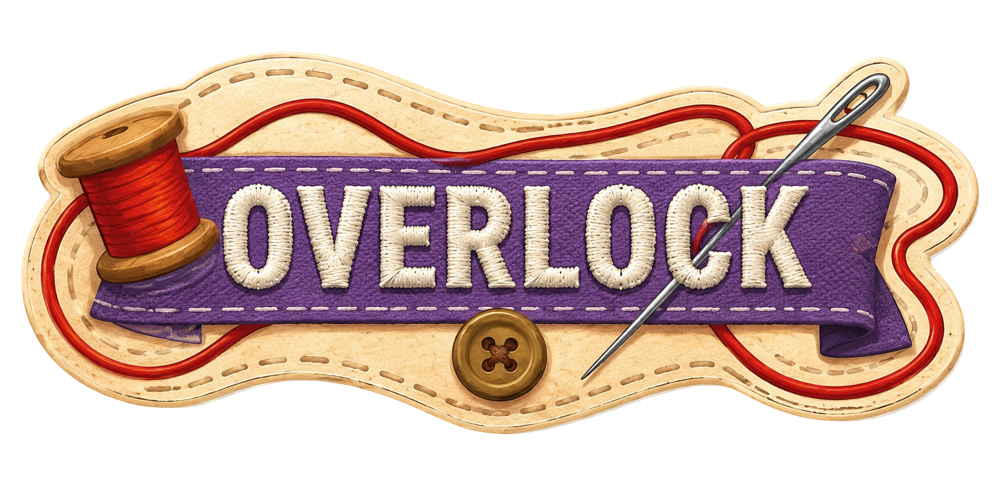
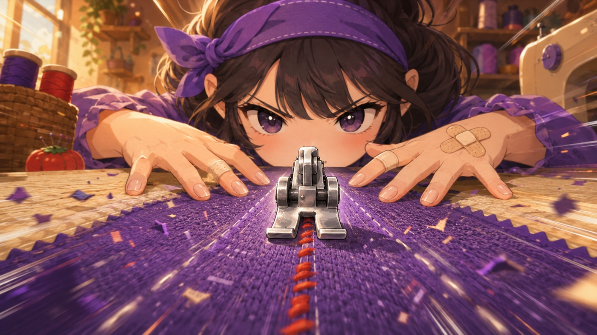
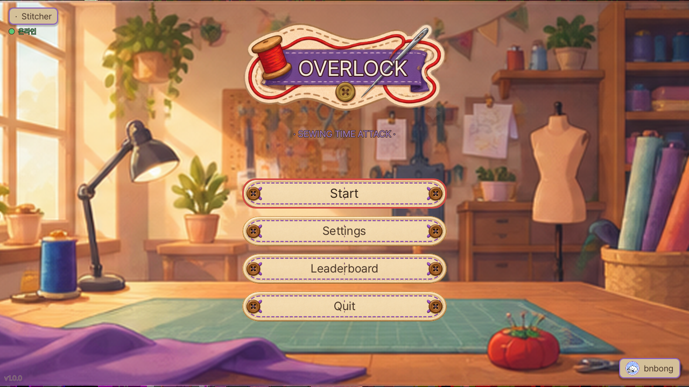
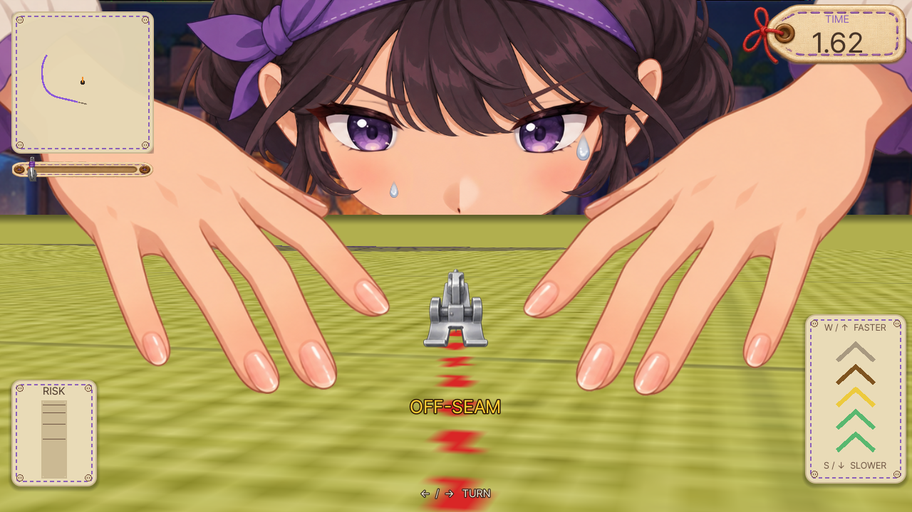
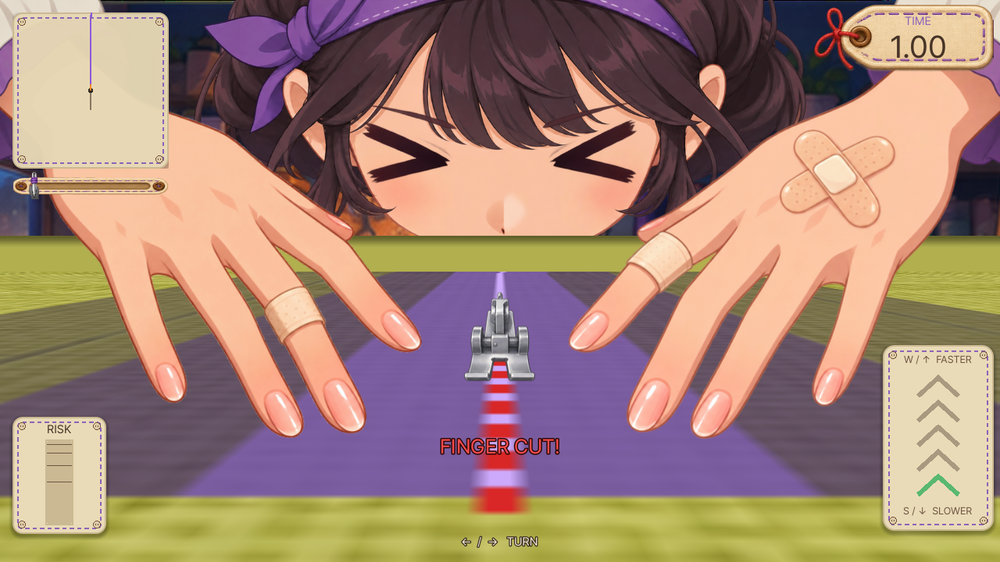
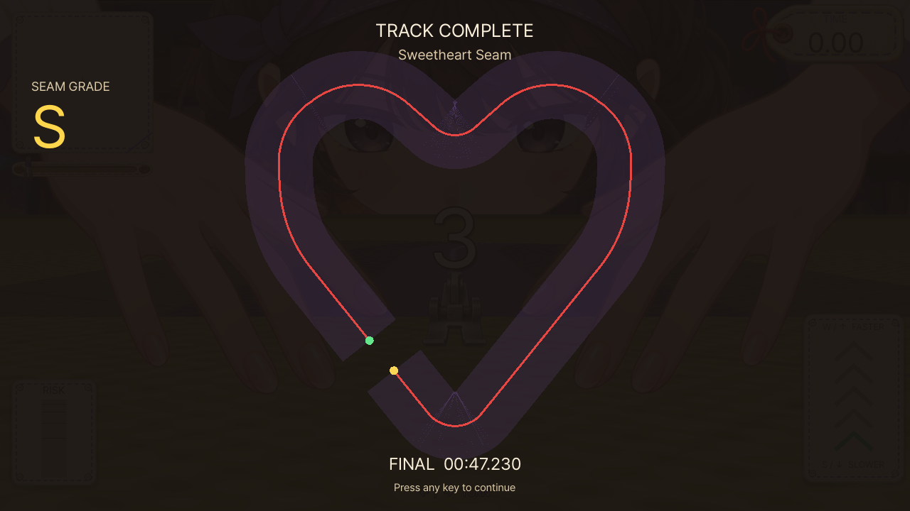
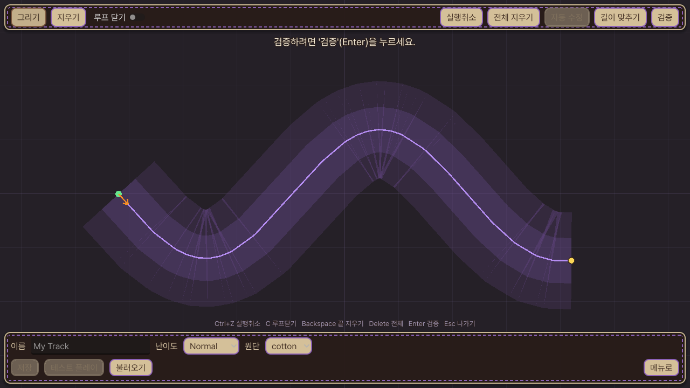
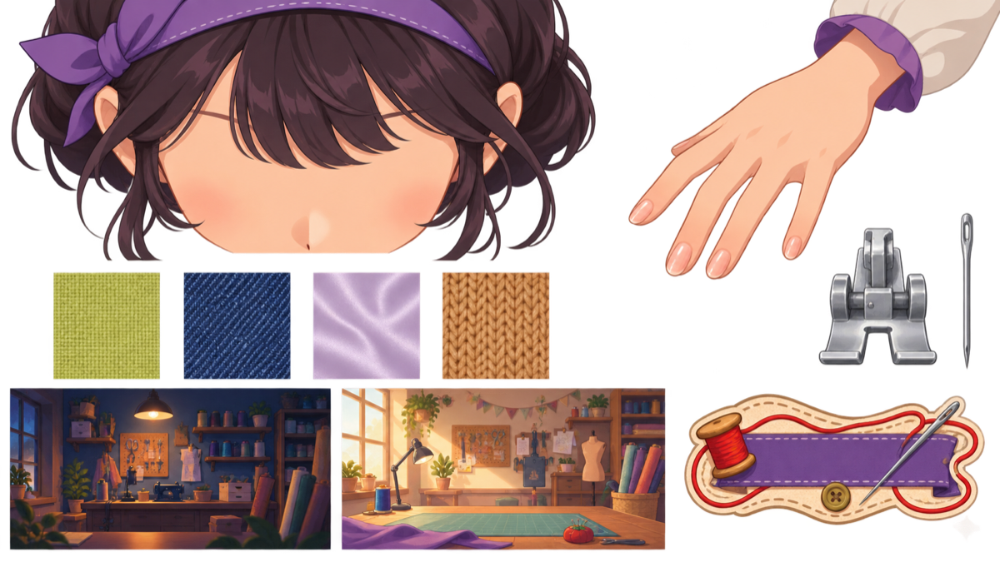
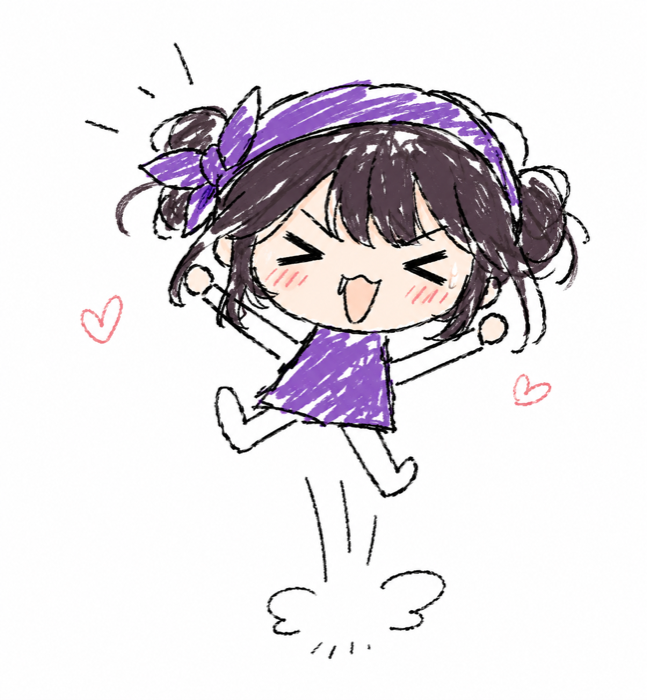
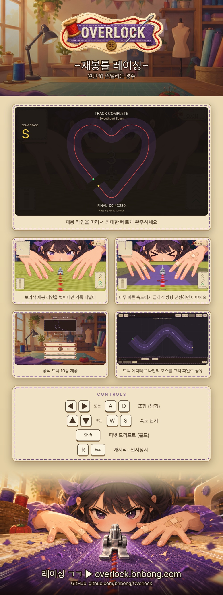

# Overlock (오버로크)

## 개요

<figure markdown="span">
    
    <figcaption>프로젝트 로고</figcaption>
</figure>

!!! tip "아이템 한줄 설명"
    원단 위에서 벌어지는 손떨리는 레이싱, 삐끗하면 아야해요

Overlock(오버로크)은 재봉틀 노루발을 레이싱 머신처럼 몰아 원단 위 재봉선을 정확히 박는
무료 웹 타임어택 게임입니다. 브라우저에서 바로 실행됩니다.

Godot 4.6.1로 만든 게임 클라이언트와 FastAPI로 만든 리더보드 서버를 붙여 1인으로 개발했습니다. 8월 23일에 v1.0.0을 릴리즈했습니다.

### 플레이

<https://overlock.bnbong.com>

데스크톱 브라우저를 권장합니다.

### 저장소

<https://github.com/bnbong/Overlock>

게임 기획서: [저장소 Wiki](https://github.com/bnbong/Overlock/wiki/Overlock-%EA%B2%8C%EC%9E%84-%EA%B8%B0%ED%9A%8D%EC%84%9C)

<figure markdown="span">
    
    <figcaption>노루발 시점 히어로 아트</figcaption>
</figure>

!!! note "고지"
    이 프로젝트는 『용과 같이 극 3』의 재봉 미니게임을 오마주한 비공식 팬 프로젝트입니다.
    ⓒ SEGA 및 『용과 같이』 시리즈와는 무관하며 게임에 들어간 에셋은 전부 오리지널 제작입니다(일부 AI 생성).
    라이선스는 MIT입니다.

## 기획

인터넷 서칭을 하다가 『용과 같이 극 3』의 재봉 미니게임을 발견했는데 그 구도의 아이디어가 너무 재미있어서 이걸 별도의 게임으로 풀어내고 싶었습니다.

용과 같이 게임 시리즈를 한 번도 플레이해본적이 없고 장르 느낌만 인지한 상태에서 바로 기획안을 작성하기 시작했고 타임어택 레이싱 게임 장르로 확정한 후 최종적으로 게임 프로젝트 이름을 재봉 용어인 Overlock(오버로크, 군필자라면 익숙한 그거..)으로 정했습니다.

이전에 진행했던 게임 프로젝트인 '헤쳐 모여! (Fall-In)' 프로젝트의 최종 완성을 앞두고 가졌던 오랜 고민은, 개발자인 내가 플레이해봐도 게임이 너무 단조롭고 재미가 없었다는 것이었습니다. 그런 의미에서 유저의 피지컬을 요구하는 레이싱게임은 큰 재미를 줄 수 있겠다는 나름의 확신이 생겨 개발을 결정하게 되었습니다.

이 게임은 개발하던 전작과 다르게 Python이 아닌 새로운 도구인 Godot 엔진을 사용하기로 결정했는데, Pygame의 표현력의 한계와 최적화 측면에서 게임 특화용 상용 엔진을 쓰는 것이 좋겠다고 판단했습니다.

빠른 프로토타이핑의 필요성, SSAFY 활동으로 인한 가용 시간 부족 등으로 개발 과정 전반은 LLM Agent에게 상당수준 의존했습니다. 그러나 완성도를 위해 단일 Agent만 사용한 것이 아닌 판단 및 오케스트레이팅은 Claude Fable, 메인 구현은 Claude Opus 5, 테스트 및 디버깅은 Claude Sonnet, 린팅 같은 가벼운 작업은 Claude haiku에게 역할을 분담하였습니다. 코드 리뷰는 OpenAI Codex에게 위임하였고 LLM이 생산하는 코드의 단점 중 하나인 '너무 불필요하게 많은 코드베이스 생성'을 막기 위해 YAGNI 판단 및 수정까지 Codex에게 맡겼습니다. 여러 Agent끼리 협업하게 구성하여 완성도를 최대한으로 끌어올리도록 했으며 UX는 만들어진 요소를 직접 플레이해보며 고쳤고 배포 후 SSAFY 구성원들에게 피드백을 맡겼습니다.

## 게임 소개

- 전진은 자동입니다. 브레이크도 후진도 없고 속도 5단계와 좌우 조향이라는 2축만 다룹니다.
- 보라색 재봉 라인을 벗어나면 OFF-SEAM으로 기록에 페널티가 붙습니다.
- 고속에서 급하게 조향하면 리스크 미터가 차고 한계를 넘으면 손가락을 다쳐 잠시 조작을 잃습니다.
- 공식 트랙 10종. 윤곽선 서킷 5종과 F1 서킷을 참고한 고난도 5종이 섞여 있습니다.
- 트랙 에디터로 직접 코스를 그리고 JSON 파일로 주고받을 수 있습니다.
- 트랙별 온라인 리더보드 Top 100을 제공합니다.

### 조작법

| 입력 | 기능 |
|---|---|
| `←` / `A` | 왼쪽 조향 |
| `→` / `D` | 오른쪽 조향 |
| `↑` / `W` | 속도 단계 상승 |
| `↓` / `S` | 속도 단계 하락 |
| `Shift` (홀드) | 피벗 드리프트 |
| `R` | 재시작 |
| `Esc` | 일시정지 |

<figure markdown="span">
    
    <figcaption>타이틀 화면</figcaption>
</figure>

<figure markdown="span">
    
    <figcaption>주행 중 화면. 재봉선을 벗어나면 OFF-SEAM 경고가 뜹니다</figcaption>
</figure>

<figure markdown="span">
    
    <figcaption>부상이 누적되면 손에 밴드가 하나씩 늘어납니다</figcaption>
</figure>

<figure markdown="span">
    
    <figcaption>완주 후 줌아웃. 자기가 박은 재봉선의 모양과 SEAM GRADE가 공개됩니다</figcaption>
</figure>

<figure markdown="span">
    
    <figcaption>트랙 선택 화면</figcaption>
</figure>

<figure markdown="span">
    
    <figcaption>마우스로 코스를 그리는 트랙 에디터</figcaption>
</figure>

## 왜 Godot을 선택했는가

- Godot의 웹(HTML5) export로 정적 파일만 올려도 브라우저에서 바로 돌아가는 구조를 만들 수 있었습니다.
- 3D 엔진의 물리 구현은 없지만, 필드 같은 핵심 연출은 셰이더로 해결해야 했는데 Godot은 2D 노드와 셰이더를 같은 씬 안에서 섞기 편했습니다.
- 최적화 편리: GL Compatibility 렌더러를 쓰면 웹에서 요구 사양을 낮게 잡을 수 있습니다.
- 1인 개발 범위에서 엔진 빌드 파이프라인까지 직접 통제하기 쉬웠습니다.

## 핵심 설계

### 결정론적 시뮬레이션과 표현 계층의 분리

시뮬레이션은 60Hz 고정 스텝의 결정론 구조입니다. `RaceDirector`가 `_physics_process`에서 플레이어를 호출 구동하는 방식이라 플레이어 노드는 자기 물리 루프를 갖지 않습니다. 결정론을 처음부터 제약으로 박아 둔 이유는 우선 조작감 튜닝을 재현 가능하게 만들기 위해서였습니다. 리플레이 재시뮬레이션으로 나중에 기록을 검증하려면 같은 입력이 항상 같은 결과를 내야 한다는 이유도 있었습니다.

트랙 데이터는 JSON의 베지어 곡선을 De Casteljau로 샘플링해 누적 호길이 `s`를 가진 폴리라인으로 굽습니다. 매 틱 판정은 이 폴리라인에서 윈도 최근접 탐색으로 처리합니다. 전체를 훑지 않고 직전 인덱스 주변만 보기 때문에 트랙이 길어져도 비용이 늘지 않습니다.

시뮬레이션(`PlayerController`, `TrackData`, `RunStats`)과 표현 계층(`scripts/presentation/`, 셰이더)은 파일 단위로 갈라 놨습니다. 이 분리의 값어치는 연출을 통째로 갈아엎을 때 드러났습니다. 탑다운 2D 프로토타입을 노루발 시점의 유사 3D 뷰로 바꾸는 큰 작업을 하면서도 시뮬레이션 코드는 한 줄도 건드리지 않았습니다. 공통 상태는 `Tuning`, `InputSetup`, `TrackLoader`, `RecordStore`, `GameState` 오토로드가 들고 있고 여기에 `AudioManager`와 `LeaderboardClient`를 나중에 얹었습니다.

### 노루발 시점 뷰: Mode 7 원근 셰이더

MVP는 위에서 내려다보는 탑다운 2D로 만들어 조작감부터 검증했습니다. 그다음 기획 단계부터 목표였던 노루발 시점 뷰로 표현 계층을 다시 작업했습니다. 투영 방식은 세 후보를 놓고 비교했습니다.

| 후보 | 판단 |
|---|---|
| SubViewport 탑다운 소스 + 풀스크린 Mode 7 원근 셰이더 | 채택 |
| CPU에서 폴리라인을 원근 변형해 `_draw` | 원단 텍스처를 원근화하려면 결국 셰이더가 필요 |
| 실제 3D (Node3D + Camera3D) | 단순한 씬인데 3D 렌더 파이프라인 전체를 써야함 |

채택한 이유 중 가장 컸던 건 크래시 대책이었습니다. 기존 방식은 급커브에서 트랙 밴드의 오프셋 폴리곤 삼각분할이 실패하며 죽는 문제가 있었습니다. Mode 7 방식은 이미 안전하게 래스터화된 두께 폴리라인을 픽셀 단위로 워프하기 때문에 이 크래시 유형이 구조적으로 사라집니다. 그 밖에도 기존 `TrackRenderer`·`TrackData`·`MiniMap`을 그대로 재사용할 수 있고 GL Compatibility에서 비용이 싸다는 점이 좋았습니다. 스티치 트레일과 원단 텍스처를 같은 소스 레이어에 얹으면 하나의 셰이더가 일관된 원근으로 처리해 준다는 점도 좋았습니다.

카메라는 회전 0에 스무딩을 끈 translate-only로 두고 heading 회전은 프래그먼트 셰이더가 샘플 좌표에 적용합니다. 카메라를 직접 돌리면 밴드 가장자리에 서브픽셀 시머가 생기는데 회전을 셰이더로 옮기면 이 문제가 없습니다.

### 리더보드 서버

Python 3.11+ 위에 FastAPI와 SQLAlchemy 2.0을 얹어 서버를 만들었습니다. DB는 SQLite를 씁니다. `/api/health`, `/api/tracks`, 기록 제출 및 조회 엔드포인트를 만들었습니다.

기록 위조를 막는 장치는 두 겹으로 하나는 트랙 무결성 확인이며 트랙 JSON 파일의 원본 바이트를 SHA-256으로 해싱한 `"sha256:" + hex` 값을 클라이언트와 서버의 스냅샷이 같은지 확인합니다. 다른 하나는 물리 하한 필터로, 트랙 중심선 길이를 최고 속도 300px/s로 나눈 시간보다 빠른 기록은 물리적으로 불가능하므로 거부합니다.

공개 API인 만큼 DoS도 신경 썼습니다. 요청 바디에 16KB 상한을 두는 미들웨어를 넣었습니다. 닉네임은 길이를 제한하면서 위험한 유니코드를 차단하고 IP당 분당 제출 횟수에 rate limit을 걸었습니다. 리더보드 조회는 윈도 함수와 SQL `LIMIT`으로 처리해 전체를 메모리로 끌어오지 않습니다.

## 웹 배포와 삽질

배포는 GitHub Actions로 묶고 호스팅은 개인 클라우드 서버에서 서빙하고 앞단에 Cloudflare를 두었습니다(기존 BNGdrasil 인프라). 여기까진 무난했는데 배포 후 유저 검증 과정에서 문제가 발생했습니다.

**gzip 이중 해제.** 라이브 직후 특정 트랙의 리더보드만 "연결 실패"가 떴습니다. 작은 응답은 멀쩡한데 큰 응답만 죽는 패턴이라 원인을 찾기까지 오래 걸렸습니다. 범인은 Cloudflare의 압축 방식 선택이었습니다. 큰 응답에는 gzip을, 작은 응답에는 zstd를 골라 압축하는데 브라우저는 gzip을 해제한 평문을 넘기면서도 `Content-Encoding` 헤더를 그대로 노출합니다. Godot `HTTPRequest`는 `accept_gzip`이 기본 true라 이 평문을 한 번 더 해제하려다 `RESULT_BODY_DECOMPRESS_FAILED`로 실패했습니다. zstd는 Godot이 재해제하지 않으니 작은 응답만 살아 있었습니다. 웹 빌드에서 `accept_gzip = false`로 껐습니다.

**웹 오디오 완전 무음.** 데스크톱에서 잘 나오던 소리가 웹에서는 하나도 안 났습니다. Godot 웹의 기본 재생 타입인 Sample이 런타임에 만든 커스텀 오디오 버스를 통과하지 못하는 문제였습니다. 플레이어에 웹 한정으로 `PLAYBACK_TYPE_STREAM`을 강제해 해결했습니다.

**캐시 퍼지.** Godot 웹 export의 산출물 파일명은 고정입니다. 해시가 붙지 않으니 재배포해도 브라우저와 CDN이 옛 파일을 그대로 들고 있습니다. 배포 워크플로에 Cloudflare 캐시 퍼지를 넣어 두는 것으로 정리했습니다.

## 유저 테스트와 v1.0.1

어렸을 때부터 여러 재미 없는 게임을 접할때마다, "아니 이 게임을 만드는 개발자들은 자기 게임도 안해보고 출시하나?" 라는 의문이 들었는데 직접 게임을 만들어보니 내가 만드는 게임에 익숙해져서 불편함을 어느순간부터 감수하며 판단하고 있었습니다. 때문에 다른 사람의 피드백이 절실하다고 판단하여 릴리즈 직후 SSAFY 동기 1,000명 가까이 있는 채팅방에 플레이를 부탁하고 피드백 설문을 받아, 8월 25일 v1.0.1에 반영했습니다.

**"조향이 너무 민감하다."** 가장 많이 나온 의견이었습니다. 여기서 고민이 있었습니다. 조향 배율 자체를 낮추면 풀락 반경이 달라져서 기존 리더보드 기록과의 공정성이 깨집니다. 그래서 배율 대신 조향 곡선을 도입했습니다. 짧게 탭할 때의 조향각을 6.3°에서 3.17°로 완화하되 풀락 반경과 풀 반전 시간은 그대로 뒀습니다. 미세 조정은 쉬워지고 코너 한계선은 그대로입니다. 여기에 설정 화면에 조향 감도 슬라이더를 추가했습니다. "리더보드 공정성을 깨는 방식으로는 조작감을 고치지 않는다"는 원칙은 앞으로도 유지할 생각입니다.

**"맵 밖으로 나가면 못 돌아온다."** 원인은 완주 판정이 호길이 `s` 하나에만 의존한다는 데 있었습니다. 재로컬 윈도 밖으로 나가면 최근접 탐색이 위치를 놓치면서 `s`가 동결됩니다. 그러면 다시 재봉선 위로 돌아와도 진행도가 갱신되지 않습니다. 재봉선에서 일정 거리 이상 떨어진 상태가 0.12초 지속되면 마지막 정상 추적점으로 소프트 리셋하도록 고쳤습니다. 3초 페널티를 물리고 "원단 이탈! 재봉선 복귀" 연출을 띄웁니다.

**정상 기록이 거부되는 버그.** 테스트 중에 서버의 물리 하한 필터가 멀쩡한 기록을 422로 막는 일이 발견됐습니다. 하한을 트랙 중심선 길이 기준으로 계산했는데 코너를 안쪽으로 잘라 달리면 실주행 거리가 중심선보다 짧아질 수 있다는 걸 놓쳤습니다. 안전계수 0.75를 곱해 하한을 낮췄습니다.

## 아트와 사운드

아트를 만들어 본 경험이 전혀 없어서 그래픽은 GPT Image로 생성한 스프라이트 시트를
분해하고 정렬해 쓰는 방식으로 해결했습니다. 시트 한 장에 얼굴, 손, 노루발, 바늘, 원단 4종,
배경 2종, 로고가 들어 있습니다.

<figure markdown="span">
    
    <figcaption>게임에 쓰인 스프라이트 시트. 여기서 잘라낸 조각을 조합해 화면을 구성했습니다</figcaption>
</figure>

BGM은 Suno AI 기반으로 뽑았고 메뉴용 Sewed와 인게임용 Locking In 두 곡을 적용했습니다.

개발은 "구현 에이전트가 읽을 것"을 전제로 결정 사항 중심으로 쓴 다음, Claude Code와 Codex 도구에 구현을 맡겼습니다. 검증은 gdtoolkit 린트, Godot 헤드리스 E2E, 자동 스크린샷 캡처 대조를 조합했습니다.

<figure markdown="span">
    
    <figcaption>v1.0.0 릴리즈 기념으로 당일 유행하던 GPT 낙서 그림 프롬프트로 뽑은 사진</figcaption>
</figure>

## 홍보

릴리즈에 맞춰 홍보 키트를 만들었습니다. itch.io 사이트와 SSAFY 커뮤니티에 사진 한장으로 홍보할 목적이었습니다.

<figure markdown="span">
    
    <figcaption>배포용 원페이지</figcaption>
</figure>

## 역할

- 게임 기획 및 룰 설계
- 결정론 시뮬레이션과 판정 로직 구현
- 노루발 시점 표현 계층 및 셰이더 구현
- 트랙 제작 및 트랙 에디터 구현
- FastAPI 리더보드 서버 설계&구현&배포
- 웹 export 및 CI/CD 파이프라인 구성
- 아트&사운드 에셋 통합
- 유저 테스트 진행 및 밸런싱

## 배운 점

- 웹 배포의 어려움은 게임 자체가 아니라 브라우저 <-> CDN <-> 엔진 등의 외부 서비스들이 만나는 경계에 있었습니다. gzip 이중 해제도, 오디오 무음도, 한글 tofu도 전부 그 경계에서 나왔습니다.
- 혼자 만든 게임의 조작감은 자기가 판단할 수 없습니다. 8명에게 플레이를 부탁하고 받은 설문이 굉장히 큰 영갑과 도움이 되었습니다.
- 처음으로 배포까지 완성한 게임이라 너무 감명깊었습니다. 게다가 실제 플레이해본 사람들의 평가 대부분이 '약간 어렵지만 굉장히 재미있다'라는 평가여서 황홀했습니다. 실시간으로 제 작품의 피드백과 평가를 받아 볼 수 있던 값진 경험이었습니다.

## 다음 단계

- 새 트랙 5종 ~ 10종 정도 추가
- 리더보드 UX 향상 (랭크도 볼 수 있게 + 가시성 향상)
- 캐릭터 추가
- 바닥 원단 재질 추가 (오프로드 재질, 미끄러운 실크같은 재질)
- 필드 아이템 추가 (골무 - 일정 시간 동안 손가락 부상 확률 0% / 엄마 찬스 - 짧은 시간 동안 트랙 정확도 100%로 자동 주행 / 그 외 고민중...)
- 커스텀 맵 공유 허브 추가 (추가에 오래 걸릴 수 있음)
- 새 게임 모드 (고민중...)
