# Overlock (오버로크)

## 개요

<figure markdown="span">
    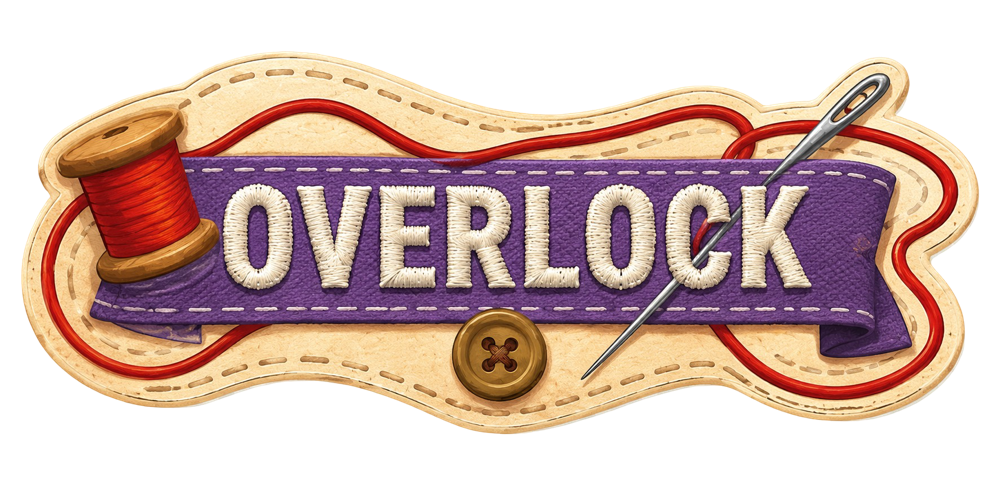
    <figcaption>프로젝트 로고</figcaption>
</figure>

!!! tip "아이템 한줄 설명"
    원단 위에서 벌어지는 손떨리는 레이싱, 삐끗하면 아야해요

Overlock(오버로크)은 재봉틀 노루발을 레이싱 머신처럼 몰아 원단 위 재봉선을 따라 달리는
무료 웹 타임어택 게임입니다. 브라우저에서 바로 실행되며, 모바일에서는 가로 화면에서 터치 버튼으로 플레이할 수 있습니다.

Godot 4.6.1로 만든 게임 클라이언트와 FastAPI로 만든 서버를 붙여 1인으로 개발했습니다. 현재 버전은 2026년 10월 4일에 올린 v2.3.1이며, 공식 사이트와 함께 itch.io에도 게시했습니다.

8월 23일에 v1.0.0을 릴리즈한 뒤 8월 28일의 v1.1.0까지 두 번 업데이트했습니다. 그 뒤로 약 한 달 동안은 업데이트가 없었고, 9월 29일부터 10월 4일까지 엿새 동안 v1.2.0부터 v2.3.1까지 8개 버전을 연달아 올렸습니다.

| 버전 | 날짜 | 핵심 |
|---|---|---|
| v1.0.0 | 2026-08-23 | 첫 릴리즈 |
| v1.0.1 | 2026-08-25 | 조향 곡선, 조향 감도 슬라이더, 원단 이탈 소프트 리셋, 피벗 드리프트 |
| v1.1.0 | 2026-08-28 | 트랙 15종, 필드 아이템(골무·엄마 찬스), 등급 우선 리더보드, 결과 화면 개편 |
| v1.2.0 | 2026-09-29 | 최초 1회 튜토리얼, 모바일 터치 컨트롤 1단계, itch.io 배포 준비 |
| v1.2.1 | 2026-09-29 | 터치 버튼 재배치, Overlock 로고 로딩 화면, 세로 화면 안내, PWA, iOS 안정성 대응 |
| v2.0.0 | 2026-09-30 | 손 밀착 자세·바늘 연출 재작업, 부상 사전 연출(손 미끄러짐·놀람), 부상 대사 말풍선, 엄마 꿀밤·꾸중 |
| v2.1.0 | 2026-09-30 | 커스텀 트랙 공유 허브 |
| v2.2.0 | 2026-09-30 | 공식/유저 트랙 선택 화면, 트랙 에디터 대폭 개선(아이템 배치, 줌, 길이 조절, 실행취소/다시실행, 재편집, 검증 안내) |
| v2.2.1 | 2026-10-01 | 아이템 슬롯(2칸, Space/USE), 구간 지우기, 모바일 메뉴·결과 화면 터치 레이아웃, 자동 일시정지, 설정 즉시 저장, 버그 수정 |
| v2.3.0 | 2026-10-03 | 개인 최고 기록 고스트, 원단별 주행 특성, 사실적인 원단 질감, 드리프트 원단 주름, 미니맵·급커브 바닥 버그 수정 |
| v2.3.1 | 2026-10-04 | 모바일 닉네임 입력 시 가상 키보드가 뜨지 않던 문제 수정("추천 이름으로 바꾸기" 추가) |

### 플레이

- 공식 사이트: <https://overlock.bnbong.com>
- itch.io: <https://bnbong.itch.io/overlock>

데스크톱 브라우저를 권장합니다. 로컬 기록과 고스트는 브라우저에 저장되고 사이트마다 따로 관리되기 때문에, 공식 사이트와 itch.io에서 쌓은 로컬 기록은 서로 공유되지 않습니다.

### 저장소

<https://github.com/bnbong/Overlock>

게임 기획서: [저장소 Wiki](https://github.com/bnbong/Overlock/wiki/Overlock-%EA%B2%8C%EC%9E%84-%EA%B8%B0%ED%9A%8D%EC%84%9C)

<figure markdown="span">
    
    <figcaption>키 비주얼. 4K로 렌더한 게임 스틸에 로고와 부제를 합성했습니다</figcaption>
</figure>

!!! note "고지"
    이 프로젝트는 『용과 같이 극 3』의 재봉 미니게임을 오마주한 비공식 팬 프로젝트입니다.
    ⓒ SEGA 및 『용과 같이』 시리즈와는 무관하며 게임에 들어간 에셋은 전부 오리지널 제작입니다(일부 AI 생성).
    라이선스는 MIT입니다.

## 기획

인터넷 서칭을 하다가 『용과 같이 극 3』의 재봉 미니게임을 발견했는데 그 구도의 아이디어가 너무 재미있어서 이걸 별도의 게임으로 풀어내고 싶었습니다.

용과 같이 게임 시리즈를 한 번도 플레이해본적이 없고 장르 느낌만 인지한 상태에서 바로 기획안을 작성하기 시작했고 타임어택 레이싱 게임 장르로 확정한 후 최종적으로 게임 프로젝트 이름을 재봉 용어인 Overlock(오버로크, 군필자라면 익숙한 그거..)으로 정했습니다.

이전에 진행했던 게임 프로젝트인 '헤쳐 모여! (Fall-In)' 프로젝트의 최종 완성을 앞두고 가졌던 오랜 고민은, 개발자인 내가 플레이해봐도 게임이 너무 단조롭고 재미가 없었다는 것이었습니다. 그런 의미에서 유저의 피지컬을 요구하는 레이싱게임은 큰 재미를 줄 수 있겠다는 나름의 확신이 생겨 개발을 결정하게 되었습니다.

이 게임은 개발하던 전작과 다르게 Python이 아닌 새로운 도구인 Godot 엔진을 사용하기로 결정했는데, Pygame의 표현력의 한계와 최적화 측면에서 게임 특화용 상용 엔진을 쓰는 것이 좋겠다고 판단했습니다.

빠른 프로토타이핑의 필요성, SSAFY 활동으로 인한 가용 시간 부족 등으로 개발 과정 전반은 LLM Agent에게 상당수준 의존했습니다. 그러나 완성도를 위해 단일 Agent만 사용한 것이 아닌 판단 및 오케스트레이팅은 Claude Fable, 메인 구현은 Claude Opus 5, 테스트 및 디버깅은 Claude Sonnet, 린팅 같은 가벼운 작업은 Claude haiku에게 역할을 분담하였습니다. 코드 리뷰는 OpenAI Codex에게 위임하였고 LLM이 생산하는 코드의 단점 중 하나인 '너무 불필요하게 많은 코드베이스 생성'을 막기 위해 YAGNI 판단 및 수정까지 Codex에게 맡겼습니다. 여러 Agent끼리 협업하게 구성하여 완성도를 최대한으로 끌어올리도록 했으며 UX는 만들어진 요소를 직접 플레이해보며 고쳤고 배포 후 SSAFY 구성원들에게 피드백을 맡겼습니다.

v1.2.0 이후로는 Codex가 계획서를 먼저 쓰고 Claude Fable이 그 계획을 구현 단위로 나눠 워커에게 분배하는 흐름이 잦아졌습니다. 손 밀착 자세, 공유 허브, 에디터 UX, 고스트와 원단 주행 특성이 모두 이 방식으로 진행되었습니다.

## 게임 소개

- 전진은 자동입니다. 브레이크도 후진도 없고 속도 5단계와 좌우 조향이라는 2축만 다룹니다.
- 보라색 재봉 라인을 벗어나면 OFF-SEAM으로 기록에 페널티가 붙습니다.
- 고속에서 급하게 조향하면 리스크 미터가 차오릅니다. 한계에 닿으면 손이 노루발 쪽으로 미끄러지는 사전 연출이 0.20초 동안 이어지고, 그 뒤에 손가락을 다쳐 잠시 조작을 잃습니다.
- 완주하면 정확도와 퍼펙트 비율에서 부상 횟수를 깎아 S부터 D까지의 재봉 등급이 매겨집니다.
- 공식 트랙은 15종입니다. 윤곽선을 따라 그린 트랙과 F1 서킷을 참고한 고난도 트랙이 섞여 있고, 난이도는 normal 5종 / expert 7종 / master 3종으로 나뉩니다.
- 트랙마다 원단이 정해져 있습니다. 면, 데님, 실크, 니트, 펠트, 새틴, 울, 가죽 8종은 바닥의 질감뿐 아니라 속도, 조향 반응, 위험 누적까지 서로 다릅니다.
- 일부 트랙의 재봉선 위에는 골무와 엄마 찬스 아이템이 놓여 있습니다. 먹은 아이템은 2칸 슬롯에 보관했다가 `Space`로 원하는 순간에 씁니다.
- `Shift`를 누르고 있으면 피벗 드리프트로 급커브를 돌 수 있습니다. 드리프트하는 동안에는 손끝 앞에서 원단이 접혀 올라옵니다.
- 내 최고 기록의 주행이 반투명 고스트로 함께 달립니다.
- 트랙 에디터로 직접 코스를 그리고, 공유 허브에 올리거나 다른 사람이 올린 트랙을 받아 플레이할 수 있습니다.
- 공식 트랙마다 온라인 리더보드 Top 100을 제공합니다.
- 모바일에서는 가로 화면의 터치 버튼으로 같은 조작을 할 수 있습니다.
- 처음 실행하면 한 번만 튜토리얼이 열립니다.

### 조작법

| 입력 | 기능 |
|---|---|
| `←` / `A` | 왼쪽 조향 |
| `→` / `D` | 오른쪽 조향 |
| `↑` / `W` | 속도 단계 상승 |
| `↓` / `S` | 속도 단계 하락 |
| `Shift` (홀드) | 피벗 드리프트 |
| `Space` | 아이템 사용 |
| `R` | 재시작 |
| `Esc` | 일시정지 |

모바일에서는 왼쪽 아래의 ◀▶ 조향 버튼, 오른쪽 아래의 ▲▼ 속도 버튼과 DRIFT·USE 버튼, 위쪽의 ‖ 일시정지 버튼으로 같은 입력을 보냅니다.

<figure markdown="span">
    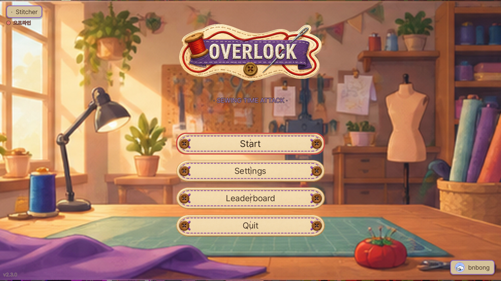
    <figcaption>타이틀 화면</figcaption>
</figure>

<figure markdown="span">
    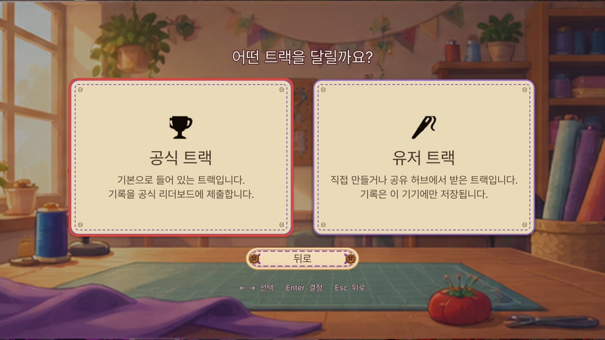
    <figcaption>Start를 누르면 공식 트랙과 유저 트랙 중 무엇을 달릴지 먼저 고릅니다</figcaption>
</figure>

<figure markdown="span">
    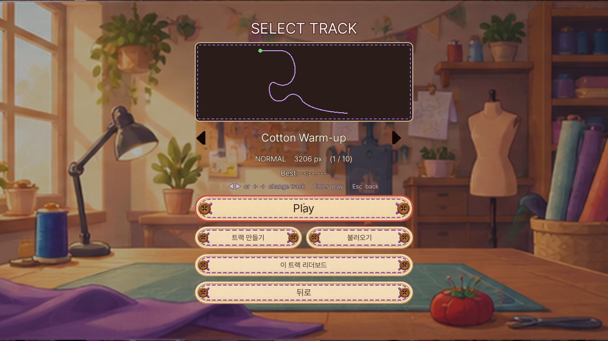
    <figcaption>공식 트랙 선택 화면. 원단의 주행 특성 문구와 개인 고스트 토글이 함께 보입니다</figcaption>
</figure>

<figure markdown="span">
    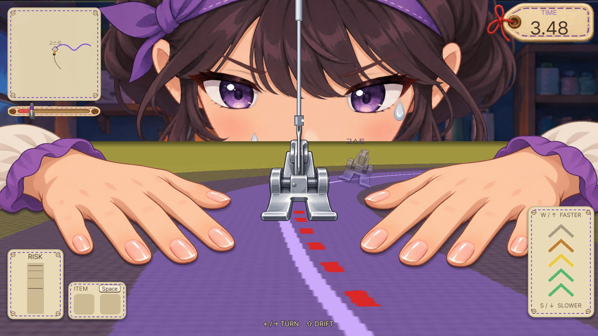
    <figcaption>내 최고 기록의 고스트와 함께 달리는 화면</figcaption>
</figure>

<figure markdown="span">
    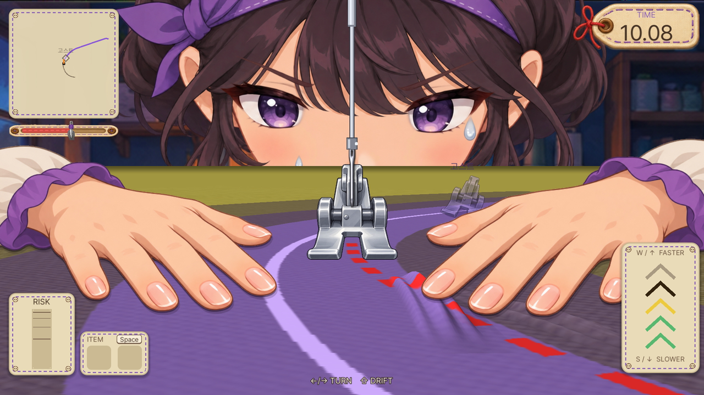
    <figcaption>드리프트 중에는 손끝 앞에서 원단 주름이 올라옵니다. 앞쪽에는 고스트가 달리고 있습니다</figcaption>
</figure>

<figure markdown="span">
    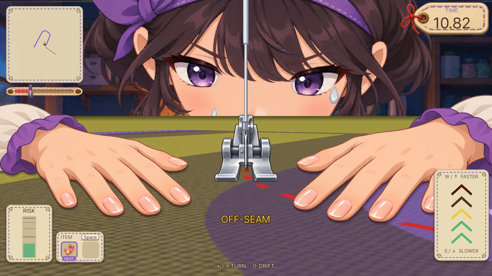
    <figcaption>아이템 슬롯에 엄마 찬스를 보관한 채 재봉선을 벗어나 OFF-SEAM이 뜬 장면</figcaption>
</figure>

<figure markdown="span">
    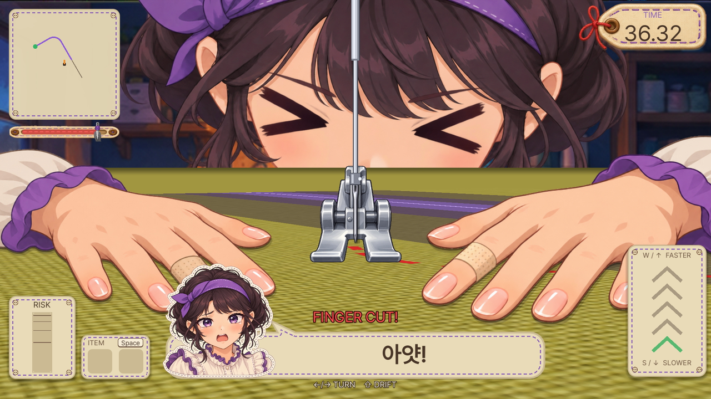
    <figcaption>손가락을 다치면 FINGER CUT! 표시와 함께 "아얏!" 같은 말풍선이 뜹니다</figcaption>
</figure>

<figure markdown="span">
    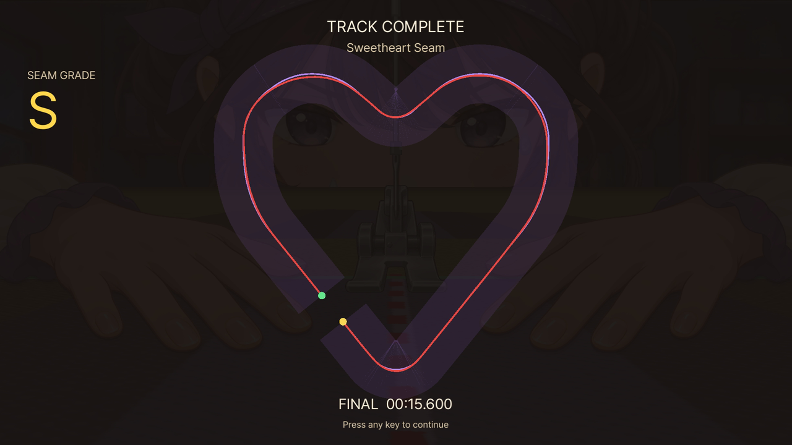
    <figcaption>완주 후 줌아웃. 자기가 박은 재봉선의 모양과 SEAM GRADE가 공개됩니다</figcaption>
</figure>

<figure markdown="span">
    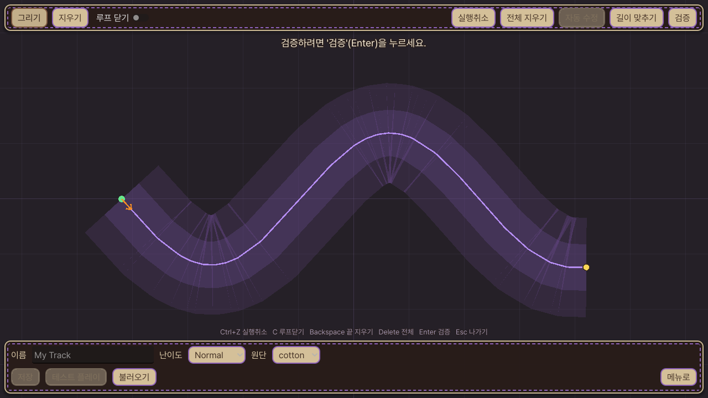
    <figcaption>트랙 에디터. 아이템을 직접 배치하고, 화면을 확대·축소하며, 구간 지우기 도구로 일부만 고쳐 그릴 수 있습니다</figcaption>
</figure>

<figure markdown="span">
    
    <figcaption>커스텀 트랙 공유 허브의 상세 화면(촬영용 데모 데이터)</figcaption>
</figure>

## 왜 Godot을 선택했는가

- Godot의 웹(HTML5) export로 정적 파일만 올려도 브라우저에서 바로 돌아가는 구조를 만들 수 있었습니다.
- 3D 엔진의 물리 구현은 없지만, 필드 같은 핵심 연출은 셰이더로 해결해야 했는데 Godot은 2D 노드와 셰이더를 같은 씬 안에서 섞기 편했습니다.
- 최적화 편리: GL Compatibility 렌더러를 쓰면 웹에서 요구 사양을 낮게 잡을 수 있습니다.
- 1인 개발 범위에서 엔진 빌드 파이프라인까지 직접 통제하기 쉬웠습니다.

## 핵심 설계

### 결정론적 시뮬레이션과 표현 계층의 분리

시뮬레이션은 60Hz 고정 스텝의 결정론 구조입니다. `RaceDirector`가 `_physics_process`에서 플레이어를 호출 구동하는 방식이라 플레이어 노드는 자기 물리 루프를 갖지 않습니다. 결정론을 처음부터 제약으로 박아 둔 이유는 우선 조작감 튜닝을 재현 가능하게 만들기 위해서였습니다. 리플레이 재시뮬레이션으로 나중에 기록을 검증하려면 같은 입력이 항상 같은 결과를 내야 한다는 이유도 있었습니다.

트랙 데이터는 JSON의 베지어 곡선을 De Casteljau로 샘플링해 누적 호길이 `s`를 가진 폴리라인으로 굽습니다. 매 틱 판정은 이 폴리라인에서 윈도 최근접 탐색으로 처리합니다. 전체를 훑지 않고 직전 인덱스 주변만 보기 때문에 트랙이 길어져도 비용이 늘지 않습니다.

시뮬레이션(`PlayerController`, `TrackData`, `RunStats`)과 표현 계층(`scripts/presentation/`, 셰이더)은 파일 단위로 나눠 두었습니다. 이 분리는 연출을 크게 바꿀 때마다 효과를 보였습니다. 탑다운 2D 프로토타입을 노루발 시점의 유사 3D 뷰로 바꿀 때도, v2.0.0에서 손 자세와 바늘 연출을 다시 만들 때도, v2.3.0에서 원단 질감과 드리프트 주름을 넣을 때도 시뮬레이션 코드는 건드리지 않았습니다. 다만 v2.0.0의 부상 사전 연출처럼 부상이 확정되는 시점 자체가 바뀌는 변경은 표현이 아니라 규칙이므로, 그 부분만 시뮬레이션 쪽에서 따로 처리했습니다. 공통 상태는 `Tuning`, `InputSetup`, `TrackLoader`, `RecordStore`, `GameState` 오토로드가 들고 있고 여기에 `AudioManager`와 `LeaderboardClient`를 나중에 얹었습니다.

### 노루발 시점 뷰: Mode 7 원근 셰이더

MVP는 위에서 내려다보는 탑다운 2D로 만들어 조작감부터 검증했습니다. 그다음 기획 단계부터 목표였던 노루발 시점 뷰로 표현 계층을 다시 작업했습니다. 투영 방식은 세 후보를 놓고 비교했습니다.

| 후보 | 판단 |
|---|---|
| SubViewport 탑다운 소스 + 풀스크린 Mode 7 원근 셰이더 | 채택 |
| CPU에서 폴리라인을 원근 변형해 `_draw` | 원단 텍스처를 원근화하려면 결국 셰이더가 필요 |
| 실제 3D (Node3D + Camera3D) | 단순한 씬인데 3D 렌더 파이프라인 전체를 써야함 |

채택한 이유 중 가장 컸던 건 크래시 대책이었습니다. 기존 방식은 급커브에서 트랙 밴드의 오프셋 폴리곤 삼각분할이 실패하며 죽는 문제가 있었습니다. Mode 7 방식은 이미 안전하게 래스터화된 두께 폴리라인을 픽셀 단위로 워프하기 때문에 이 크래시 유형이 구조적으로 사라집니다. 그 밖에도 기존 `TrackRenderer`와 `TrackData`, `MiniMap`을 그대로 재사용할 수 있고 GL Compatibility에서 비용이 싸다는 점이 좋았습니다. 스티치 트레일과 원단 텍스처를 같은 소스 레이어에 얹으면 하나의 셰이더가 일관된 원근으로 처리해 준다는 점도 좋았습니다.

카메라는 회전 0에 스무딩을 끈 translate-only로 두고 heading 회전은 프래그먼트 셰이더가 샘플 좌표에 적용합니다. 카메라를 직접 돌리면 밴드 가장자리에 서브픽셀 시머가 생기는데 회전을 셰이더로 옮기면 이 문제가 없습니다.

### 조작감 조정 원칙

조작감을 고칠 때는 "리더보드 공정성을 깨는 방식으로는 조작감을 고치지 않는다"는 원칙을 지킵니다.

**조향 곡선.** 조향이 너무 민감하다는 피드백을 받았을 때 조향 배율 자체를 낮추면 풀락 반경이 달라져서 기존 리더보드 기록과의 공정성이 깨집니다. 그래서 배율 대신 조향 곡선을 도입했습니다. 짧게 탭할 때의 조향각을 6.3°에서 3.17°로 완화하되 풀락 반경과 풀 반전 시간은 그대로 뒀습니다. 미세 조정은 쉬워지고 코너 한계선은 그대로입니다.

**조향 감도 슬라이더.** 설정 화면의 슬라이더는 회전력 배율이 아니라 heading 출력의 완화 곡선 계수만 움직입니다. 이 곡선은 풀락에서 항등이라 슬라이더를 어디에 두든 회전 반경과 풀 반전 시간이 변하지 않습니다. 조작감은 취향대로 고르고 기록의 기하는 모두 같게 두려는 장치입니다.

**피벗 드리프트.** 코너를 도는 수단이 조향 하나뿐이라 고난도 트랙의 급커브에서 선택지가 너무 적었습니다. 그래서 `Shift` 홀드로 발동하는 피벗 드리프트를 넣었습니다. 드리프트 중에는 조향 각속도에 2.5배가 걸려 5단 회전 반경이 75px에서 30px로 줄어듭니다. 대신 리스크의 상시 가산값이 0.09에서 0.18로 오르고 손과 바늘의 근접도가 최대로 고정되기 때문에, 오래 물고 있으면 부상 확률이 그만큼 올라갑니다. 바닥에는 스키드 마크가 남아 어디서 몇 번 꺾었는지가 완주 후 실루엣에 그대로 보입니다.

### 터치 입력의 등가성

모바일 대응은 웹 빌드를 iOS Safari와 Android Chrome에서 가로 화면으로 플레이하는 범위로 정했습니다. 네이티브 앱은 계획하지 않았습니다.

`TouchControls.gd`가 화면에 버튼을 그리고, 버튼을 누르거나 떼면 `InputEventAction`을 만들어 `Input.parse_input_event()`로 보냅니다. 키보드와 완전히 같은 InputMap 액션 경로를 타기 때문에 `RaceDirector`나 `PlayerController` 같은 시뮬레이션 코드는 한 줄도 수정하지 않았습니다.

여기서도 기준은 공정성입니다. 터치 입력은 키보드 입력과 등가여야 합니다. 조향은 원래 -1, 0, +1의 디지털 값이라 터치도 같은 값을 냅니다. 가상 조이스틱이나 기울기 같은 아날로그 조향은 도입하지 않았습니다. 키보드로는 낼 수 없는 궤적이 생기면 한쪽이 유리해지고 기존 기록과의 비교도 깨지기 때문입니다. 자동 보조 기능도 넣지 않았습니다.

멀티터치는 `TouchScreenButton` 노드를 쓰지 않고 `InputEventScreenTouch`의 인덱스를 직접 추적하는 방식으로 처리했습니다. 이렇게 하면 Control 앵커 좌표계를 써서 HUD와 같은 좌표계에서 겹침을 검사할 수 있습니다. 조향과 드리프트는 손가락이 미끄러져 들어와도 인정하고, 속도·일시정지·USE는 누르기 시작한 버튼에서만 인정하는 식으로 버튼마다 규칙을 다르게 둘 수 있습니다. 판정 영역을 보이는 사각형보다 8px 넓게 잡을 수 있고, 데스크톱에서 `--touch-controls` 강제 모드를 켜면 마우스로 검증할 수도 있습니다. Codex 리뷰에서는 씬을 다시 불러올 때 눌린 액션이 풀리지 않고 남는 버그가 잡혀, `_exit_tree`에서 모든 액션을 해제하도록 고쳤습니다.

화면은 1280×720 기준에 `canvas_items` 스트레치와 `keep` 비율을 쓰기 때문에 19.5:9 폰 화면에서는 16:9 레터박스가 됩니다. 844×390 화면에서는 UI가 약 0.54배로 줄어 메뉴 버튼 높이가 26~30px까지 작아졌습니다. 그래서 v2.2.1에서 메뉴, 결과, 설정, 리더보드 화면을 터치 전용 배치로 키웠고, 조향 버튼도 112px에서 144px까지 단계적으로 키웠습니다. 데스크톱에서는 터치 버튼을 표시하지 않습니다.

### 아이템 슬롯과 필드 아이템

재봉선 위에 놓인 아이템을 20px 안으로 지나가면 획득합니다. 골무는 4.5초 동안 부상을 막아 줍니다. 리스크는 정상적으로 쌓이지만 이 구간에서는 0.95로 상한이 걸려 한계선에 닿지 않습니다. 엄마 찬스는 2.8초 동안 노루발이 중심선을 자동으로 따라 달리게 합니다.

엄마 찬스에는 함정이 하나 있었습니다. 급코너 한복판에서 자동 주행이 끝나면 조작을 넘겨받은 순간 그대로 원단을 이탈했습니다. 그래서 만료 시점의 중심선 곡률이 반경 100px보다 급하면 곡률이 풀리는 지점까지 최대 1.2초를 더 끌어 주는 핸드오프 게이트를 뒀습니다. 아이템은 15종 중 10종에만 놓았고, 초반 윤곽선 트랙은 조작을 익히는 트랙으로 남겨 뒀습니다.

v1.1.0에서는 아이템을 밟는 즉시 발동했습니다. v2.2.1부터는 먹은 아이템을 2칸 슬롯에 보관하고, `Space`(모바일은 USE)를 누르면 먼저 먹은 것부터 사용합니다. 슬롯이 가득 차 있으면 새 아이템을 먹을 수 없습니다. 이 변경은 입력 프레임에 `use_item` 필드를 더하는 일이라, 모바일 대응과는 별개인 게임 규칙 변경으로 다뤘습니다.

### 원단별 주행 특성

v2.3.0 전까지 원단은 바닥 그림만 달랐습니다. 지금은 트랙의 원단이 주행 특성도 바꿉니다. 한 트랙 전체에는 한 가지 원단만 쓰고, 무작위 미끄러짐이나 무작위 부상은 넣지 않았습니다.

원단 데이터는 `game/data/fabric_profiles.json` 한 곳에 있습니다. 원단마다 속도, 조향 지연, 위험 누적의 세 배율을 0.5~1.5 범위에서 정합니다.

| 원단 | 속도 | 조향 지연 | 위험 누적 | 화면 문구 |
|---|---:|---:|---:|---|
| 면 | 1.00 | 1.00 | 1.00 | 표준 조작감 |
| 데님 | 0.94 | 0.90 | 0.85 | 조금 느리지만 반응이 빠르고 위험이 덜 쌓임 |
| 실크 | 1.04 | 1.15 | 1.10 | 조금 빠르지만 반응이 늦고 위험이 더 쌓임 |
| 니트 | 0.98 | 1.08 | 0.95 | 약간 느리고 반응이 조금 늦음 |
| 울 | 0.95 | 1.00 | 0.90 | 느리고 위험이 덜 쌓임 |
| 펠트 | 0.96 | 0.88 | 0.90 | 느리지만 반응이 빠르고 위험이 덜 쌓임 |
| 새틴 | 1.02 | 1.10 | 1.05 | 약간 빠르고 반응이 늦음 |
| 가죽 | 0.92 | 0.95 | 0.85 | 가장 느리지만 위험이 덜 쌓임 |

런이 시작되면 `RaceDirector`가 원단 프로필을 `PlayerController`에 한 번 넘깁니다. `PlayerController`는 배율만 보관하고, 매 틱 전역 `Tuning` 값에 배율을 곱한 effective 값을 씁니다. 전역 `Tuning`을 바꾸지 않으므로 다음 트랙으로 배율이 누적되지 않습니다. 위험 계산의 속도 계수와 회전력 계산의 최대 속도도 같은 배율을 적용한 값을 쓰기 때문에, 같은 기어의 속도 비율과 회전 각속도는 원단과 무관하게 같고 회전 반경만 속도 배율만큼 달라집니다.

면은 배율이 1.0이라 원단 도입 전 물리와 틱 단위로 비트까지 같습니다. 이 점은 v2.2.1의 `PlayerController`를 기준본으로 두고 비교하는 회귀 검사로 확인합니다. 표에 없는 원단은 면으로 처리합니다. 5단에서 풀조향을 유지했을 때 경고와 부상까지 걸리는 시간은 면이 0.63초와 2.08초, 데님이 0.97초와 2.78초, 실크가 0.50초와 1.57초, 가죽이 0.90초와 2.70초로 측정되었습니다. 모든 원단에서 1~2단은 어떤 입력에도 부상이 나지 않으며, 스크립트 조향 드라이버로 8개 원단과 공식 트랙 15개의 모든 조합을 완주할 수 있는지 확인했습니다.

트랙 길이, 판정 폭, 등급, 페널티 초, 아이템 지속 시간은 원단과 무관하게 같습니다. 공유 허브에 트랙을 올리는 사람은 원단을 고를 수는 있지만 배율을 직접 올릴 수는 없습니다. 서버도 같은 파일을 복사해 두고 기록의 최소 시간 하한을 계산할 때 사용합니다.

<figure markdown="span">
    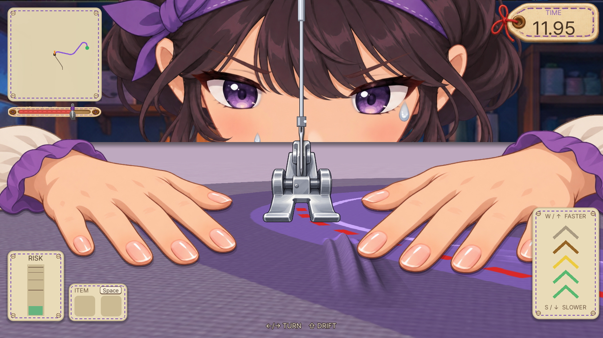
    <figcaption>실크 원단 위에서 드리프트하는 장면</figcaption>
</figure>

### 개인 고스트

내 최고 기록의 주행은 미니맵 마커와, 트랙 위를 달리는 반투명 보라색 노루발 실루엣으로 함께 보입니다. 트랙 선택 화면에서 고스트를 켜고 끌 수 있습니다. 최고 기록은 재봉 등급을 우선하고 같은 등급이면 빠른 시간을 기준으로 판정하며, 이는 온라인 리더보드와 같은 기준입니다.

고스트는 입력을 다시 시뮬레이션하지 않고 위치 스냅샷으로 기록합니다. 물리 틱에서 20Hz(50ms) 간격으로 시간, 월드 좌표, heading, 진행도 `s`를 저장하고, 렌더할 때 인접한 두 샘플을 보간합니다. 최대 24,000 샘플(약 20분)까지 저장하며 파일은 2MiB를 넘지 않게 제한했습니다. 원단 이탈 복귀처럼 순간 이동하는 지점은 별도 샘플로 남겨, 그 구간을 직선으로 보간하지 않게 했습니다. 고스트는 충돌, 아이템, 리스크, 기록 중 어디에도 영향을 주지 않습니다.

고스트 파일의 헤더에는 경로, 폭, 재질, 아이템 같은 플레이 데이터 전체의 해시(track_fingerprint)와 물리 규칙 버전(physics_ruleset)을 함께 기록합니다. 트랙 내용이나 물리 규칙이 바뀌면 그 기록과는 비교하지 않고 고스트만 끄며, 기록 자체는 보존합니다.

필드 위의 고스트는 아이템 빌보드와 같은 Mode 7 역투영으로 월드 좌표를 화면 좌표로 바꿔 그립니다. 새 그림을 만들지 않고 기존 노루발 그림을 0.8배 크기에 반투명 보라색으로 칠해 재사용했습니다. 플레이어보다 뒤에 있으면 그리지 않고, 플레이어와 40px 이내로 가까우면 숨겼다가 90px까지 멀어지는 동안 서서히 드러냅니다. 노루발, 바늘, 재봉선을 가리지 않게 하려는 규칙입니다. 계획 단계에서는 구간별 시간차 팝업도 있었지만 v2.3.0에는 넣지 않았습니다.

### 커스텀 트랙 공유 허브

v2.1.0에서 에디터로 만든 트랙을 계정 없이 공개 게시하고, 다른 사람의 트랙을 검색해 받아서 플레이하는 공유 허브를 붙였습니다.

**삭제 토큰.** 로그인이 없으므로 삭제 권한은 게시 응답으로 한 번만 받는 삭제 토큰으로 증명합니다. 서버는 토큰의 SHA-256만 저장하고 비교 시간이 일정한 방식으로 대조합니다. 클라이언트는 토큰을 별도 파일에 보관하고, 트랙 JSON 내보내기나 게시 데이터에는 넣지 않습니다. 대신 브라우저 데이터를 지우면 삭제 권한도 함께 사라집니다. 게시물은 수정할 수 없고, 고친 트랙은 새로 올린 뒤 이전 게시물을 지우는 방식입니다.

**서버 재검증.** 서버는 클라이언트의 트랙 검증을 믿지 않고 다시 검증합니다. 정규화된 폴리라인만 받고, 점은 최대 4096개, 좌표는 유한한 값이면서 절댓값 100000 이내여야 합니다. 판정 폭은 perfect < safe < fail 순서를 지키면서 각각 1000 이하여야 하고, 난이도와 재질은 허용 목록에 있는 값만 받습니다. 클라이언트가 보낸 길이, 체크섬, id는 다시 계산하거나 버립니다. 제목은 80자, 작성자는 32자, 설명은 1000자로 제한하고 제어문자를 막으며, 닉네임과 설명은 BBCode나 HTML로 해석하지 않고 일반 텍스트로만 그립니다.

**부하 제한.** 허브 경로는 실제로 받은 바이트를 기준으로 1MiB를 넘으면 바로 413으로 끊습니다. `Content-Length`를 속이거나 chunked로 보내도 마찬가지입니다. 게시는 IP당 분당 3회와 하루 30회, 조회는 분당 120회, 삭제는 토큰 추측을 막기 위해 분당 10회로 제한했습니다. 이 레이트리밋은 기록 제출용과 버킷을 분리했습니다.

**기록 분리.** 허브에서 받은 트랙의 기록은 로컬에만 저장하고, 공식 리더보드는 공식 트랙만 다룹니다. 받은 트랙에는 로컬 ID를 새로 발급합니다. 같은 경로라도 폭이나 아이템이 다르면 서로 다른 트랙으로 취급합니다.

API는 네 개입니다.

| 메서드 | 경로 | 용도 |
|---|---|---|
| GET | `/api/community/tracks?q=&limit=&offset=` | 제목 검색과 최신순 목록 |
| GET | `/api/community/tracks/{id}` | 상세 조회 |
| POST | `/api/community/tracks` | 게시(201과 함께 삭제 토큰을 한 번 반환) |
| DELETE | `/api/community/tracks/{id}` | Bearer 토큰으로 삭제 |

### 리더보드 서버

Python 3.11+ 위에 FastAPI와 SQLAlchemy 2.0을 얹어 서버를 만들었습니다. DB는 SQLite를 씁니다. `/api/health`, `/api/tracks`, 기록 제출 및 조회 엔드포인트를 만들었고, 공유 허브 API는 공식 기록 체계와 테이블을 분리해 같은 서버에 올렸습니다.

기록 위조를 막는 장치는 두 겹으로 하나는 트랙 무결성 확인이며 트랙 JSON 파일의 원본 바이트를 SHA-256으로 해싱한 `"sha256:" + hex` 값을 클라이언트와 서버의 스냅샷이 같은지 확인합니다. 다른 하나는 물리 하한 필터로, 물리적으로 불가능할 만큼 빠른 기록을 거부합니다. 지금은 원단의 속도 배율까지 반영해 하한을 계산합니다.

공개 API인 만큼 DoS도 신경 썼습니다. 기록 제출 경로에는 요청 바디에 16KB 상한을 두는 미들웨어를 넣었습니다. 닉네임은 길이를 제한하면서 위험한 유니코드를 차단하고 IP당 분당 제출 횟수에 rate limit을 걸었습니다. 리더보드 조회는 윈도 함수와 SQL `LIMIT`으로 처리해 전체를 메모리로 끌어오지 않습니다.

**등급 우선 정렬.** 처음에는 시간 하나로만 정렬해서 재봉선을 대충 밟고 빨리 달리는 쪽이 무조건 이겼습니다. 재봉 게임인데 재봉 품질이 순위에 안 들어간다는 게 계속 걸렸습니다. 그래서 v1.1.0부터 등급을 우선하고 같은 등급 안에서는 시간으로 정렬합니다. S등급 25초가 A등급 20초보다 위입니다.

이때 등급 공식이 클라이언트와 서버 두 곳에 존재하면 표시 등급과 정렬 등급이 어긋날 수 있습니다. 그래서 서버 쪽 `grade.py`는 클라이언트 `RunStats.gd`의 가중치와 컷오프를 상수 단위로 1:1 복제하고 서로를 가리키는 주석을 남겼습니다. 정렬은 이 점수를 SQL `CASE` 식으로 티어화해 처리하므로 전체를 메모리로 끌어오지 않아도 됩니다. 구버전 클라이언트가 퍼펙트 비율을 보내지 않는 경우도 있어서 그 필드는 기본값을 둔 선택값으로 받았습니다.

## 표현 계층

**손 밀착 자세와 바늘.** v2.0.0에서 손끝만 떠 있던 자세를 손목을 내리고 손바닥을 원단에 붙인 자세로 바꿨습니다. 기본 캐릭터, 엄마, 밴드, 골무 손을 모두 다시 만들었고, 조향과 드리프트에 맞춰 손이 원단을 누르는 움직임을 더했습니다. 바늘의 상하 운동은 원단을 관통하는 지점을 기준으로 3~7Hz 범위에서 뚜렷하게 보이게 했고, 멈춰 있을 때는 바늘이 올라간 위치에 둡니다.

**부상 사전 연출.** 리스크가 1.0에 닿아도 바로 다치지 않고 0.20초(12틱) 동안 대기 상태로 들어갑니다. 이 동안 손이 노루발 쪽으로 미끄러지고 캐릭터가 놀란 눈을 한 뒤에 손가락 부상이 확정됩니다. 그 사이에 골무, 엄마 찬스, 원단 이탈, 리셋이 끼어들면 부상 없이 풀립니다. 완주하는 순간에는 대기 중인 부상을 즉시 확정합니다. 이 연출 때문에 부상 1회당 기록이 최대 0.15초 유리해지는 차이가 생기지만, 결정론은 그대로 유지됩니다. 부상을 당하면 눈물 맺힌 초상화와 함께 "아얏!", "아파!", "아이고!" 중 하나가 말풍선으로 뜹니다. 대사를 고르는 난수는 시뮬레이션 난수와 분리했습니다.

<figure markdown="span">
    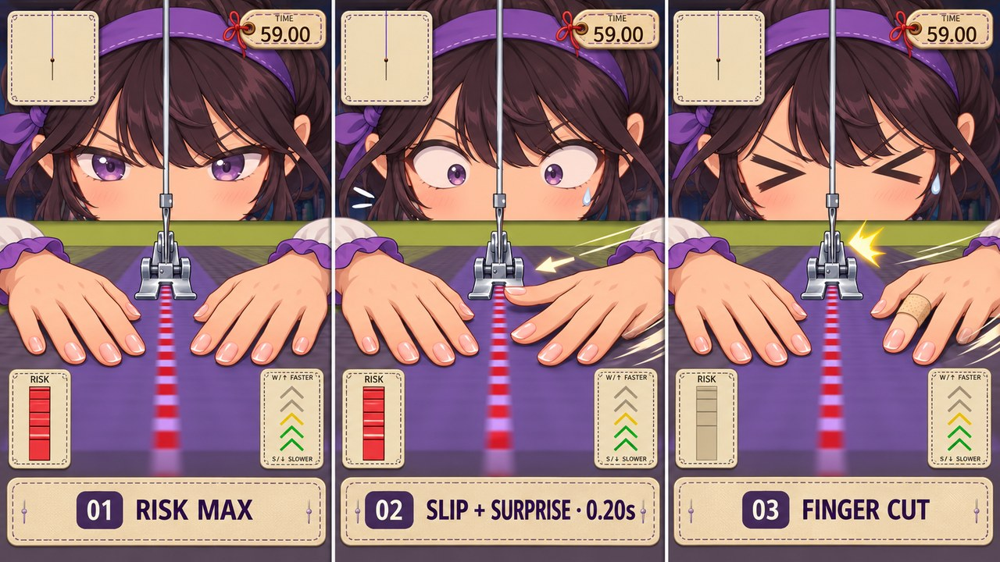
    <figcaption>부상 사전 연출 컨셉. 리스크가 한계에 닿은 뒤 손이 미끄러지고 놀란 다음 손가락을 다치는 3컷입니다</figcaption>
</figure>

**엄마 꿀밤.** 원단을 벗어나 강제로 복귀하면 캐릭터가 ">_<" 표정으로 꿀밤을 맞고, 엄마 초상화가 "이녀석, 제대로 해야지!"라고 꾸중하는 말풍선이 뜹니다.

**원단 질감.** v2.3.0에서 바닥 원단을 실제 천처럼 보이는 질감 텍스처로 바꿔 8종마다 다른 결이 보이게 했습니다. 원단 표면, 주름, 원근을 각각의 셰이더가 맡습니다.

**드리프트 주름.** `Shift`를 누르고 있는 동안 손끝 앞에서 원단이 접혀 올라오고(GATHER), 놓으면 가라앉습니다(RELAX). 주름은 손을 따라다니고 완주 줌아웃 화면에도 흔적이 남습니다. 표현 계층만 바꾼 작업이라 시뮬레이션에는 영향이 없습니다.

<figure markdown="span">
    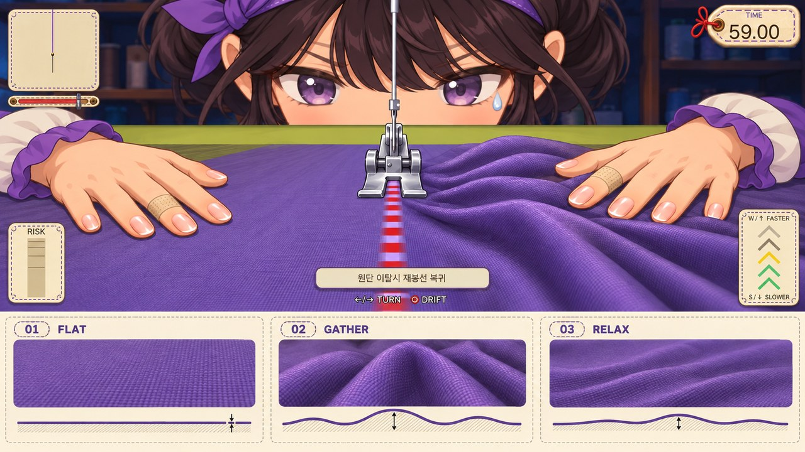
    <figcaption>드리프트 주름 컨셉. FLAT, GATHER, RELAX 세 상태를 먼저 그림으로 정했습니다</figcaption>
</figure>

**결과 화면.** 결과 화면에는 완주 직후 알아야 하는 것만 남겼습니다. 트랙명, 재봉 등급, 최종 시간과 페널티, 신기록 여부, 등급 산출 요소 한 줄, 리더보드 제출입니다. 대신 등급별 시나리오 일러스트를 카드 왼쪽에 크게 걸어 S와 D의 결과가 그림으로 먼저 읽히게 했습니다.

## 웹 배포와 삽질

배포는 GitHub Actions로 묶고 호스팅은 개인 클라우드 서버에서 서빙하고 앞단에 Cloudflare를 두었습니다(기존 BNGdrasil 인프라). 여기까진 무난했는데 배포 후 유저 검증 과정에서 문제가 발생했습니다.

**gzip 이중 해제.** 라이브 직후 특정 트랙의 리더보드만 "연결 실패"가 떴습니다. 작은 응답은 멀쩡한데 큰 응답만 죽는 패턴이라 원인을 찾기까지 오래 걸렸습니다. 범인은 Cloudflare의 압축 방식 선택이었습니다. 큰 응답에는 gzip을, 작은 응답에는 zstd를 골라 압축하는데 브라우저는 gzip을 해제한 평문을 넘기면서도 `Content-Encoding` 헤더를 그대로 노출합니다. Godot `HTTPRequest`는 `accept_gzip`이 기본 true라 이 평문을 한 번 더 해제하려다 `RESULT_BODY_DECOMPRESS_FAILED`로 실패했습니다. zstd는 Godot이 재해제하지 않으니 작은 응답만 살아 있었습니다. 웹 빌드에서 `accept_gzip = false`로 껐습니다.

**웹 오디오 완전 무음.** 데스크톱에서 잘 나오던 소리가 웹에서는 하나도 안 났습니다. Godot 웹의 기본 재생 타입인 Sample이 런타임에 만든 커스텀 오디오 버스를 통과하지 못하는 문제였습니다. 플레이어에 웹 한정으로 `PLAYBACK_TYPE_STREAM`을 강제해 해결했습니다.

**캐시 퍼지.** Godot 웹 export의 산출물 파일명은 고정입니다. 해시가 붙지 않으니 재배포해도 브라우저와 CDN이 옛 파일을 그대로 들고 있습니다. 배포 워크플로에 Cloudflare 캐시 퍼지를 넣어 두는 것으로 정리했습니다.

**iOS에서 게임이 켜지지 않던 문제.** 모바일 대응을 올린 날, 사용자의 iPhone 15 Pro Max(Chrome)에서 "WebGL context lost"가 나며 게임이 켜지지 않았습니다. 처음에는 WebKit의 Metal provoking-vertex 버그를 의심해 `getContext`를 감싸 provoking vertex를 지정하고 `devicePixelRatio`에 상한 2를 두었습니다. 그런데 게임과 무관한 순수 JS 프로브에서도 300×150 크기의 webgl2 캔버스가 생성 직후 lost되는 것을 확인했습니다. 원인은 iOS 18.7.2 RC(22H123) 자체의 WebKit 버그였고, 최종판(22H124)에서 수정되었습니다. 게임 코드와는 관계가 없었습니다.

**DPR 상한 제거.** 그 뒤 "모바일 웹 텍스트가 뭉개진다"는 보고가 들어왔습니다. 앞서 넣은 상한 때문에 DPR 3 기기에서 2/3 해상도로 렌더한 뒤 업스케일하고 있었습니다. 상한을 둔 판과 두지 않은 판의 라플라시안 선명도를 비교해 2.4~6배 차이를 확인한 뒤 상한을 다시 제거했습니다. 그만큼 렌더하는 픽셀 수는 2.25배 늘어납니다.

**가상 키보드.** v2.3.1에서는 모바일 닉네임 입력칸을 눌러도 가상 키보드가 뜨지 않던 문제를 고쳤습니다. 웹 export 옵션 `html/experimental_virtual_keyboard`가 꺼져 있어서였고, 이 옵션을 켰습니다. 키보드 없이도 바꿀 수 있도록 "추천 이름으로 바꾸기" 버튼도 넣었습니다.

**itch.io 배포.** itch.io 배포는 수동 트리거 전용 GitHub Actions 워크플로로 처리합니다. Godot 4.6.1 headless로 Web 프리셋을 export한 뒤, itch.io 공식 CLI인 butler로 빌드 결과를 채널에 올립니다. 러너에서 butler 배포 서버(broth)의 DNS 해석이 실패하는 경우가 있어서, butler는 GitHub Releases에서 먼저 받고 broth를 폴백으로 두었습니다. 첫 푸시 뒤에는 itch 페이지에서 'This file will be played in the browser' 옵션을 한 번 손으로 켜야 합니다. 웹 export를 스레드 OFF로 빌드했기 때문에 SharedArrayBuffer가 필요 없고, itch.io에 COOP/COEP 헤더가 없어도 그대로 실행됩니다.

## 유저 피드백 반영

어렸을 때부터 여러 재미 없는 게임을 접할때마다, "아니 이 게임을 만드는 개발자들은 자기 게임도 안해보고 출시하나?" 라는 의문이 들었는데 직접 게임을 만들어보니 내가 만드는 게임에 익숙해져서 불편함을 어느순간부터 감수하며 판단하고 있었습니다. 때문에 다른 사람의 피드백이 절실하다고 판단하여 릴리즈 직후 SSAFY 동기 1,000명 가까이 있는 채팅방에 플레이를 부탁하고 피드백 설문을 받아, 8월 25일 v1.0.1에 반영했습니다.

**"조향이 너무 민감하다."** 가장 많이 나온 의견이었습니다. 배율을 낮추는 대신 조향 곡선과 감도 슬라이더로 대응했고, 자세한 내용은 위의 조작감 조정 원칙에 정리했습니다.

**"맵 밖으로 나가면 못 돌아온다."** 원인은 완주 판정이 호길이 `s` 하나에만 의존한다는 데 있었습니다. 재로컬 윈도 밖으로 나가면 최근접 탐색이 위치를 놓치면서 `s`가 동결되고, 다시 재봉선 위로 돌아와도 진행도가 갱신되지 않았습니다. 재봉선에서 일정 거리 이상 떨어진 상태가 0.12초 지속되면 마지막 정상 추적점으로 소프트 리셋하도록 고쳤습니다. 3초 페널티를 물리고 "원단 이탈! 재봉선 복귀" 연출을 띄웁니다.

**정상 기록이 거부되는 버그.** 테스트 중에 서버의 물리 하한 필터가 멀쩡한 기록을 422로 막는 일이 발견됐습니다. 하한을 트랙 중심선 길이 기준으로 계산했는데 코너를 안쪽으로 잘라 달리면 실주행 거리가 중심선보다 짧아질 수 있다는 걸 놓쳤습니다. 안전계수 0.75를 곱해 하한을 낮췄습니다.

## 아트와 사운드

아트를 만들어 본 경험이 전혀 없어서 그래픽은 GPT Image로 생성한 스프라이트 시트를
분해하고 정렬해 쓰는 방식으로 해결했습니다. 시트 한 장에 얼굴, 손, 노루발, 바늘, 원단 4종,
배경 2종, 로고가 들어 있습니다.

<figure markdown="span">
    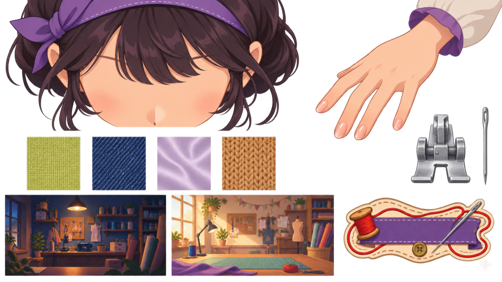
    <figcaption>게임에 쓰인 스프라이트 시트. 여기서 잘라낸 조각을 조합해 화면을 구성했습니다</figcaption>
</figure>

v2.0.0의 손 밀착 자세 작업에서는 손 9종과 큰 노루발 1종을 새로 만들었습니다. GPT 이미지로 생성한 뒤 안정 영역에 맞춰 정렬하고 배경을 제거해 적용했습니다. 이 작업에서는 구현에 들어가기 전에 Codex가 계획서와 컨셉 이미지, 에셋을 먼저 준비했습니다. 손 밀착 자세뿐 아니라 손가락 부상, 엄마 꾸중, 드리프트 주름도 컨셉 이미지로 연출을 먼저 정한 뒤에 구현했습니다. 구현은 Claude Fable이 격리된 worktree에서 Opus 워커 두 명에게 손 담당과 바늘·튜토리얼 담당으로 나눠 병렬로 맡겼고, 마지막에는 디버그 플레이에서 나온 피드백을 반영해 손 비율과 위치를 다시 맞췄습니다.

BGM은 Suno AI 기반으로 뽑았고 메뉴용 Sewed와 인게임용 Locking In 두 곡을 적용했습니다.

<figure markdown="span">
    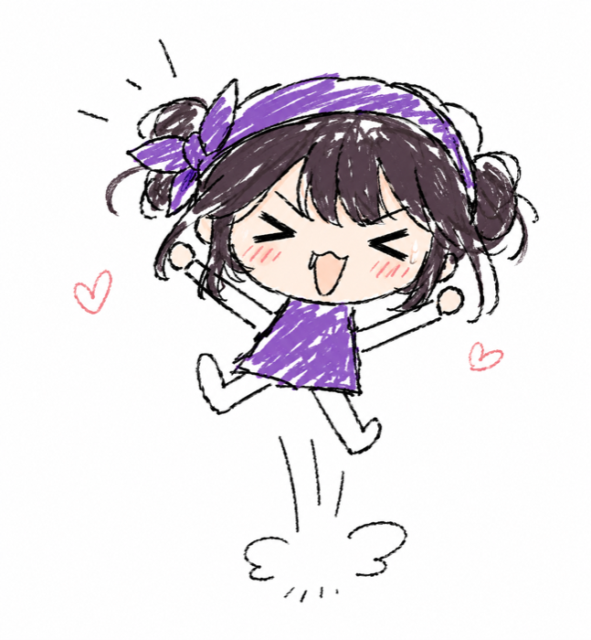
    <figcaption>v1.0.0 릴리즈 기념으로 당일 유행하던 GPT 낙서 그림 프롬프트로 뽑은 사진</figcaption>
</figure>

## 홍보

itch.io 게시에 맞춰 홍보 키트를 다시 만들었습니다.

**키 비주얼.** 새로 그린 그림이 아니라, HUD를 끄고 4K 네이티브로 렌더한 게임 스틸(하트 트랙의 커브 장면)에 로고와 부제 "원단 위를 달리는 재봉틀 레이싱", URL을 합성했습니다. 3840, 1920, 1280 폭의 판과 문구 없는 판, itch.io 커버용 630×500과 1260×1000 판을 함께 뽑았습니다. 분할 구도와 콜라주 시안도 만들었지만 채택하지 않고 보관해 두었습니다.

<figure markdown="span">
    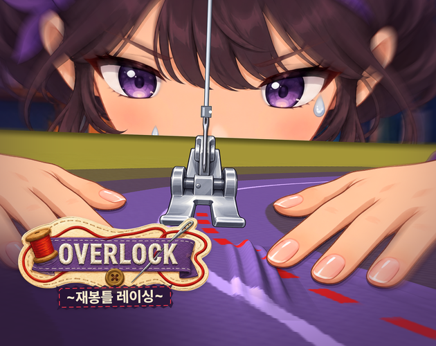
    <figcaption>itch.io 커버(630×500)</figcaption>
</figure>

**itch.io 페이지 에셋.** 960×300 배너, 데님을 Deep Plum 톤으로 바꾼 256px 배경 타일, 홈질 점선 구분선, 키캡 모양의 조작법 블록, 48×48 특징 아이콘 6종, 섹션 제목 띠, 640×360 12fps GIF 2종(드리프트 주름, 고스트와 엄마 찬스)을 모두 스크립트로 생성했습니다. 색은 Thread Purple `#8D62B9`, Deep Plum `#2A1838`, Fabric Cream `#F3E7C9`, Stitch Red `#E5364B`, Ink Brown `#47342A` 다섯 개를 토큰으로 정했고 글꼴은 Pretendard를 썼습니다. 저장소 README도 같은 에셋으로 다시 구성하고 상단에 홍보 영상을 넣었습니다.

**홍보 영상.** 1920×1080 60fps의 43.63초짜리 영상입니다. 배경음악은 Kevin MacLeod의 "Newer Wave"(110 BPM, CC BY 4.0)이며, 20마디에 모든 컷과 자막을 비트에 맞춰 배치했습니다. 촬영은 손으로 하지 않았습니다. `PromoDriver.gd`가 격리된 user 디렉터리의 스크래치 사본에서 키보드와 마우스 이벤트를 주입해 시나리오별로 자동 플레이하고, 이 화면을 Python과 skia로 합성했습니다. v2.0 빌드로 찍었던 장면은 v2.3.0 빌드로 전부 다시 촬영했습니다.

<figure markdown="span">
    
    <figcaption>홍보 영상 스토리보드 시트</figcaption>
</figure>

## 검증 방식

개발은 "구현 에이전트가 읽을 것"을 전제로 결정 사항 중심으로 쓴 다음, Claude Code와 Codex 도구에 구현을 맡겼습니다. 검증은 gdtoolkit 린트, Godot 헤드리스 E2E, 자동 스크린샷 캡처 대조를 조합했습니다.

별도의 대형 테스트 프레임워크는 만들지 않고, 기능마다 얇은 회귀 검사 도구를 `tools/` 아래에 두었습니다.

- `community_hub_regression`, `track_editor_regression`, `track_band_regression`
- `ghost_regression`, `fabric_regression`, `drift_folds_regression`
- `item_slot_regression`, `palm_contact_regression`
- `mobile_steer_regression`, `menu_ux_regression`, `start_flow_regression`

각 도구는 Godot을 헤드리스로 실행하고, 실제 저장 데이터를 건드리지 않도록 격리된 user 디렉터리의 사본에서 동작합니다. 예를 들어 손 밀착 자세 작업의 회귀 검사는 317개 항목을 통과했습니다. 화면 캡처는 1280×720과 함께 844×390, 932×430, 800×360의 폰 비율 3종에서 찍어 대조했습니다.

다만 데스크톱의 `--touch-controls` 모사 검증과 iOS·Android 실기 검증은 구분해서 다룹니다. 실기 체크리스트는 문서로 정리해 두었고, 홍보용 스크린샷과 영상은 모두 macOS 데스크톱에서 촬영했습니다.

## 역할

- 게임 기획 및 룰 설계
- 결정론 시뮬레이션과 판정 로직 구현
- 노루발 시점 표현 계층 및 셰이더 구현
- 트랙 제작 및 트랙 에디터 구현
- FastAPI 리더보드 서버 설계&구현&배포
- 커스텀 트랙 공유 허브 API 설계&구현
- 모바일 터치 컨트롤과 터치 전용 UI 배치
- 웹 export 및 CI/CD 파이프라인 구성, itch.io 배포
- 아트&사운드 에셋 통합
- 키 비주얼, itch.io 페이지 에셋, 홍보 영상 제작
- 유저 테스트 진행 및 밸런싱

## 배운 점

- 웹 배포의 어려움은 게임 자체가 아니라 브라우저 <-> CDN <-> 엔진 등의 외부 서비스들이 만나는 경계에 있었습니다. gzip 이중 해제도, 오디오 무음도, 한글 tofu도 전부 그 경계에서 나왔습니다.
- 혼자 만든 게임의 조작감은 자기가 판단할 수 없습니다. 8명에게 플레이를 부탁하고 받은 설문이 굉장히 큰 영감과 도움이 되었습니다.
- 처음으로 배포까지 완성한 게임이라 너무 감명깊었습니다. 게다가 실제 플레이해본 사람들의 평가 대부분이 '약간 어렵지만 굉장히 재미있다'라는 평가여서 황홀했습니다. 실시간으로 제 작품의 피드백과 평가를 받아 볼 수 있던 값진 경험이었습니다.
- 원인을 확정하기 전에 넣은 우회 코드는 나중에 되돌리게 됩니다. iOS 문제를 WebKit 렌더링 버그로 추측하고 넣은 DPR 상한은, 원인이 iOS 출시 후보판(RC) 자체의 버그로 밝혀진 뒤 텍스트가 뭉개지는 다른 문제를 남겼고 결국 제거했습니다.
- 처음에 시뮬레이션과 표현 계층, 입력 경로를 나눠 둔 덕분에 모바일 터치, 손 연출, 원단 질감처럼 큰 기능을 붙일 때도 시뮬레이션 코드를 거의 건드리지 않을 수 있었습니다. 부상 사전 연출처럼 규칙이 바뀌는 변경만 시뮬레이션 쪽에서 따로 다뤘습니다.

## 다음 단계

- 모바일 2단계: 트랙 에디터 터치 조작 개선
- 더 많은 공식 트랙 추가 & 공식 트랙 개선
- 플레이어블 캐릭터 추가
- 공유 허브 개선(인기순, 좋아요 등)
