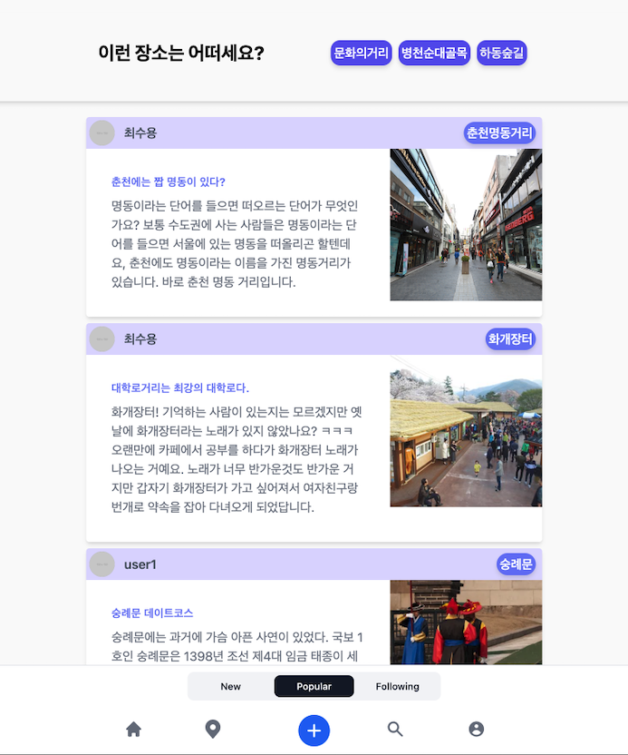
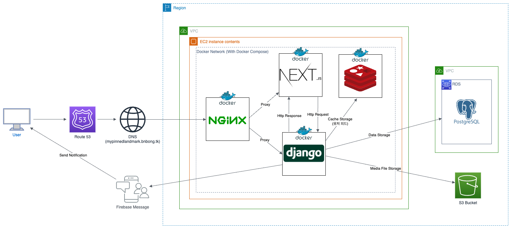
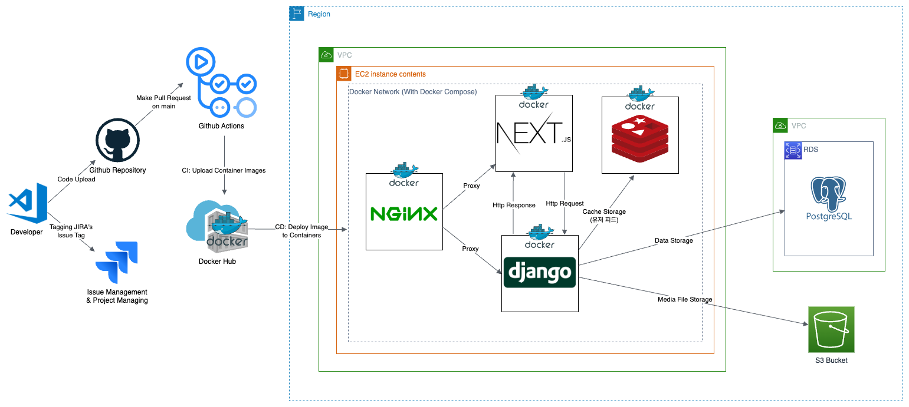

# Project Pinned

## 개요

!!! tip "아이템 한줄 설명"
    지역 랜드마크와 개인의 추억을 지도 위에서 연결해 공유하는 웹 SNS 서비스

Project Pinned는 공개SW 개발자대회와 문화데이터 활용 경진대회 출품을 목적으로 진행한 팀 프로젝트다.
핵심 아이디어는 "랜드마크 데이터"와 "개인 기억"을 분리하지 않고, **지도 기반 피드**로 결합하는 것이었다.

### 저장소

<https://github.com/bnbong/Project-Pinned>

### 역할

팀장, 백엔드, 설계, 스프린트 운영, 아키텍처 설계

## 문제 정의

여행/지역 서비스는 많지만, 대부분은 정보 검색이나 리뷰에 집중한다. 반대로 SNS는 추억과 감정을 공유하는 데 강하지만 장소 맥락이 약하다.

Project Pinned에서는 이 둘을 묶어서,

- 지도에서 랜드마크를 보고
- 해당 장소와 연결된 사람들의 추억을 읽고
- 나도 같은 위치에 추억을 남길 수 있는

서비스를 만들고자 했다.

단순한 지도 서비스도, 단순한 SNS도 아니라 **"장소를 중심으로 피드를 재구성하는 구조"** 가 핵심 아이디어였다.

## 아키텍처 설계

<figure markdown="span">
    
    <figcaption>시스템 아키텍처</figcaption>
</figure>

<figure markdown="span">
    
    <figcaption>CI/CD 구조</figcaption>
</figure>

### 왜 Django + Next.js 조합이었는가

- 백엔드는 게시글, 사용자, 장소, 댓글처럼 관계형 데이터 모델링이 중요해서 Django가 잘 맞았다.
- 프론트는 지도 UI와 피드 렌더링 경험을 빠르게 만들 필요가 있어 Next.js가 유리했다.
- 두 계층을 분리한 덕분에, 백엔드 API와 프론트 UI를 병렬로 개발할 수 있었다.
- 빠르게 서비스를 개발해야하는 공모전 특성상, 팀원들이 가장 익숙한 stack을 선택하는 것이 중요했다.

### 왜 PostgreSQL과 Redis를 함께 썼는가

- PostgreSQL은 장소, 사용자, 게시글처럼 관계가 명확한 데이터를 안정적으로 관리하기 적합했다. 또한 지도 좌표 데이터 저장을 위해 PostGIS 확장을 고려하여 선택했다.
- Redis는 빈번히 조회되는 데이터나 세션/임시 상태를 분리해 다루기 위한 선택이었다.

이 프로젝트는 한 달 남짓한 단기 일정이었기 때문에, 실험적인 저장소 구조보다 **안정적이고 익숙한 조합**을 택해 구현 리스크를 줄이는 쪽으로 선택했다.

## 백엔드 관점의 핵심 설계

내가 집중했던 부분은 "지도 위 추억 피드"라는 문제를 백엔드 API와 데이터 구조로 어떻게 풀어낼지였다.

- 랜드마크와 게시글을 연결하는 데이터 모델 설계
- 지도 뷰와 피드 뷰에서 모두 재사용 가능한 API 구조 정리
- Swagger와 Wiki 기반 문서 체계 구성
- Docker 기반 개발/테스트/배포 환경 분리

`docker-compose.yml`, `docker-compose.test.yml`, `docker-compose.prod.yml`을 나눠 둔 것도 같은 이유였다. 짧은 기간 안에 배포 안정성을 확보하려면, **개발용과 운영용 구성을 명시적으로 구분**할 필요가 있었다.

## 운영과 협업

Project Pinned는 구현 난이도 못지않게 팀 운영이 중요했던 프로젝트였다.
팀장으로서 아래 역할을 함께 맡았다.

- 스프린트 범위 조정
- 백엔드 개발 우선순위 관리
- API 테스트 및 배포 전 검증 흐름 정리
- 문서화와 협업 규칙 정리

공모전 프로젝트는 일정이 짧기 때문에, 좋은 설계보다도 **끝까지 완성 가능한 범위를 잡는 일** 이 더 중요해진다. 이 프로젝트에서는 그 균형을 맞추는 게 팀장 역할의 핵심이었다.

## 기술 선택 이유

### Docker

프론트/백엔드/Nginx/DB를 각각 따로 실행하면 팀원별 환경 차이가 커진다. 그래서 컨테이너 기반으로 개발 환경을 맞추고, 테스트/운영용 구성을 별도 compose 파일로 분리했다.

### Nginx

Next.js와 Django API 사이의 프록시 역할, 정적 리소스 처리, 배포 환경의 진입점 통합을 위해 Nginx를 뒀다.

### AWS

당시 팀 프로젝트 기준으로 접근성이 좋고 자료가 많아 빠른 배포에 유리했다.
목표는 대규모 운영이 아니라, **짧은 기간 안에 실제 동작하는 서비스 데모를 만드는 것**이었다.

## 결과와 회고

공모전 수상까지 이어지진 않았지만, Project Pinned는 내게 다음 경험을 남겨 주었다.

- 지도 데이터와 SNS 도메인을 결합한 서비스 설계 경험
- 단기 팀 프로젝트에서의 아키텍처 의사결정 경험
- 프론트/백엔드/인프라를 동시에 보는 팀장 역할 경험

개발 회고는 별도 글로도 정리했다.

- [[Web Application] Project-Pinned 개발 회고](https://blog.naver.com/bnbong/223217885371)

## 배운 점

- 서비스 아이디어가 아무리 흥미로워도, 짧은 일정에서는 **핵심 플로우만 살리는 설계**가 필요하다.
- 팀장 역할은 많이 만드는 것보다 **무엇을 포기할지 정하는 일**이 더 많았다.
- 지도와 피드가 결합된 서비스는 프론트 UI만큼 백엔드 데이터 모델링도 중요하다는 점을 배웠다.
