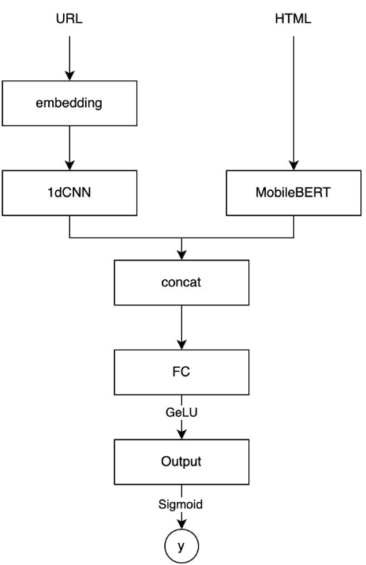
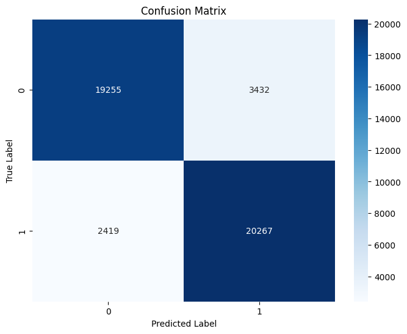

# Phishing QR detector

## 개요

!!! tip "아이템 한줄 설명"
    QR/URL 피싱 탐지를 목표로 한 캡스톤 프로젝트의 서버, 모델 서빙 버전

2024년 캡스톤 프로젝트로 만든 AI 기반 피싱 사이트 탐지 시스템을 정리한 문서입니다.
이 프로젝트는 이후 개인 프로젝트 [Wegis](wegis.md)로 확장됐습니다. 캡스톤 단계에서는
실사용 서비스보다 모델 구조 검증, 입력 전처리, 추론 서버 구축에 무게를 뒀습니다.

### 저장소

- Server : <https://github.com/bnbong/Qshing_server>
- 후속 개인 프로젝트 : [Wegis](wegis.md)

!!! info "후속 프로젝트와의 관계"
    `qr-phishing-detector`는 학기 중 수행한 캡스톤 원형이고, `Wegis`는 이 프로젝트를 개인적으로 이어서 확장한 버전입니다.

## 문제 정의

당시 문제의식은 단순했습니다. 피싱 링크는 더 이상 노골적인 문자열 패턴만으로 구분되지 않으며, 특히 QR 코드나 축약 URL을 경유하는 경우 사용자가 실제 목적지를 인지하기 어렵습니다. 그래서 다음 두 가지 신호를 함께 보려고 했습니다.

- URL 문자열 자체가 가지는 형태적 특징
- 해당 URL이 열어 주는 HTML 본문의 문맥 정보

단순 룰 기반 차단이나 단일 입력 분류기를 넘어, 문자열 패턴과 페이지 문맥을
함께 보는 멀티모달 구조를 캡스톤의 핵심 실험 대상으로 잡았습니다.

## 모델 구조

<figure markdown="span">
    
    <figcaption>캡스톤 단계에서 사용한 URL + HTML 멀티모달 분류 구조</figcaption>
</figure>

핵심 모델은 `QsingBertModel`이며, 구조는 다음과 같습니다.

- URL 입력은 커스텀 토크나이저를 거쳐 1D-CNN 분기로 전달
- HTML 입력은 MobileBERT 인코더로 전달
- 두 임베딩을 concat한 뒤 FC + GELU + Sigmoid로 최종 이진 분류 수행

### 왜 이렇게 설계했는가

- URL은 짧고 규칙적인 토큰 패턴이 중요하므로 Transformer보다 CNN이 가볍고 효과적이었습니다.
- HTML 본문은 의미와 문맥이 중요하므로 BERT 계열 인코더가 더 적합했습니다.
- 캡스톤 과제 특성상 학습/추론 자원이 제한되어 있었기 때문에, BERT 계열 중 비교적 경량인 MobileBERT를 택해 응답 지연을 줄이고자 했습니다.

정확도만 보고 고른 게 아니라, 학기 프로젝트 범위에서 감당할 수 있는 연산비와 구현 난이도를 고려한 타협안이었습니다.

## 전처리 및 추론 파이프라인

모델만큼 중요했던 부분은 입력을 실제로 만드는 과정이었습니다. `preprocessor.py`, `html_loader.py` 구현 기준으로 다음 흐름을 사용했습니다.

- Selenium headless Chrome으로 대상 URL을 로드
- 렌더링된 HTML을 `html2text`로 정제
- 문장 단위로 분리한 뒤 `langdetect`로 영어 문장만 선별
- HTML은 BERT 토크나이저, URL은 커스텀 URL 토크나이저로 각각 전처리

이 구조를 택한 이유는 피싱 사이트가 정적 HTML만 제공하지 않기 때문입니다. 실제로 자바스크립트 렌더링 이후에만 주요 텍스트가 드러나는 경우가 있어, 단순 `requests.get()` 수준으로는 충분하지 않다고 판단했습니다.

## 서버 설계

캡스톤 단계의 서버는 FastAPI 기반 추론 서버로 구성했습니다.

- `/phishing-detection/analyze` 형태의 단일 분석 API 제공
- Docker 기반 실행 환경 정리
- Pydantic 기반 입출력 스키마 정의
- 모델 체크포인트를 서버 내부에서 직접 로드하는 구조 채택

당시에는 제품화보다 모델을 HTTP API로 안정적으로 감싸는 게 목적이었기 때문에,
확장 프로그램이나 운영 데이터베이스, 피드백 수집보다는 추론 API의 단순성과 재현성을 우선시했습니다(졸업과제 마무리 단계에서는 이것들도 모두 구현했습니다).

## 실험 결과

<figure markdown="span">
    
    <figcaption>캡스톤 실험 결과 예시 Confusion Matrix</figcaption>
</figure>

첨부한 confusion matrix 기준으로, 모델은 정상/피싱 양쪽 클래스에서 모두 한쪽으로 심하게 쏠리지 않는 분류 성능을 보였습니다. 특히 피싱 클래스 recall이 비교적 안정적으로 나왔다는 점에서, 후속 서비스화 가능성을 확인하는 용도로는 충분했습니다.

## 제가 맡은 역할

- FastAPI 추론 서버 구성
- 모델 로딩 및 API 응답 구조 정리
- HTML 수집 및 입력 전처리 코드 정리
- Docker 실행 환경 정리

## 한계와 후속 확장

캡스톤 단계의 한계도 분명했습니다.

- 사용자가 직접 요청을 보내야 하는 PoC 성격이 강했습니다.
- 브라우저에서 즉시 차단하거나 경고하는 보호 흐름이 없었습니다.

이 한계를 보완하기 위해 이후 Wegis에서 다음이 추가됐습니다.

- 의심 사이트 접근을 확실하게 block 할 수 있는 브라우저 확장 프로그램과의 연동
- 배치 분석 API
- 화이트리스트/블랙리스트 캐시 전략 수립
- 클릭 차단 및 다운로드 경고 UX

## 배운 점

- 모델 아이디어가 좋아도 입력 파이프라인이 약하면 결과가 흔들린다는 걸 직접 겪었습니다.
- 피싱 탐지는 정답률만으로 끝나는 문제가 아니라, 언제 어떤 방식으로 사용자에게 개입하느냐가 중요하다는 사실도 확인했습니다.
- 이 프로젝트는 이후 Wegis로 이어지며, 연구용 PoC를 서비스 형태로 확장하는 경험의 출발점이 됐습니다.
