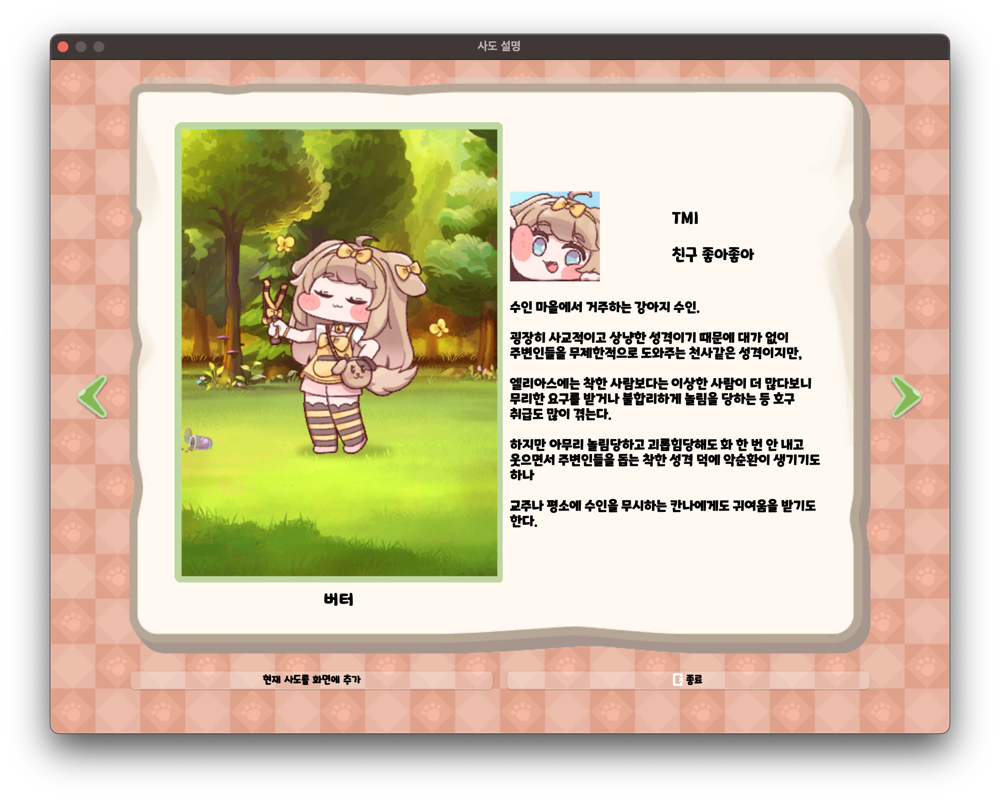

# rickTcal_DayLife

## 개요

릭트컬 데이라이프는 [트릭컬 리바이브](https://trickcal.com/) 게임 캐릭터의 볼따구를 잡아당기는 상호작용을 데스크톱 위젯 형태로 옮긴 팬 메이드 프로젝트입니다. 학회 워크샵 대체 과제로 진행했습니다.

### 저장소

<https://github.com/bnbong/rickTcal_DayLife>

## 프로젝트 목표

이 프로젝트는 범용 생산성 앱이 아니라, 데스크톱 애플리케이션에서 직접 만지는 상호작용 감각을 구현해 보는 게 목표였습니다. 워크샵 요구사항도 명확했습니다.

- PyQt6 사용
- 삶의 질을 높이는 프로그램 개발
- Windows / macOS / Linux 지원

## 왜 PyQt6였는가

데스크톱 앱 과제였기 때문에, 크로스 플랫폼 GUI 프레임워크가 필요했습니다. PyQt6는

- Python 기반으로 빠르게 상호작용 실험이 가능하고
- 이벤트 처리 구조가 명확하며
- 배포 결과물을 만들기에도 비교적 수월

하다는 점에서 잘 맞았습니다.

## 왜 팬 메이드 프로젝트를 선택했는가

과제로 주어진 '삶의 질을 높이는'이라는 관점에서 사람들의 삶의 질을 높일 수 있는 요인으로 스트레스를 낮추는 것을 생각했습니다. 그리고 스트레스 해소에 도움이 되는 요소 중 하나로 귀여운 것을 보면 스트레스가 낮아진다는 연구결과가 떠올랐습니다. 그래서 제가 좋아하는 게임 캐릭터의 귀여운 상호작용을 데스크톱 앱으로 옮기는 프로젝트를 선택했습니다.

## 구현 포인트

### 핵심 인터랙션

| 인게임 | 데스크톱 구현 |
|---|---|
| {: width=200px} | {: width=200px} |

핵심 기능은 캐릭터 볼따구를 클릭하고 드래그하고 놓는 동안 반응을 보여 주는 것입니다.
이 프로젝트에서 중요했던 건 입력 이벤트를 곧바로 시각, 청각 피드백으로 연결하는 감각이었습니다.

### 캐릭터 정보와 배치

우측 하단 버튼으로 캐릭터 설명을 열어 보고, 고른 캐릭터를 바탕화면에 추가하도록 만들었습니다.
상호작용과 선택, 배치가 함께 있는 데스크톱 앱 구조를 경험했습니다.

### 릴리스

Windows와 macOS용 실행 파일을 릴리스 형태로 제공했습니다.
과제 수준 프로젝트라도 실제 실행 파일 배포까지 다룬 점이 의미 있었습니다.

## 역할

- 프로젝트 기획
- PyQt6 기반 데스크톱 앱 구현
- 릴리스 정리
- 문서화 및 테스트

## 배운 점

- GUI 앱은 화면을 그리는 것보다 이벤트와 피드백을 잇는 일이 더 까다롭습니다.
- 데스크톱 앱은 웹과 다르게 설치/배포 흐름까지 고려해야 해서 완성 비용이 높습니다.
