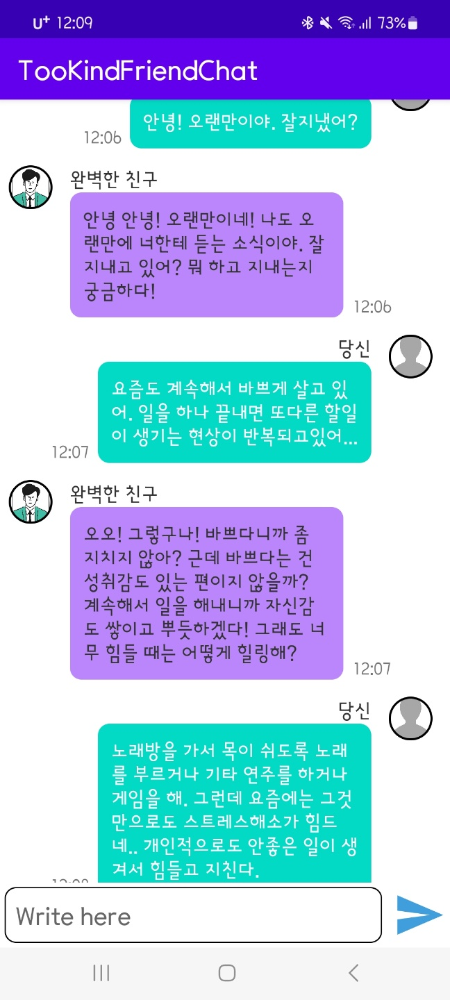

# TooKindFriendChat

## 개요

TooKindFriendChat은 "무조건 나에게 맞춰 주는 환상적인 친구와 채팅한다"는 콘셉트로 만든 Android 앱이다. 학회 워크샵 대체 과제로 진행했다.

### 저장소

<https://github.com/bnbong/TooKindFriendChat>

## 프로젝트 의도

이 프로젝트는 복잡한 메신저를 만드는 것이 아니라, **LLM이 들어간 대화형 UX를 모바일 앱에서 직접 체험해 보는 것**이었다. 당시 목표는 다음과 같았다.

- Android 클라이언트에서 자연어 응답형 AI를 붙여 보기
- 대화 상대의 성격을 하나의 콘셉트로 고정해 UX를 만들어 보기
- 별도 서버 없이도 동작 가능한 최소 제품을 구성해 보기

## 왜 이런 구조였는가

### Android + Java

워크샵 과제 범위 안에서 익숙한 환경으로 빠르게 앱 UX를 검증하고 싶었기 때문에 Java 기반 Android 앱으로 구현했다. Kotlin 경험은 거의 없었고 기한이 빠듯했기 때문에 Java 선택이 불가피했다.

### OpenAI API 직접 연동

별도 백엔드 서버를 두면 인증, 세션, 중계 로직까지 같이 설계해야 한다. 하지만 이 프로젝트는 채팅 UX 실험이 우선이었기 때문에, 클라이언트에서 직접 OpenAI API를 호출하는 구조를 택했다.

이 선택은 보안 측면에서의 장기 운영 구조라기보다, **LLM 응답 흐름을 가장 짧은 거리에서 확인하기 위한 프로토타입 선택**이었다.

### GPT-3.5 Turbo

당시 접근성과 비용, 응답 속도, 텍스트 대화 품질을 함께 고려했을 때 가장 현실적인 선택지였다.

## 구현하면서 중요했던 점

- 사용자가 입력한 메시지를 대화 기록과 함께 전달하는 채팅 UX 설계
- 응답 지연을 고려한 비동기 네트워크 처리
- 토큰 수 제한과 API 실패 가능성을 앱 UX에 반영

이 프로젝트는 모델 성능보다도 **API 응답 지연과 토큰 제한이 UX에 직접 영향을 준다**는 사실을 직접 체감하게 해 줬다.

## 역할

- 프로젝트 기획
- Android 프론트엔드 구현
- OpenAI API 연동

## 배운 점

- LLM 앱은 모델 그 자체보다 **대화 흐름과 응답 대기 경험**이 중요하다.
- 서버 없이도 빠르게 개념 검증을 할 수 있지만, 실제 서비스화 단계에서는 보안과 중계 계층이 반드시 필요하다.
