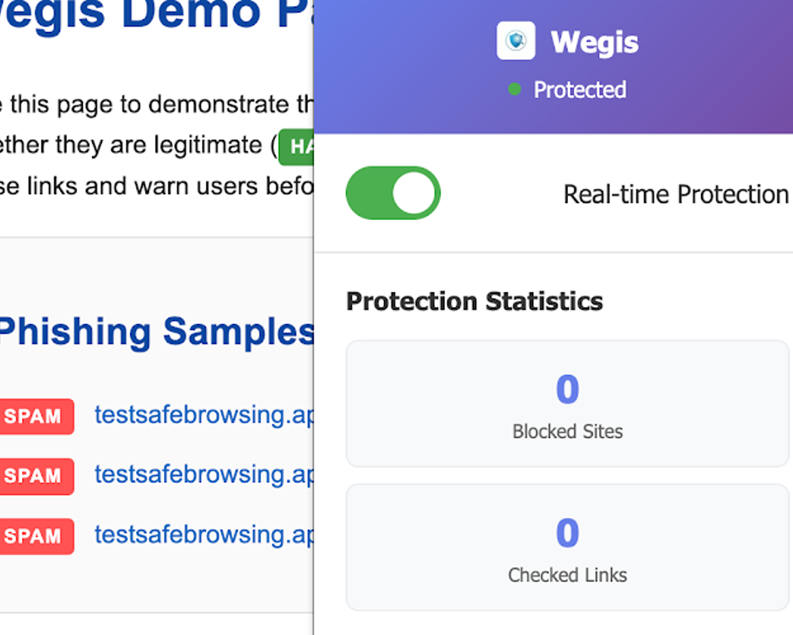
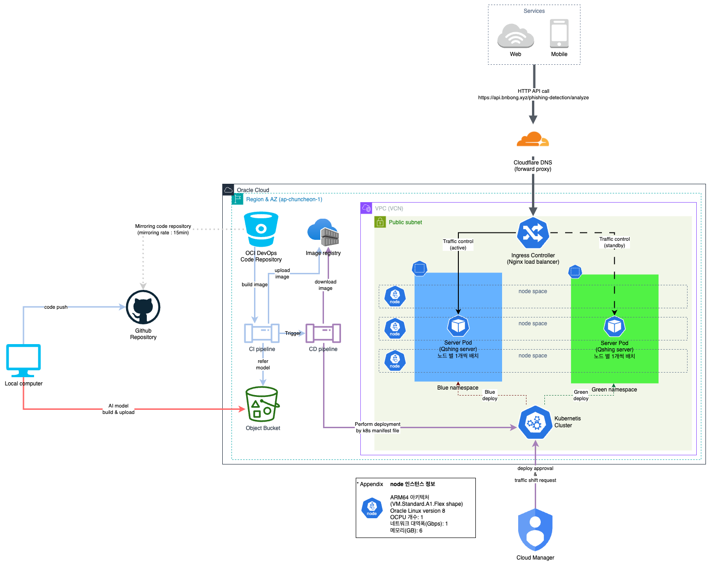
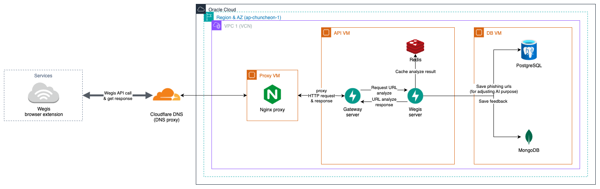

# Wegis

## 개요

!!! tip "아이템 한줄 설명"
    캡스톤에서 만든 QR/URL 피싱 탐지 연구를 브라우저 보호 도구로 확장한 실사용형 프로젝트

Wegis는 `qr-phishing-detector` 캡스톤 프로젝트를 개인 프로젝트로 이어서 확장한 버전입니다.
학기 중에는 멀티모달 피싱 탐지 모델과 서버 PoC를 만드는 데 집중했다면, Wegis에서는
그 결과물을 실제 사용 흐름에 맞게 다시 설계했습니다. 브라우저 확장 프로그램이 페이지의 링크를 수집하고, FastAPI 서버가 URL과 HTML을 함께 분석한 뒤, 위험 링크를 차단하거나 경고 UI를 보여주는 식으로 제품 형태까지 끌어올렸습니다.

<figure markdown="span">
    
    <figcaption>Wegis 확장 프로그램 데모 화면</figcaption>
</figure>

### 저장소

- Extension : <https://github.com/bnbong/Wegis>
- Server : <https://github.com/bnbong/Wegis_server>
- 캡스톤 원형 프로젝트 : [Phishing QR detector](qr-phishing-detector.md)

## 문제 정의

캡스톤 단계에서는 모델의 정확도와 추론 가능성을 확인하는 것이 우선이었습니다. 하지만 실제 사용자 입장과 운영 관점에서 보면 다음 문제가 여전히 남아 있었습니다.

- 분석 요청을 사용자가 수동으로 보내야 하면 보호 효과가 약합니다.
- 학술용 서버 구조는 실사용 시나리오에서 응답 지연, 운영 비용 문제를 그대로 안고 갑니다.

그래서 Wegis에서는 모델 자체보다도 "어떻게 실시간 방어 도구로 묶을 것인가(서비스화할 것인가)"를 핵심 과제로 잡았습니다.

## 프로젝트 확장 방향

캡스톤 버전과 비교했을 때 Wegis에서 크게 달라진 부분은 다음과 같습니다.

- 서버 단일 분석 API 중심 구조를 브라우저 확장과 서버, 데이터 저장소 구조로 확장했습니다.
- 수동 입력형 PoC를 페이지에 진입하면 곧바로 링크를 수집해 배치 분석하는 흐름으로 개선했습니다.
- 단순 추론 결과 반환에서 끝나지 않고 차단 규칙과 사용자 경고 UI, 피드백 수집까지 포함시켰습니다.
- 초기 Kubernetes 중심 설계를 실제 운영 관점에서 다시 검토해 단순한 VM 기반 구조로 재편했습니다.

결국 Wegis는 모델 연구 결과를 운영 가능한 제품 구조로 옮기는 과정 자체를 다룬 프로젝트입니다.

## 시스템 설계

### 브라우저 확장 프로그램

Wegis 확장 프로그램은 Manifest V3 기반으로 작성했습니다. 단순히 현재 탭의 URL만 읽는 것이 아니라 페이지 안에 있는 링크 후보를 최대한 많이 수집하도록 설계했습니다.

- `content/link-collector.js`에서 본문에 노출된 URL 문자열, `a[href]`, 다운로드 링크, 소셜 카드 메타데이터를 수집합니다.
- `jsQR`를 사용해 `img`, `canvas`에 포함된 QR 코드까지 디코딩해 링크 후보로 포함시킵니다.
- `MutationObserver`를 활용해 동적으로 추가되는 DOM에도 반응하도록 구성했습니다.
- `background/service-worker.js`에서 배치 분석 API 호출, 결과 캐싱, 차단 통계 저장, 동적 차단 규칙 적용을 수행합니다.

이렇게 설계한 이유는 피싱 링크가 항상 명시적인 앵커 태그 형태로만 존재하지 않기 때문입니다.

텍스트 본문, 다운로드 버튼, QR 이미지, SPA 렌더링 이후 추가되는 DOM까지 다뤄야 실제 브라우저 보호 도구로서 쓸모가 있다고 봤습니다.

### 차단 및 사용자 경험

확장 프로그램은 분석 결과가 위험으로 판정되면 단순 색상 강조에서 끝나지 않고, 실제 클릭 차단까지 이어지도록 만들었습니다.

- 위험 링크에 경고 스타일과 배지를 부여합니다.
- 클릭/엔터/보조 클릭 이벤트를 가로채 차단 모달을 띄웁니다.
- `chrome.declarativeNetRequest` 동적 규칙으로 차단 목록을 관리합니다.
- PDF, 실행 파일처럼 고위험 다운로드 링크는 별도 경고 다이얼로그를 제공합니다.

피싱 탐지는 확률값만 보여주는 것으로는 충분하지 않습니다. 사용자는 경고를 보더라도 그대로 클릭하는 경우가 많아서, UI 경고와 네트워크 차단을 함께 설계해야 실제 보호 효과가 생긴다고 봤습니다.

## 모델 설계

Wegis의 분류 모델은 캡스톤 단계에서 확립한 멀티모달 구조를 그대로 이어받았습니다. 모델은 캡스톤 때와 마찬가지로 URL 문자열과 렌더링된 HTML 본문을 함께 사용합니다.

<figure markdown="span">
    
    <figcaption>URL 1D-CNN + HTML MobileBERT 기반 멀티모달 구조</figcaption>
</figure>

### 입력 파이프라인

- URL은 커스텀 토크나이저로 문자 단위 시퀀스로 변환한 뒤 1D-CNN에 입력합니다.
- HTML은 Selenium으로 실제 페이지를 렌더링한 후 `html2text`로 본문 텍스트를 추출합니다.
- `langdetect`를 사용해 영어 문장만 선별하고, 이를 BERT 입력으로 정리합니다.
- HTML 쪽 인코더는 `google/mobilebert-uncased`, URL 쪽 인코더는 다중 커널 Conv1D를 사용했습니다.

### 왜 이 조합을 택했는가

- URL은 길이가 짧고 형태적 패턴이 중요하므로 문자/토큰 단위 CNN이 효율적이었습니다.
- HTML 본문은 문맥 정보가 중요하므로 Transformer 계열 인코더가 유리했습니다.
- BERT 계열 중에서도 MobileBERT를 쓴 건 정확도보다 실시간 추론 지연과 메모리 예산이 더 중요했기 때문입니다.

<figure markdown="span">
    
    <figcaption>멀티모달 모델 실험 결과 예시 Confusion Matrix</figcaption>
</figure>

## 서버 설계

서버는 FastAPI 기반으로 작성했고, 애플리케이션 시작 시점에 필요한 외부 자원과 모델을 명시적으로 초기화하는 구조를 사용했습니다.

- FastAPI lifespan에서 Redis, MongoDB, PostgreSQL, 모델 객체를 순차적으로 초기화합니다.
- 분석 API는 단건 체크와 배치 체크를 분리해 확장 프로그램 호출 패턴에 맞췄습니다.
- Redis에는 결과 캐시와 화이트리스트/블랙리스트 도메인 집합을 저장합니다.
- MongoDB에는 사용자 피드백처럼 스키마 변동 가능성이 높은 문서를 저장합니다.
- PostgreSQL은 구조화된 서비스 데이터와 분석 이력 관리 용도로 사용합니다.

저장소를 이렇게 나눈 건 데이터 성격이 서로 달랐기 때문입니다. 결과 캐시는 빠른 조회가 중요했고, 피드백은 유연한 메타데이터 저장이 필요했으며, 운영 데이터는 관계형 관리가 더 적합했습니다.

## 인프라 재설계

처음에는 OKE 기반 배포와 DevOps 파이프라인을 포함한 비교적 큰 구성을 실험했습니다. 그런데 개인 프로젝트 운영 관점에서 보니 이 구조는 과도했습니다. 실제 트래픽과 운영 비용을 고려했을 때, 배포 복잡도에 비해 얻는 이득이 크지 않았습니다.

<figure markdown="span">
    
    <figcaption>초기 Kubernetes/DevOps 중심 설계</figcaption>
</figure>

<figure markdown="span">
    
    <figcaption>운영 복잡도를 낮춘 VM 기반 재설계 구조</figcaption>
</figure>

그래서 인프라는 다음 방향으로 단순화했습니다.

- Kubernetes 중심 구조에서 Proxy VM / API VM / DB VM 형태의 단순 VM 구조로 축소했습니다.
- 모델, API, 캐시, 데이터 저장소의 책임은 유지하되, 운영 계층 수를 줄여 장애 지점을 줄였습니다.
- Cloudflare DNS + Nginx reverse proxy를 두고 서버 내부는 HTTP 프록시로 연결했습니다.
- 실험과 운영을 반복하기 쉽도록 Docker Compose 기반 개발 환경은 그대로 두었습니다.

이 재설계의 목적은 인프라를 더 화려하게 만드는 게 아니라 개인 프로젝트 규모에서 감당할 수 있는 운영 구조를 찾는 데 있었습니다.

## 기술 선택 이유

### FastAPI

모델 서빙, 입력 검증, 문서 자동화가 모두 필요했기 때문에 FastAPI가 가장 효율적이었습니다.
특히 분석 API와 확장 프로그램 사이의 계약을 빠르게 고정할 수 있다는 점이 컸습니다.

### Redis

확장 프로그램은 같은 링크를 반복적으로 검사하는 경우가 많습니다. 결과를 짧은 주기로 캐시하지 않으면 불필요한 추론 요청이 급격히 늘어나기 때문에 Redis가 자연스러운 선택이었습니다.

### Manifest V3

브라우저 확장 생태계가 MV3로 이동하고 있었기 때문에 장기적으로 유지 가능한 구조를 택하고 싶었습니다. 백그라운드 페이지 대신 서비스 워커 제약을 받아들이는 쪽이 맞다고 봤습니다.

### Selenium 기반 HTML 수집

정적 HTML만 가져오면 실제 렌더링 이후에 생성되는 본문을 놓칠 수 있습니다. 피싱 사이트는 자바스크립트로 콘텐츠를 동적으로 그리는 경우도 있어서, 렌더링 결과를 기준으로 HTML을 가져오는 방식이 꼭 필요했습니다.

## 역할

- 브라우저 확장 프로그램 설계 및 구현
- 멀티모달 모델 서빙 파이프라인 구현
- FastAPI 서버, 데이터 저장소, 캐시 계층 설계
- OCI 기반 인프라 재설계 및 운영 구조 단순화
- 사용자 경고 UX, 피드백 API, 차단 정책 설계

## 결과 및 성과

- 멀티모달 모델 기준 F1 0.8739 수준의 분류 성능을 확보했습니다.
- 기존 프로젝트와 비교해 전체 요청 latency가 줄었습니다(cold-path 기준). avg는 1,092.9ms -> 715.3ms(34.5% 개선), p95는 1,297.1ms -> 731.3ms(43.6% 개선), max는 1,488.1ms -> 853.7ms(42.6% 개선)였습니다. 단계별로 보면 html_fetch 평균 405.0ms -> 176.8ms(56.3% 개선), inference 평균 558.8ms -> 458.5ms(17.9% 개선)을 확인했습니다.
- 단건 분석 중심 구조에서 배치 분석과 캐시 기반 실시간 보호 흐름으로 확장했습니다.
- 페이지 링크, 다운로드 링크, QR 코드 링크까지 다루는 확장 프로그램 동작을 확인했습니다.
- 학술용 PoC를 브라우저 보호 도구 형태의 서비스로 전환했습니다.

## 배운 점

- 모델 정확도와 제품 완성도는 별개의 문제입니다. 추론 모델이 있어도 수집, 차단, 저장, 피드백 구조가 없으면 서비스가 되지 않는다는 걸 체감했습니다.
- 인프라는 트래픽과 운영 인력이 정합니다. 개인 프로젝트에서는 단순한 구조가 오히려 더 오래 유지된다는 사실을 배웠습니다.
- 멀티모달 시스템은 입력 파이프라인이 절반 이상입니다. URL 토큰화, HTML 추출, 언어 필터링이 흔들리면 모델 품질도 같이 흔들립니다.
